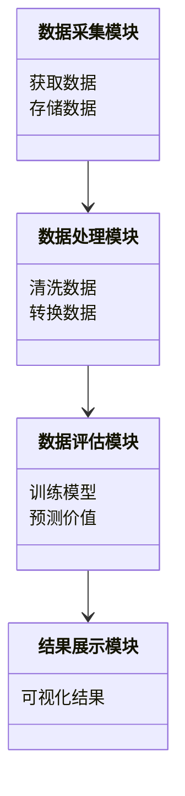
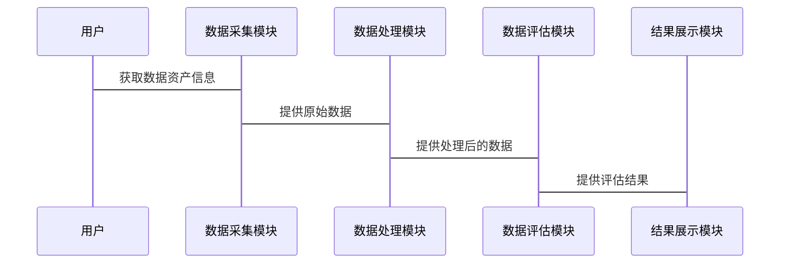

                 


# AI agents辅助价值投资者评估公司的数据资产价值

> 关键词：AI agents，数据资产，价值投资者，数据资产评估，机器学习

> 摘要：本文探讨了AI agents如何辅助价值投资者评估公司的数据资产价值。通过分析数据资产的定义、特征及其在投资决策中的作用，结合AI代理的优势，构建了数据资产评估的数学模型和算法框架。文章详细介绍了系统架构设计和项目实现，展示了AI代理在数据资产评估中的实际应用，并提出了最佳实践和注意事项。

---

## 第一部分：数据资产价值评估的背景与核心概念

### 第1章：数据资产价值评估的背景与问题背景

#### 1.1 数据资产的定义与特征

##### 1.1.1 数据资产的定义
数据资产是指企业拥有或控制的、能够为企业带来经济利益的、以电子形式存在的信息资源。数据资产包括结构化数据（如数据库中的表格）、半结构化数据（如JSON、XML文件）和非结构化数据（如文本、图像）。

##### 1.1.2 数据资产的核心特征
- **可扩展性**：数据资产可以通过分析和整合产生更大的价值。
- **动态性**：数据资产的价值会随着时间变化，受市场环境和企业战略的影响。
- **关联性**：数据资产之间的关联性可以揭示潜在的商业机会。

##### 1.1.3 数据资产与传统资产的对比
| 特性      | 数据资产         | 传统资产         |
|-----------|------------------|------------------|
| 形态      | 数字化           | 实体化           |
| 可流动性   | 高               | 低               |
| 价值评估   | 动态、复杂       | 静态、相对简单   |

#### 1.2 价值投资者的评估需求

##### 1.2.1 价值投资者的核心目标
价值投资者关注企业的内在价值，通过分析企业的财务状况、市场地位和竞争优势来寻找被低估的投资机会。

##### 1.2.2 数据资产在投资决策中的作用
数据资产是企业核心竞争力的重要组成部分，能够影响企业的市场地位和盈利能力。例如，互联网公司依赖数据资产进行精准营销和用户画像。

##### 1.2.3 数据资产价值评估的难点与挑战
- 数据隐私和安全问题。
- 数据的多样性和复杂性。
- 数据价值的动态性和不确定性。

#### 1.3 AI agents在数据资产评估中的作用

##### 1.3.1 AI agents的基本概念
AI agents是能够感知环境、自主决策并执行任务的智能体。在数据资产评估中，AI agents可以用于数据清洗、特征提取和价值预测。

##### 1.3.2 AI agents在数据资产评估中的优势
- 高效性：AI agents能够快速处理大量数据，提供实时评估。
- 精准性：通过机器学习算法，AI agents能够发现数据中的隐含关系。
- 自适应性：AI agents可以根据市场变化动态调整评估模型。

##### 1.3.3 数据资产价值评估的边界与外延
数据资产价值评估的边界包括数据的合法性、可用性和可扩展性。外延则包括数据的整合、分析和应用。

---

### 第2章：数据资产价值评估的核心概念与联系

#### 2.1 数据资产价值评估的模型与方法

##### 2.1.1 数据资产价值评估的模型框架
数据资产价值评估模型通常包括数据的采集、清洗、分析和预测四个阶段。

##### 2.1.2 数据资产价值的影响因素
- 数据的完整性：数据是否完整影响评估的准确性。
- 数据的相关性：数据的相关性越高，评估价值越大。
- 数据的时效性：数据的时效性影响其市场价值。

##### 2.1.3 数据资产价值评估的指标体系
- 数据质量指标：完整性、准确性、一致性。
- 数据价值指标：市场影响力、竞争优势、潜在收益。

#### 2.2 AI agents与数据资产价值评估的关系

##### 2.2.1 AI agents在数据资产评估中的角色
AI agents作为数据资产评估的工具，能够提高评估的效率和准确性。

##### 2.2.2 数据资产与AI agents的交互机制
通过API接口，AI agents可以与企业的数据系统进行交互，获取必要的数据进行评估。

##### 2.2.3 数据资产价值评估的动态性与实时性
数据资产价值评估需要实时更新，以反映市场变化和企业动态。

---

#### 2.3 数据资产价值评估的核心算法与数学模型

##### 2.3.1 数据资产价值评估的算法原理

###### 使用机器学习模型进行数据资产评估
1. 数据清洗：去除无效数据，处理缺失值。
2. 特征提取：提取关键特征，如数据的市场规模、用户活跃度。
3. 模型训练：使用回归模型或神经网络模型进行训练。
4. 模型预测：基于训练好的模型预测数据资产的价值。

###### 使用深度学习模型进行数据资产评估
- 使用LSTM网络捕捉时间序列数据中的长期依赖关系。
- 使用Transformer模型进行多模态数据的特征提取。

##### 2.3.2 数据资产价值评估的数学模型

###### 数据资产价值的线性回归模型
$$ \text{Value} = \beta_0 + \beta_1 \times \text{Size} + \beta_2 \times \text{Accuracy} + \epsilon $$
其中，$\beta_0$、$\beta_1$、$\beta_2$是模型参数，$\epsilon$是误差项。

###### 数据资产价值的神经网络模型
构建一个三层神经网络，输入层包含数据特征，隐藏层包含激活函数，输出层预测数据资产价值。

---

### 第3章：数据资产价值评估的系统分析与架构设计

#### 3.1 系统分析与需求分析

##### 3.1.1 问题场景的描述
价值投资者需要评估目标公司的数据资产价值，但由于数据的多样性和复杂性，手动评估效率低下。

##### 3.1.2 项目目标与范围
开发一个基于AI agents的数据资产评估系统，帮助投资者快速准确地评估数据资产价值。

##### 3.1.3 系统功能需求
- 数据采集模块：从企业系统中获取数据资产信息。
- 数据处理模块：清洗和转换数据。
- 数据评估模块：基于机器学习模型进行价值评估。
- 结果展示模块：以可视化形式呈现评估结果。

#### 3.2 系统架构设计

##### 3.2.1 系统功能模块划分
- 数据采集模块：负责数据的获取和存储。
- 数据处理模块：对数据进行清洗和转换。
- 数据评估模块：利用机器学习模型进行价值预测。
- 结果展示模块：将评估结果以可视化形式展示。

##### 3.2.2 系统架构的Mermaid类图


##### 3.2.3 系统架构的Mermaid架构图


#### 3.3 系统接口与交互设计

##### 3.3.1 系统接口设计
- 数据采集接口：提供REST API，用于获取数据资产信息。
- 数据处理接口：提供数据清洗和转换的API。
- 数据评估接口：提供模型训练和预测的API。

##### 3.3.2 系统交互的Mermaid序列图


---

### 第4章：数据资产价值评估的项目实战

#### 4.1 环境安装与配置

##### 4.1.1 开发环境的安装
- 安装Python 3.8及以上版本。
- 安装必要的库：numpy、pandas、scikit-learn、keras、tensorflow。

##### 4.1.2 数据集的准备
获取目标公司的数据资产信息，包括数据的类型、规模、准确性和市场影响力。

#### 4.2 系统核心实现源代码

##### 4.2.1 数据采集模块的实现
```python
import requests

def get_data_asset(company_id):
    url = f"https://api.data-provider.com/assets/{company_id}"
    response = requests.get(url)
    return response.json()
```

##### 4.2.2 数据处理模块的实现
```python
import pandas as pd

def process_data(data):
    df = pd.DataFrame(data)
    df = df.dropna()
    df['Size'] = df['Size'].apply(lambda x: x.upper())
    return df
```

##### 4.2.3 数据评估模块的实现
```python
from sklearn.linear_model import LinearRegression

def train_model(features, labels):
    model = LinearRegression()
    model.fit(features, labels)
    return model

def predict_value(model, new_features):
    return model.predict(new_features)
```

##### 4.2.4 结果展示模块的实现
```python
import matplotlib.pyplot as plt

def plot_results(predicted, actual):
    plt.scatter(actual, predicted)
    plt.xlabel('实际价值')
    plt.ylabel('预测价值')
    plt.show()
```

#### 4.3 实际案例分析与详细解读

##### 4.3.1 案例背景
假设我们评估一家互联网公司的用户数据资产，数据包括用户的点击行为、购买记录和社交网络信息。

##### 4.3.2 数据处理与模型训练
```python
data = get_data_asset(12345)
processed_data = process_data(data)
features = processed_data[['Size', 'Accuracy']]
labels = processed_data['Value']
model = train_model(features, labels)
```

##### 4.3.3 模型预测与结果展示
```python
new_features = [[10000, 0.9]]
predicted_value = model.predict(new_features)
plot_results(predicted_value, labels)
```

---

## 第五部分：最佳实践与注意事项

### 5.1 小结

通过本文的介绍，我们了解了AI agents在数据资产评估中的重要作用，掌握了数据资产评估的核心算法和系统架构设计方法。实际案例展示了如何将理论应用于实践，帮助投资者快速准确地评估数据资产价值。

### 5.2 注意事项

- 数据隐私和安全问题必须得到高度重视。
- 数据资产评估模型需要定期更新，以适应市场变化。
- 在实际应用中，建议结合多种算法进行评估，以提高结果的准确性。

### 5.3 扩展阅读

- 《机器学习实战》：深入理解机器学习算法及其应用。
- 《数据科学导论》：系统学习数据科学的核心概念和方法。

---

## 作者

作者：AI天才研究院/AI Genius Institute & 禅与计算机程序设计艺术 /Zen And The Art of Computer Programming

