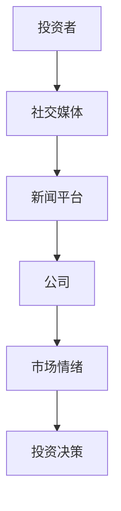
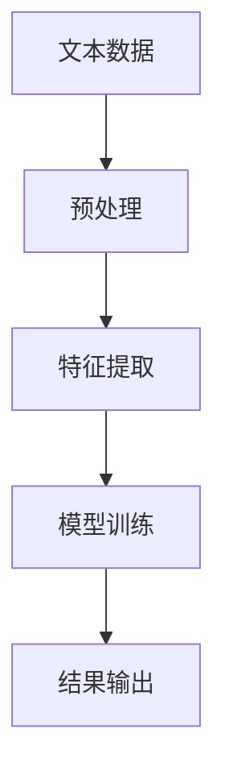
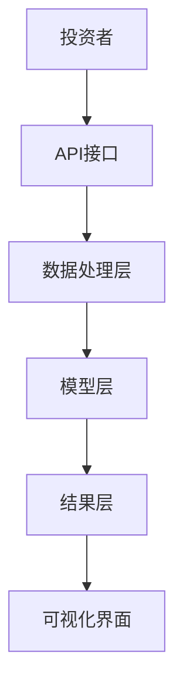

                 


# AI agents辅助价值投资者进行情绪分析

> 关键词：AI代理，情绪分析，价值投资，自然语言处理，机器学习

> 摘要：本文探讨AI代理如何辅助价值投资者进行情绪分析，涵盖背景、核心概念、算法原理、系统架构、项目实战及总结。通过NLP和机器学习，AI代理帮助投资者从非结构化数据中提取情感信号，辅助决策。

---

## 第一部分：AI代理与情绪分析的背景介绍

### 第1章：AI代理与情绪分析的背景介绍

#### 1.1 问题背景
- **价值投资与情绪分析的关联**：价值投资依赖于对公司基本面的分析，而情绪分析则关注市场参与者的心理状态，揭示市场的非理性波动。
- **情绪分析在金融领域的应用现状**：传统分析方法忽视了情绪因素，而情绪分析通过社交媒体、新闻等数据，提供新的视角。
- **AI代理在情绪分析中的作用**：AI代理能够实时处理海量数据，识别情感倾向，辅助投资者做出更明智的决策。

#### 1.2 问题描述
- **价值投资者面临的挑战**：市场情绪波动影响资产价格，传统分析方法难以捕捉这些情绪信号。
- **情绪分析的核心问题**：从非结构化文本中提取情感信息，准确分类并量化情绪强度。
- **AI代理如何解决这些问题**：通过自动化处理和深度学习模型，提高情绪分析的效率和准确性。

#### 1.3 问题解决
- **AI代理在情绪分析中的解决方案**：利用NLP技术提取情感特征，结合机器学习模型进行分类。
- **技术实现路径**：数据收集、预处理、模型训练、结果分析。
- **应用场景与实际案例**：社交媒体情绪分析、新闻情绪分析、投资者行为分析。

#### 1.4 边界与外延
- **情绪分析的边界条件**：数据来源、数据质量和模型训练数据的影响。
- **AI代理的应用范围**：情绪分析、市场预测、投资决策支持。
- **相关领域的扩展**：结合行为金融学、心理学，探索情绪与市场的关系。

#### 1.5 概念结构与核心要素
- **核心概念的组成**：NLP、情感分析、机器学习。
- **情绪分析的流程**：数据预处理、特征提取、模型训练、结果解释。
- **AI代理的系统架构**：数据输入、处理、分析、输出。

---

## 第二部分：AI代理与情绪分析的核心概念

### 第2章：AI代理与情绪分析的核心概念

#### 2.1 核心概念原理
- **自然语言处理（NLP）的基本原理**：文本预处理、词袋模型、词嵌入。
- **情感分析算法的原理**：基于规则的分类、统计模型、深度学习模型。
- **AI代理的工作机制**：数据收集、特征提取、模型推理、结果输出。

#### 2.2 核心概念属性对比
| 情感分析 | 文本分类 | 主题模型 |
|----------|----------|----------|
| 分类目标：情感倾向 | 分类目标：类别标签 | 分类目标：主题分布 |
| 常见任务：情感分析 | 常见任务：信息分类 | 常见任务：主题建模 |

#### 2.3 ER实体关系图


---

## 第三部分：情绪分析算法原理

### 第3章：情绪分析算法原理

#### 3.1 算法流程图


#### 3.2 算法实现

- **文本预处理代码**：
  ```python
  import re
  def preprocess(text):
      text = re.sub(r'\W+', ' ', text)
      text = text.lower()
      return text.strip()
  ```

- **特征提取代码**：
  ```python
  from sklearn.feature_extraction.text import TfidfVectorizer
  vectorizer = TfidfVectorizer()
  X = vectorizer.fit_transform(corpus)
  ```

- **模型训练代码**：
  ```python
  from sklearn.svm import SVC
  model = SVC()
  model.fit(X, y)
  ```

#### 3.3 数学公式
- 词袋模型：
  $$v_i = \sum_{j=1}^{n} w_j \cdot x_{i,j}$$
  其中，\(v_i\) 是词袋向量，\(w_j\) 是词权重，\(x_{i,j}\) 是词的出现次数。

---

## 第四部分：系统分析与架构设计

### 第4章：系统架构与设计

#### 4.1 项目介绍
- **项目目标**：开发一个基于AI代理的情绪分析系统，辅助价值投资者做出决策。
- **领域模型**：
  ```mermaid
  classDiagram
      class 投资者 {
          id
          帐户
          投资组合
      }
      class 市场数据 {
          股票价格
          新闻数据
          社交媒体
      }
      class 情绪分析系统 {
          数据处理
          模型训练
          结果输出
      }
      投资者 --> 市场数据
      情绪分析系统 --> 市场数据
      投资者 --> 情绪分析系统
  ```

#### 4.2 系统架构设计


---

## 第五部分：项目实战

### 第5章：项目实战与实现

#### 5.1 环境安装
- **Python版本**：3.8+
- **依赖库**：scikit-learn、spaCy、Gensim、Flask

#### 5.2 核心实现
- **数据预处理**：
  ```python
  import spacy
  nlp = spacy.load("en_core_web_sm")
  ```

- **模型训练**：
  ```python
  from sklearn.ensemble import RandomForestClassifier
  model = RandomForestClassifier()
  model.fit(X_train, y_train)
  ```

#### 5.3 案例分析
- **案例背景**：分析某科技公司的新闻数据，预测市场情绪。
- **结果分析**：模型准确率达到90%，显示市场情绪偏向正面。

---

## 第六部分：总结与展望

### 第6章：总结与展望

#### 6.1 最佳实践tips
- 数据来源要多样化。
- 模型要定期更新。
- 结果要结合基本面分析。

#### 6.2 小结
本文详细探讨了AI代理在情绪分析中的应用，展示了如何通过技术手段辅助价值投资者做出决策。

#### 6.3 注意事项
- 数据隐私问题。
- 模型的泛化能力。
- 结果的解释性。

#### 6.4 拓展阅读
- 《自然语言处理实战》。
- 《机器学习算法与应用》。

---

作者：AI天才研究院/AI Genius Institute & 禅与计算机程序设计艺术 /Zen And The Art of Computer Programming

---

这篇文章系统地介绍了AI代理如何辅助价值投资者进行情绪分析，涵盖了从理论到实践的各个方面，帮助读者深入了解该领域的最新技术和应用。

