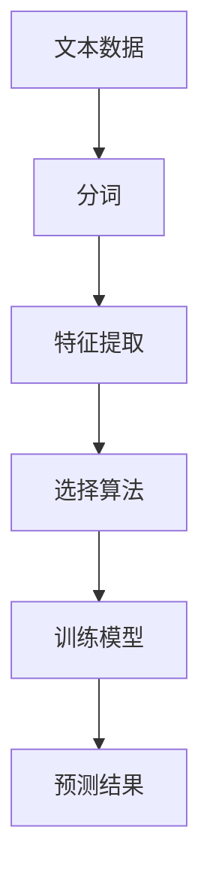
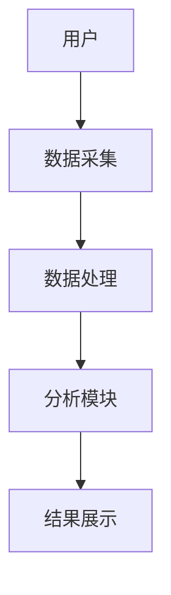

                 


# AI agents辅助价值投资者进行社交媒体分析

> **关键词**：AI agents，社交媒体分析，价值投资，情感分析，NLP，投资决策

> **摘要**：本文探讨了AI agents如何辅助价值投资者从社交媒体数据中获取有价值的信息。通过分析社交媒体文本、情感倾向和网络影响力，AI agents能够帮助投资者识别市场情绪、评估公司声誉并优化投资决策。文章详细介绍了相关技术原理、系统设计和实际应用案例。

---

## 第一部分：社交媒体分析的背景与价值投资

### 第1章：社交媒体分析的背景与价值投资

#### 1.1 社交媒体分析的现状与挑战

- **社交媒体数据的特点**：海量、实时、多样，包含文本、图片、视频等多种形式。
- **价值投资者面临的挑战**：信息过载、情绪干扰、数据噪声。
- **AI agents的作用**：高效处理数据，提取关键信息，提供决策支持。

#### 1.2 价值投资的核心概念与策略

- **价值投资定义**：通过分析公司基本面，寻找被市场低估的投资标的。
- **社交媒体在价值投资中的作用**：提供市场情绪、公司新闻、投资者观点等信息。
- **AI agents的应用场景**：实时监控市场动态，分析投资者情绪，识别潜在投资机会。

#### 1.3 AI agents辅助价值投资的必要性

- **数据处理优势**：AI agents能够快速处理大量非结构化数据。
- **信息分析优势**：通过NLP技术，AI agents能识别文本中的情感、主题和实体。
- **决策支持优势**：AI agents提供数据驱动的见解，辅助投资者做出更明智的决策。

---

## 第二部分：AI agents的基本概念与核心原理

### 第2章：AI agents的基本概念与核心原理

#### 2.1 AI agents的定义与分类

- **定义**：AI agents是能够感知环境、执行任务的智能体。
- **分类**：基于规则的AI agents和基于模型的AI agents，以及基于大模型的AI agents。
- **基于大模型的AI agents**：利用如GPT-3等模型进行更复杂的任务处理。

#### 2.2 AI agents的核心原理

- **自然语言处理（NLP）**：用于文本理解和生成。
- **信息抽取与知识图谱**：从文本中提取实体、关系和事件，构建知识图谱。
- **情感分析与意图识别**：识别文本中的情感倾向和用户意图。

#### 2.3 AI agents在社交媒体分析中的应用

- **情感分析**：判断社交媒体上的观点是正面、负面还是中性。
- **主题挖掘**：识别文本中的主要主题和话题。
- **网络影响力分析**：评估用户的影响力和信息传播路径。

---

## 第三部分：社交媒体文本分析的核心技术

### 第3章：社交媒体文本分析的核心技术

#### 3.1 文本预处理与特征提取

- **文本清洗**：去除无关字符、停用词和噪音。
- **分词与词袋模型**：将文本分解成词语，并构建词袋模型。
- **词嵌入与大模型表示**：使用Word2Vec或BERT等模型生成词向量。

#### 3.2 情感分析与主题挖掘

- **情感分析算法**：使用SVM、随机森林或深度学习模型。
- **主题挖掘方法**：LDA（Latent Dirichlet Allocation）和NMF（Non-negative Matrix Factorization）。
- **案例分析**：分析社交媒体上的股票评论，判断市场情绪。

---

## 第四部分：基于AI agents的情感分析算法原理

### 第4章：基于AI agents的情感分析算法原理

#### 4.1 情感分析的算法流程



#### 4.2 情感分析的数学模型

- **线性SVM模型**：使用词袋模型，公式为：
  $$ f(x) = \text{sign}(w \cdot x + b) $$
- **深度学习模型**：使用卷积神经网络（CNN）或循环神经网络（RNN）。

#### 4.3 情感分析的Python实现

```python
from sklearn.svm import SVC
from sklearn.feature_extraction.text import TfidfVectorizer

# 文本预处理
vectorizer = TfidfVectorizer(max_features=5000)
X = vectorizer.fit_transform(texts)

# 训练模型
model = SVC()
model.fit(X, y)

# 预测
new_text = ["股票表现不错"]
new_X = vectorizer.transform([new_text])
print(model.predict(new_X))
```

---

## 第五部分：社交媒体影响力分析与网络结构分析

### 第5章：社交媒体影响力分析与网络结构分析

#### 5.1 社交媒体影响力分析方法

- **中心性分析**：计算用户的度中心性、接近中心性和中间中心性。
- **社区检测**：使用社区检测算法识别社交网络中的群体。

#### 5.2 网络结构分析的数学模型

- **度中心性公式**：
  $$ \text{degree}(v) = \sum_{u} a_{uv} $$
- **Louvain算法**：用于社区检测的贪心算法。

#### 5.3 社交媒体影响力的Python实现

```python
import networkx as nx

# 构建社交网络图
G = nx.Graph()
G.add_edges_from(edges)

# 计算度中心性
degrees = nx.degree_centrality(G)
print(degrees)

# 社区检测
communities = nx.community_louvain(G)
print(communities)
```

---

## 第六部分：系统架构设计与实现方案

### 第6章：系统架构设计与实现方案

#### 6.1 系统功能设计

- **数据采集模块**：从社交媒体API获取数据。
- **数据处理模块**：清洗、分词和特征提取。
- **分析模块**：情感分析和影响力分析。
- **结果展示模块**：可视化分析结果。

#### 6.2 系统架构设计



#### 6.3 接口设计与交互流程

- **API接口**：RESTful API提供数据获取和分析结果。
- **交互流程**：用户输入查询，系统返回分析结果。

---

## 第七部分：项目实战与案例分析

### 第7章：项目实战与案例分析

#### 7.1 项目实战：社交媒体情感分析系统

- **环境安装**：
  ```bash
  pip install numpy pandas scikit-learn networkx
  ```

#### 7.2 系统实现

```python
from sklearn.model_selection import train_test_split
from sklearn.metrics import accuracy_score

# 数据分割
X_train, X_test, y_train, y_test = train_test_split(X, y, test_size=0.2)

# 模型训练
model.fit(X_train, y_train)

# 模型评估
print(accuracy_score(model.predict(X_test), y_test))
```

#### 7.3 案例分析

- **案例1**：分析某公司社交媒体上的评论，识别市场情绪。
- **案例2**：通过影响力分析，识别关键意见领袖。

---

## 第八部分：总结、小结与注意事项

### 第8章：总结与注意事项

#### 8.1 总结

- AI agents通过社交媒体分析，为价值投资者提供了强大的数据支持。
- 相关技术包括NLP、情感分析和网络影响力分析。

#### 8.2 小结与注意事项

- 数据质量和模型选择影响分析结果。
- 需要注意隐私保护和数据合规性。
- 推荐进一步学习相关技术书籍和论文。

---

**作者**：AI天才研究院/AI Genius Institute & 禅与计算机程序设计艺术 /Zen And The Art of Computer Programming

