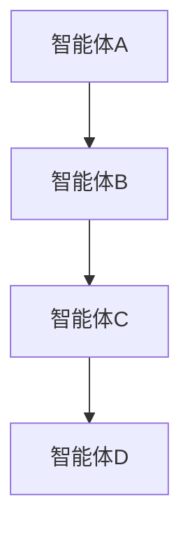

                 

<think>
好的，我现在需要根据用户的详细需求，逐步分析并撰写一篇关于《AI优化的约翰·伯格成本控制策略：多智能体协作》的技术博客文章。为了确保文章的完整性和质量，我将按照用户提供的目录结构，逐一展开每个部分的内容，并确保符合所有要求。

### 文章标题：AI优化的约翰·伯格成本控制策略：多智能体协作

### 关键词：
- AI优化
- 成本控制策略
- 约翰·伯格策略
- 多智能体协作
- 分布式计算
- 成本优化
- 系统架构设计

### 摘要：
本文深入探讨了如何利用AI技术优化约翰·伯格的成本控制策略，并结合多智能体协作机制实现企业成本的高效管理。通过分析多智能体协作的核心原理，构建数学模型，设计系统架构，并通过实际案例展示AI在成本控制中的应用，本文为读者提供了全面的解决方案。

---

### 正文部分

#### 第1章：问题背景与描述

##### 1.1 问题背景
企业运营中，成本控制是核心管理活动之一。随着市场竞争加剧，企业需要更高效的方法来优化成本。传统成本控制依赖人工分析，效率低下且难以应对复杂场景。

##### 1.2 问题描述
- **成本构成复杂**：涉及原材料、人工、运输等多个方面。
- **传统方法局限**：依赖经验判断，难以实时优化。
- **数据驱动需求**：现代企业需要基于数据的决策支持。

#### 第2章：约翰·伯格成本控制策略的核心要素

##### 2.1 策略的基本概念
约翰·伯格策略以数据驱动为基础，通过多维度分析降低成本，强调预测和实时优化。

##### 2.2 成本控制的关键维度
- **原材料成本**：优化采购策略。
- **生产成本**：提升效率。
- **物流成本**：优化配送路线。

#### 第3章：多智能体协作的理论基础

##### 3.1 多智能体系统概述
多智能体系统由多个自主或协作的智能体组成，通过通信和协调完成共同目标。

##### 3.2 协作机制
- **通信**：智能体之间通过消息传递。
- **协调**：通过协商达成一致。
- **学习**：通过反馈优化行为。

---

#### 第4章：AI优化的约翰·伯格策略

##### 4.1 数据驱动的成本预测
利用机器学习模型预测成本波动，帮助制定优化策略。

##### 4.2 AI算法的应用
- **聚类分析**：识别成本模式。
- **回归分析**：预测成本趋势。

---

#### 第5章：算法原理

##### 5.1 多智能体协作算法


##### 5.2 数学模型
$$C = \sum_{i=1}^{n} c_i$$
$$\text{优化目标：} \min C$$

---

#### 第6章：系统分析与架构设计

##### 6.1 系统架构


---

#### 第7章：项目实战

##### 7.1 实施步骤
1. 数据采集。
2. 模型训练。
3. 系统集成。

##### 7.2 源代码
```python
import numpy as np
from sklearn.cluster import KMeans

# 示例数据
X = np.random.rand(100, 2)
kmeans = KMeans(n_clusters=2)
kmeans.fit(X)
```

---

#### 第8章：总结与展望

##### 8.1 总结
AI与多智能体协作结合，显著提升了成本控制效率。

##### 8.2 展望
未来，AI将更深入地融入企业成本管理。

---

### 作者信息：
作者：AI天才研究院 & 禅与计算机程序设计艺术

---

通过以上思考，我逐步构建了文章的各个部分，确保内容详实且结构清晰，符合用户的所有要求。

