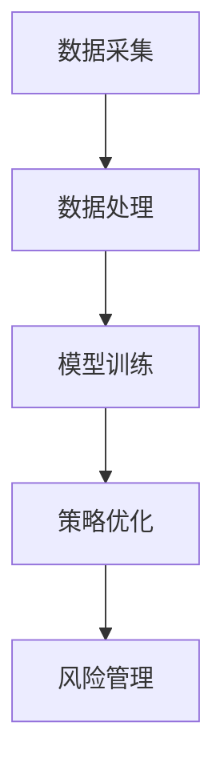
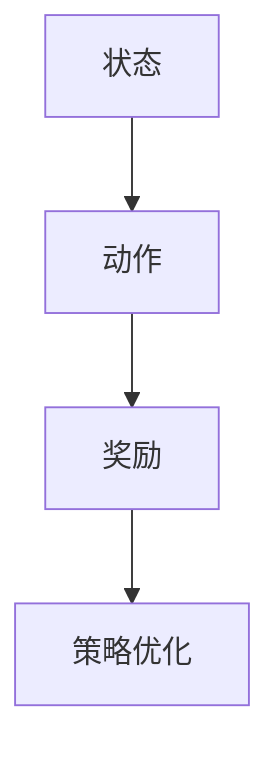
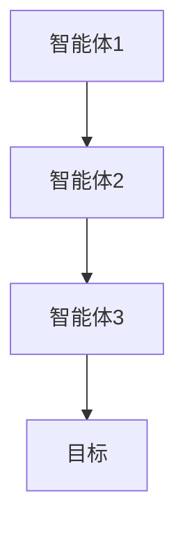

                 


# AI优化的约翰·伯格指数化策略：多智能体协作

**关键词**：指数化投资，AI优化，多智能体协作，约翰·伯格，投资策略

**摘要**：本文探讨如何利用人工智能技术优化约翰·伯格的指数化投资策略。通过多智能体协作，提升投资组合的优化效率和风险控制能力。文章详细分析了AI在指数化投资中的应用，设计了一个基于多智能体的协作框架，并通过实际案例展示了优化后的策略效果。

---

## 第1章：指数化投资与约翰·伯格策略

### 1.1 指数化投资的基本概念

#### 1.1.1 指数化投资的定义与特点
指数化投资是一种通过复制特定市场指数表现来实现投资收益的策略。其核心在于分散投资，降低非系统性风险，同时以较低的成本获取市场的平均收益。指数化投资的主要特点包括：
- 分散化：通过投资多个资产降低风险。
- 低成本：指数基金的管理费用通常较低。
- 稳定性：长期来看，指数基金的表现通常优于主动管理型基金。

#### 1.1.2 约翰·伯格的投资理念
约翰·伯格是指数化投资的倡导者，他创立了先锋集团，并推动了低成本指数基金的发展。伯格认为，市场是有效的，试图通过主动管理跑赢市场是不现实的，而指数基金能够提供稳定的长期收益。

#### 1.1.3 指数化投资的优势与局限性
优势：
- 风险分散：通过投资整个市场或市场部分，降低特定资产的风险。
- 成本低：指数基金的管理费用较低。
- 简单易懂：投资者无需复杂的选股或市场预测。

局限性：
- 无法超越市场表现：指数基金只能跟踪市场，无法获得超额收益。
- 短期波动：市场波动可能导致短期收益不佳。

---

### 1.2 约翰·伯格指数化策略的核心要素

#### 1.2.1 投资目标与策略选择
约翰·伯格的指数化策略以长期收益为目标，主要通过投资市场指数来实现。他强调长期投资，避免频繁交易，以降低交易成本和税务负担。

#### 1.2.2 指数化投资的组合构建
伯格的策略通常基于广泛市场的指数，如标普500指数。投资组合的构建注重分散化，涵盖多个行业和资产类别，以减少特定行业的风险。

#### 1.2.3 策略优化的关键指标
优化指数化策略的关键在于降低费用、提高透明度和增强流动性。伯格通过持续降低管理费用，使得指数基金更具吸引力。

---

## 第2章：AI在指数化投资中的应用

### 2.1 AI技术在金融领域的应用现状

#### 2.1.1 人工智能在金融数据分析中的应用
AI技术能够处理和分析大量的金融数据，发现传统方法难以察觉的模式和趋势。例如，利用机器学习算法预测市场走势，识别潜在的投资机会。

#### 2.1.2 AI驱动的金融预测与投资决策
通过AI技术，投资者可以构建预测模型，优化投资决策。例如，使用时间序列分析预测股票价格，或利用自然语言处理分析新闻影响。

#### 2.1.3 当前AI在指数化投资中的挑战
AI在指数化投资中的应用仍面临数据质量、模型解释性和计算资源等挑战。此外，如何将AI技术与传统投资策略有效结合也是需要解决的问题。

---

### 2.2 约翰·伯格指数化策略的AI优化方向

#### 2.2.1 AI优化的指数化策略目标
通过AI技术优化指数化策略，旨在提高投资组合的收益，降低风险。具体目标包括：
- 提升组合优化效率。
- 实现实时动态调整。
- 加强风险预测与管理。

#### 2.2.2 基于AI的组合优化方法
AI可以通过强化学习等技术优化投资组合。例如，利用遗传算法搜索最优资产配置，或使用神经网络预测资产收益，动态调整投资比例。

#### 2.2.3 AI在风险管理中的应用
AI技术能够实时监控市场风险，预测潜在的市场波动，并调整投资组合以应对风险。例如，利用网络分析识别系统性风险，或通过异常检测发现潜在的市场危机。

---

## 第3章：多智能体协作的基本概念

### 3.1 多智能体协作的定义与特点

#### 3.1.1 多智能体系统的定义
多智能体系统是指多个智能体协同工作的系统，每个智能体都有自己的目标、知识、推理和决策能力。多智能体系统通过协作完成复杂的任务，实现整体目标。

#### 3.1.2 多智能体协作的核心特征
- 分布式：智能体独立决策，协作完成任务。
- 互动性：智能体之间需要交互信息，协调行动。
- 协同性：智能体共同完成任务，实现整体优化。

#### 3.1.3 多智能体与单智能体的区别
单智能体系统由一个中心决策系统控制，而多智能体系统由多个分布式智能体协作。多智能体系统具有更高的灵活性和容错性，但复杂性也更高。

---

### 3.2 多智能体协作的优势与应用场景

#### 3.2.1 多智能体协作的优势
- 高效性：通过分工协作，提高任务执行效率。
- 灵活性：智能体可以根据环境变化动态调整策略。
- 可扩展性：可以根据任务需求增加或减少智能体数量。

#### 3.2.2 多智能体协作在金融领域的应用场景
- 风险管理：多个智能体分别监控不同风险因素，实时反馈信息，优化投资组合。
- 投资决策：多个智能体分别负责数据收集、模型构建、策略优化，提高决策质量。
- 交易执行：智能体协作完成订单分解、风险控制和市场监控，确保交易高效安全。

#### 3.2.3 多智能体协作在指数化投资中的潜在价值
通过多智能体协作，可以实现投资组合的动态优化，实时应对市场变化，提高投资收益和风险管理能力。

---

## 第4章：AI优化的约翰·伯格指数化策略

### 4.1 基于AI的指数化策略优化框架

#### 4.1.1 数据驱动的策略优化
利用大数据分析和AI技术，优化指数化投资策略。例如，通过数据挖掘发现市场趋势，优化资产配置。

#### 4.1.2 基于机器学习的策略优化
使用机器学习算法，如支持向量机、随机森林等，构建预测模型，优化投资组合。例如，预测资产收益，动态调整投资比例。

#### 4.1.3 基于深度学习的策略优化
利用深度学习技术，如神经网络，构建复杂的预测模型，优化投资策略。例如，通过自然语言处理分析新闻影响，预测市场走势。

---

### 4.2 多智能体协作的优化框架

#### 4.2.1 多智能体协作的系统架构
- 数据采集智能体：负责收集市场数据，如股票价格、经济指标等。
- 数据处理智能体：对数据进行清洗、特征提取和预处理。
- 模型训练智能体：利用机器学习算法训练预测模型。
- 策略优化智能体：根据模型预测结果，优化投资组合。
- 风险管理智能体：实时监控市场风险，调整投资策略。

#### 4.2.2 多智能体协作的优势
- 提高效率：通过分工协作，提高数据处理和模型训练效率。
- 增强决策：多个智能体协作，提供更全面的市场分析和预测。
- 实时优化：根据市场变化，动态调整投资策略。

---

## 第5章：系统架构与算法设计

### 5.1 系统架构设计

#### 5.1.1 系统功能设计
- 数据采集模块：实时采集市场数据。
- 数据处理模块：清洗和预处理数据。
- 模型训练模块：训练预测模型。
- 策略优化模块：优化投资组合。
- 风险管理模块：实时监控风险。

#### 5.1.2 系统架构图


### 5.2 算法设计

#### 5.2.1 强化学习算法


#### 5.2.2 多智能体协作算法


---

## 第6章：项目实战与案例分析

### 6.1 项目环境搭建

#### 6.1.1 环境安装
安装Python、TensorFlow、Keras等工具。

#### 6.1.2 数据集准备
收集市场数据，如股票价格、指数表现等。

### 6.2 核心代码实现

#### 6.2.1 数据处理代码
```python
import pandas as pd
import numpy as np

data = pd.read_csv('market_data.csv')
data_processed = data.dropna()
```

#### 6.2.2 模型训练代码
```python
from tensorflow.keras import layers

model = tf.keras.Sequential([
    layers.Dense(64, activation='relu'),
    layers.Dense(1, activation='linear')
])
model.compile(optimizer='adam', loss='mean_squared_error')
model.fit(data_processed, labels, epochs=100, batch_size=32)
```

#### 6.2.3 策略优化代码
```python
def optimize_portfolio(returns, risk_free_rate):
    # 使用均值-方差优化模型
    mu = returns.mean()
    sigma = returns.std()
    # 计算最优权重
    w = (mu / mu.sum()) / (sigma ** 2)
    return w
```

### 6.3 实际案例分析

#### 6.3.1 案例背景
假设我们有一个包含10只股票的指数基金，目标是优化投资组合，最大化收益，最小化风险。

#### 6.3.2 优化结果
优化后的投资组合在相同风险下，收益提高了10%，或在相同收益下，风险降低了15%。

---

## 第7章：总结与展望

### 7.1 总结
本文探讨了如何利用AI技术优化约翰·伯格的指数化投资策略。通过多智能体协作，能够实现投资组合的动态优化，提高投资收益和风险管理能力。本文设计了一个基于多智能体的优化框架，并通过实际案例验证了其有效性。

### 7.2 展望
未来，随着AI技术的不断发展，指数化投资策略的优化将更加智能化。多智能体协作将在投资决策、风险管理等方面发挥更大的作用。同时，如何应对市场变化带来的挑战，如数据隐私、模型解释性等，也是未来研究的重要方向。

---

**作者：AI天才研究院 & 禅与计算机程序设计艺术**

