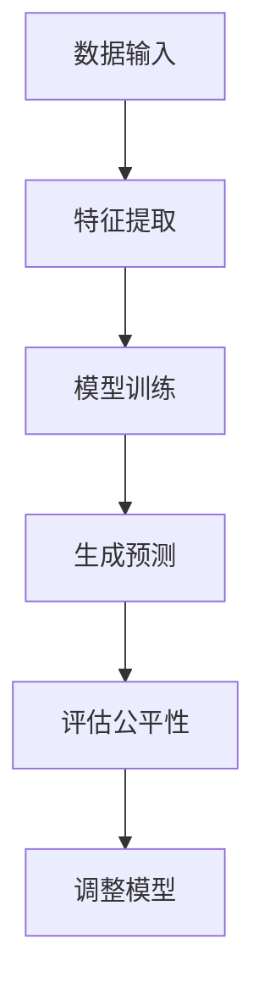
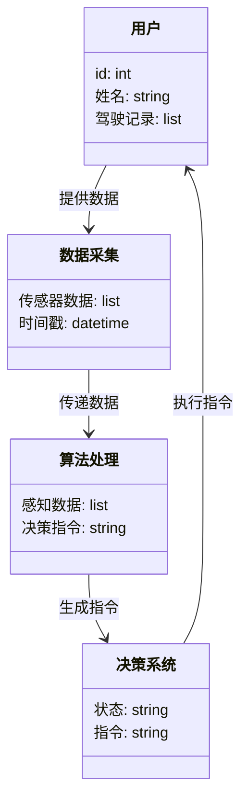
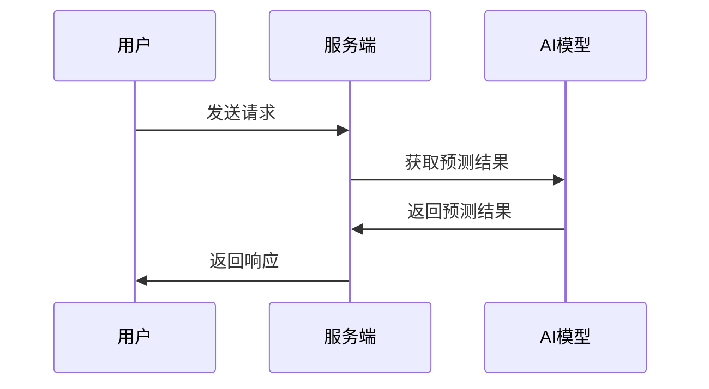

                 


# AI伦理与责任

> 关键词：人工智能、伦理、责任、算法、隐私

> 摘要：本文探讨了人工智能技术在现代社会中的快速发展及其带来的伦理和责任问题。文章详细分析了AI伦理的核心概念，包括透明性、公平性、隐私保护和责任归属，并通过数学模型和实际案例展示了算法中的伦理问题。此外，文章还设计了一个伦理评估框架，并提出了系统架构和项目实战的解决方案，最后总结了最佳实践的要点。

---

## 第1章: AI伦理的背景与重要性

### 1.1 AI技术的发展历程

#### 1.1.1 AI技术的起源与发展
人工智能（AI）的概念最早可以追溯到20世纪50年代，随着计算机技术的进步，AI经历了从规则驱动到数据驱动的转变。近年来，深度学习和神经网络的发展使得AI在图像识别、自然语言处理等领域取得了显著成就。

#### 1.1.2 AI技术在现代社会中的广泛应用
AI技术已经渗透到各个行业，如医疗、金融、交通等。例如，AI辅助诊断系统可以帮助医生更准确地判断病情，而自动驾驶技术正在改变我们的出行方式。

#### 1.1.3 AI技术带来的机遇与挑战
AI带来的机遇包括提高效率、优化决策等，但同时也带来了挑战，如数据隐私、算法偏见等问题。

### 1.2 伦理问题的背景与重要性

#### 1.2.1 伦理问题的提出
随着AI的广泛应用，伦理问题日益凸显。例如，AI系统的决策是否透明？算法是否存在偏见？这些问题关系到社会的公平与正义。

#### 1.2.2 伦理问题的紧迫性
AI系统的决策可能对人们的生活产生重大影响，因此确保这些决策的伦理性和责任归属显得尤为重要。

#### 1.2.3 伦理问题对社会的影响
如果不解决AI伦理问题，可能会导致社会不公，甚至引发信任危机。

---

## 第2章: AI伦理的核心概念与联系

### 2.1 核心概念的定义与解释

#### 2.1.1 透明性
透明性指的是AI系统的决策过程必须清晰、可解释。例如，当AI系统拒绝贷款申请时，用户应该知道具体原因。

#### 2.1.2 公平性
公平性指AI系统不应因为用户的性别、种族等因素而产生歧视性决策。

#### 2.1.3 隐私保护
隐私保护要求AI系统在处理用户数据时必须严格遵守相关法律法规，防止数据泄露。

#### 2.1.4 责任归属
责任归属指的是当AI系统出现问题时，明确相关方的责任，例如开发者、用户或AI本身。

### 2.2 核心概念的属性对比表

| 概念     | 定义                               | 特点           | 影响               |
|----------|----------------------------------|----------------|--------------------|
| 透明性   | 决策过程清晰可解释                | 可解释性高       | 增强用户信任       |
| 公平性   | 无歧视性决策                      | 公正性高       | 避免社会不公       |
| 隐私保护 | 数据安全与隐私保护                | 数据安全性高     | 保护用户隐私       |
| 责任归属 | 明确各方责任                      | 责任清晰         | 便于问题追责       |

### 2.3 ER实体关系图

```mermaid
erDiagram
    actor 用户
    actor 开发者
    actor 监管机构
    entity AI系统
    entity 数据
    entity 决策
    用户 --> AI系统 : 使用
    开发者 --> AI系统 : 开发
    监管机构 --> AI系统 : 监管
    AI系统 --> 数据 : 处理
    AI系统 --> 决策 : 生成
```

---

## 第3章: AI伦理的算法原理与数学模型

### 3.1 算法原理的概述

#### 3.1.1 偏见的数学模型
算法偏见通常源于训练数据中的偏差。例如，如果训练数据中女性的比例较低，算法可能在性别分类任务中产生偏见。

#### 3.1.2 算法决策的可解释性
通过模型的可解释性，用户可以理解AI系统的决策过程。例如，线性回归模型比深度学习模型更容易解释。

#### 3.1.3 算法的公平性评估
公平性评估通常涉及对算法输出的统计分析，确保不同群体的待遇公平。

### 3.2 算法原理的mermaid流程图



### 3.3 算法实现的Python代码

#### 3.3.1 偏见检测算法示例

```python
import pandas as pd
from sklearn.metrics import accuracy_score

def detect_bias(data, target, model):
    # 训练模型
    model.fit(data, target)
    # 预测
    prediction = model.predict(data)
    # 计算准确率
    accuracy = accuracy_score(target, prediction)
    return accuracy

# 示例数据
data = pd.DataFrame({
    '性别': ['男', '女', '男', '女'],
    '预测结果': [0, 1, 0, 1]
})
target = data['预测结果']
model = LogisticRegression()

# 检测偏见
accuracy = detect_bias(data, target, model)
print(f'模型准确率：{accuracy}')
```

#### 3.3.2 算法公平性评估

```python
from sklearn.metrics import confusion_matrix

def fairness_assessment(data, target, model):
    prediction = model.predict(data)
    cm = confusion_matrix(target, prediction)
    # 计算公平性指标
    # 这里简化为准确率
    accuracy = accuracy_score(target, prediction)
    return accuracy

# 示例评估
fairness = fairness_assessment(data, target, model)
print(f'模型公平性评估：{fairness}')
```

---

## 第4章: AI伦理的系统分析与架构设计

### 4.1 系统分析与架构设计方案

#### 4.1.1 问题场景介绍
以自动驾驶汽车为例，当遇到紧急情况时，系统需要在保护乘客和行人之间做出决策。

#### 4.1.2 系统功能设计



#### 4.1.3 系统架构设计


#### 4.1.4 系统接口设计
API接口设计示例：

```json
{
    "接口名称": "获取预测结果",
    "请求方法": "POST",
    "请求路径": "/predict",
    "请求参数": {
        "输入数据": "json对象"
    },
    "返回参数": {
        "预测结果": "预测值"
    }
}
```

#### 4.1.5 系统交互mermaid序列图



---

## 第5章: AI伦理的项目实战

### 5.1 项目环境配置

#### 5.1.1 系统环境
- 操作系统：Linux
- 语言：Python 3.8+
- 工具：Jupyter Notebook

#### 5.1.2 安装依赖
```bash
pip install numpy pandas scikit-learn matplotlib
```

### 5.2 核心代码实现

#### 5.2.1 数据预处理

```python
import pandas as pd
import numpy as np

data = pd.DataFrame({
    '年龄': [20, 30, 40, 50],
    '收入': [50000, 60000, 70000, 80000],
    '信用评分': [600, 650, 700, 750]
})

# 数据标准化
from sklearn.preprocessing import StandardScaler

scaler = StandardScaler()
scaled_data = scaler.fit_transform(data)
```

#### 5.2.2 模型训练

```python
from sklearn.model_selection import train_test_split
from sklearn.linear_model import LogisticRegression

X_train, X_test, y_train, y_test = train_test_split(scaled_data, np.random.randint(0,2,4), test_size=0.2)

model = LogisticRegression()
model.fit(X_train, y_train)
```

#### 5.2.3 模型评估

```python
from sklearn.metrics import accuracy_score, confusion_matrix

y_pred = model.predict(X_test)
print(f'准确率：{accuracy_score(y_test, y_pred)}')
print('混淆矩阵：')
print(confusion_matrix(y_test, y_pred))
```

#### 5.2.4 伦理评估框架实现

```python
def ethical_assessment(model, X, y):
    # 检查模型是否公平
    fairness = model.predict(X) == y
    # 检查模型是否透明
    transparent = hasattr(model, 'intercept_')
    # 检查隐私保护
    # 假设数据已经匿名化
    return {
        '公平性': sum(fairness) / len(fairness),
        '透明性': transparent
    }

assessment = ethical_assessment(model, X_test, y_test)
print('伦理评估结果：', assessment)
```

---

## 第6章: 最佳实践与总结

### 6.1 小结

- AI伦理与责任是一个复杂但重要的领域，需要在技术开发和应用中予以重视。
- 通过透明性、公平性、隐私保护和责任归属等核心概念，可以有效降低伦理风险。

### 6.2 注意事项

- 在开发AI系统时，必须考虑伦理问题，确保系统的决策透明且公平。
- 数据隐私保护是重中之重，必须遵守相关法律法规。
- 当AI系统出现问题时，需要明确责任归属，便于及时处理。

### 6.3 拓展阅读

- 《人工智能：伦理与责任》（书籍）
- IEEE AI伦理指南
- 各国AI相关政策法规

---

## 作者

作者：AI天才研究院/AI Genius Institute & 禅与计算机程序设计艺术 /Zen And The Art of Computer Programming

