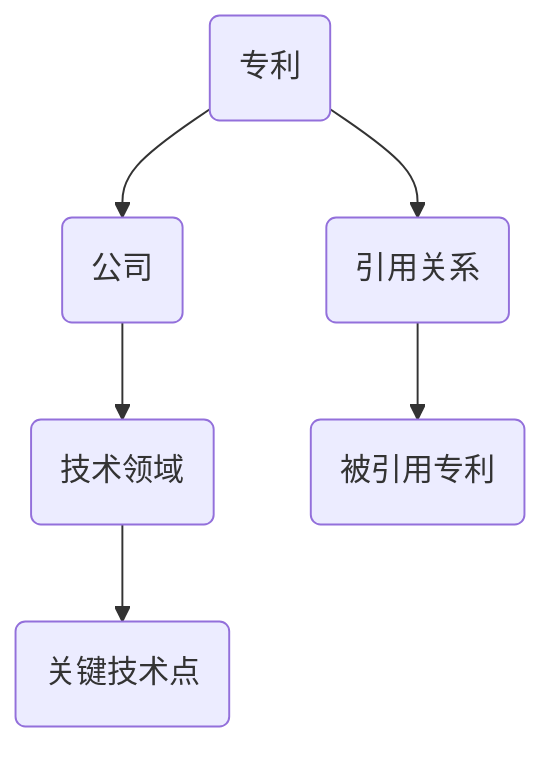
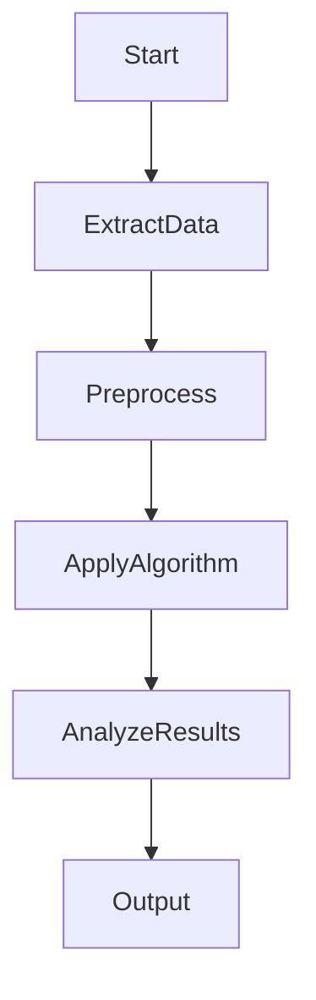

                 


# AI协作分析公司专利引用网络：评估技术领先地位

> **关键词**：AI协作分析、专利引用网络、技术领先地位、文本挖掘、图论算法、机器学习、系统架构

> **摘要**：本文探讨了利用AI协作分析公司专利引用网络来评估技术领先地位的方法。通过构建专利引用网络，结合文本挖掘和图论算法，分析技术领域的动态和趋势，识别关键技术和领先公司。文章详细介绍了核心概念、算法原理、系统架构，并通过案例分析展示AI协作分析的实际应用。

---

## 第1章 AI协作分析的背景与核心概念

### 1.1 问题背景

#### 1.1.1 专利分析的重要性

专利是企业技术创新的核心成果，专利分析能够揭示企业的技术布局、研发重点和竞争优势。通过专利引用网络分析，可以发现技术间的关联性，评估技术领先性。

#### 1.1.2 传统专利分析的局限性

传统专利分析依赖人工解读，耗时且难以发现隐藏的技术关联。随着技术复杂度的增加，传统方法在处理海量专利数据时显得力不从心。

#### 1.1.3 AI协作分析的优势

AI协作分析能够高效处理大量专利数据，发现潜在的技术关联，提供客观的技术评估结果。通过结合文本挖掘和图论算法，AI协作分析可以揭示技术网络的结构特征，帮助企业识别技术领先者。

### 1.2 问题描述

#### 1.2.1 专利引用网络的定义

专利引用网络是由专利文档及其引用关系构成的网络，反映了技术间的引用和依赖关系。

#### 1.2.2 技术领先地位的评估需求

企业需要通过评估技术领先地位，制定研发策略，识别技术风险和机会。

#### 1.2.3 当前技术评估中的挑战

传统评估方法主观性强，难以量化技术领先性；数据复杂度高，处理难度大；技术动态变化快，需要实时评估。

### 1.3 问题解决

#### 1.3.1 AI协作分析的解决方案

利用AI技术自动处理专利数据，构建专利引用网络，分析技术网络的结构特征，评估技术领先性。

#### 1.3.2 专利引用网络的构建方法

通过文本挖掘提取专利信息，建立专利节点和引用边，构建网络结构。

#### 1.3.3 技术领先地位的评估方法

基于网络分析和机器学习，评估节点的重要性，识别关键技术和领先公司。

### 1.4 边界与外延

#### 1.4.1 专利引用网络的边界

专利引用网络仅包含专利及其引用关系，不涉及其他类型的知识资产。

#### 1.4.2 技术领先地位的评估范围

专注于技术领域的领先性评估，不涉及企业整体竞争力。

#### 1.4.3 相关领域的关联性

专利引用网络与技术趋势、市场竞争等密切相关。

### 1.5 核心概念与组成

#### 1.5.1 专利引用网络的组成要素

- 专利节点：表示单个专利
- 引用边：表示专利之间的引用关系

#### 1.5.2 技术领先地位的评估维度

- 技术创新性：专利的新颖性
- 技术影响力：专利被引用次数
- 技术布局：专利分布的技术领域

#### 1.5.3 AI协作分析的核心要素

- 数据处理：专利文本挖掘
- 网络构建：专利引用网络构建
- 网络分析：技术领先性评估

---

## 第2章 专利引用网络的核心概念与联系

### 2.1 核心概念原理

#### 2.1.1 专利引用网络的构建原理

通过文本挖掘技术提取专利信息，建立专利节点和引用边，构建网络结构。

#### 2.1.2 技术领先地位的评估原理

基于网络分析和机器学习，评估节点的重要性，识别关键技术和领先公司。

#### 2.1.3 AI协作分析的协同机制

结合文本挖掘、图论算法和机器学习，协同分析专利引用网络，评估技术领先性。

### 2.2 概念属性特征对比

| **概念**       | **属性特征**                     |
|----------------|----------------------------------|
| 专利节点       | 单个专利，包含专利号、申请人、申请日期等信息 |
| 引用边         | 表示专利之间的引用关系           |
| 技术领域       | 专利涉及的技术领域               |
| 技术领先性     | 专利在网络中的重要性和影响力       |

### 2.3 ER实体关系图架构



---

## 第3章 AI协作分析的算法原理

### 3.1 算法原理概述

#### 3.1.1 文本挖掘技术

用于提取专利文本中的关键词和主题，建立专利主题模型。

#### 3.1.2 图论算法

用于构建专利引用网络，分析网络的结构特征，如节点度数、中心性等。

#### 3.1.3 机器学习模型

用于预测技术趋势和评估技术领先性，如使用聚类算法识别技术簇。

### 3.2 算法流程图



### 3.3 算法实现

#### 3.3.1 文本挖掘算法

使用TF-IDF提取关键词，建立主题模型。

#### 3.3.2 图论算法

计算节点度数、PageRank算法评估节点重要性。

#### 3.3.3 机器学习模型

使用聚类算法识别技术簇，使用回归模型预测技术趋势。

### 3.4 数学模型

#### 3.4.1 PageRank算法公式

$$ PR(p) = \sum_{p' \in In(p)} \frac{PR(p')}{Out(p')} $$

其中，$PR(p)$表示节点$p$的PageRank值，$In(p)$表示节点$p$的入边，$Out(p')$表示节点$p'$的出边数。

#### 3.4.2 聚类算法公式

使用K-means算法进行聚类，计算节点间的相似性。

---

## 第4章 系统分析与架构设计方案

### 4.1 项目介绍

构建一个AI协作分析系统，用于评估公司专利引用网络的技术领先地位。

### 4.2 系统功能设计

- 数据采集模块：获取专利数据
- 数据处理模块：清洗和预处理
- 网络构建模块：构建专利引用网络
- 网络分析模块：评估技术领先性
- 结果展示模块：可视化分析结果

### 4.3 系统架构设计

```mermaid
graph TD
    Client --> API Gateway
    API Gateway --> PatentDB
    API Gateway --> AnalysisEngine
    AnalysisEngine --> TextMiner
    TextMiner --> KeywordExtractor
    TextMiner --> TopicModel
    AnalysisEngine --> NetworkBuilder
    NetworkBuilder --> GraphDatabase
```

### 4.4 系统接口设计

- 数据接口：提供专利数据的API接口
- 分析接口：提供技术领先性评估的API接口
- 可视化接口：提供图表展示的API接口

### 4.5 系统交互流程图

```mermaid
graph TD
    Client --> API Gateway
    API Gateway --> AnalysisEngine
    AnalysisEngine --> TextMiner
    TextMiner --> KeywordExtractor
    KeywordExtractor --> Client
    TextMiner --> TopicModel
    TopicModel --> Client
```

---

## 第5章 项目实战

### 5.1 环境安装

- 安装Python、Jupyter Notebook、自然语言处理库（如NLTK、spaCy）、图论分析库（如NetworkX）、机器学习库（如Scikit-learn）。

### 5.2 核心实现代码

#### 5.2.1 数据处理代码

```python
import pandas as pd
import numpy as np
from sklearn.feature_extraction.text import TfidfVectorizer

# 加载专利数据
patent_data = pd.read_csv('patent.csv')

# 使用TF-IDF提取关键词
vectorizer = TfidfVectorizer()
tfidf = vectorizer.fit_transform(patent_data['abstract'])
feature_names = vectorizer.get_feature_names_out()

# 提取关键词
keywords = pd.DataFrame(tfidf.toarray(), columns=feature_names)
```

#### 5.2.2 图构建代码

```python
import networkx as nx

# 构建专利引用网络
G = nx.Graph()
G.add_edges_from(patent_edges)

# 计算PageRank值
pr = nx.pagerank(G)
```

### 5.3 案例分析

分析某技术领域的专利引用网络，识别关键技术点和领先公司。

---

## 第6章 总结与展望

### 6.1 总结

本文详细介绍了AI协作分析在专利引用网络中的应用，展示了如何利用算法评估技术领先地位。

### 6.2 展望

未来研究可以结合更多数据源，如专利申请和引用数据，构建更复杂的网络模型，提供更精准的技术评估。

---

## 附录

### 附录A 数据集

推荐使用以下数据集进行实验：

- USPTO专利数据库
- PATENTSCOPE数据库

### 附录B 工具

推荐使用以下工具：

- Python的自然语言处理库：spaCy、NLTK
- 图论分析库：NetworkX
- 机器学习库：Scikit-learn

---

**作者：AI天才研究院 & 禅与计算机程序设计艺术**

---

这篇文章详细介绍了AI协作分析在专利引用网络中的应用，通过构建网络、分析算法和系统架构，帮助读者全面理解技术领先地位的评估方法。

