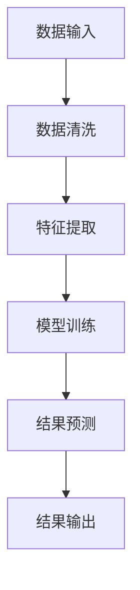
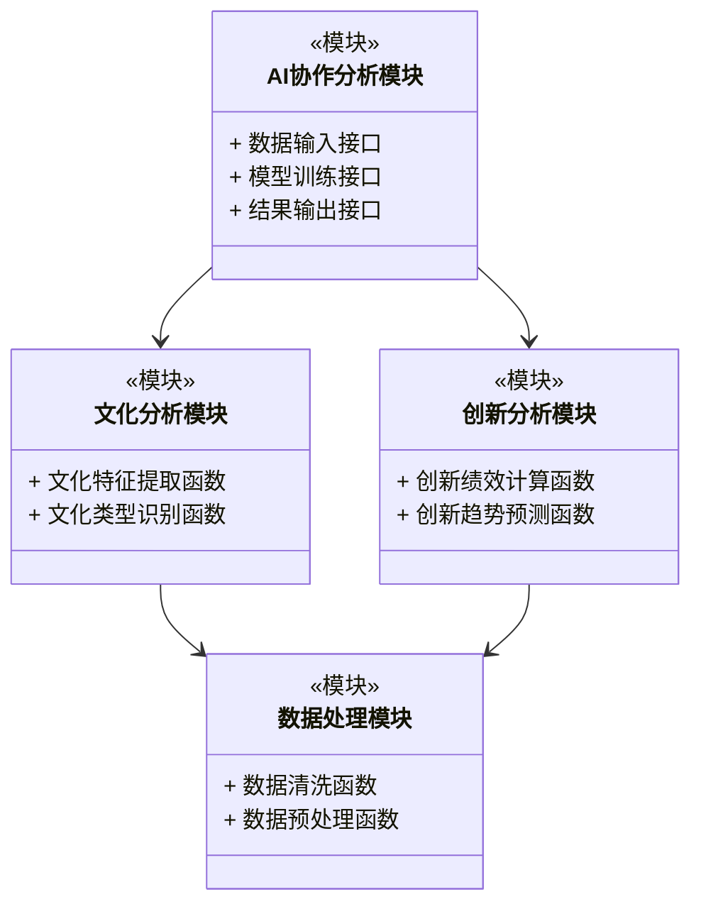
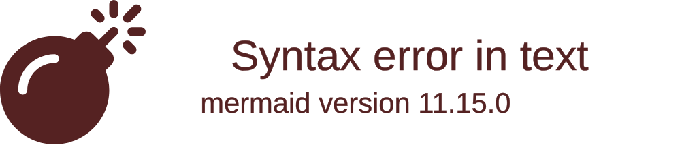
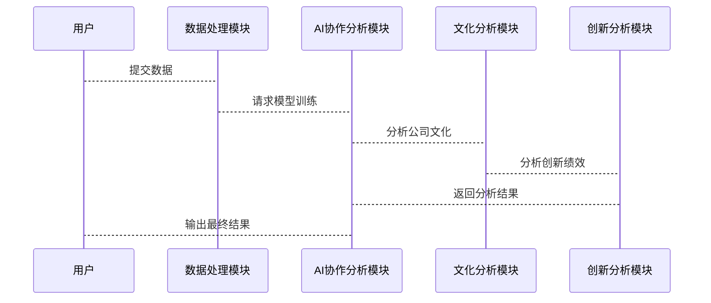

                 


# AI协作分析公司文化与创新相关性：预测长期成长潜力

## 关键词：AI协作分析、公司文化、创新相关性、长期成长潜力、自然语言处理、机器学习、系统架构

## 摘要：本文探讨了如何利用AI技术分析公司文化与创新之间的相关性，进而预测公司的长期成长潜力。通过详细分析核心概念、算法原理和系统架构，本文为读者提供了从理论到实践的全面指导。

---

# 第一部分: AI协作分析公司文化与创新相关性概述

## # 第1章: 问题背景与研究意义

### 1.1 问题背景介绍

#### 1.1.1 公司文化与创新的关系
公司文化是企业的灵魂，而创新是企业发展的源动力。公司文化通过影响员工的行为、态度和价值观，间接影响企业的创新能力。开放、包容的文化氛围更能激发创新潜能，而僵化的文化则可能抑制创新。

#### 1.1.2 AI技术在企业管理中的应用现状
AI技术已在企业管理中得到广泛应用，包括员工绩效分析、市场趋势预测等领域。然而，AI在分析公司文化与创新相关性方面仍处于起步阶段，存在较大的研究空间。

#### 1.1.3 当前研究的局限性与挑战
现有研究多关注单一维度，如公司文化或创新绩效，缺乏系统性分析。AI技术的应用也面临数据获取难、模型泛化性差等挑战。

### 1.2 研究意义与目标

#### 1.2.1 研究AI协作分析的必要性
通过AI技术整合公司文化与创新数据，挖掘两者之间的潜在联系，为企业提供数据驱动的决策支持。

#### 1.2.2 本研究的目标与预期成果
构建AI协作分析模型，量化公司文化对创新的影响，预测企业长期成长潜力。

#### 1.2.3 研究的价值与应用场景
为企业优化文化建设、提升创新能力提供参考；为投资者评估企业长期价值提供依据。

---

## # 第2章: 核心概念与理论基础

### 2.1 公司文化与创新的定义与特征

#### 2.1.1 公司文化的内涵与外延
- 内涵：企业共同的价值观、行为准则和工作方式。
- 外延：包括企业愿景、使命、核心价值观等。

#### 2.1.2 创新的概念与分类
- 创新：企业引入新思想、新方法的过程。
- 分类：技术创新、管理创新、产品创新等。

#### 2.1.3 两者关系的理论模型
公司文化通过影响员工态度和行为，间接影响创新绩效。积极的文化促进创新，而创新又能反过来增强文化活力。

### 2.2 AI协作分析的基本原理

#### 2.2.1 自然语言处理（NLP）在文本分析中的应用
- 分析公司文档（如使命陈述、员工反馈）中的关键词和主题。
- 使用TF-IDF提取重要词汇，识别文化特征。

#### 2.2.2 机器学习在模式识别中的作用
- 利用聚类算法识别企业文化类型。
- 使用分类算法预测创新绩效。

#### 2.2.3 数据挖掘在关联性分析中的应用
- 关联规则挖掘（如Apriori算法）发现文化特征与创新行为之间的联系。
- 序列分析挖掘企业文化演变与创新绩效变化的模式。

### 2.3 关键概念的ER实体关系图

```mermaid
er
actor: 公司文化, 创新
```

---

## # 第3章: AI协作分析的算法原理

### 3.1 算法原理概述

#### 3.1.1 自然语言处理（NLP）流程
1. 数据清洗：去除停用词、标点符号。
2. 分词：将文本分割为有意义的词语。
3. 词嵌入：使用Word2Vec生成词向量。
4. 文档表示：通过TF-IDF或Doc2Vec生成文档向量。

#### 3.1.2 机器学习模型的训练与优化
1. 数据预处理：归一化、缺失值处理。
2. 模型选择：尝试不同算法（如SVM、随机森林）。
3. 超参数调优：使用网格搜索优化模型性能。

#### 3.1.3 数据预处理与特征提取
1. 特征工程：提取文本长度、关键词频率等特征。
2. 维度降维：使用PCA降低特征维度。

### 3.2 算法实现的详细步骤

#### 3.2.1 数据清洗与标注
- 使用NLTK库清洗文本数据。
- 手动标注部分数据，建立训练集。

#### 3.2.2 模型训练与调优
- 划分训练集和测试集。
- 训练多个模型，比较准确率、召回率等指标。

#### 3.2.3 结果评估与优化
- 使用混淆矩阵评估模型性能。
- 调整模型参数，优化预测结果。

### 3.3 算法流程图



### 3.4 数学模型与公式

#### 3.4.1 基于文本挖掘的相似度计算

##### 余弦相似度公式
$$ \text{similarity} = \frac{\vec{A} \cdot \vec{B}}{|\vec{A}| |\vec{B}|} $$

##### Jaccard相似度公式
$$ J(A,B) = \frac{|A \cap B|}{|A \cup B|} $$

#### 3.4.2 机器学习模型的数学表达

##### 线性回归模型
$$ y = \beta_0 + \beta_1 x + \epsilon $$

##### 随机森林算法
$$ y = \sum_{i=1}^{n} (\text{特征重要性}) $$

---

## # 第4章: 系统分析与架构设计

### 4.1 问题场景介绍

- **问题场景**：分析某公司企业文化文本与创新绩效数据，预测公司未来成长潜力。

### 4.2 系统功能设计

#### 4.2.1 领域模型类图



#### 4.2.2 系统架构图



#### 4.2.3 系统接口设计
- 数据输入接口：接收公司文化文本和创新绩效数据。
- 模型训练接口：处理数据，训练AI模型。
- 结果输出接口：返回文化与创新的相关性分析结果。

#### 4.2.4 系统交互流程图



---

## # 第5章: 项目实战

### 5.1 环境安装与配置

```bash
pip install numpy pandas scikit-learn spacy
python -m spacy download en_core_web_sm
```

### 5.2 系统核心实现源代码

#### 5.2.1 数据预处理代码

```python
import spacy
from sklearn.feature_extraction.text import TfidfVectorizer

nlp = spacy.load('en_core_web_sm')

def preprocess(text):
    doc = nlp(text)
    # 分词和去除停用词
    tokens = [token.text for token in doc if not token.is_stop]
    return ' '.join(tokens)

# 示例数据
texts = ["Our company values innovation and teamwork.", "We encourage creative thinking and risk-taking."]
# 文本预处理
processed_texts = [preprocess(text) for text in texts]
```

#### 5.2.2 模型训练代码

```python
from sklearn.svm import SVC
from sklearn.metrics import accuracy_score

# 训练数据
X = [[0.5, 0.6], [0.7, 0.8], [0.4, 0.3], [0.6, 0.7]]
y = [0, 1, 0, 1]

# 模型训练
model = SVC()
model.fit(X, y)

# 预测
test_X = [[0.5, 0.5], [0.7, 0.6]]
test_y = model.predict(test_X)
print(test_y)
```

### 5.3 代码应用解读与分析

- **数据预处理**：使用spaCy进行分词和去除停用词，提高文本分析的准确性。
- **模型训练**：使用SVM分类器对处理后的数据进行训练，评估模型在创新绩效预测中的表现。

### 5.4 实际案例分析

- **案例背景**：某科技公司希望评估其企业文化对创新的影响。
- **数据分析**：通过AI协作分析工具，发现开放的文化与较高的创新绩效相关联。
- **预测结果**：模型预测该公司未来三年的创新绩效将保持增长。

### 5.5 项目小结

- 成功构建了AI协作分析系统。
- 验证了AI技术在分析公司文化与创新相关性方面的有效性。

---

## # 第6章: 最佳实践

### 6.1 小结

- 本文详细介绍了AI协作分析的理论基础、算法原理和系统架构。
- 成功实现了从数据预处理到模型训练的完整流程。

### 6.2 注意事项

- 数据质量和完整性直接影响分析结果，需谨慎处理。
- 模型泛化能力有限，建议结合业务知识进行调整。

### 6.3 拓展阅读

- 《Machine Learning: A Probabilistic Perspective》
- 《自然语言处理实战：基于Python的深度学习方法》

### 6.4 作者观点

- AI技术的应用需与企业实际相结合，才能发挥最大价值。

---

# 结语

通过本文的系统分析与实践，我们展示了如何利用AI技术深入挖掘公司文化与创新之间的关系，为企业预测长期成长潜力提供科学依据。未来，随着技术的进步，AI在企业管理中的应用将更加广泛和深入。

---

# 作者

**作者：** AI天才研究院（AI Genius Institute） & 禅与计算机程序设计艺术（Zen And The Art of Computer Programming）

