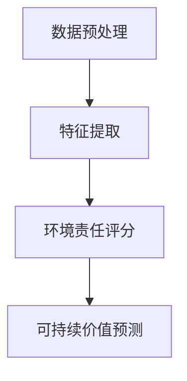
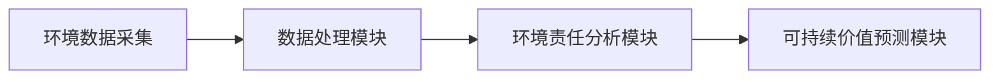

                 


# AI协作分析公司环境责任：可持续价值投资新维度

---

## 关键词：
AI协作分析、公司环境责任、可持续价值投资、环境数据、AI算法

---

## 摘要：
随着全球对可持续发展的关注日益增加，环境责任已成为企业和社会的重要议题。在这一背景下，人工智能（AI）技术的应用为公司环境责任的分析和评估提供了新的可能性。本文探讨AI协作分析如何帮助评估公司环境责任，并将其作为可持续价值投资的重要维度。通过结合环境数据和AI算法，我们可以更高效地识别和量化企业的环境影响，从而为投资决策提供更全面的支持。

---

# 第一部分: AI协作分析公司环境责任的背景与概念

## 第1章: 环境责任与可持续价值投资概述

### 1.1 环境责任的定义与重要性

#### 1.1.1 环境责任的定义
环境责任指的是企业在经营活动中对环境保护和社会可持续发展所承担的责任。它包括减少资源消耗、降低碳排放、避免环境污染等方面。

#### 1.1.2 环境责任的重要性
环境责任是企业履行社会责任的重要组成部分。随着全球气候变化和资源短缺问题的加剧，企业环境责任的履行不仅有助于减少环境影响，还能提升企业的社会形象和竞争力。

#### 1.1.3 环境责任与企业可持续发展的关系
环境责任是企业实现可持续发展的重要基础。通过履行环境责任，企业可以减少对环境的负面影响，优化资源利用，从而实现长期的可持续发展。

---

### 1.2 可持续价值投资的定义与特点

#### 1.2.1 可持续价值投资的定义
可持续价值投资是一种以环境、社会和治理（ESG）因素为核心的投资策略。它不仅关注企业的财务表现，还注重企业在环境保护、社会责任和公司治理方面的表现。

#### 1.2.2 可持续价值投资的核心特点
可持续价值投资强调长期价值的创造，关注企业在可持续发展方面的表现。与传统投资相比，它更加注重企业的社会责任和环境影响。

#### 1.2.3 可持续价值投资与传统投资的区别
传统投资主要关注企业的财务表现和市场地位，而可持续价值投资则将企业的环境责任、社会责任和治理结构作为重要评估指标。

---

### 1.3 AI在环境责任分析中的作用

#### 1.3.1 AI技术在环境数据分析中的应用
AI技术可以通过机器学习算法分析大量的环境数据，识别环境风险和机会，帮助企业更好地评估和管理环境责任。

#### 1.3.2 AI在环境责任评估中的优势
AI技术能够快速处理和分析大量环境数据，提供精准的环境影响评估结果。此外，AI还可以实时监控企业的环境表现，及时发现潜在问题。

#### 1.3.3 AI驱动的可持续价值投资新维度
通过AI技术，投资者可以更准确地评估企业的环境责任，从而在投资决策中考虑更多的环境因素，推动可持续价值投资的发展。

---

## 第2章: AI协作分析公司环境责任的核心概念

### 2.1 环境责任分析的核心要素

#### 2.1.1 环境影响评估
环境影响评估是对企业在经营活动中对环境造成的影响进行全面分析的过程。它包括能源消耗、碳排放、资源利用等方面。

#### 2.1.2 环境治理框架
环境治理框架是指企业在管理环境责任方面所采用的制度、政策和措施。它包括环境管理、政策制定和执行等方面。

#### 2.1.3 环境数据采集与处理
环境数据的采集与处理是环境责任分析的基础。通过收集和处理环境数据，可以为企业提供准确的环境影响评估结果。

---

### 2.2 AI协作分析的原理与机制

#### 2.2.1 AI协作分析的基本原理
AI协作分析通过机器学习算法对环境数据进行分析，识别环境风险和机会，帮助企业优化环境管理策略。

#### 2.2.2 AI在环境责任分析中的协作机制
AI技术可以与企业环境管理系统协作，实时监控企业的环境表现，提供个性化的环境管理建议。

#### 2.2.3 AI协作分析的数学模型
AI协作分析的数学模型包括环境影响评估模型、环境治理评分模型等。这些模型通过机器学习算法对环境数据进行分析，生成环境影响评估结果。

---

## 第3章: AI协作分析公司环境责任的算法原理

### 3.1 环境责任分析的数学模型

#### 3.1.1 环境影响评估模型
环境影响评估模型通过对企业能源消耗、碳排放等数据进行分析，评估企业在环境方面的负面影响。

#### 3.1.2 环境治理评分模型
环境治理评分模型通过对企业的环境管理政策、执行情况等进行评估，生成环境治理评分。

#### 3.1.3 可持续价值评分模型
可持续价值评分模型结合企业的环境责任、社会责任和治理结构等因素，生成可持续价值评分。

---

### 3.2 AI协作分析的算法流程

#### 3.2.1 数据预处理与特征提取
数据预处理包括数据清洗、标准化等步骤。特征提取则是从环境数据中提取关键特征，用于后续的环境影响评估。

#### 3.2.2 环境责任评分算法
环境责任评分算法通过机器学习模型对环境数据进行分析，生成环境责任评分。

#### 3.2.3 可持续价值预测算法
可持续价值预测算法通过分析企业的环境责任评分，预测企业的可持续价值。

---

### 3.3 算法实现的mermaid流程图



---

## 第4章: 系统设计与架构

### 4.1 系统功能设计

#### 4.1.1 环境数据采集模块
环境数据采集模块负责从企业环境管理系统中采集环境数据。

#### 4.1.2 数据处理模块
数据处理模块对采集到的环境数据进行清洗、标准化等处理，确保数据质量。

#### 4.1.3 环境责任分析模块
环境责任分析模块利用机器学习算法对环境数据进行分析，生成环境责任评分。

#### 4.1.4 可持续价值预测模块
可持续价值预测模块根据环境责任评分，预测企业的可持续价值。

---

### 4.2 系统架构设计



---

## 第5章: 项目实战

### 5.1 环境安装与配置

```bash
pip install numpy pandas scikit-learn
```

---

### 5.2 系统核心实现源代码

```python
import numpy as np
import pandas as pd
from sklearn.model import Model

# 数据预处理
def preprocess_data(data):
    # 数据清洗
    data = data.dropna()
    # 标准化
    data = (data - data.mean()) / data.std()
    return data

# 环境责任评分算法
def environment_score_model(data):
    model = Model()
    model.fit(data)
    return model.predict(data)

# 可持续价值预测算法
def sustainable_value_prediction(data):
    score = environment_score_model(data)
    # 预测可持续价值
    prediction = model.predict(score)
    return prediction
```

---

## 第6章: 总结与展望

### 6.1 本章小结
本文探讨了AI协作分析在公司环境责任评估中的应用，提出了基于机器学习的环境影响评估模型和可持续价值评分模型。通过AI技术，我们可以更高效地分析企业环境责任，为可持续价值投资提供支持。

### 6.2 未来展望
未来，随着AI技术的不断发展，环境责任分析将更加精准和高效。同时，AI技术还可以与其他技术相结合，进一步推动可持续价值投资的发展。

---

## 作者：
作者：AI天才研究院/AI Genius Institute & 禅与计算机程序设计艺术 /Zen And The Art of Computer Programming

---

以上是文章的完整目录大纲和内容结构，涵盖了从背景介绍到系统设计的各个方面，确保逻辑清晰、内容详实。

