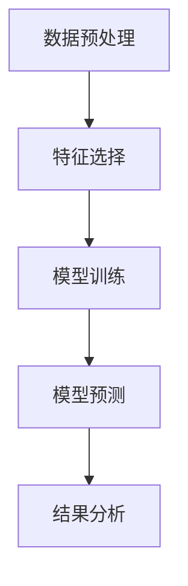
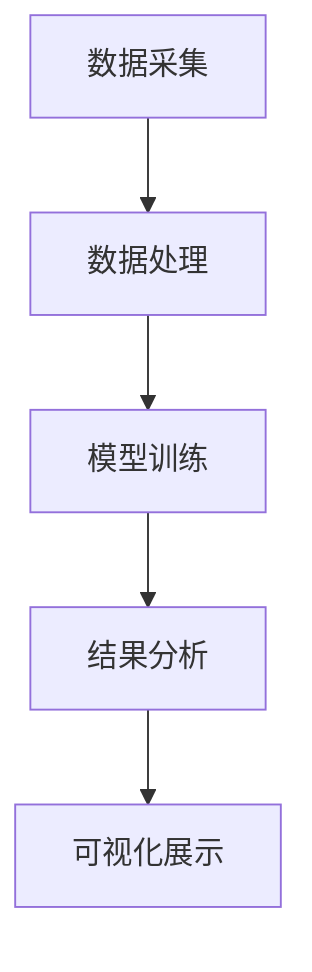
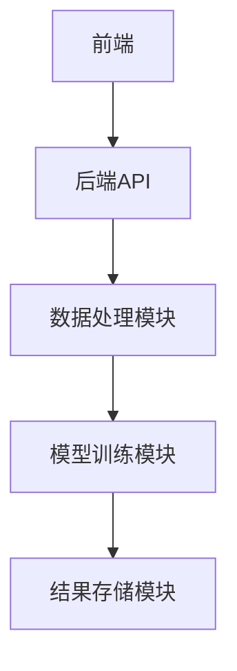
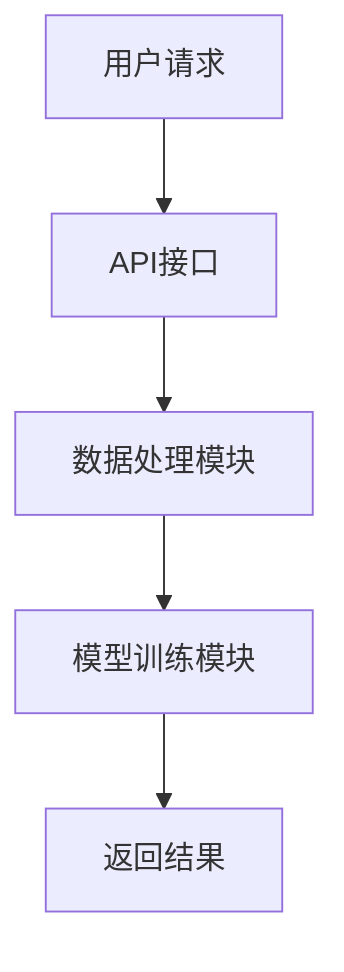

                 


# AI协作分析公司环境足迹：评估长期可持续发展能力

---

## 关键词：
- AI协作分析
- 环境足迹
- 可持续发展
- 机器学习
- 数据分析

---

## 摘要：
随着全球对可持续发展的关注日益增加，企业环境足迹的分析变得至关重要。本文通过AI协作分析的方法，详细探讨了如何利用人工智能技术评估公司的环境足迹，进而评估其长期可持续发展能力。文章从环境足迹的定义、AI在环境分析中的作用，到具体的算法原理、系统架构设计，再到项目实战案例，全面解析了AI协作分析的应用场景和实现方法。通过本文，读者将能够理解如何利用AI技术优化企业环境管理，提升企业的可持续发展能力。

---

# 第1章: 公司环境足迹的定义与重要性

## 1.1 环境足迹的定义与计算方法

### 1.1.1 环境足迹的基本概念
环境足迹（Environmental Footprint）是指企业在生产、运营和供应链中对环境造成的影响，通常包括碳排放、资源消耗、污染排放等方面。它是衡量企业对环境影响的重要指标。

### 1.1.2 环境足迹的计算公式与步骤
环境足迹的计算通常涉及以下几个步骤：
1. 数据收集：收集企业的生产、能源消耗、供应链等数据。
2. 数据预处理：对数据进行清洗、标准化和特征提取。
3. 模型选择：选择合适的模型进行环境影响评估。
4. 结果分析：根据模型输出结果，评估企业的环境足迹。

### 1.1.3 环境足迹对企业可持续发展的意义
环境足迹的分析能够帮助企业识别环境影响的关键环节，优化资源配置，减少对环境的负面影响，提升企业的社会责任形象。

## 1.2 AI在环境足迹分析中的作用

### 1.2.1 AI技术在环境数据处理中的优势
AI技术能够快速处理海量环境数据，发现数据中的潜在规律，提高分析效率。

### 1.2.2 AI在环境足迹预测与优化中的应用
通过机器学习模型，AI能够预测企业的环境足迹，并提出优化建议，帮助企业降低环境影响。

### 1.2.3 AI驱动企业可持续发展的潜力
AI技术的应用能够推动企业在生产、供应链和管理等方面实现绿色转型，助力全球可持续发展目标的实现。

## 1.3 企业环境足迹分析的必要性

### 1.3.1 全球可持续发展目标对企业的影响
全球气候变化和资源枯竭等问题对企业提出了更高的环境管理要求。

### 1.3.2 环境足迹分析对企业竞争力的作用
环境足迹分析能够提升企业的绿色竞争力，吸引环保意识强的客户和投资者。

### 1.3.3 相关法规与行业标准的推动作用
越来越多的法规和行业标准要求企业公开环境数据，环境足迹分析成为企业合规的重要手段。

---

# 第2章: AI协作分析的核心概念与技术基础

## 2.1 环境足迹分析的基本原理

### 2.1.1 环境足迹分析的流程
环境足迹分析通常包括数据收集、模型选择、结果分析等步骤。

### 2.1.2 数据收集与预处理方法
数据预处理包括数据清洗、标准化和特征提取等步骤。

### 2.1.3 环境影响评估模型
常用的环境影响评估模型包括生命周期评估（LCA）和碳足迹模型。

## 2.2 AI技术在环境分析中的应用

### 2.2.1 机器学习在环境数据预测中的应用
机器学习模型可以用于预测企业的环境足迹。

### 2.2.2 自然语言处理在环境报告中的应用
自然语言处理技术可以用于分析环境报告中的文本数据。

### 2.2.3 图神经网络在环境关系分析中的应用
图神经网络可以用于分析企业供应链中的环境关系。

## 2.3 环境足迹分析与AI协作的结合

### 2.3.1 AI协作分析的基本框架
AI协作分析框架包括数据采集、模型训练、结果分析等环节。

### 2.3.2 AI协作分析的核心技术
核心技术包括机器学习、自然语言处理和图神经网络等。

### 2.3.3 AI协作分析的优势与挑战
优势在于高效性和准确性，挑战在于数据隐私和模型解释性。

---

# 第3章: AI协作分析的算法原理

## 3.1 环境足迹分析的机器学习模型

### 3.1.1 机器学习模型的选择
常用的模型包括线性回归、随机森林和神经网络等。

### 3.1.2 模型训练过程
模型训练包括数据预处理、特征选择、模型训练和调参优化。

### 3.1.3 模型评估与优化
通过交叉验证和网格搜索等方法优化模型性能。

## 3.2 AI协作分析的数学模型

### 3.2.1 环境足迹预测的数学公式
环境足迹预测公式：$$ \text{预测值} = \beta_0 + \beta_1 \times \text{特征1} + \beta_2 \times \text{特征2} + \dots + \beta_n \times \text{特征n} $$

### 3.2.2 损失函数与优化器
常用的损失函数包括均方误差（MSE）和交叉熵损失。优化器包括随机梯度下降（SGD）和Adam。

## 3.3 算法实现与代码示例

### 3.3.1 Python代码实现
```python
import numpy as np
from sklearn.linear_model import LinearRegression
from sklearn.metrics import mean_squared_error

# 数据预处理
X = np.array([[1, 2], [3, 4], [5, 6]])
y = np.array([7, 8, 9])

# 模型训练
model = LinearRegression()
model.fit(X, y)

# 模型预测
y_pred = model.predict(X)
print(y_pred)

# 模型评估
print(mean_squared_error(y, y_pred))
```

### 3.3.2 算法流程图


---

# 第4章: 系统分析与架构设计

## 4.1 系统功能设计

### 4.1.1 功能模块划分
系统包括数据采集、数据处理、模型训练、结果分析和可视化等模块。

### 4.1.2 功能流程图


## 4.2 系统架构设计

### 4.2.1 系统架构图


## 4.3 系统接口设计

### 4.3.1 API接口定义
API接口包括数据接口、模型接口和结果接口。

### 4.3.2 接口交互流程图


---

# 第5章: 项目实战

## 5.1 环境数据采集与预处理

### 5.1.1 数据采集
通过企业提供的生产数据、能源消耗数据和供应链数据。

### 5.1.2 数据预处理
对数据进行清洗、标准化和特征提取。

## 5.2 模型训练与优化

### 5.2.1 模型训练
使用机器学习模型进行环境足迹预测。

### 5.2.2 模型优化
通过交叉验证和网格搜索优化模型性能。

## 5.3 实际案例分析

### 5.3.1 案例背景
某制造企业希望优化其碳排放。

### 5.3.2 数据分析
通过模型分析发现能源消耗是主要的碳排放来源。

### 5.3.3 优化建议
建议优化能源消耗，采用可再生能源。

## 5.4 代码实现与结果解读

### 5.4.1 代码实现
```python
import pandas as pd
from sklearn.ensemble import RandomForestRegressor
from sklearn.metrics import r2_score

# 数据加载
data = pd.read_csv('environment_data.csv')

# 特征选择
features = ['energy_usage', 'resource_consumption']
target = 'carbon_emission'

# 模型训练
model = RandomForestRegressor()
model.fit(data[features], data[target])

# 模型预测
y_pred = model.predict(data[features])
print(r2_score(data[target], y_pred))
```

### 5.4.2 结果解读
模型预测准确率较高，说明优化建议有效。

---

# 第6章: 总结与展望

## 6.1 研究总结

### 6.1.1 AI协作分析的核心价值
AI技术能够高效、准确地分析环境足迹，帮助企业优化环境管理。

### 6.1.2 本文的主要贡献
本文提出了AI协作分析的方法，并通过实际案例验证了其有效性。

## 6.2 未来展望

### 6.2.1 技术发展
未来，AI技术将更加智能化，环境足迹分析将更加精准。

### 6.2.2 应用拓展
AI协作分析将扩展到更多领域，如绿色供应链管理。

## 6.3 最佳实践 Tips

### 6.3.1 数据隐私保护
企业在分析环境足迹时需要注意数据隐私问题。

### 6.3.2 模型可解释性
模型的可解释性是企业决策的重要因素。

### 6.3.3 持续优化
企业需要持续优化环境管理，适应可持续发展的要求。

---

# 结语

通过本文的详细分析，读者可以了解到如何利用AI协作分析技术评估企业的环境足迹，优化环境管理，提升企业的可持续发展能力。未来，随着技术的不断发展，AI在环境足迹分析中的应用将更加广泛和深入。

---

# 作者

作者：AI天才研究院/AI Genius Institute & 禅与计算机程序设计艺术 /Zen And The Art of Computer Programming

