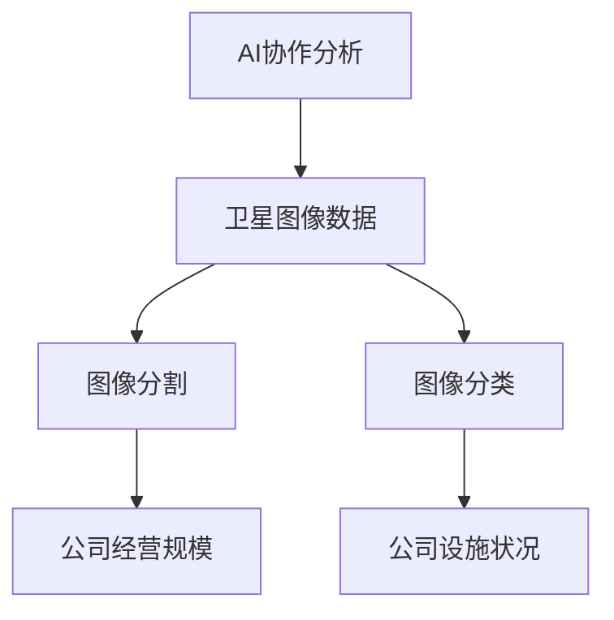
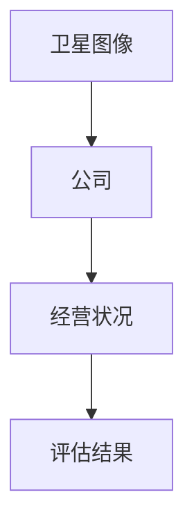
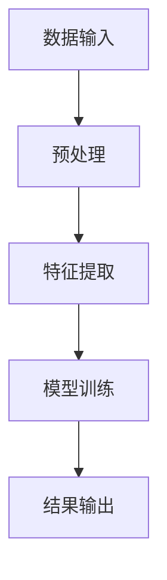
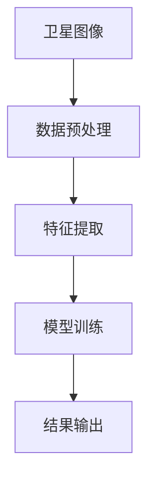
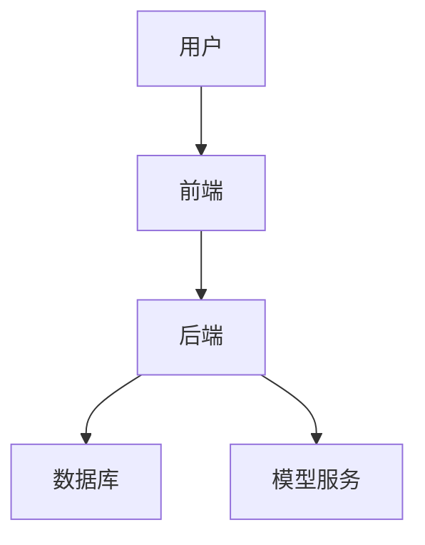
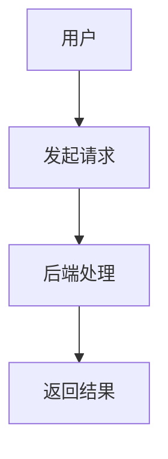

                 


# AI协作分析卫星图像数据：评估公司实际经营状况

> 关键词：AI协作、卫星图像数据、公司经营状况、图像分割、深度学习、图像识别

> 摘要：本文将详细探讨如何利用AI协作分析卫星图像数据来评估公司实际经营状况。通过结合卫星图像分析与人工智能技术，我们可以从卫星图像中提取关键信息，进而评估公司的经营状况。文章将从背景介绍、核心概念、算法原理、系统架构设计、项目实战等多个方面展开，提供全面的技术解析。

---

# 第1章 背景介绍

## 1.1 问题背景

### 1.1.1 卫星图像数据的现状与挑战
卫星图像数据作为一种重要的遥感数据源，广泛应用于地理信息系统、环境监测、城市规划等领域。然而，卫星图像数据量大、分辨率高，且包含丰富的空间和地物信息，如何高效地从这些数据中提取有用的信息是一个巨大的挑战。

### 1.1.2 公司经营状况评估的传统方法
传统的公司经营状况评估主要依赖于财务报表、市场调研和实地考察等方法。然而，这些方法存在数据获取成本高、实时性差、覆盖面有限等局限性。特别是在偏远地区或不便实地考察的情况下，传统的评估方法显得力不从心。

### 1.1.3 AI协作分析的必要性
AI技术的发展为卫星图像数据的分析提供了新的可能性。通过AI协作分析，可以自动从卫星图像中提取关键信息，如公司的经营规模、设施状况等，从而为公司经营状况评估提供更全面、更实时的数据支持。

---

## 1.2 问题描述

### 1.2.1 卫星图像数据的特点
卫星图像数据具有以下特点：
- 数据量大：卫星图像通常覆盖大面积区域，数据量巨大。
- 分辨率高：现代卫星图像的分辨率可以达到亚米级，细节丰富。
- 多光谱特性：卫星图像通常包含多光谱信息，能够提供更多的地物特征。

### 1.2.2 公司经营状况评估的关键指标
公司经营状况评估的关键指标包括：
- 经营规模：公司占地面积、建筑数量等。
- 设施状况：公司设施的完好程度、设备更新情况等。
- 人员配置：公司员工数量、办公区域使用情况等。

### 1.2.3 AI协作分析的目标与范围
AI协作分析的目标是从卫星图像中提取与公司经营状况相关的特征信息，如建筑轮廓、土地使用情况等，并结合其他数据源（如公司财报）进行综合评估。分析范围包括图像数据的采集、预处理、特征提取、模型训练和结果输出。

---

## 1.3 问题解决

### 1.3.1 AI技术在卫星图像分析中的应用
AI技术在卫星图像分析中的应用主要体现在以下几个方面：
- 图像分割：将卫星图像分割成不同的区域，识别出公司建筑、道路、绿地等。
- 图像分类：对分割后的区域进行分类，确定其用途（如工业区、办公区等）。
- 目标检测：检测图像中的特定目标，如公司标志、设备等。

### 1.3.2 协作分析的实现方式
协作分析可以通过以下方式实现：
- 多模态数据融合：将卫星图像与公司财报、市场数据等多模态数据进行融合，提高分析的准确性。
- 跨团队协作：结合GIS、AI、数据分析等多领域的知识，共同完成分析任务。

### 1.3.3 公司经营状况评估的多维度分析
公司经营状况评估需要从多个维度进行分析，包括：
- 经营规模：公司占地面积、建筑数量等。
- 经营效率：公司设施的使用效率、设备更新情况等。
- 经营风险：公司周边环境、市场变化对公司的影响等。

---

## 1.4 边界与外延

### 1.4.1 数据范围的界定
数据范围的界定包括：
- 数据类型：仅限于卫星图像数据，不包括其他类型的数据（如公司财报）。
- 数据时间：仅限于某个特定时间段的卫星图像，不包括历史数据。

### 1.4.2 业务范围的限制
业务范围的限制包括：
- 仅限于公司经营状况的评估，不包括其他业务（如环境监测）。
- 仅限于公司经营规模和设施状况的评估，不包括公司内部管理、财务状况等。

### 1.4.3 技术实现的边界
技术实现的边界包括：
- 仅限于基于深度学习的图像分析技术，不包括其他AI技术（如NLP）。
- 仅限于图像分割和分类任务，不包括目标检测等其他任务。

---

## 1.5 概念结构与核心要素组成

### 1.5.1 核心概念的层次结构
核心概念的层次结构如下：
- 顶层概念：AI协作分析
  - 中层概念：卫星图像数据、公司经营状况评估
    - 底层概念：图像分割、图像分类、数据预处理

### 1.5.2 核心要素的相互关系
核心要素的相互关系如下：
- 数据预处理是图像分割和分类的基础。
- 图像分割和分类是公司经营状况评估的重要组成部分。
- 公司经营状况评估是AI协作分析的最终目标。

### 1.5.3 概念模型的可视化


---

# 第2章 核心概念与联系

## 2.1 核心概念原理

### 2.1.1 AI协作的基本原理
AI协作的基本原理包括：
- 数据共享：各团队共享卫星图像数据。
- 联合分析：各团队基于共享数据进行分析，并分享分析结果。
- 结果整合：将各团队的分析结果整合，得出最终的公司经营状况评估。

### 2.1.2 卫星图像数据的处理流程
卫星图像数据的处理流程包括：
1. 数据预处理：包括图像增强、去噪、归一化等。
2. 数据标注：对图像中的关键区域进行标注。
3. 数据分割：将图像分割成不同的区域。
4. 数据分类：对分割后的区域进行分类。

### 2.1.3 公司经营状况评估的数学模型
公司经营状况评估的数学模型如下：
$$
\text{经营状况} = f(\text{经营规模}, \text{设施状况}, \text{人员配置})
$$
其中，$f$ 是一个综合评估函数，可以根据具体需求进行定制。

---

## 2.2 概念属性特征对比

### 2.2.1 数据类型对比
| 数据类型 | 描述 |
|----------|------|
| 卫星图像数据 | 多光谱、高分辨率、大容量 |
| 公司经营规模数据 | 数量化、结构化、实时性差 |

---

## 2.3 ER实体关系图



---

## 2.4 算法流程图



---

# 第3章 算法原理讲解

## 3.1 数据预处理

### 3.1.1 卫星图像的增强处理
卫星图像的增强处理包括：
- 对比度增强：通过调整图像的对比度，使图像更清晰。
- 颜色平衡：调整图像的颜色分布，使图像更接近人眼观察效果。

### 3.1.2 数据标注与分割
数据标注与分割是卫星图像分析的关键步骤，通常使用深度学习框架（如TensorFlow、PyTorch）进行图像分割。

### 3.1.3 数据归一化处理
数据归一化处理是将图像数据标准化，使其具有相同的尺度，通常使用以下公式：
$$
x_{\text{norm}} = \frac{x - \mu}{\sigma}
$$
其中，$\mu$ 是均值，$\sigma$ 是标准差。

---

## 3.2 模型训练

### 3.2.1 深度学习模型的选择
深度学习模型的选择包括：
- U-Net：常用于图像分割任务。
- Mask R-CNN：适用于目标检测和图像分割任务。

### 3.2.2 神经网络结构设计
神经网络结构设计包括：
- 编码器：提取图像的特征。
- 解码器：将特征恢复为原始图像的像素。

### 3.2.3 损失函数与优化器
常用的损失函数包括：
- 交叉熵损失：常用于分类任务。
- 边界损失：常用于图像分割任务。

---

## 3.3 结果输出

### 3.3.1 输出格式
结果输出通常以JSON格式存储，包含以下内容：
- 分割结果：每个像素的类别标签。
- 分类结果：图像的整体分类结果。

### 3.3.2 可视化展示
可视化展示是将分割结果 overlays 在原始图像上，以便更好地理解模型的输出。

---

# 第4章 系统分析与架构设计

## 4.1 问题场景介绍
问题场景介绍包括：
- 数据源：卫星图像数据。
- 业务目标：评估公司经营状况。

---

## 4.2 系统功能设计

### 4.2.1 领域模型


### 4.2.2 系统架构设计


### 4.2.3 系统接口设计
系统接口设计包括：
- 数据接口：提供卫星图像数据的接口。
- 模型接口：提供模型训练和预测的接口。

### 4.2.4 系统交互


---

## 4.3 项目实战

### 4.3.1 环境安装
环境安装包括：
- 安装Python和相关库（如TensorFlow、OpenCV）。
- 安装卫星图像数据处理工具（如GDAL）。

### 4.3.2 核心代码实现

```python
import tensorflow as tf
import cv2

# 数据预处理
def preprocess_image(image):
    image = cv2.resize(image, (256, 256))
    image = image / 255.0
    return image

# 模型训练
model = tf.keras.Sequential([
    tf.keras.layers.Conv2D(64, (3, 3), activation='relu'),
    tf.keras.layers.MaxPooling2D((2, 2)),
    tf.keras.layers.Conv2D(128, (3, 3), activation='relu'),
    tf.keras.layers.MaxPooling2D((2, 2)),
    tf.keras.layers.Flatten(),
    tf.keras.layers.Dense(256, activation='relu'),
    tf.keras.layers.Dense(10, activation='softmax')
])

model.compile(optimizer='adam', loss='sparse_categorical_crossentropy', metrics=['accuracy'])
model.fit(X_train, y_train, epochs=10, batch_size=32)
```

### 4.3.3 案例分析
案例分析包括：
- 数据来源：某公司卫星图像数据。
- 数据处理：对图像进行分割和分类。
- 结果分析：根据模型输出的结果，评估公司的经营状况。

---

## 4.4 最佳实践

### 4.4.1 小结
通过AI协作分析卫星图像数据，我们可以更高效、更准确地评估公司的经营状况。

### 4.4.2 注意事项
- 数据质量：确保卫星图像数据的清晰度和准确性。
- 模型选择：根据具体任务选择合适的深度学习模型。

### 4.4.3 拓展阅读
- 推荐阅读《深度学习实战》、《卫星图像分析技术》等书籍。

---

# 作者

作者：AI天才研究院/AI Genius Institute & 禅与计算机程序设计艺术 /Zen And The Art of Computer Programming

