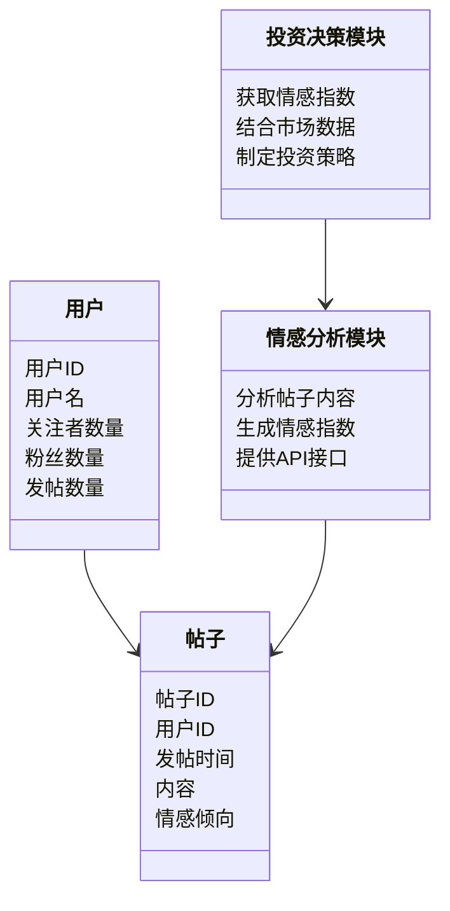
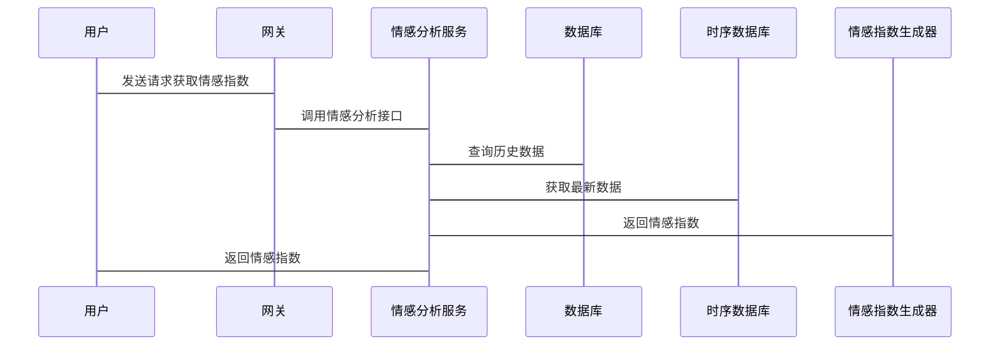

                 


# AI协作分析社交媒体情绪：增强价值投资的时机选择

---

## 关键词：
- AI协作、社交媒体情绪、价值投资、时机选择、情绪分析、深度学习、投资决策

---

## 摘要：
本文深入探讨了如何利用人工智能技术协作分析社交媒体情绪，以增强价值投资的时机选择。通过分析社交媒体上的文本数据，提取投资者情绪，结合市场趋势，构建基于AI的情绪驱动投资策略，帮助投资者捕捉市场情绪波动，优化投资决策。

---

# 第一部分: 背景介绍与核心概念

## 第1章: 背景与核心概念

### 1.1 社会情绪与价值投资概述

#### 1.1.1 什么是社会情绪分析
- 定义：社会情绪分析是通过自然语言处理技术，从社交媒体文本中提取用户情感、态度和情绪的过程。
- 重要性：帮助投资者理解市场参与者的集体情绪，捕捉市场波动。

#### 1.1.2 价值投资的核心概念
- 价值投资：基于对公司内在价值的分析，寻找被市场低估的投资标的。
- 情绪与价值投资的关系：市场情绪波动会影响资产价格，情绪分析可以帮助投资者识别市场恐慌或乐观情绪，从而优化投资决策。

#### 1.1.3 社会情绪分析在投资中的应用
- 情绪指标构建：基于社交媒体数据，构建情绪指数，用于预测市场走势。
- 投资策略优化：结合情绪分析结果，制定动态投资策略。

---

## 第2章: AI协作分析社交媒体情绪的背景与问题描述

### 2.1 社交媒体数据的特点与挑战

#### 2.1.1 数据多样性
- 社交媒体数据来源广泛，包括文本、图片、视频等多种形式。
- 数据量大，实时性强，需要高效的处理能力。

#### 2.1.2 数据噪声与干扰
- 用户情绪复杂，数据中存在大量噪声和干扰信息。
- 如何处理非结构化数据是关键挑战。

#### 2.1.3 数据的实时性
- 市场情绪变化迅速，需要实时监测和分析。

### 2.2 社会情绪分析的难点与解决方案

#### 2.2.1 情绪分类的复杂性
- 情感具有主观性和多样性，分类任务具有挑战性。
- 需要结合上下文和语境进行分析。

#### 2.2.2 AI在情绪分析中的作用
- 自然语言处理技术的进步，如BERT、GPT等模型，为情绪分析提供了强大的工具。
- 结合深度学习和传统机器学习方法，提升分析精度。

#### 2.2.3 解决方案的框架
- 数据预处理：清洗、分词、特征提取。
- 模型训练：基于深度学习的情绪分类模型。
- 应用场景：构建情绪指数，制定投资策略。

### 2.3 问题边界与外延

#### 2.3.1 问题的边界
- 专注于社交媒体情绪分析，不涉及其他数据源。
- 着重于情绪分类和预测，不涉及具体的投资策略执行。

#### 2.3.2 相关概念的对比
- 情感分析与情绪分析的区别。
- 市场情绪与投资者情绪的关联。

#### 2.3.3 核心要素与组成
- 数据来源：社交媒体文本。
- 分析方法：自然语言处理、深度学习。
- 应用目标：优化投资决策。

---

# 第二部分: 核心概念与原理

## 第3章: 社会情绪分析的核心原理

### 3.1 情感分类与分析

#### 3.1.1 情感分类的定义
- 基于文本内容，判断作者的情感倾向（如正面、负面、中性）。

#### 3.1.2 基于文本的情感分类方法
- 传统方法：基于词袋模型和词嵌入（如TF-IDF、Word2Vec）。
- 深度学习方法：LSTM、Transformer等模型。

#### 3.1.3 基于深度学习的情感分类模型
- BERT模型在情感分类中的应用。
- 模型的优势：捕捉上下文信息，处理长文本。

### 3.2 社交媒体数据的特征提取

#### 3.2.1 文本特征提取方法
- 词袋模型：提取关键词及其权重。
- 词嵌入：将词语转化为向量表示（如Word2Vec、GloVe）。

#### 3.2.2 基于词嵌入的特征提取
- 使用预训练的词向量（如Glove、FastText）。
- 模型训练中的特征提取步骤。

#### 3.2.3 图结构特征提取
- 基于社交网络的结构特征（如用户影响力、信息传播路径）。

### 3.3 情绪传播与扩散机制

#### 3.3.1 情绪传播的基本模型
- 情绪传播的网络模型：如阈值模型、影响扩散模型。
- 情绪在网络中的传播规律。

#### 3.3.2 社交网络中的情绪扩散
- 网络结构对情绪扩散的影响。
- 关键节点识别：识别情绪传播的关键用户。

#### 3.3.3 情绪传播的动态特征
- 情绪传播的时间序列特征。
- 情绪强度的动态变化。

---

## 第4章: 价值投资中的社会情绪分析

### 4.1 投资决策中的情绪因素

#### 4.1.1 情绪对市场的影响
- 情绪如何影响资产价格。
- 市场情绪周期性：从乐观到恐慌的转变。

#### 4.1.2 投资者情绪的周期性
- 情绪周期与市场周期的关系。
- 情绪指标与市场拐点的关联。

#### 4.1.3 情绪与市场波动的关系
- 情绪波动如何预测市场波动。
- 基于情绪的市场风险预警。

### 4.2 基于社会情绪的价值投资策略

#### 4.2.1 情绪指标的构建
- 综合情绪指数：基于社交媒体情绪数据构建情绪指标。
- 情绪指数的标准化与动态调整。

#### 4.2.2 情绪指标与投资决策
- 利用情绪指标筛选投资标的。
- 情绪指标与基本面分析的结合。

#### 4.2.3 基于情绪的交易策略
- 基于情绪指标的买卖信号生成。
- 动态调整投资组合的策略。

---

# 第三部分: 算法原理与数学模型

## 第5章: 情感分类算法原理

### 5.1 基于机器学习的情感分类

#### 5.1.1 传统机器学习方法
- 朴素贝叶斯分类器：基于概率的分类方法。
- 支持向量机（SVM）：基于特征空间的分类。

#### 5.1.2 基于特征的分类模型
- 词袋模型与TF-IDF特征。
- 基于词嵌入的特征提取。

#### 5.1.3 模型评估与优化
- 准确率、召回率、F1值的计算。
- 调参与模型优化。

### 5.2 基于深度学习的情感分类

#### 5.2.1 循环神经网络（RNN）
- RNN的结构与工作原理。
- 在情感分类中的应用。

#### 5.2.2 变体自注意力网络（Transformer）
- Transformer模型的结构。
- 在情感分类中的优势。

#### 5.2.3 模型训练与调优
- 模型训练的步骤。
- 参数调整与优化技巧。

### 5.3 情感分类的数学模型

#### 5.3.1 朴素贝叶斯分类器
- 概率公式：$$P(y|x) = P(x|y)P(y)$$

#### 5.3.2 支持向量机（SVM）
- 最大间隔目标函数：$$\frac{1}{2}||w||^2 + C\sum_{i=1}^n \xi_i$$

#### 5.3.3 深度学习模型的损失函数
- 交叉熵损失函数：$$-\sum_{i=1}^n y_i \log(p_i) + (1-y_i)\log(1-p_i)$$

---

## 第6章: 基于时间序列的社会情绪分析

### 6.1 时间序列分析的基本原理

#### 6.1.1 时间序列的特征
- 趋势、周期性、随机性。
- 如何提取这些特征用于情绪分析。

#### 6.1.2 时间序列的分解方法
- 加性模型（Additive Model）：$$T_t + S_t + R_t + E_t$$
- 乘法模型（Multiplicative Model）：$$T_t \times S_t \times R_t \times E_t$$

#### 6.1.3 时间序列预测模型
- ARIMA模型：自回归积分移动平均模型。
- LSTM网络：长短期记忆网络在时间序列中的应用。

### 6.2 基于LSTM的情绪预测模型

#### 6.2.1 LSTM网络的结构
- 输入门、遗忘门、输出门。
- LSTM单元的更新公式。

#### 6.2.2 LSTM在时间序列预测中的应用
- LSTM网络的训练与预测步骤。
- 模型的优势：捕捉长期依赖关系。

---

# 第四部分: 系统分析与架构设计

## 第7章: 系统功能设计

### 7.1 领域模型（ER类图）



### 7.2 系统架构设计


### 7.3 系统接口设计

- API接口：RESTful API设计，提供情感指数查询、情绪分类等服务。
- 数据接口：与社交媒体平台的数据接口对接，获取实时数据。

### 7.4 系统交互设计



---

## 第8章: 项目实战

### 8.1 环境安装与配置

#### 8.1.1 安装Python环境
- 安装Python 3.8+。
- 安装必要的库：numpy、pandas、tensorflow、transformers、requests。

#### 8.1.2 安装与配置社交媒体API
- 使用Twitter API、微博API等。
- 获取API密钥，配置开发环境。

### 8.2 系统核心实现源代码

#### 8.2.1 数据收集模块
```python
import requests
from transformers import pipeline

# 数据收集模块
def collect_data(api_key, api_secret):
    # 使用API获取社交媒体数据
    pass

# 数据预处理模块
def preprocess_data(data):
    # 分词、清洗数据
    pass

# 情感分析模块
sentiment_analyzer = pipeline("sentiment-analysis")
```

#### 8.2.2 情感分析模块
```python
def analyze_sentiment(text):
    result = sentiment_analyzer(text)
    return result['label']

# 示例
text = "This stock is a great buy!"
print(analyze_sentiment(text))
```

#### 8.2.3 情感指数生成模块
```python
def generate_sentiment_index(posts):
    positive_count = sum(1 for post in posts if analyze_sentiment(post['content']) == 'POSITIVE')
    negative_count = len(posts) - positive_count
    return (positive_count - negative_count) / len(posts)
```

### 8.3 实际案例分析

#### 8.3.1 数据来源
- 使用Twitter API获取某股票的社交媒体数据。
- 数据时间范围：最近一个月。

#### 8.3.2 数据处理与分析
- 清洗数据，提取文本内容。
- 使用BERT模型进行情感分类。

#### 8.3.3 投资策略制定
- 根据情感指数调整投资组合。
- 结合基本面分析，制定买卖策略。

---

## 第五部分: 最佳实践与总结

## 第9章: 最佳实践与小结

### 9.1 最佳实践
- 数据质量：确保数据的完整性和准确性。
- 模型优化：持续优化情感分类模型，提升准确率。
- 实时性：保持系统的实时性，及时捕捉情绪变化。

### 9.2 注意事项
- 数据隐私：遵守社交媒体平台的数据使用政策。
- 情绪分析的局限性：情绪分析结果仅供参考，需结合其他因素进行决策。

### 9.3 拓展阅读
- 《算法交易：资金管理的艺术》
- 《自然语言处理实战：基于Python的深度学习方法》

---

## 作者：AI天才研究院 & 禅与计算机程序设计艺术

---

**注**：由于篇幅限制，以上目录大纲仅为部分内容示例。完整的文章将涵盖每一部分的详细展开，包括公式推导、代码实现、案例分析等。

