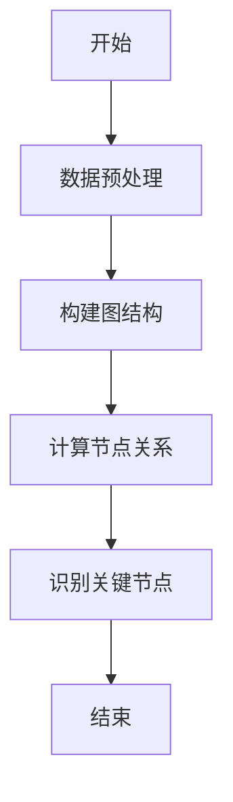
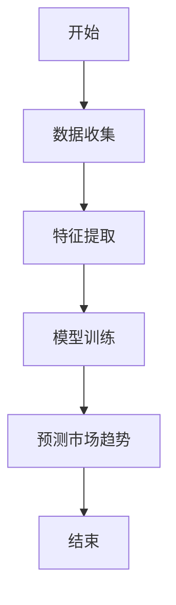
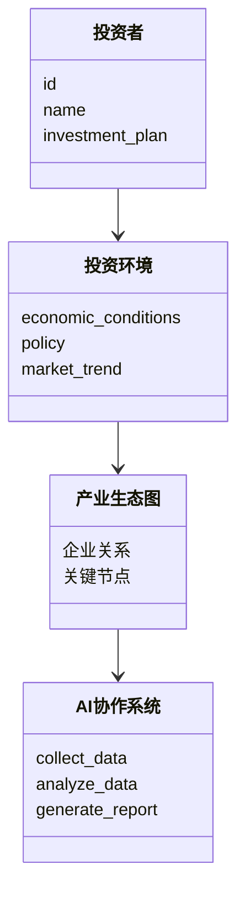
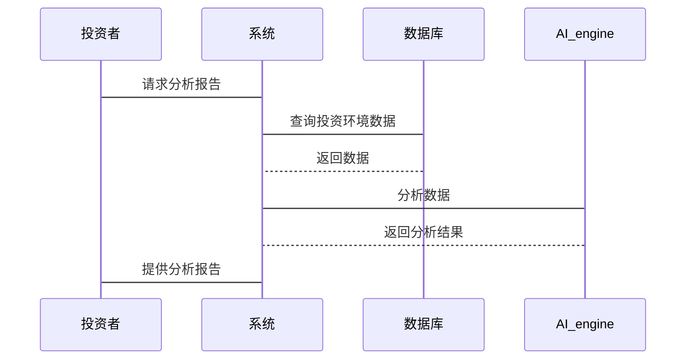

                 


# AI协作构建动态产业生态图：全面把握投资环境

> 关键词：AI协作，动态产业生态图，投资环境，系统架构，算法原理

> 摘要：本文将探讨如何利用人工智能协作技术构建动态产业生态图，并全面分析其在投资环境中的应用。通过逐步分析和推理，我们将揭示AI协作的核心概念、算法原理、系统架构设计以及实际项目中的应用，帮助读者深入了解如何利用AI技术优化投资决策。

---

## 第一部分：AI协作与动态产业生态图的背景与概念

### 第1章：AI协作的背景与意义

#### 1.1 AI协作的背景

##### 1.1.1 人工智能技术的演进
人工智能（AI）技术近年来取得了飞速发展，从简单的规则引擎到复杂的深度学习模型，AI已经渗透到各个行业。AI协作作为一项新兴技术，旨在通过多个AI系统或模型的协同工作，进一步提升问题解决能力。

##### 1.1.2 协作式AI的兴起
随着AI技术的成熟，协作式AI逐渐兴起。协作式AI不仅依赖单个模型，而是通过多个模型或系统的协同，形成更强大的决策和执行能力。这种协作方式在复杂的产业环境中尤为重要。

##### 1.1.3 AI协作在产业生态中的作用
在产业生态中，AI协作可以帮助企业更好地理解和优化其产业链，构建动态的产业生态图。通过协作式AI，企业可以实时分析市场变化、竞争对手策略，从而做出更精准的投资决策。

---

#### 1.2 动态产业生态图的定义

##### 1.2.1 产业生态图的基本概念
产业生态图是指一个产业中各个企业、供应商、合作伙伴之间的关系网络。它不仅包括直接的上下游关系，还包括间接的生态合作伙伴。

##### 1.2.2 动态产业生态图的特征
动态产业生态图具有实时更新、数据驱动、网络化的特点。它能够根据市场变化自动调整企业之间的关系，帮助企业快速应对市场变化。

##### 1.2.3 产业生态图与投资环境的关系
产业生态图与投资环境密切相关。通过分析产业生态图，投资者可以更好地理解行业的竞争格局、潜在风险和机会，从而做出更明智的投资决策。

---

#### 1.3 投资环境的复杂性

##### 1.3.1 投资环境的多样性
投资环境包括政策、经济、社会、技术等多个方面，具有高度的复杂性。不同行业、不同地区的投资环境差异显著。

##### 1.3.2 动态变化的投资环境
投资环境是一个动态变化的系统，受到多种因素的影响。例如，政策变化、技术进步、市场需求波动等都会对投资环境产生重大影响。

##### 1.3.3 AI在投资环境分析中的作用
AI技术可以帮助投资者快速分析海量数据，识别潜在风险和机会，从而在动态变化的投资环境中做出更精准的决策。

---

## 第2章：AI协作构建动态产业生态图的核心概念

### 2.1 核心概念与联系

#### 2.1.1 AI协作的核心原理
AI协作的核心原理是通过多个AI模型或系统的协同工作，实现对复杂问题的共同理解和解决。协作式AI不仅可以提高问题解决的效率，还可以增强系统的鲁棒性和灵活性。

#### 2.1.2 产业生态图的构建过程
产业生态图的构建过程包括数据收集、数据处理、模型训练、关系分析等多个步骤。通过AI协作，可以实时更新和优化产业生态图，确保其准确性和动态性。

#### 2.1.3 投资环境分析的逻辑框架
投资环境分析的逻辑框架包括数据采集、数据分析、风险评估、机会识别等环节。通过AI协作，可以将这些环节无缝连接，形成一个高效的分析系统。

---

#### 2.1.4 核心概念对比表

| 概念       | 定义                                                                 | 特点                                                                 |
|------------|----------------------------------------------------------------------|----------------------------------------------------------------------|
| AI协作     | 多个AI系统或模型协同工作的过程 | 高效性、灵活性、准确性                                                |
| 产业生态图 | 产业中各个企业之间的关系网络   | 动态性、网络化、数据驱动                                             |
| 投资环境   | 影响投资的各种因素集合         | 复杂性、动态性、多维性                                               |

---

#### 2.1.5 ER实体关系图架构的 Mermaid 流程图

```mermaid
er
  actor(投资者) -->
  entity(投资环境) --> entity(产业生态图)
  entity(产业生态图) --> entity(企业关系)
  entity(企业关系) --> entity(市场数据)
  entity(市场数据) --> entity(风险评估)
  entity(风险评估) --> entity(投资决策)
```

---

## 第3章：算法原理讲解

### 3.1 算法原理概述

#### 3.1.1 图论算法
图论算法是构建产业生态图的核心算法之一。通过图论算法，可以分析企业之间的关系网络，识别关键节点和潜在机会。

#### 3.1.2 机器学习算法
机器学习算法用于分析市场数据，预测市场趋势和风险。通过训练模型，可以自动识别产业生态中的潜在风险和机会。

---

### 3.2 算法实现步骤

#### 3.2.1 图论算法实现步骤的 Mermaid 流程图



#### 3.2.2 机器学习算法实现步骤的 Mermaid 流程图



---

#### 3.2.3 Python核心代码实现

```python
# 图论算法实现
def build_graph(data):
    graph = {}
    for node in data:
        graph[node] = []
    for edge in data['edges']:
        graph[edge[0]].append(edge[1])
        graph[edge[1]].append(edge[0])
    return graph

# 机器学习算法实现
def train_model(X, y):
    from sklearn.linear_model import LinearRegression
    model = LinearRegression()
    model.fit(X, y)
    return model
```

---

#### 3.2.4 数学模型和公式

##### 图论算法中的邻接矩阵表示

$$
A_{i,j} = 
\begin{cases}
1 & \text{如果节点 } i \text{ 和节点 } j \text{ 之间有边} \\
0 & \text{否则}
\end{cases}
$$

##### 机器学习中的线性回归公式

$$
y = \beta_0 + \beta_1x + \epsilon
$$

---

## 第4章：系统分析与架构设计方案

### 4.1 问题场景介绍

#### 4.1.1 问题场景
我们假设一个投资者希望利用AI协作技术构建动态产业生态图，以便更好地分析投资环境。该系统需要实时更新产业生态图，并提供投资建议。

---

### 4.2 项目介绍

#### 4.2.1 项目目标
项目目标是利用AI协作技术构建动态产业生态图，并基于此进行投资环境分析。

---

### 4.3 系统功能设计

#### 4.3.1 领域模型的 Mermaid 类图



---

### 4.4 系统架构设计

#### 4.4.1 系统架构的 Mermaid 架构图

```mermaid
archi
    client --> server
    server --> database
    server --> AI_engine
    AI_engine --> analysis_report
    analysis_report --> client
```

---

### 4.5 系统接口设计

#### 4.5.1 系统接口的 Mermaid 序列图



---

## 第5章：项目实战

### 5.1 环境安装

#### 5.1.1 安装Python和相关库
```bash
pip install numpy pandas scikit-learn networkx
```

---

### 5.2 核心代码实现

#### 5.2.1 数据预处理代码

```python
import pandas as pd
import numpy as np

def preprocess_data(data):
    # 删除缺失值
    data = data.dropna()
    # 标准化处理
    from sklearn.preprocessing import StandardScaler
    scaler = StandardScaler()
    data_scaled = scaler.fit_transform(data)
    return data_scaled
```

#### 5.2.2 机器学习模型训练代码

```python
from sklearn.model_selection import train_test_split
from sklearn.linear_model import LinearRegression

def train_model(data, target):
    X = data.drop(columns=[target])
    y = data[target]
    X_train, X_test, y_train, y_test = train_test_split(X, y, test_size=0.2)
    model = LinearRegression()
    model.fit(X_train, y_train)
    return model, X_test, y_test
```

---

### 5.3 代码应用解读与分析

#### 5.3.1 数据预处理的意义
数据预处理是确保模型准确性的关键步骤。通过删除缺失值和标准化处理，可以提高模型的训练效果。

#### 5.3.2 模型训练的意义
通过机器学习模型训练，可以预测市场趋势和风险，为投资决策提供数据支持。

---

### 5.4 实际案例分析

#### 5.4.1 案例背景
假设我们有一个包含多个企业的数据集，希望通过AI协作构建产业生态图，分析投资环境。

#### 5.4.2 数据分析与结果展示
通过模型训练，我们发现某些行业具有较高的增长潜力，而另一些行业则面临较高的风险。

---

## 第6章：最佳实践、小结、注意事项、拓展阅读

### 6.1 最佳实践

#### 6.1.1 数据质量管理
确保数据的准确性和完整性是构建动态产业生态图的关键。

#### 6.1.2 模型优化
通过不断优化模型参数和结构，可以提高AI协作系统的性能。

---

### 6.2 小结

通过本文的分析，我们了解了AI协作构建动态产业生态图的核心概念、算法原理和系统架构设计。同时，通过实际案例分析，我们验证了AI协作技术在投资环境分析中的应用价值。

---

### 6.3 注意事项

- 数据隐私和安全问题需要高度重视。
- 模型的可解释性和透明度是实际应用中的重要考量因素。
- 系统的实时性和响应速度需要根据具体场景进行优化。

---

### 6.4 拓展阅读

- 《Machine Learning: A Probabilistic Perspective》
- 《Network Science》
- 《Investment Analysis and Portfolio Management》

---

## 作者：AI天才研究院 & 禅与计算机程序设计艺术

---

以上是《AI协作构建动态产业生态图：全面把握投资环境》的完整目录大纲，涵盖了从背景介绍到实际应用的各个方面，旨在帮助读者系统地理解AI协作技术在构建动态产业生态图和投资环境分析中的应用。

