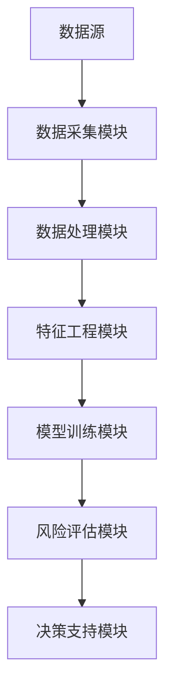
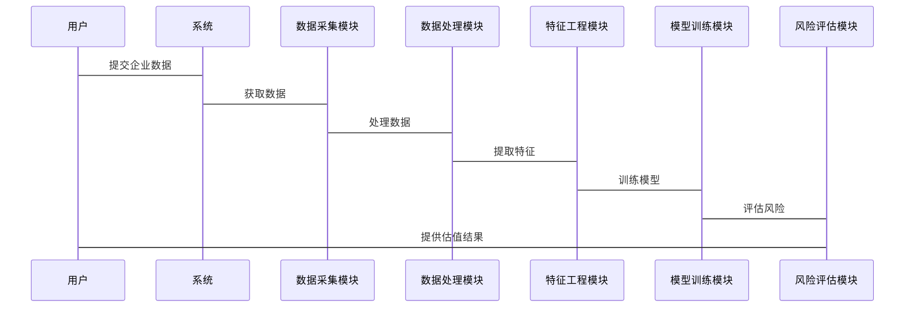

                 


# AI在企业并购估值中的应用与挑战

## 关键词：AI，企业并购，估值模型，机器学习，深度学习

## 摘要：随着人工智能技术的飞速发展，AI在企业并购估值中的应用日益广泛。本文深入探讨了AI在企业并购估值中的核心应用，分析了其背后的算法原理，提出了系统化的解决方案，并通过实际案例展示了AI技术的实际应用效果。同时，本文也探讨了在应用过程中面临的挑战，并展望了未来的发展方向。

---

## 第1章：引言

### 1.1 背景介绍

企业并购是企业战略发展的重要手段，其核心在于对目标企业的准确估值。传统估值方法依赖于财务数据和人工分析，存在效率低、主观性强、难以覆盖海量数据等问题。随着人工智能技术的快速发展，AI在企业并购估值中的应用为这一领域带来了新的可能性。

### 1.2 核心概念

- **企业并购**：指一家企业收购另一家企业的一部分或全部股权，以实现战略目标或扩大业务范围。
- **AI**：人工智能，通过算法模拟人类学习和决策过程，实现数据处理、模式识别和预测。
- **估值模型**：用于评估企业价值的数学模型，通常基于财务数据和市场信息。

### 1.3 问题描述

企业并购估值的关键在于准确预测目标企业的未来表现。传统方法依赖于财务报表分析、DCF模型等，但存在以下问题：
- 数据量大，分析耗时。
- 依赖人工经验，主观性强。
- 难以捕捉非结构化数据（如文本、图像）中的潜在信息。

### 1.4 问题解决

AI通过机器学习算法可以从海量数据中提取有价值的信息，帮助提升估值的准确性和效率。具体优势包括：
- 处理多源异构数据的能力。
- 自动化特征提取与建模。
- 高效的预测能力。

### 1.5 边界与外延

企业并购估值AI系统主要用于辅助决策，而非完全替代人类判断。其边界包括：
- 数据质量和完整性。
- 模型的可解释性。
- 外部市场环境的不可预测性。

### 1.6 概念结构与核心要素

以下是企业并购估值AI系统的核心要素：

| **要素**       | **描述**                                                                 |
|----------------|--------------------------------------------------------------------------|
| 数据源         | 财务报表、行业数据、新闻媒体等。                                          |
| 特征工程       | 数据预处理、特征提取。                                                    |
| 算法模型       | 用于预测企业价值的机器学习模型。                                          |
| 风险评估       | 评估模型预测的不确定性。                                                  |
| 决策支持       | 提供基于AI预测的决策建议。                                                |

---

## 第2章：AI在并购估值中的核心应用

### 2.1 数据收集与预处理

#### 2.1.1 数据来源

企业并购估值所需的数据来源广泛，包括：
- **财务数据**：收入、利润、现金流等。
- **行业数据**：市场趋势、竞争分析。
- **文本数据**：新闻报道、公司公告。
- **图像数据**：企业产品或服务的图像信息。

#### 2.1.2 数据清洗

数据清洗是确保模型准确性的基础步骤，包括：
- **去除缺失值**：处理缺失数据。
- **异常值处理**：识别并处理异常值。
- **数据标准化**：统一数据格式。

### 2.2 特征工程

特征工程是提升模型性能的关键步骤，具体包括：
- **特征提取**：从原始数据中提取有价值的特征。
- **特征选择**：选择对目标变量影响最大的特征。
- **特征变换**：通过变换降低数据的复杂性。

### 2.3 估值模型构建

#### 2.3.1 监督学习模型

监督学习模型适用于有标签的数据，常用的模型包括：
- **线性回归**：用于预测连续型变量。
- **支持向量机（SVM）**：适用于分类和回归任务。
- **随机森林**：适用于特征重要性分析。

#### 2.3.2 无监督学习模型

无监督学习适用于无标签数据，常用模型包括：
- **聚类分析**：将企业分为不同的类别。
- **主成分分析（PCA）**：降维处理。

### 2.4 模型评估与优化

模型评估是确保模型泛化能力的关键步骤，常用方法包括：
- **交叉验证**：评估模型的稳定性。
- **超参数优化**：通过网格搜索或随机搜索优化模型性能。

### 2.5 风险评估

AI可以通过分析历史数据和市场趋势，评估并购中的风险因素，如市场风险、运营风险等。

---

## 第3章：AI算法原理与数学模型

### 3.1 监督学习模型的数学基础

#### 3.1.1 线性回归

线性回归是最简单的回归模型，其数学表达式为：
$$ y = \beta_0 + \beta_1 x + \epsilon $$
其中，$\beta_0$ 是截距，$\beta_1$ 是斜率，$\epsilon$ 是误差项。

#### 3.1.2 支持向量机（SVM）

SVM适用于分类和回归任务，其目标是最小化经验风险和结构风险。对于线性可分的数据，SVM的决策函数为：
$$ f(x) = \text{sign}(w \cdot x + b) $$
其中，$w$ 是权重向量，$b$ 是截距。

### 3.2 无监督学习模型的数学基础

#### 3.2.1 K-均值聚类

K-均值聚类是一种常见的聚类算法，其目标是最小化簇内平方和。算法步骤包括：
1. 初始化质心。
2. 计算每个数据点到质心的距离，分配簇。
3. 更新质心。
4. 重复步骤2和3，直到收敛。

---

## 第4章：系统分析与架构设计

### 4.1 问题场景介绍

本章将从系统角度分析AI驱动的并购估值系统的设计与实现。系统目标是通过AI技术提升企业并购估值的效率和准确性。

### 4.2 系统功能设计

系统功能模块包括：
- 数据采集模块：采集企业数据。
- 数据处理模块：清洗和预处理数据。
- 特征工程模块：提取特征。
- 模型训练模块：训练机器学习模型。
- 风险评估模块：评估并购风险。

### 4.3 系统架构设计

以下是系统的总体架构：



### 4.4 接口设计

系统接口设计包括：
- 数据接口：与数据库对接。
- API接口：提供外部调用服务。

### 4.5 交互设计

以下是系统交互流程：



---

## 第5章：项目实战

### 5.1 环境安装

项目实战需要以下环境：
- Python 3.8+
- scikit-learn、TensorFlow、Pandas等库。

### 5.2 核心实现

以下是核心代码示例：

```python
import pandas as pd
from sklearn.ensemble import RandomForestRegressor
from sklearn.metrics import mean_squared_error
from sklearn.model_selection import train_test_split

# 加载数据
data = pd.read_csv('并购数据.csv')

# 数据预处理
data = data.dropna()

# 特征与标签分离
X = data.drop('目标变量', axis=1)
y = data['目标变量']

# 划分训练集与测试集
X_train, X_test, y_train, y_test = train_test_split(X, y, test_size=0.2, random_state=42)

# 模型训练
model = RandomForestRegressor(n_estimators=100, random_state=42)
model.fit(X_train, y_train)

# 模型预测
y_pred = model.predict(X_test)

# 模型评估
mse = mean_squared_error(y_test, y_pred)
print(f'均方误差：{mse}')
```

### 5.3 案例分析

以某企业为例，分析其并购估值过程，并展示AI技术的应用效果。

---

## 第6章：总结与展望

### 6.1 总结

本文详细探讨了AI在企业并购估值中的应用，分析了其算法原理，并提出了系统化的解决方案。AI技术的应用显著提升了估值的效率和准确性。

### 6.2 展望

未来，随着AI技术的不断进步，企业并购估值将更加智能化和自动化。同时，如何提升模型的可解释性和应对数据隐私问题将是研究的重点。

---

## 作者：AI天才研究院/AI Genius Institute & 禅与计算机程序设计艺术 /Zen And The Art of Computer Programming

---

**Note**: 如果您对上述内容有疑问或需要进一步的解释，请随时提出。

