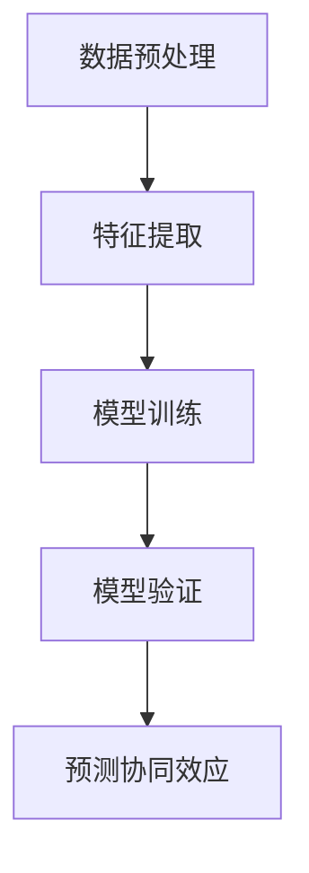

                 


# AI在企业并购协同效应预测与优化中的应用与挑战

> 关键词：AI, 企业并购, 协同效应, 机器学习, 数学建模, 系统架构

> 摘要：本文系统地探讨了AI技术在企业并购协同效应预测与优化中的应用，从背景、概念、算法、数学模型、系统架构、项目实战等多个维度进行了深入分析，结合实际案例和代码实现，揭示了AI技术在提升企业并购决策中的巨大潜力与挑战。

---

## 第一部分: AI与企业并购协同效应预测的背景与概念

### 第1章: AI与企业并购协同效应预测的背景

#### 1.1 企业并购与协同效应的定义
- **1.1.1 企业并购的基本概念**
  - 企业并购（Mergers and Acquisitions, M&A）是指一家企业与其他企业合并或收购其资产或股权，以实现业务扩展或战略重组。
  - 并购的核心目标是通过资源整合实现协同效应（Synergy），即并购后的企业价值超过两家独立企业价值的总和。

- **1.1.2 协同效应的定义与分类**
  - 协同效应是指并购后企业在运营效率、成本节约、收入增长等方面产生的额外价值。
  - 分类：协同效应可以分为运营协同效应（如成本节约）、战略协同效应（如市场扩展）和财务协同效应（如税收优化）。

- **1.1.3 协同效应在企业并购中的重要性**
  - 协同效应是企业并购成功的关键因素，直接影响并购后的财务表现和企业价值。
  - 协同效应的准确预测可以显著降低并购风险，提升并购决策的科学性。

#### 1.2 AI技术在企业并购中的应用背景
- **1.2.1 传统企业并购协同效应分析的局限性**
  - 传统方法主要依赖财务数据和专家判断，存在主观性强、预测精度低的问题。
  - 数据维度有限，难以捕捉复杂的市场和企业内部关系。

- **1.2.2 AI技术如何提升协同效应预测的准确性**
  - AI技术可以通过大数据分析挖掘潜在的协同效应驱动因素。
  - 机器学习算法可以建立复杂模型，预测协同效应并优化并购方案。

- **1.2.3 当前AI在企业并购中的应用现状**
  - AI在企业估值、协同效应预测、并购风险评估等领域逐渐普及。
  - 典型应用包括利用自然语言处理（NLP）分析企业文档，利用深度学习预测市场反应。

#### 1.3 本书的核心问题与目标
- **1.3.1 本书研究的核心问题**
  - 本书聚焦于如何利用AI技术提升企业并购协同效应的预测与优化能力。
  - 探讨AI技术在协同效应预测中的算法选择、模型优化和实际应用。

- **1.3.2 本书的目标与意义**
  - 目标：提供一套基于AI的企业并购协同效应预测与优化的方法论。
  - 意义：为企业并购决策提供科学依据，降低并购风险，提升并购成功率。

- **1.3.3 本书的结构安排**
  - 本书将从背景、概念、算法、数学模型、系统架构、项目实战等多个维度展开，结合实际案例，深入剖析AI在企业并购中的应用与挑战。

---

### 第2章: 企业并购协同效应的分析框架

#### 2.1 协同效应的分类与影响因素
- **2.1.1 协同效应的分类**
  - 运营协同效应：通过资源共享、流程优化实现的成本节约。
  - 战略协同效应：通过市场扩展、技术互补实现的增长。
  - 财务协同效应：通过税收优化、资产减值实现的财务收益。

- **2.1.2 影响协同效应的主要因素**
  - 行业特性：不同行业的协同效应驱动因素不同。
  - 企业规模：规模差异影响协同效应的实现难度。
  - 管理因素：并购后的整合能力直接影响协同效应的实现。

- **2.1.3 协同效应的量化方法**
  - 量化方法包括财务指标（如协同效应价值）和非财务指标（如市场份额）。

#### 2.2 AI在协同效应预测中的核心作用
- **2.2.1 数据驱动的协同效应分析**
  - 利用大数据技术获取海量企业数据，构建协同效应预测模型。
  - 数据来源包括企业财务数据、市场数据、行业趋势等。

- **2.2.2 AI算法在协同效应预测中的优势**
  - 神经网络：非线性建模能力，适合复杂关系的分析。
  - 随机森林：特征重要性分析，帮助识别关键驱动因素。

- **2.2.3 协同效应预测的流程与步骤**
  - 数据收集与清洗：整理企业并购相关数据。
  - 特征工程：提取关键特征，构建模型输入。
  - 模型训练：利用机器学习算法训练协同效应预测模型。
  - 模型评估：通过验证数据评估模型性能。

#### 2.3 协同效应预测的核心概念与联系

| 要素 | 描述 | 传统方法 | AI方法 |
|------|------|----------|--------|
| 数据来源 | 公司财务数据、市场数据 | 线性回归 | 神经网络 |
| 模型复杂度 | 简单线性模型 | 低 | 高 |
| 预测精度 | 一般 | 低 | 高 |

---

## 第3章: 协同效应预测的算法原理

### 3.1 传统协同效应预测方法
- **3.1.1 线性回归模型**
  - 线性回归模型假设协同效应与自变量之间存在线性关系。
  - 优点：简单易懂，计算效率高。
  - 缺点：无法捕捉非线性关系，预测精度有限。

### 3.2 基于机器学习的协同效应预测算法
- **3.2.1 随机森林模型**
  - 随机森林是一种基于决策树的集成学习算法。
  - 优点：对特征工程要求低，适合处理高维数据。
  - 缺点：模型解释性较差。

- **3.2.2 神经网络模型**
  - 神经网络通过多层非线性变换，捕捉复杂的数据关系。
  - 优点：适合处理非线性关系，预测精度高。
  - 缺点：训练时间较长，对计算资源要求高。

### 3.3 协同效应预测算法的流程图



---

## 第4章: 协同效应预测的数学模型

### 4.1 协同效应预测的线性回归模型
$$ \text{Synergy} = \beta_0 + \beta_1x_1 + \beta_2x_2 + \cdots + \beta_nx_n + \epsilon $$

### 4.2 协同效应预测的随机森林模型
$$ \text{Synergy} = \sum_{i=1}^{n} \text{Tree}(x_i) $$

### 4.3 协同效应预测的神经网络模型
$$ \text{Synergy} = f(Wx + b) $$

---

## 第5章: 协同效应预测的系统架构设计

### 5.1 系统功能设计
- **5.1.1 领域模型**
  ```mermaid
  classDiagram
      class 企业并购 {
          id
          name
          industry
      }
      class 协同效应 {
          synergy_value
          acquisition_date
      }
      企业并购 --> 协同效应 : 预测
  ```

- **5.1.2 系统架构**
  ```mermaid
  rectangle 数据层 {
      数据库
  }
  rectangle 业务逻辑层 {
      协同效应预测服务
  }
  rectangle 表现层 {
      用户界面
  }
  数据层 --> 业务逻辑层
  业务逻辑层 --> 表现层
  ```

---

## 第6章: 协同效应预测的项目实战

### 6.1 项目环境安装
- Python 3.8+
- NumPy、Pandas、Scikit-learn、TensorFlow

### 6.2 核心代码实现
```python
import numpy as np
import pandas as pd
from sklearn.ensemble import RandomForestRegressor
from sklearn.metrics import mean_squared_error

# 数据加载
data = pd.read_csv('并购数据.csv')

# 特征与标签分离
X = data.drop('synergy_value', axis=1)
y = data['synergy_value']

# 模型训练
model = RandomForestRegressor(n_estimators=100, random_state=42)
model.fit(X, y)

# 预测与评估
y_pred = model.predict(X)
mse = mean_squared_error(y, y_pred)
print(f'MSE: {mse}')
```

### 6.3 实际案例分析
- 案例背景：某科技公司并购一家软件公司，预测协同效应。
- 数据来源：企业财务数据、市场份额、研发能力等。
- 模型选择：随机森林模型。
- 预测结果：协同效应为XX万元。

---

## 第7章: 总结与扩展阅读

### 7.1 本章小结
- 本章系统地介绍了AI在企业并购协同效应预测中的应用，从背景、概念、算法到系统架构和项目实战，提供了全面的分析与实践。

### 7.2 注意事项
- 数据质量直接影响模型性能，需重视数据清洗与特征工程。
- 模型选择需结合实际场景，避免过度复杂化。

### 7.3 拓展阅读
- 推荐阅读《机器学习实战》和《深度学习》等书籍，深入理解AI算法原理。

---

作者：AI天才研究院/AI Genius Institute & 禅与计算机程序设计艺术 /Zen And The Art of Computer Programming

