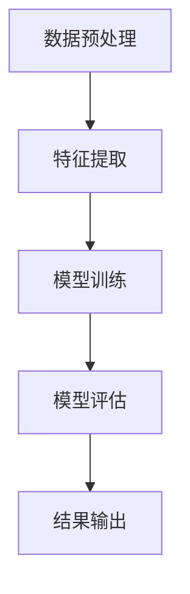
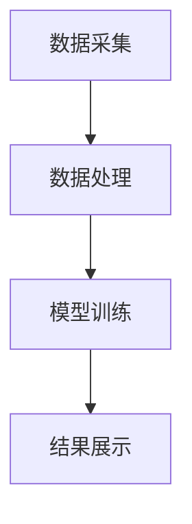

                 

# AI在企业并购协同效应预测中的应用与挑战

> 关键词：企业并购、协同效应、人工智能、机器学习、预测模型

> 摘要：本文探讨了人工智能在企业并购协同效应预测中的应用与挑战。通过分析协同效应的定义、类型及其预测模型，结合具体的AI算法和系统架构设计，本文详细阐述了如何利用AI技术提升企业并购决策的准确性，并对未来的发展方向进行了展望。

---

# 第一部分: 企业并购与协同效应概述

## 第1章: 企业并购与协同效应的背景与概念

### 1.1 企业并购的基本概念

#### 1.1.1 企业并购的定义与类型
企业并购（Mergers and Acquisitions, M&A）是指一家企业合并或收购另一家企业，以实现资源优化配置和业务扩展。常见的并购类型包括：
- **横向并购**：同一行业内的企业并购，旨在扩大市场份额。
- **纵向并购**：产业链上下游的企业并购，以增强垂直整合能力。
- **混合并购**：与主业无关的跨行业并购，以 diversify 业务。

#### 1.1.2 协同效应的定义与分类
协同效应（Synergy）是指企业并购后，由于资源优化配置和业务整合所带来的额外价值。协同效应的分类包括：
- **成本协同效应**：通过合并减少重复成本，如行政、研发、生产等。
- **收入协同效应**：通过合并扩大市场、客户群体或产品线。
- **管理协同效应**：通过整合管理团队和流程提高效率。

#### 1.1.3 协同效应在企业并购中的重要性
协同效应是企业并购成功的关键因素之一。它不仅能够提升企业价值，还能降低并购风险。然而，协同效应的实现往往受到多种因素的影响，如企业文化、管理能力、市场竞争等。

### 1.2 AI技术在企业并购中的应用背景

#### 1.2.1 AI技术的发展与企业并购的结合
随着AI技术的快速发展，企业并购的决策过程逐渐从传统的经验驱动转向数据驱动。AI技术能够通过分析海量数据，发现潜在的协同效应，为并购决策提供科学依据。

#### 1.2.2 数据驱动的决策在企业并购中的价值
企业并购涉及大量的数据，如财务数据、市场数据、技术数据等。通过AI技术，可以对这些数据进行清洗、分析和建模，从而发现隐藏的模式和趋势，帮助决策者制定更明智的并购策略。

#### 1.2.3 协同效应预测的挑战与机遇
协同效应预测是一个复杂的过程，涉及多个变量和不确定性。AI技术的应用为协同效应预测提供了新的可能性，但也面临数据质量、模型泛化能力等挑战。

---

## 第2章: 协同效应预测的核心概念与理论基础

### 2.1 协同效应的构成要素

#### 2.1.1 成本协同效应
成本协同效应是通过合并企业减少重复成本，如行政、研发、生产等。例如，两家企业的研发部门合并后可以节省研发成本。

#### 2.1.2 收入协同效应
收入协同效应是通过合并企业扩大市场、客户群体或产品线，从而增加收入。例如，一家企业并购另一家拥有新客户群体的企业，可以带来新的收入来源。

#### 2.1.3 管理协同效应
管理协同效应是通过整合管理团队和流程提高效率。例如，合并后的企业可以共享管理经验，优化组织结构。

### 2.2 协同效应预测的数学模型

#### 2.2.1 协同效应的线性回归模型
线性回归模型是协同效应预测的基础模型之一。假设协同效应与企业的规模、市场份额等因素呈线性关系，模型可以表示为：
$$ Synergy = \beta_0 + \beta_1(Size) + \beta_2(Market Share) + \epsilon $$
其中，$ \beta_0 $ 是截距，$ \beta_1 $ 和 $ \beta_2 $ 是回归系数，$ \epsilon $ 是误差项。

#### 2.2.2 协同效应的非线性回归模型
非线性回归模型能够捕捉协同效应与变量之间的非线性关系。例如，可以使用多项式回归模型：
$$ Synergy = \beta_0 + \beta_1(Size) + \beta_2(Size^2) + \epsilon $$

#### 2.2.3 协同效应的分类模型
分类模型用于预测协同效应的类型，如成本协同、收入协同等。常用的分类算法包括决策树、随机森林等。

### 2.3 协同效应预测的核心要素与关系

#### 2.3.1 协同效应的驱动因素
协同效应的驱动因素包括企业规模、市场份额、管理能力、技术优势等。

#### 2.3.2 协同效应的限制因素
协同效应的实现受到企业文化、管理能力、市场竞争等限制因素的影响。

#### 2.3.3 协同效应的实现路径
协同效应的实现路径包括战略规划、资源整合、组织优化等。

---

## 第3章: AI算法在协同效应预测中的原理与实现

### 3.1 常见AI算法在协同效应预测中的应用

#### 3.1.1 线性回归模型
线性回归模型适用于协同效应的线性关系预测。例如，可以用于预测协同效应与企业规模之间的关系。

#### 3.1.2 支持向量机模型
支持向量机模型适用于协同效应的分类和回归问题。例如，可以用于分类协同效应的类型。

#### 3.1.3 随机森林模型
随机森林模型适用于协同效应的特征重要性分析和非线性关系预测。例如，可以用于识别协同效应的关键驱动因素。

#### 3.1.4 神经网络模型
神经网络模型适用于协同效应的复杂非线性关系预测。例如，可以用于处理多维数据和复杂模式。

### 3.2 基于机器学习的协同效应预测模型

#### 3.2.1 数据预处理与特征提取
数据预处理包括数据清洗、缺失值处理、异常值处理等。特征提取包括选择关键特征、特征工程等。

#### 3.2.2 模型训练与优化
模型训练包括选择算法、参数优化、交叉验证等。例如，可以使用网格搜索优化模型参数。

#### 3.2.3 模型评估与验证
模型评估包括使用训练集和测试集评估模型性能。常用的评估指标包括均方误差（MSE）、R²值等。

### 3.3 协同效应预测的算法流程图

---

## 第4章: 协同效应预测的系统架构与实现

### 4.1 系统功能模块划分

#### 4.1.1 数据采集模块
数据采集模块负责从企业内部和外部数据源获取相关数据，如财务数据、市场数据等。

#### 4.1.2 数据处理模块
数据处理模块负责对采集到的数据进行清洗、转换和特征提取。

#### 4.1.3 模型训练模块
模型训练模块负责选择合适的算法，训练模型并优化参数。

#### 4.1.4 结果展示模块
结果展示模块负责将模型预测结果以可视化的方式展示给用户。

### 4.2 系统架构设计

#### 4.2.1 系统功能设计
系统功能包括数据采集、数据处理、模型训练、结果展示等。

#### 4.2.2 系统架构图

---

## 第5章: 项目实战与案例分析

### 5.1 项目实战

#### 5.1.1 数据预处理与特征工程
假设我们有一个企业并购案例，需要预测协同效应。首先，我们需要采集相关数据，包括企业规模、市场份额、管理能力等。然后，进行数据清洗和特征提取。

#### 5.1.2 模型训练与优化
选择随机森林模型进行训练，并使用交叉验证优化模型参数。

#### 5.1.3 模型评估与分析
评估模型的性能，分析预测结果，识别关键驱动因素。

### 5.2 案例分析

#### 5.2.1 案例背景
假设我们分析一家科技公司并购一家软件公司的情况。

#### 5.2.2 数据分析
通过数据分析，识别协同效应的关键驱动因素，如技术互补性、客户重叠度等。

#### 5.2.3 模型预测
使用训练好的模型预测协同效应，并评估其准确性。

---

## 第6章: 协同效应预测的挑战与未来方向

### 6.1 协同效应预测的挑战

#### 6.1.1 数据质量问题
数据的质量直接影响模型的性能。例如，数据缺失、噪声等问题会影响预测结果的准确性。

#### 6.1.2 模型泛化能力
模型的泛化能力是协同效应预测的关键。如果模型在训练集上表现良好，但在测试集上表现不佳，说明模型泛化能力不足。

#### 6.1.3 伦理与法律问题
企业并购涉及复杂的伦理和法律问题，如反垄断法、数据隐私等。AI技术的应用需要遵守相关法律法规。

### 6.2 协同效应预测的未来方向

#### 6.2.1 强化学习的应用
强化学习在协同效应预测中的潜力巨大。通过模拟企业并购的过程，强化学习可以优化决策策略。

#### 6.2.2 图神经网络的应用
图神经网络可以用于处理复杂的企业网络关系，如供应链、合作伙伴关系等。

#### 6.2.3 多模态数据的融合
多模态数据的融合可以提高协同效应预测的准确性。例如，结合文本数据、图像数据等。

---

## 作者：AI天才研究院/AI Genius Institute & 禅与计算机程序设计艺术 /Zen And The Art of Computer Programming

---

通过本文的分析，我们了解了AI在企业并购协同效应预测中的应用与挑战。AI技术的应用为协同效应预测提供了新的可能性，但也面临诸多挑战。未来，随着技术的进步，AI在企业并购中的应用将更加广泛和深入。

