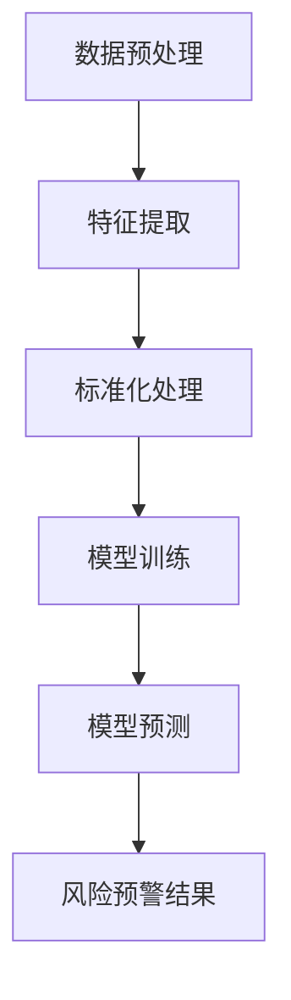
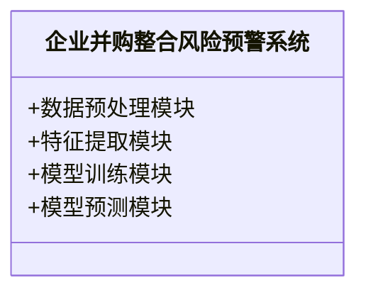
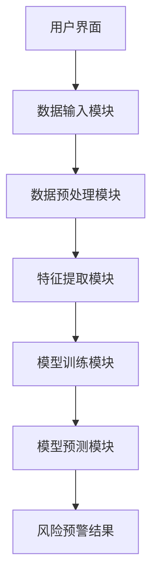
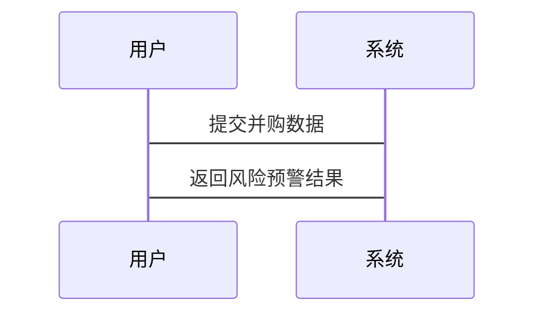

                 


# AI在企业并购整合风险预警中的应用与挑战

> 关键词：企业并购整合、AI技术、风险预警、机器学习、知识图谱

> 摘要：  
本文深入探讨了人工智能（AI）技术在企业并购整合风险预警中的应用与挑战。通过分析并购整合的主要风险类型、AI技术的核心概念与原理，构建了基于机器学习的风险预警模型，并详细阐述了算法原理与实现方案。同时，本文还探讨了系统架构设计与实际案例分析，最后总结了当前应用中的主要挑战与未来发展方向。

---

## 第1章: 企业并购整合风险预警的背景与问题背景

### 1.1 企业并购整合的定义与特点

#### 1.1.1 企业并购的定义与类型
企业并购（Mergers and Acquisitions, M&A）是指企业之间的合并或收购行为。并购整合是企业在完成并购后，将双方的业务、资源、组织结构等进行整合的过程。常见的并购类型包括：
- **横向并购**：同一行业内的企业合并。
- **纵向并购**：供应链上下游企业的合并。
- **混合并购**：无直接关联的企业之间的并购。

#### 1.1.2 企业并购整合的核心特点
企业并购整合的核心特点包括：
- **协同效应**：通过整合实现成本节约或收入增长。
- **风险管理**：整合过程中可能面临多种风险，如文化冲突、战略偏差等。
- **复杂性**：整合涉及多个方面，包括战略、组织、文化等。

#### 1.1.3 并购整合中的主要风险类型
并购整合中的主要风险包括：
- **战略风险**：并购战略与企业目标不一致。
- **经营风险**：整合后的企业经营不善。
- **财务风险**：并购过程中可能出现的财务问题。
- **文化风险**：双方文化冲突导致整合失败。

### 1.2 企业并购整合风险预警的定义与价值

#### 1.2.1 风险预警的定义
风险预警是指通过分析潜在风险因素，提前预测和识别可能对企业造成负面影响的事件，并采取相应的预防措施。

#### 1.2.2 并购整合风险预警的核心价值
- 提前识别潜在风险，降低整合失败的概率。
- 提高并购决策的准确性，优化整合策略。
- 降低整合过程中的不确定性，提升企业整体效率。

#### 1.2.3 风险预警在企业并购中的作用
- 帮助企业在并购前评估潜在风险。
- 在整合过程中实时监控风险，及时调整策略。

### 1.3 当前企业并购整合风险预警的现状与挑战

#### 1.3.1 现有风险预警方法的局限性
- **数据不足**：传统方法依赖经验判断，缺乏数据支持。
- **主观性高**：风险评估结果受主观因素影响较大。
- **实时性差**：传统方法难以实现实时监控和预警。

#### 1.3.2 AI技术在风险预警中的应用现状
- **数据驱动**：AI技术可以通过大数据分析，提供更精准的预测。
- **自动化**：AI能够自动化处理大量数据，提高预警效率。
- **实时监控**：AI技术可以实现对并购整合过程中的实时监控。

#### 1.3.3 当前应用中的主要挑战
- **数据质量问题**：数据的准确性和完整性直接影响预警效果。
- **模型可解释性**：复杂的AI模型可能难以解释其预测结果。
- **技术与业务结合难度**：AI技术与企业并购整合业务的深度融合需要较高的技术门槛。

### 1.4 本章小结
本章从企业并购整合的背景出发，分析了并购整合的主要风险类型，并探讨了风险预警的定义与价值。同时，总结了当前风险预警方法的局限性和AI技术的应用现状，最后提出了当前应用中的主要挑战。

---

## 第2章: AI在企业并购整合风险预警中的核心概念与联系

### 2.1 AI技术的核心概念与原理

#### 2.1.1 人工智能的基本概念
人工智能（AI）是指计算机系统模拟人类智能的能力，包括学习、推理、问题解决等。

#### 2.1.2 机器学习与深度学习的原理
- **机器学习**：通过数据训练模型，使其能够识别模式并做出预测。
- **深度学习**：基于人工神经网络，能够自动提取数据特征。

#### 2.1.3 自然语言处理（NLP）与知识图谱
- **NLP**：用于处理文本数据，提取有用信息。
- **知识图谱**：用于构建领域知识库，支持智能决策。

### 2.2 并购整合风险预警的核心要素与模型

#### 2.2.1 并购风险的主要来源
- **战略风险**：并购战略与企业目标不一致。
- **经营风险**：整合后的企业经营不善。
- **财务风险**：并购过程中可能出现的财务问题。
- **文化风险**：双方文化冲突导致整合失败。

#### 2.2.2 风险预警模型的构建要素
- **数据来源**：企业财务数据、市场数据、文本数据等。
- **风险指标**：如财务指标、市场指标、文化指标等。
- **模型选择**：如随机森林、神经网络等。

#### 2.2.3 基于AI的风险预警模型框架
- **数据预处理**：清洗、特征提取。
- **模型训练**：训练风险预警模型。
- **模型评估**：验证模型的准确性和可解释性。

### 2.3 AI技术与并购整合风险预警的关系

#### 2.3.1 AI技术在风险识别中的作用
- **数据驱动**：通过大数据分析，识别潜在风险。
- **自动化**：自动化处理数据，提高预警效率。
- **实时监控**：实时监控企业并购整合过程中的风险。

#### 2.3.2 数据驱动的预警机制
- **数据采集**：通过多种渠道采集数据。
- **数据分析**：利用AI技术分析数据，识别风险。
- **预警反馈**：根据分析结果，发出预警信号。

#### 2.3.3 AI技术与传统风险评估方法的对比
| 对比维度       | AI技术                     | 传统方法                   |
|----------------|---------------------------|-----------------------------|
| 数据依赖       | 高                        | 低                          |
| 自动化程度     | 高                        | 低                          |
| 可解释性       | 低（复杂模型）            | 高                          |

### 2.4 本章小结
本章介绍了AI技术的核心概念与原理，并分析了并购整合风险预警的核心要素与模型。最后，对比了AI技术与传统风险评估方法的差异，强调了AI技术在风险预警中的优势。

---

## 第3章: 企业并购整合风险的多维度分析与建模

### 3.1 并购整合风险的主要维度

#### 3.1.1 企业战略风险
- 并购战略与企业目标不一致。
- 并购后战略调整困难。

#### 3.1.2 经营风险
- 整合后企业经营不善。
- 业务协同效果不佳。

#### 3.1.3 财务风险
- 并购成本过高。
- 整合过程中的财务问题。

#### 3.1.4 文化与组织整合风险
- 企业文化冲突。
- 组织结构整合困难。

### 3.2 基于AI的风险预警模型构建

#### 3.2.1 数据收集与特征提取
- 数据来源：企业财务数据、市场数据、文本数据等。
- 特征提取：如财务指标、市场指标、文本情感分析等。

#### 3.2.2 风险指标的量化与权重分配
- 风险指标量化：将风险因素转化为可量化的指标。
- 权重分配：根据经验或模型训练确定各指标的权重。

#### 3.2.3 基于机器学习的模型选择
- 模型选择：如随机森林、神经网络等。
- 模型训练：利用训练数据训练模型。
- 模型评估：验证模型的准确性和可解释性。

### 3.3 风险预警模型的验证与优化

#### 3.3.1 模型的训练与测试
- 训练数据：用于模型训练。
- 测试数据：用于模型评估。

#### 3.3.2 模型的评估与优化
- 模型评估：如准确率、召回率、F1值等。
- 模型优化：调整模型参数，优化模型性能。

#### 3.3.3 模型的可解释性分析
- 可解释性：通过特征重要性分析，解释模型的预测结果。

### 3.4 本章小结
本章从多维度分析了并购整合风险，并构建了基于机器学习的风险预警模型。通过模型的训练与优化，提高了风险预警的准确性和可解释性。

---

## 第4章: 基于AI的并购整合风险预警算法原理

### 4.1 算法原理概述
基于AI的并购整合风险预警算法主要包括数据预处理、特征提取、模型训练与预测等步骤。

### 4.2 算法实现步骤

#### 4.2.1 数据预处理
- 数据清洗：去除无效数据。
- 特征提取：提取关键特征。

#### 4.2.2 模型训练
- 选择合适的算法：如随机森林、神经网络等。
- 训练模型：利用训练数据训练模型。

#### 4.2.3 模型预测
- 输入测试数据：进行风险预测。
- 输出预警结果：如高风险、中风险、低风险。

### 4.3 算法实现的数学模型

#### 4.3.1 随机森林模型
随机森林是一种基于树的集成学习方法，通过构建多个决策树并进行投票或平均，提高模型的准确性和稳定性。

#### 4.3.2 神经网络模型
神经网络是一种模仿人脑结构和功能的模型，通过多层神经元之间的连接，学习数据的特征和模式。

### 4.4 算法实现的代码示例

#### 4.4.1 数据预处理
```python
import pandas as pd
from sklearn.preprocessing import StandardScaler

# 加载数据
data = pd.read_csv('并购整合风险数据.csv')

# 提取特征
features = data[['财务指标', '市场指标', '文化指标']]
target = data['风险等级']

# 标准化处理
scaler = StandardScaler()
features_scaled = scaler.fit_transform(features)
```

#### 4.4.2 模型训练
```python
from sklearn.ensemble import RandomForestClassifier

# 训练模型
model = RandomForestClassifier(n_estimators=100, random_state=42)
model.fit(features_scaled, target)
```

#### 4.4.3 模型预测
```python
# 预测风险
test_features = ...  # 测试数据
test_scaled = scaler.transform(test_features)
predictions = model.predict(test_scaled)
```

### 4.5 算法实现的流程图


### 4.6 本章小结
本章详细介绍了基于AI的并购整合风险预警算法的原理与实现过程，通过随机森林和神经网络等算法，构建了风险预警模型，并通过代码示例展示了模型的实现过程。

---

## 第5章: 系统分析与架构设计方案

### 5.1 系统功能设计

#### 5.1.1 领域模型设计


#### 5.1.2 系统架构设计


### 5.2 系统接口设计
- 数据接口：与企业数据系统对接，获取并购整合数据。
- 用户接口：提供风险预警结果的可视化界面。

### 5.3 系统交互设计


### 5.4 本章小结
本章设计了企业并购整合风险预警系统的功能模块、系统架构和交互流程，为系统的实际开发提供了指导。

---

## 第6章: 项目实战与案例分析

### 6.1 环境安装与配置
- 安装Python、机器学习库（如scikit-learn、xgboost）等。

### 6.2 核心代码实现

#### 6.2.1 数据预处理
```python
import pandas as pd
from sklearn.preprocessing import StandardScaler

# 加载数据
data = pd.read_csv('并购整合风险数据.csv')

# 提取特征
features = data[['财务指标', '市场指标', '文化指标']]
target = data['风险等级']

# 标准化处理
scaler = StandardScaler()
features_scaled = scaler.fit_transform(features)
```

#### 6.2.2 模型训练
```python
from sklearn.ensemble import RandomForestClassifier

# 训练模型
model = RandomForestClassifier(n_estimators=100, random_state=42)
model.fit(features_scaled, target)
```

#### 6.2.3 模型预测
```python
# 预测风险
test_features = ...  # 测试数据
test_scaled = scaler.transform(test_features)
predictions = model.predict(test_scaled)
```

### 6.3 实际案例分析
- **案例背景**：某企业并购失败的案例。
- **数据分析**：通过AI技术分析并购过程中的风险因素。
- **预警结果**：预测并购整合中的高风险点，并提出相应的建议。

### 6.4 本章小结
本章通过实际案例分析，展示了AI技术在企业并购整合风险预警中的应用效果，并验证了模型的可行性和有效性。

---

## 第7章: 总结与展望

### 7.1 本论文的总结
本文详细探讨了AI技术在企业并购整合风险预警中的应用，构建了基于机器学习的风险预警模型，并通过实际案例验证了模型的可行性。

### 7.2 当前应用中的主要挑战
- **数据质量问题**：数据的准确性和完整性直接影响预警效果。
- **模型可解释性**：复杂的AI模型可能难以解释其预测结果。
- **技术与业务结合难度**：AI技术与企业并购整合业务的深度融合需要较高的技术门槛。

### 7.3 对未来研究的展望
- **数据质量提升**：通过数据清洗和特征工程，提高数据质量。
- **模型优化**：探索更高效的算法，提高模型的准确性和可解释性。
- **领域知识结合**：将领域知识与AI技术结合，提升预警效果。

### 7.4 本章小结
本章总结了本文的主要内容，分析了当前应用中的主要挑战，并对未来研究方向进行了展望。

---

## 参考文献
（此处列出相关文献和参考资料）

---

## 作者：AI天才研究院/AI Genius Institute & 禅与计算机程序设计艺术 /Zen And The Art of Computer Programming

---

以上是基于用户提供的大纲，结合具体的章节内容进行的扩展与详细说明。如果需要进一步的修改或补充，请随时告知。

