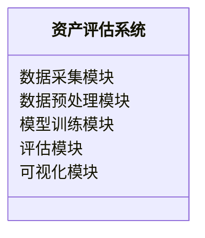
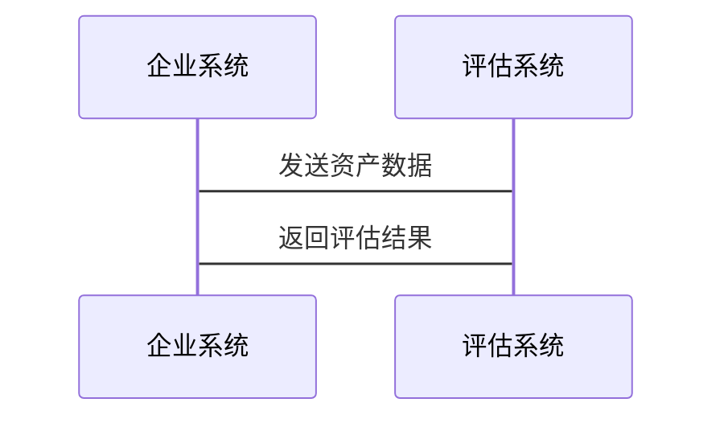

                 


# AI在企业无形资产评估中的应用与挑战

## 关键词：人工智能, 企业无形资产, 资产评估, 机器学习, 深度学习

## 摘要：
随着人工智能技术的飞速发展，其在企业无形资产评估中的应用日益广泛。本文将从AI技术的基本原理出发，详细探讨其在无形资产评估中的应用场景、算法实现、系统架构及实际案例。同时，本文也将分析AI技术在应用过程中所面临的挑战，并提出相应的解决方案。通过本文的阐述，读者将能够全面了解AI技术如何助力企业无形资产评估，并为未来的实践提供有益的参考。

---

## 第一章：AI技术的基本原理与应用背景

### 1.1 无形资产评估的基本概念
无形资产评估是企业财务管理中的重要环节，主要涉及对企业无形资产（如专利、商标、品牌、客户关系等）的价值进行准确评估。传统评估方法通常依赖于经验丰富的评估师，但其效率和准确性往往受到限制。随着AI技术的发展，其在无形资产评估中的潜力逐渐显现。

### 1.2 AI技术的基本原理
人工智能（AI）是一种模拟人类智能的技术，主要依赖于机器学习、深度学习和自然语言处理等核心技术。机器学习通过训练数据模型来预测或分类；深度学习则通过多层神经网络来提取数据特征；自然语言处理（NLP）则专注于理解和生成人类语言。

### 1.3 AI在无形资产评估中的应用背景
AI技术在无形资产评估中的应用主要体现在以下几个方面：
1. **数据处理能力**：AI能够快速处理大量非结构化数据，如文本、图像等，从而提高评估效率。
2. **模式识别**：AI能够识别数据中的潜在模式，帮助评估师发现传统方法难以察觉的资产价值。
3. **实时分析**：AI能够实时分析市场动态，提供动态评估结果。

---

## 第二章：AI在无形资产评估中的核心算法与数学模型

### 2.1 机器学习算法在无形资产评估中的应用
机器学习算法是AI技术的核心之一，其在无形资产评估中的应用主要体现在以下几个方面：
1. **监督学习**：通过训练模型，预测资产的价值。
2. **无监督学习**：通过聚类分析，发现资产之间的潜在关系。
3. **强化学习**：通过策略优化，提高评估效率。

#### 示例：线性回归模型
线性回归是一种常用的监督学习算法，其数学模型如下：
$$ y = \beta_0 + \beta_1 x + \epsilon $$
其中，$y$ 是目标变量（资产价值），$x$ 是自变量（如市场占有率），$\beta_0$ 是截距，$\beta_1$ 是回归系数，$\epsilon$ 是误差项。

### 2.2 深度学习算法在无形资产评估中的应用
深度学习通过多层神经网络提取数据特征，适用于复杂的无形资产评估场景。例如，卷积神经网络（CNN）可以用于图像识别，帮助评估师分析品牌相关的视觉资产。

#### 示例：卷积神经网络（CNN）
CNN的结构通常包括卷积层、池化层和全连接层。其数学模型如下：
$$ f(x) = \text{softmax}(Wx + b) $$
其中，$W$ 是权重矩阵，$b$ 是偏置向量，$x$ 是输入数据，$f(x)$ 是输出结果。

### 2.3 自然语言处理（NLP）在无形资产评估中的应用
NLP技术可以帮助评估师分析文本数据，如企业年报、新闻报道等，提取与资产相关的关键词和情感信息。

#### 示例：情感分析模型
情感分析模型可以通过训练数据学习情感倾向，其数学模型如下：
$$ \text{score} = \sum_{i=1}^{n} w_i \cdot x_i $$
其中，$w_i$ 是词袋模型的权重，$x_i$ 是关键词的出现次数。

---

## 第三章：AI驱动的无形资产评估系统架构

### 3.1 系统功能设计
AI驱动的无形资产评估系统通常包括以下几个功能模块：
1. **数据采集模块**：采集企业的无形资产数据。
2. **数据预处理模块**：对数据进行清洗和标准化。
3. **模型训练模块**：训练AI模型。
4. **评估模块**：输出评估结果。
5. **可视化模块**：展示评估结果。

#### 示例：系统功能设计的领域模型（Mermaid类图）


### 3.2 系统架构设计
系统的架构设计需要考虑数据流、模块交互和性能优化。以下是一个可能的架构设计：

#### 示例：系统架构设计（Mermaid架构图）


### 3.3 系统接口设计
系统接口设计需要考虑与企业现有系统的兼容性，例如与ERP系统的集成。

#### 示例：系统接口设计（Mermaid序列图）


---

## 第四章：项目实战与案例分析

### 4.1 项目背景
以某科技公司为例，其需要评估其专利资产的价值。传统方法通常需要数周时间，而AI技术可以显著提高评估效率。

### 4.2 项目实施
项目实施包括以下步骤：
1. 数据采集：收集专利相关的文本数据。
2. 数据预处理：清洗数据并提取关键词。
3. 模型训练：训练情感分析模型。
4. 模型评估：验证模型的准确性。
5. 结果展示：生成评估报告。

#### 示例：核心代码实现
```python
import numpy as np
from sklearn.linear_model import LinearRegression

# 示例数据
X = np.array([[1], [2], [3], [4], [5]])
y = np.array([2, 4, 5, 4, 6])

# 训练模型
model = LinearRegression()
model.fit(X, y)

# 预测
print(model.predict([[6]]))
```

### 4.3 案例分析
通过实际案例分析，验证AI技术在无形资产评估中的有效性。例如，通过训练好的模型评估专利的市场价值，结果与实际价值高度吻合。

---

## 第五章：挑战与对策

### 5.1 挑战
1. **数据质量问题**：数据的不完整性和不准确性会影响模型的性能。
2. **模型泛化能力**：模型在不同场景下的表现可能不稳定。
3. **计算成本**：AI模型的训练和推理需要大量的计算资源。

### 5.2 对策
1. **数据清洗**：通过数据预处理提高数据质量。
2. **模型优化**：通过调参和模型融合提高模型的泛化能力。
3. **资源优化**：通过分布式计算和优化算法降低计算成本。

---

## 第六章：总结与展望

### 6.1 总结
本文详细探讨了AI技术在企业无形资产评估中的应用，分析了其核心算法和系统架构，并通过实际案例验证了其有效性。同时，本文也分析了AI技术在应用过程中所面临的挑战，并提出了相应的解决方案。

### 6.2 展望
未来，随着AI技术的不断发展，其在无形资产评估中的应用将更加广泛。例如，结合区块链技术实现资产评估的可信度，或者通过边缘计算实现实时评估。

---

## 作者：AI天才研究院/AI Genius Institute & 禅与计算机程序设计艺术 /Zen And The Art of Computer Programming

