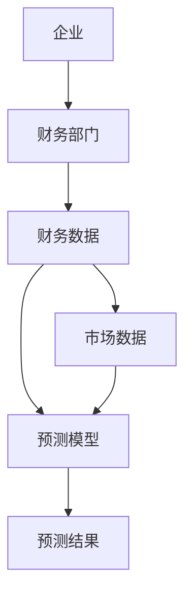
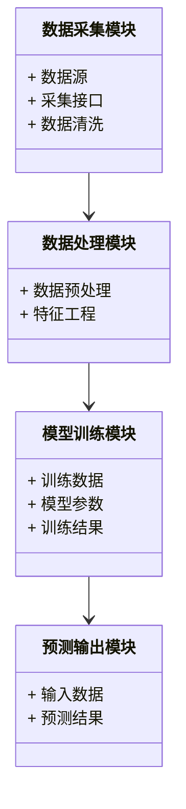
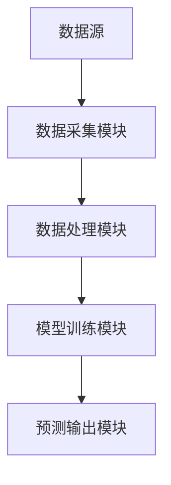
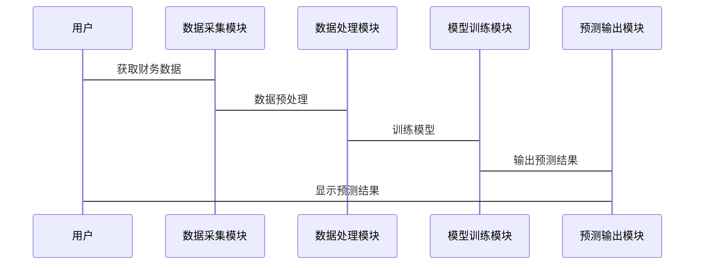

                 


# AI在企业财务预测中的应用与实践

> 关键词：AI技术，企业财务预测，机器学习，深度学习，财务数据分析

> 摘要：本文详细探讨了人工智能（AI）在企业财务预测中的应用与实践。首先介绍了AI与企业财务预测的背景，分析了传统财务预测的局限性以及AI技术带来的变革。接着深入讲解了AI在财务预测中的核心概念与联系，包括机器学习、深度学习等技术的基本原理及其在财务预测中的具体应用。然后，本文详细分析了常见AI算法（如线性回归、支持向量机、随机森林、神经网络等）在财务预测中的实际应用，并通过Mermaid图和数学公式展示了这些算法的工作流程和数学模型。最后，本文通过项目实战的方式，详细介绍了如何利用AI技术构建企业财务预测系统，包括系统架构设计、接口设计和交互流程，并通过具体案例分析展示了AI在财务预测中的实际效果。本文还总结了AI在财务预测中的优势与挑战，并提出了未来的发展方向。

---

# 第一部分: AI在企业财务预测中的应用与实践概述

## 第1章: AI与企业财务预测的背景介绍

### 1.1 AI技术的发展与应用背景

#### 1.1.1 AI技术的演进历程
人工智能（AI）技术起源于20世纪50年代，经历了从符号推理到机器学习，再到深度学习的演变。近年来，随着计算能力的提升和数据量的爆炸式增长，AI技术得到了飞速发展，广泛应用于图像识别、自然语言处理、金融分析等领域。

#### 1.1.2 企业财务预测的传统方法与局限性
传统的财务预测方法主要依赖于统计分析和经验判断。这些方法通常基于历史数据，通过线性回归、时间序列分析等方法进行预测。然而，传统方法存在以下局限性：
- 数据维度有限，难以捕捉复杂的市场变化；
- 预测精度受模型假设的限制；
- 需要大量人工干预，效率较低。

#### 1.1.3 AI技术在财务预测中的潜在价值
AI技术通过机器学习、深度学习等方法，能够从海量数据中提取特征，发现隐藏的模式，从而提高预测的准确性和效率。AI在财务预测中的潜在价值包括：
- 提高预测精度；
- 自动化处理复杂数据；
- 实时监控和预测；
- 发现潜在风险。

### 1.2 企业财务预测的核心问题与挑战

#### 1.2.1 财务预测的基本概念与目标
财务预测是通过分析历史数据和当前市场状况，预测未来财务状况的过程。其目标是帮助企业做出更明智的财务决策，优化资源配置，降低风险。

#### 1.2.2 传统财务预测方法的局限性
传统财务预测方法主要依赖于统计模型，难以处理非结构化数据，且对异常值和噪声数据的鲁棒性较差。此外，传统方法通常需要手动调整模型参数，效率较低。

#### 1.2.3 AI技术如何解决财务预测中的难题
AI技术通过以下方式解决了传统财务预测中的难题：
- 利用机器学习算法自动提取特征；
- 处理非结构化数据（如文本数据）；
- 提高模型的泛化能力和鲁棒性；
- 实现自动化预测和实时监控。

### 1.3 AI在企业财务预测中的应用前景

#### 1.3.1 AI技术在财务预测中的优势
AI技术在财务预测中的优势主要体现在以下几个方面：
- 高精度：AI模型能够从大量数据中发现复杂模式，提高预测精度；
- 自动化：AI能够自动化处理数据，减少人工干预；
- 实时性：AI可以实时分析数据，提供实时预测结果；
- 可扩展性：AI模型能够处理海量数据，适用于大规模预测。

#### 1.3.2 企业财务预测的未来发展趋势
随着AI技术的不断发展，企业财务预测的未来发展趋势包括：
- 多模态数据融合：结合文本、图像等多种数据源进行预测；
- 自动化决策：AI模型直接驱动财务决策过程；
- 解释性增强：模型能够提供可解释的预测结果；
- 个性化预测：针对不同企业定制化预测模型。

#### 1.3.3 本章小结
本章通过介绍AI技术的发展历程，分析了传统财务预测的局限性，并探讨了AI技术在财务预测中的潜在价值和未来发展趋势，为后续内容奠定了基础。

---

## 第2章: AI在企业财务预测中的核心概念与联系

### 2.1 AI技术的核心原理

#### 2.1.1 机器学习的基本原理
机器学习是一种通过数据训练模型的技术，其核心是通过优化目标函数来找到最佳模型参数。机器学习可以分为监督学习、无监督学习和强化学习三类。

- 监督学习：基于标记数据训练模型，用于分类和回归任务；
- 无监督学习：基于无标记数据发现数据中的结构；
- 强化学习：通过与环境交互学习最优策略。

#### 2.1.2 深度学习的核心概念
深度学习是一种基于人工神经网络的机器学习技术，通过多层非线性变换提取数据特征。深度学习的核心在于其强大的特征提取能力，能够处理复杂的数据模式。

#### 2.1.3 自然语言处理与AI的关系
自然语言处理（NLP）是AI的重要分支，主要用于处理文本数据。NLP技术在财务预测中的应用包括情感分析、文本分类等，能够帮助预测市场情绪和企业财务状况。

### 2.2 财务预测中的关键要素

#### 2.2.1 财务数据的特征与分类
财务数据包括收入、利润、成本等指标，通常分为结构化数据和非结构化数据两类。结构化数据适合传统统计模型，而非结构化数据需要借助NLP技术进行处理。

#### 2.2.2 财务预测模型的输入与输出
财务预测模型的输入包括财务数据、市场数据等，输出是预测的财务指标，如收入预测、利润预测等。

#### 2.2.3 数据预处理与特征工程
数据预处理是AI模型训练的重要步骤，包括数据清洗、归一化、特征提取等。特征工程则是通过选择和构建特征来提高模型的性能。

### 2.3 AI与财务预测的结合模型

#### 2.3.1 传统统计模型与AI模型的对比
传统统计模型（如线性回归）在简单场景下表现良好，但难以处理复杂数据。AI模型（如随机森林、神经网络）能够处理复杂数据，但需要更多的数据和计算资源。

#### 2.3.2 基于机器学习的财务预测模型
基于机器学习的财务预测模型包括随机森林、支持向量机（SVM）等。这些模型能够自动提取特征，适合处理结构化数据。

#### 2.3.3 深度学习在财务预测中的应用
深度学习模型（如LSTM）在处理时间序列数据方面表现优异，适合用于预测财务时间序列，如股票价格、汇率波动等。

### 2.4 核心概念对比分析

#### 2.4.1 AI与传统财务预测方法的对比表格
以下是一个对比表格：

| 特性                | 传统财务预测方法 | AI技术 |
|---------------------|------------------|--------|
| 数据处理能力        | 结构化数据        | 结构化+非结构化 |
| 预测精度            | 较低             | 较高    |
| 自动化程度          | 低               | 高      |
| 鲁棒性              | 较差             | 较好    |

#### 2.4.2 ER实体关系图架构的Mermaid流程图
以下是企业财务预测系统的核心概念架构图：



#### 2.4.3 本章小结
本章通过对比分析，介绍了AI技术的核心原理，探讨了财务预测中的关键要素，并展示了AI与传统财务预测方法的对比，为后续的算法分析奠定了基础。

---

## 第3章: 常见AI算法在财务预测中的应用

### 3.1 线性回归算法

#### 3.1.1 线性回归的基本原理
线性回归是一种简单而常用的回归算法，适用于线性关系的预测。其基本假设是因变量与自变量之间存在线性关系。

#### 3.1.2 线性回归在财务预测中的应用
线性回归常用于预测企业的收入、利润等指标。以下是一个简单的线性回归模型：

$$ y = \beta_0 + \beta_1x + \epsilon $$

其中，$y$ 是预测的财务指标，$x$ 是自变量，$\beta_0$ 和 $\beta_1$ 是回归系数，$\epsilon$ 是误差项。

#### 3.1.3 线性回归的优缺点分析
线性回归的优点是简单易懂，计算效率高；缺点是只能处理线性关系，对非线性数据的拟合能力较差。

### 3.2 支持向量机（SVM）

#### 3.2.1 SVM的基本原理
支持向量机是一种监督学习算法，适用于分类和回归任务。其核心思想是将数据映射到高维空间，并找到一个最优超平面进行分类或回归。

#### 3.2.2 SVM在财务预测中的应用
SVM常用于企业财务状况分类，如判断企业是否破产。以下是一个简单的SVM回归模型：

$$ y = \text{sign}(w \cdot x + b) $$

其中，$w$ 是权重向量，$x$ 是输入向量，$b$ 是偏置项。

#### 3.2.3 SVM的优缺点分析
SVM的优点是泛化能力强，适合小规模数据；缺点是计算复杂度高，不适合大规模数据。

### 3.3 随机森林与梯度提升树

#### 3.3.1 随机森林的基本原理
随机森林是一种基于决策树的集成学习算法，通过随机采样和特征选择来提高模型的泛化能力。

#### 3.3.2 随机森林在财务预测中的应用
随机森林常用于处理复杂数据，如预测企业的信用评分。以下是一个随机森林模型的伪代码：

```python
from sklearn.ensemble import RandomForestRegressor
model = RandomForestRegressor(n_estimators=100, random_state=42)
model.fit(X_train, y_train)
y_pred = model.predict(X_test)
```

#### 3.3.3 随机森林的优缺点分析
随机森林的优点是抗过拟合能力强，适合处理高维数据；缺点是计算资源消耗较大。

### 3.4 神经网络与深度学习

#### 3.4.1 神经网络的基本原理
神经网络是一种模拟人脑结构的计算模型，由多个层次的神经元组成，能够通过反向传播算法进行训练。

#### 3.4.2 神经网络在财务预测中的应用
神经网络常用于处理时间序列数据，如预测股票价格。以下是一个简单的神经网络模型的Python代码：

```python
import tensorflow as tf
model = tf.keras.Sequential([
    tf.keras.layers.Dense(64, activation='relu', input_shape=(n_features,)),
    tf.keras.layers.Dense(1)
])
model.compile(optimizer='adam', loss='mean_squared_error')
model.fit(X_train, y_train, epochs=100, batch_size=32)
```

#### 3.4.3 神经网络的优缺点分析
神经网络的优点是能够处理复杂的非线性关系，适合处理大规模数据；缺点是计算资源消耗大，模型解释性较差。

---

## 第4章: 系统分析与架构设计方案

### 4.1 问题场景介绍
企业财务预测系统需要处理大量的财务数据和市场数据，预测企业的财务状况。系统需要具备数据采集、数据处理、模型训练、预测输出等功能。

### 4.2 项目介绍
本项目旨在开发一个基于AI的企业财务预测系统，包括数据采集模块、数据处理模块、模型训练模块和预测输出模块。

### 4.3 系统功能设计

#### 4.3.1 领域模型Mermaid类图
以下是系统的领域模型类图：



### 4.4 系统架构设计

#### 4.4.1 系统架构Mermaid架构图
以下是系统的架构图：



#### 4.4.2 系统接口设计
系统接口包括数据采集接口、模型训练接口和预测接口。数据采集接口用于获取财务数据，模型训练接口用于训练预测模型，预测接口用于输出预测结果。

#### 4.4.3 系统交互Mermaid序列图
以下是系统的交互序列图：



### 4.5 本章小结
本章通过系统分析和架构设计，展示了企业财务预测系统的整体架构，并详细描述了各模块的功能和接口设计。

---

## 第5章: 项目实战

### 5.1 环境安装

#### 5.1.1 安装Python
安装Python 3.8及以上版本。

#### 5.1.2 安装必要的Python库
安装以下Python库：
```bash
pip install numpy pandas scikit-learn tensorflow
```

### 5.2 系统核心实现源代码

#### 5.2.1 数据采集模块
```python
import pandas as pd
import requests

def fetch_data(api_key):
    url = f"http://api.example.com/financial_data?api_key={api_key}"
    response = requests.get(url)
    data = pd.DataFrame(response.json())
    return data
```

#### 5.2.2 数据处理模块
```python
def preprocess_data(data):
    data = data.dropna()
    data = (data - data.mean()) / data.std()
    return data
```

#### 5.2.3 模型训练模块
```python
from sklearn.ensemble import RandomForestRegressor

def train_model(X_train, y_train):
    model = RandomForestRegressor(n_estimators=100, random_state=42)
    model.fit(X_train, y_train)
    return model
```

#### 5.2.4 预测输出模块
```python
def predict(model, X_test):
    y_pred = model.predict(X_test)
    return y_pred
```

### 5.3 代码应用解读与分析
以下是一个完整的代码示例：

```python
import pandas as pd
import requests
from sklearn.ensemble import RandomForestRegressor

def fetch_data(api_key):
    url = f"http://api.example.com/financial_data?api_key={api_key}"
    response = requests.get(url)
    data = pd.DataFrame(response.json())
    return data

def preprocess_data(data):
    data = data.dropna()
    data = (data - data.mean()) / data.std()
    return data

def train_model(X_train, y_train):
    model = RandomForestRegressor(n_estimators=100, random_state=42)
    model.fit(X_train, y_train)
    return model

def predict(model, X_test):
    y_pred = model.predict(X_test)
    return y_pred

# 主程序
if __name__ == "__main__":
    api_key = "your_api_key"
    data = fetch_data(api_key)
    data_processed = preprocess_data(data)
    X_train, y_train, X_test = split_data(data_processed)
    model = train_model(X_train, y_train)
    y_pred = predict(model, X_test)
    print("预测结果:", y_pred)
```

### 5.4 实际案例分析与详细讲解剖析
以下是一个实际案例分析：

假设我们有一个企业的财务数据，包括收入、利润、成本等指标。我们需要预测未来一年的收入。

1. 数据采集：从API获取企业的财务数据。
2. 数据处理：清洗数据，进行归一化处理。
3. 模型训练：使用随机森林算法训练预测模型。
4. 预测输出：输入测试数据，输出预测结果。

### 5.5 项目小结
本章通过项目实战，详细展示了如何利用AI技术构建企业财务预测系统。通过代码示例和案例分析，帮助读者理解AI在财务预测中的实际应用。

---

## 第6章: 总结与展望

### 6.1 本项目总结
本项目通过AI技术实现了企业财务预测系统，展示了AI在财务预测中的巨大潜力。系统包括数据采集、数据处理、模型训练和预测输出四个模块，能够高效、准确地预测企业的财务状况。

### 6.2 最佳实践Tips

#### 6.2.1 数据处理
- 数据清洗是关键，确保数据质量；
- 特征工程能够显著提高模型性能。

#### 6.2.2 模型选择
- 根据数据类型选择合适的模型；
- 多模型对比分析，选择最优模型。

#### 6.2.3 系统设计
- 模块化设计便于维护和扩展；
- 接口设计要清晰，便于集成。

### 6.3 注意事项
- 数据隐私和安全问题需要高度重视；
- 模型的可解释性需要重点关注；
- 系统的实时性和稳定性需要优化。

### 6.4 拓展阅读
- 《Hands-On Machine Learning with Scikit-Learn, Keras, and TensorFlow》
- 《Deep Learning for Financial Applications》

### 6.5 本章小结
本章总结了项目的成果和经验，并提出了未来的改进方向和注意事项，为读者提供了宝贵的参考。

---

## 作者信息

作者：AI天才研究院/AI Genius Institute & 禅与计算机程序设计艺术 /Zen And The Art of Computer Programming

---

通过以上内容，本文详细探讨了AI在企业财务预测中的应用与实践，从理论到实践，全面分析了AI技术在财务预测中的优势和挑战，并通过具体案例展示了如何利用AI技术构建高效的财务预测系统。希望本文能够为读者提供有价值的参考和启发。

