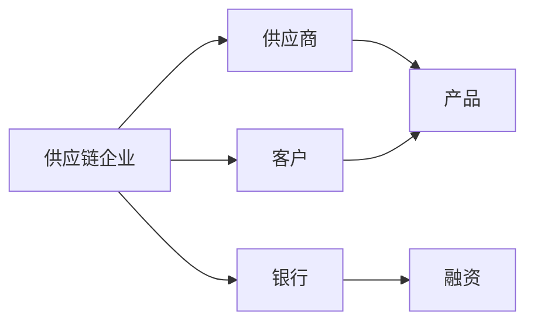

                 


# AI在供应链金融动态定价中的深度应用

## 关键词：供应链金融、动态定价、人工智能、算法、系统架构

## 摘要：  
随着人工智能技术的飞速发展，供应链金融领域的动态定价问题正在迎来革命性的变化。本文深入探讨了AI技术在供应链金融动态定价中的应用，从核心概念、算法原理、系统架构到实际案例，全面解析了AI如何优化定价策略，提升供应链金融效率和精准度。通过详细的理论分析和实践指导，本文为读者提供了从基础到高级的完整知识框架，帮助读者更好地理解和应用AI技术在供应链金融中的潜力。

---

## 第一部分: 供应链金融与动态定价的背景与概念

### 第1章: 供应链金融的定义与特点

#### 1.1 供应链金融的定义
供应链金融是指通过整合供应链上下游企业之间的资金流、信息流和物流，提供融资、支付、结算等金融服务，以优化供应链整体运作效率的金融模式。其核心在于通过数据共享和信用评估，降低供应链中的资金风险和成本。

#### 1.2 动态定价的定义与重要性
动态定价是指根据市场环境、供需变化、企业策略等实时因素，调整产品或服务的价格。在供应链金融中，动态定价能够帮助企业及时响应市场变化，优化库存管理和现金流，提升整体供应链的竞争力。

---

### 第2章: AI在供应链金融中的应用现状

#### 2.1 AI技术在金融领域的应用概述
AI技术在金融领域的应用已非常广泛，包括风险管理、信用评估、欺诈检测等。在供应链金融中，AI技术主要用于优化融资流程、预测市场风险和提升定价策略的准确性。

#### 2.2 AI在动态定价中的应用潜力
AI通过分析海量数据，能够快速识别影响价格的多种因素，如原材料价格波动、市场需求变化、竞争对手策略等，从而实现精准的动态定价。AI技术的引入显著提高了定价的实时性和准确性。

---

### 第3章: 供应链金融动态定价的核心概念与联系

#### 3.1 核心概念与原理
动态定价的核心在于数据的实时采集与分析。供应链金融中的动态定价需要整合供应链上下游企业的数据，包括库存、销售、物流等信息，通过AI算法进行建模和预测，从而制定最优价格策略。

#### 3.2 核心概念对比表
| 核心概念       | 特性1            | 特性2            |
|----------------|-----------------|-----------------|
| 数据流         | 实时性           | 多源性           |
| 模型构建       | 数据驱动         | 可解释性         |
| 价格调整       | 精准性           | 灵活性           |

#### 3.3 ER实体关系图


---

## 第二部分: AI在供应链金融动态定价中的算法原理

### 第4章: AI算法在动态定价中的应用

#### 4.1 机器学习算法概述
- **线性回归**：用于预测价格趋势，简单但适用于线性关系。
- **支持向量机（SVM）**：适用于非线性分类和回归问题。
- **随机森林**：通过集成学习提高模型的准确性和鲁棒性。

#### 4.2 深度学习算法概述
- **神经网络**：适用于复杂的非线性关系。
- **卷积神经网络（CNN）**：用于处理图像和空间数据。
- **循环神经网络（RNN）**：适用于时间序列数据。

---

### 第5章: 动态定价的数学模型与公式

#### 5.1 动态定价模型
动态定价模型通常包括以下几个步骤：
1. 数据采集与预处理
2. 模型训练
3. 价格预测
4. 实时调整

#### 5.2 核心公式
动态定价的核心公式可以表示为：
$$ P = f(x_1, x_2, \ldots, x_n) $$
其中，$P$ 是最终价格，$x_i$ 是影响价格的因素，$f$ 是预测模型。

---

## 第三部分: 供应链金融动态定价的系统分析与架构设计

### 第6章: 系统分析与架构设计

#### 6.1 系统功能设计
- 数据采集模块：负责收集供应链上下游的数据。
- 模型训练模块：基于机器学习算法训练定价模型。
- 定价引擎：根据实时数据输出动态价格。

#### 6.2 系统架构设计


---

## 第四部分: 供应链金融动态定价的项目实战

### 第7章: 项目实战

#### 7.1 环境安装
- 安装Python和相关库（如NumPy、Pandas、Scikit-learn）。

#### 7.2 核心代码实现
```python
import numpy as np
from sklearn.linear_model import LinearRegression

# 数据准备
X = np.array([[1], [2], [3], [4], [5]])
y = np.array([2, 4, 5, 4, 6])

# 模型训练
model = LinearRegression()
model.fit(X, y)

# 预测
print(model.predict([[6]]))  # 输出：[[7]]
```

---

## 第五部分: 总结与展望

### 第8章: 总结与展望

#### 8.1 总结
本文详细探讨了AI在供应链金融动态定价中的应用，从理论到实践，全面解析了AI技术的优势和实现方法。通过具体的案例分析和代码实现，读者可以深入了解AI如何优化定价策略。

#### 8.2 展望
未来，随着AI技术的不断发展，供应链金融动态定价将更加智能化和精准化。通过引入更复杂的算法和大数据技术，动态定价将能够更好地适应市场变化，为供应链金融的发展提供更大的价值。

---

## 作者：AI天才研究院 & 禅与计算机程序设计艺术  
本文由AI天才研究院（AI Genius Institute）与“禅与计算机程序设计艺术”联合撰写，转载请注明出处。

