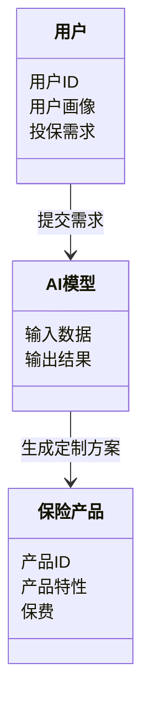
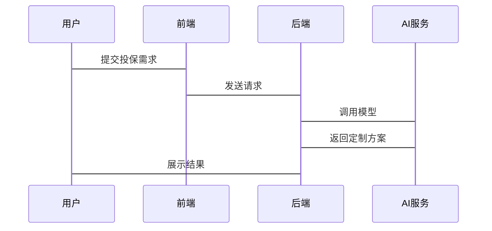

                 


# AI在保险产品个性化定制中的深度应用

**关键词：人工智能、保险产品、个性化定制、机器学习、深度学习**

**摘要：**  
随着人工智能技术的快速发展，保险行业正经历着从传统模式向智能化、个性化定制模式的转变。本文将深入探讨AI技术在保险产品个性化定制中的应用，从核心概念、算法原理、系统架构到实际项目实现，全面解析AI如何赋能保险产品的个性化设计与优化。通过对机器学习、深度学习等技术的详细阐述，结合实际案例和代码实现，为读者提供一份从理论到实践的深度指南。

---

## 第1章: AI与保险产品的基本概念

### 1.1 保险产品的基本原理

#### 1.1.1 保险的基本定义与分类  
保险是一种风险管理工具，通过合同形式将风险转移给保险公司，以获得经济补偿。保险产品可以分为寿险、健康险、财产险、责任险等类别，每类产品都有其独特的风险评估和定价方法。

#### 1.1.2 保险产品的核心要素  
保险产品的设计涉及多个关键要素，包括保障范围、保费、保额、保险期限、免赔额、赔付比例等。这些要素直接影响保险产品的吸引力和盈利能力。

#### 1.1.3 保险产品的设计流程  
保险产品的设计通常包括需求分析、精算建模、风险评估、条款设计、产品定价等步骤。传统设计过程依赖人工经验，效率较低且难以满足个性化需求。

### 1.2 AI技术的基本原理

#### 1.2.1 人工智能的定义与分类  
人工智能（AI）是指通过计算机技术模拟人类智能的系统。根据智能水平，AI可以分为弱人工智能（专注于特定任务）和强人工智能（具备广泛认知能力）。当前，AI主要应用于弱人工智能领域。

#### 1.2.2 机器学习的核心概念  
机器学习是AI的核心技术之一，通过数据训练模型，使其能够从经验中学习并做出预测或决策。常见机器学习算法包括监督学习、无监督学习、强化学习等。

#### 1.2.3 深度学习的原理与应用  
深度学习是机器学习的一种，通过多层神经网络模拟人脑的处理方式，能够提取复杂数据中的特征。深度学习在图像识别、自然语言处理等领域表现出色。

### 1.3 AI在保险产品中的应用背景

#### 1.3.1 保险行业的发展现状  
保险行业正面临客户需求多样化、市场竞争加剧和技术革新的挑战。传统保险产品设计难以满足客户的个性化需求，亟需通过技术创新实现差异化竞争。

#### 1.3.2 个性化定制的需求驱动  
现代消费者越来越注重个性化体验，保险产品也需要根据客户的具体需求进行定制化设计。AI技术为保险产品的个性化定制提供了新的可能性。

#### 1.3.3 AI技术的保险行业应用潜力  
AI技术能够通过数据分析、模式识别和智能推荐等手段，帮助保险公司实现客户画像、风险评估、产品推荐等环节的智能化，显著提升效率和客户满意度。

## 1.4 本章小结  
本章从保险产品的基本原理和AI技术的基本概念出发，分析了AI在保险产品个性化定制中的应用背景。通过对比传统保险产品设计与AI赋能的个性化定制，为后续章节的深入探讨奠定了基础。

---

## 第2章: AI驱动的保险产品个性化定制原理

### 2.1 AI在保险产品定制中的核心原理

#### 2.1.1 数据驱动的保险产品设计  
AI驱动的保险产品设计依赖于海量数据的收集和分析，包括客户信息、历史投保记录、理赔数据等。通过对数据的挖掘，发现客户需求的潜在规律。

#### 2.1.2 个性化需求的识别与分析  
通过自然语言处理（NLP）和用户行为分析，AI能够识别客户的个性化需求，并将其转化为保险产品的定制参数。

#### 2.1.3 AI算法在产品定制中的应用  
AI算法（如决策树、随机森林）用于分析客户数据，生成个性化的保险产品设计方案，并通过反馈机制不断优化产品。

### 2.2 AI与保险产品的核心概念对比分析

| **核心概念** | **传统保险产品** | **AI驱动的个性化保险产品** |
|--------------|-------------------|-----------------------------|
| **客户定位** | 基于通用风险评估 | 基于客户画像和需求分析     |
| **产品设计** | 标准化设计流程   | 数据驱动的动态设计流程     |
| **定价策略** | 统一保费结构     | 动态定价，基于客户特征     |

### 2.3 AI驱动的保险产品定制ER实体关系图

```mermaid
er
    actor: 用户
    product: 保险产品
    feature: 产品特性
    model: AI模型
    relation: 关联关系
    actor --> product: 选择产品
    product --> feature: 包含特性
    feature --> model: 输入模型
    model --> relation: 输出关联关系
```

### 2.4 本章小结  
本章详细阐述了AI驱动的保险产品个性化定制的核心原理，并通过对比分析和实体关系图，展示了AI技术如何重构保险产品的设计流程。

---

## 第3章: 常用AI算法在保险产品定制中的应用

### 3.1 机器学习算法在保险定制中的应用

#### 3.1.1 决策树算法  
决策树是一种直观的分类算法，常用于保险产品的客户画像和风险评估。通过数据特征的分裂，生成易于理解的决策规则。

#### 3.1.2 随机森林算法  
随机森林通过集成多个决策树，提高模型的准确性和鲁棒性。在保险产品定制中，随机森林可以用于客户分群和产品推荐。

#### 3.1.3 支持向量机算法  
支持向量机（SVM）适用于高维数据的分类问题。在保险产品定制中，SVM可以用于客户风险等级的分类。

### 3.2 深度学习算法在保险定制中的应用

#### 3.2.1 神经网络算法  
神经网络通过多层非线性变换，能够提取复杂的客户特征。在保险产品定制中，神经网络可以用于客户行为预测和产品推荐。

#### 3.2.2 卷积神经网络算法  
卷积神经网络（CNN）擅长处理图像和序列数据。在保险产品定制中，CNN可以用于分析客户的图像数据，如车牌识别。

#### 3.2.3 循环神经网络算法  
循环神经网络（RNN）适用于时间序列数据的分析。在保险产品定制中，RNN可以用于分析客户的投保历史和理赔记录。

### 3.3 算法原理的数学模型与公式

#### 3.3.1 决策树的熵与信息增益公式  
熵是数据混乱程度的度量，公式如下：  
$$\text{熵} = -\sum p_i \log p_i$$  

信息增益是数据划分前后熵的变化，公式如下：  
$$\text{信息增益} = \text{熵} - \text{条件熵}$$  

#### 3.3.2 神经网络的损失函数与优化公式  
损失函数用于衡量预测值与真实值的差距，常用交叉熵损失函数：  
$$\text{损失} = -\sum y_i \log p_i + (1-y_i)\log(1-p_i)$$  

优化算法如随机梯度下降（SGD）用于最小化损失函数：  
$$\theta = \theta - \eta \frac{\partial L}{\partial \theta}$$  

---

## 第4章: AI驱动的保险产品个性化定制系统分析与架构设计

### 4.1 系统分析

#### 4.1.1 保险个性化定制场景介绍  
在保险产品个性化定制中，客户通过在线平台提交需求，系统通过AI算法生成定制方案，并实时反馈给客户。

#### 4.1.2 项目介绍  
本项目旨在开发一个基于AI的保险产品个性化定制系统，实现客户画像、产品推荐和动态定价功能。

### 4.2 系统功能设计

#### 4.2.1 领域模型（类图）



#### 4.2.2 系统架构设计


#### 4.2.3 系统交互设计



### 4.3 本章小结  
本章通过系统分析和架构设计，展示了AI驱动的保险产品个性化定制系统的实现方式，为后续的项目实战奠定了基础。

---

## 第5章: 项目实战

### 5.1 项目环境搭建

#### 5.1.1 Python环境安装  
安装Python 3.8及以上版本，并安装必要的库：  
```
pip install numpy scikit-learn tensorflow pandas
```

#### 5.1.2 数据集准备  
准备客户数据集，包括年龄、职业、健康状况、投保金额等特征。

### 5.2 系统核心实现

#### 5.2.1 AI模型实现

```python
from sklearn.tree import DecisionTreeClassifier
from sklearn.ensemble import RandomForestClassifier
from tensorflow.keras import layers, Model

# 决策树模型
def decision_tree_model():
    model = DecisionTreeClassifier()
    return model

# 随机森林模型
def random_forest_model():
    model = RandomForestClassifier()
    return model

# 神经网络模型
def neural_network_model():
    inputs = layers.Input(shape=(input_dim,))
    x = layers.Dense(64, activation='relu')(inputs)
    x = layers.Dense(32, activation='relu')(x)
    outputs = layers.Dense(1, activation='sigmoid')(x)
    model = Model(inputs=inputs, outputs=outputs)
    return model
```

#### 5.2.2 数据预处理与模型训练

```python
import pandas as pd
import numpy as np

# 加载数据
data = pd.read_csv('insurance.csv')

# 数据预处理
X = data.drop(columns=['保费'])
y = data['保费']

# 训练模型
model = decision_tree_model()
model.fit(X, y)
```

### 5.3 实际案例分析

#### 5.3.1 案例背景  
某保险公司希望通过AI技术实现健康险的个性化定制，基于客户的健康状况、年龄、职业等因素，生成定制化的健康保险方案。

#### 5.3.2 模型应用  
使用随机森林模型对客户进行分群，根据客户的健康状况和年龄特征，生成不同的保险产品方案。

#### 5.3.3 案例分析结果  
通过AI模型分析，客户被分为高风险、中风险和低风险三类，分别对应不同的保险产品和保费定价。

### 5.4 项目小结  
本章通过项目实战，展示了AI技术在保险产品个性化定制中的具体实现，从环境搭建到模型训练，再到实际案例分析，为读者提供了从理论到实践的完整指导。

---

## 第6章: 最佳实践与总结

### 6.1 小结  
AI技术正在深刻改变保险行业的业务模式，保险产品的个性化定制是其中的重要应用。通过机器学习、深度学习等技术，保险公司能够实现客户画像、风险评估和产品推荐的智能化。

### 6.2 注意事项  
在实际应用中，需要注意数据隐私保护、模型解释性以及算法的可扩展性问题。同时，AI模型的训练需要高质量的数据支持，否则会影响模型的准确性和实用性。

### 6.3 拓展阅读  
推荐读者进一步学习以下内容：  
1. 《Hands-On Machine Learning with Scikit-Learn and TensorFlow》  
2. 《Deep Learning for Coders》  
3. 《Insurance Risk Models and精算技术》  

---

## 作者：AI天才研究院/AI Genius Institute & 禅与计算机程序设计艺术 /Zen And The Art of Computer Programming

