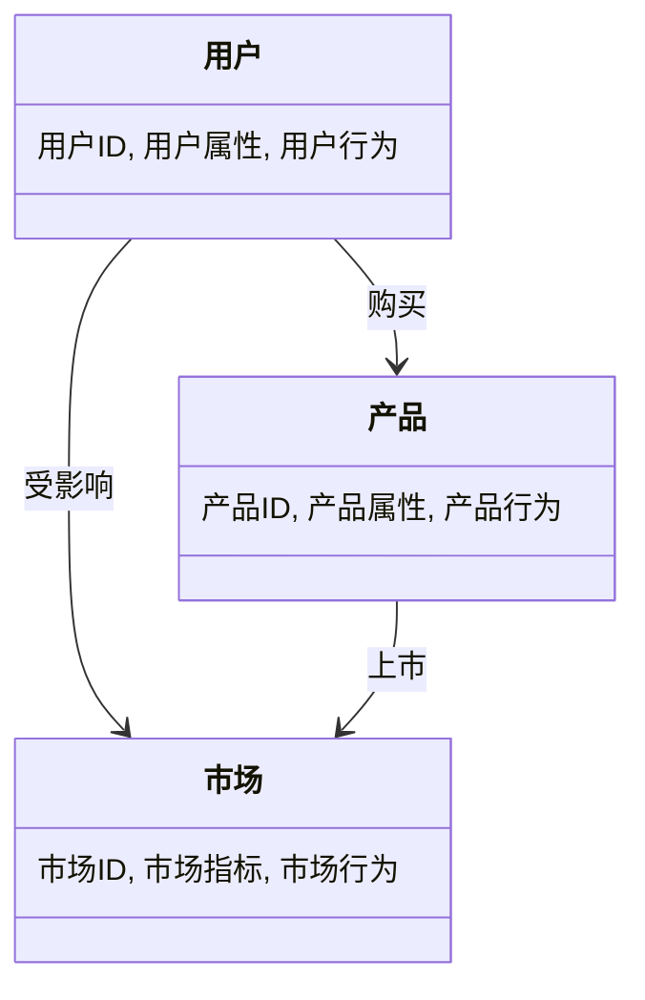
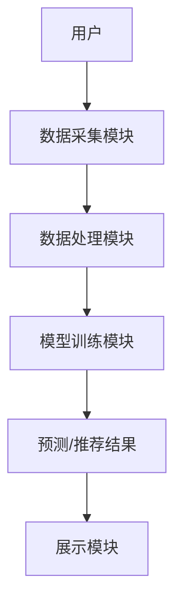

                 


好的，我将按照您的要求，逐步构建这篇技术博客文章的目录大纲。为了让内容更加丰富，我将先列出各个部分的主要内容和结构，然后再开始详细撰写。

# 目录大纲

# 《AI在保险产品需求预测与个性化推荐中的深度应用》

> 关键词：保险产品需求预测、个性化推荐、人工智能、机器学习、深度学习

> 摘要：本文探讨了人工智能技术在保险产品需求预测和个性化推荐中的应用，分析了传统方法的局限性，详细介绍了基于机器学习和深度学习的预测模型和推荐系统，结合实际案例展示了如何通过AI技术提升保险产品的精准需求预测和个性化推荐能力，为保险行业的数字化转型提供了新的思路和解决方案。

---

# 第1章: 保险行业与AI技术的结合

## 1.1 保险行业的现状与挑战

### 1.1.1 保险行业的基本概念与业务模式

- 保险的基本概念与分类
- 保险行业的主要业务模式（寿险、产险、健康险等）
- 保险行业面临的数字化转型需求

### 1.1.2 保险行业面临的主要问题与痛点

- 传统保险产品设计的局限性
- 客户需求预测的不准确性
- 个性化推荐的效率低下
- 数据孤岛与信息不透明的问题

### 1.1.3 AI技术如何解决保险行业的难题

- AI在保险产品设计中的应用
- AI在客户需求预测中的优势
- AI在个性化推荐中的潜力

## 1.2 AI技术在保险行业的应用背景

### 1.2.1 AI技术的发展历程与现状

- 人工智能技术的演进历程
- 当前AI技术在各行业的应用现状
- 保险行业AI应用的独特性

### 1.2.2 保险行业数字化转型的需求

- 数字化转型的必要性与目标
- AI技术在保险数字化转型中的作用
- 保险行业对AI技术的需求分析

### 1.2.3 AI在保险产品需求预测与推荐中的应用前景

- AI在保险产品需求预测中的潜力
- AI在个性化推荐中的应用前景
- 保险行业AI应用的未来趋势

## 1.3 保险产品需求预测与个性化推荐的核心概念

### 1.3.1 需求预测的基本概念与方法

- 需求预测的定义与作用
- 传统需求预测的方法（时间序列分析、回归分析等）
- AI技术在需求预测中的应用

### 1.3.2 个性化推荐的基本概念与方法

- 个性化推荐的定义与作用
- 传统推荐系统的方法（基于内容的推荐、协同过滤推荐等）
- AI技术在个性化推荐中的应用

### 1.3.3 需求预测与个性化推荐的联系与区别

- 需求预测与个性化推荐的联系
- 需求预测与个性化推荐的区别
- 两者的协同应用策略

## 1.4 本章小结

---

# 第2章: 保险产品需求预测的核心原理

## 2.1 需求预测的原理与方法

### 2.1.1 需求预测的基本原理

- 需求预测的基本原理
- 影响保险产品需求的主要因素（客户行为、市场环境、产品特性等）

### 2.1.2 常见的需求预测方法

- 传统需求预测方法（时间序列分析、回归分析等）
- 各种方法的优缺点对比
- 适用场景分析

## 2.2 基于AI的需求预测模型

### 2.2.1 机器学习在需求预测中的应用

- 机器学习的基本概念与分类
- 常见的机器学习算法在需求预测中的应用（线性回归、决策树、随机森林等）
- 各种算法的优缺点对比

### 2.2.2 深度学习在需求预测中的应用

- 深度学习的基本概念与分类
- 常见的深度学习算法在需求预测中的应用（RNN、LSTM、CNN等）
- 各种算法的优缺点对比

### 2.2.3 混合模型的应用

- 混合模型的基本概念
- 混合模型在需求预测中的优势
- 混合模型的实际应用案例

## 2.3 需求预测的特征工程与数据处理

### 2.3.1 数据清洗与预处理

- 数据清洗的基本步骤
- 数据预处理的技术与方法
- 数据特征的选择与提取

### 2.3.2 特征提取与选择

- 特征提取的基本原理
- 常见的特征选择方法（基于统计、基于模型、基于树的方法）
- 各种方法的优缺点对比

### 2.3.3 时间序列数据的特殊处理

- 时间序列数据的特性与处理方法
- 常见的时间序列模型（ARIMA、Prophet等）
- 各种模型的优缺点对比

## 2.4 本章小结

---

# 第3章: 保险产品个性化推荐的核心原理

## 3.1 个性化推荐的基本原理

### 3.1.1 推荐系统的分类

- 基于内容的推荐
- 基于协同过滤的推荐
- 基于混合模型的推荐
- 基于知识图谱的推荐

### 3.1.2 基于用户行为的推荐原理

- 用户行为分析的基本方法
- 基于用户行为的推荐模型
- 各种模型的优缺点对比

### 3.1.3 基于物品特性的推荐原理

- 物品特性分析的基本方法
- 基于物品特性的推荐模型
- 各种模型的优缺点对比

## 3.2 基于机器学习的个性化推荐模型

### 3.2.1 机器学习在个性化推荐中的应用

- 机器学习的基本概念与分类
- 常见的机器学习算法在个性化推荐中的应用（线性回归、决策树、随机森林等）
- 各种算法的优缺点对比

### 3.2.2 深度学习在个性化推荐中的应用

- 深度学习的基本概念与分类
- 常见的深度学习算法在个性化推荐中的应用（RNN、LSTM、CNN等）
- 各种算法的优缺点对比

### 3.2.3 混合模型的应用

- 混合模型的基本概念
- 混合模型在个性化推荐中的优势
- 混合模型的实际应用案例

## 3.3 个性化推荐的特征工程与数据处理

### 3.3.1 数据清洗与预处理

- 数据清洗的基本步骤
- 数据预处理的技术与方法
- 数据特征的选择与提取

### 3.3.2 特征提取与选择

- 特征提取的基本原理
- 常见的特征选择方法（基于统计、基于模型、基于树的方法）
- 各种方法的优缺点对比

### 3.3.3 用户行为数据的特殊处理

- 用户行为数据的特性与处理方法
- 常见的用户行为模型（马可夫链、隐马尔可夫模型等）
- 各种模型的优缺点对比

## 3.4 本章小结

---

# 第4章: AI在保险产品需求预测与推荐中的算法原理

## 4.1 常见算法概述

### 4.1.1 线性回归

- 线性回归的基本原理
- 线性回归的数学模型与公式
- 线性回归的优缺点

### 4.1.2 决策树

- 决策树的基本原理
- 决策树的数学模型与公式
- 决策树的优缺点

### 4.1.3 随机森林

- 随机森林的基本原理
- 随机森林的数学模型与公式
- 随机森林的优缺点

### 4.1.4 支持向量机

- 支持向量机的基本原理
- 支持向量机的数学模型与公式
- 支持向量机的优缺点

### 4.1.5 神经网络

- 神经网络的基本原理
- 神经网络的数学模型与公式
- 神经网络的优缺点

## 4.2 算法的数学模型与公式

### 4.2.1 线性回归的数学模型

$$ y = \beta_0 + \beta_1 x + \epsilon $$

### 4.2.2 决策树的数学模型

- ID3算法的信息增益公式：
$$ \text{信息增益} = \text{熵}(D) - \sum_{v} \text{熵}(D_v) $$

- C4.5算法的信息增益率公式：
$$ \text{信息增益率} = \frac{\text{信息增益}(D, a)}{\text{熵}(a)} $$

### 4.2.3 随机森林的数学模型

- 随机森林的投票机制：
$$ \text{最终预测结果} = \text{多数投票结果} $$

### 4.2.4 支持向量机的数学模型

$$ \text{最大化} \quad \frac{1}{2} \|w\|^2 $$
$$ \text{满足} \quad y_i (w \cdot x_i + b) \geq 1 $$

### 4.2.5 神经网络的数学模型

- 前向神经网络的激活函数：
$$ a = \sigma(w x + b) $$
$$ \sigma \text{可以是Sigmoid、ReLU、Tanh等} $$

## 4.3 算法的优缺点对比

### 4.3.1 线性回归

- 优点：简单、易于解释、计算效率高
- 缺点：只能处理线性关系、对异常值敏感

### 4.3.2 决策树

- 优点：易于解释、能够处理非线性关系、鲁棒性好
- 缺点：容易过拟合、计算复杂度高

### 4.3.3 随机森林

- 优点：集成方法、抗过拟合、鲁棒性好
- 缺点：计算复杂度高、需要较多计算资源

### 4.3.4 支持向量机

- 优点：适用于小样本数据、高维数据、鲁棒性好
- 缺点：计算复杂度高、需要参数调整

### 4.3.5 神经网络

- 优点：能够处理复杂非线性关系、表达能力强
- 缺点：计算复杂度高、需要大量数据、容易过拟合

## 4.4 本章小结

---

# 第5章: 保险产品需求预测与个性化推荐的系统分析与架构设计

## 5.1 问题场景介绍

### 5.1.1 保险产品需求预测的场景

- 保险产品的市场分析
- 客户需求预测的场景
- 市场趋势分析的场景

### 5.1.2 个性化推荐的场景

- 客户画像分析
- 产品推荐策略
- 个性化服务推荐

## 5.2 系统功能设计

### 5.2.1 领域模型设计



### 5.2.2 系统架构设计



### 5.2.3 系统接口设计

- API接口设计
- 接口调用流程

### 5.2.4 系统交互设计

```mermaid
sequenceDiagram
    用户 -> 数据采集模块: 提交请求
    数据采集模块 -> 数据处理模块: 发送数据
    数据处理模块 -> 模型训练模块: 发送处理后的数据
    模型训练模块 -> 预测/推荐结果
    预测/推荐结果 -> 展示模块: 显示结果
```

## 5.3 本章小结

---

# 第6章: 保险产品需求预测与个性化推荐的项目实战

## 6.1 环境安装与配置

### 6.1.1 Python环境的安装与配置

- 安装Python
- 安装必要的库（NumPy、Pandas、Scikit-learn、TensorFlow、Keras等）

### 6.1.2 数据集的获取与预处理

- 数据集的获取渠道
- 数据清洗与预处理的步骤
- 数据集的特征工程

## 6.2 系统核心实现源代码

### 6.2.1 需求预测模型的实现

```python
import numpy as np
import pandas as pd
from sklearn.linear_model import LinearRegression
from sklearn.tree import DecisionTreeRegressor
from sklearn.ensemble import RandomForestRegressor
from sklearn.svm import SVR
from sklearn.neural_networks import MLPRegressor

# 数据加载
data = pd.read_csv('insurance_data.csv')
X = data[['age', 'sex', 'bmi', 'children', 'smoker', 'region']]
y = data['charges']

# 模型训练
models = {
    'Linear Regression': LinearRegression(),
    'Decision Tree': DecisionTreeRegressor(),
    'Random Forest': RandomForestRegressor(),
    'SVM': SVR(),
    'Neural Network': MLPRegressor()
}

for name, model in models.items():
    model.fit(X, y)
    print(f"{name} trained successfully")
```

### 6.2.2 个性化推荐系统的实现

```python
import numpy as np
import pandas as pd
from sklearn.metrics.pairwise import cosine_similarity
from sklearn.decomposition import TruncatedSVD

# 数据加载
products = pd.read_csv('insurance_products.csv')
user_data = pd.read_csv('user_profiles.csv')

# 特征提取
product_features = products[['feature1', 'feature2', 'feature3']]
user_features = user_data[['preference1', 'preference2', 'preference3']]

# 推荐算法实现
def recommend_products(users, products, user_features, product_features):
    # 计算相似度
    similarity_matrix = cosine_similarity(user_features, product_features)
    # 找出相似度最高的产品
    top_recommendations = np.argsort(similarity_matrix, axis=1)[:, ::-1]
    return top_recommendations

recommendations = recommend_products(users, products, user_features, product_features)
print("推荐结果:", recommendations)
```

## 6.3 代码应用解读与分析

### 6.3.1 需求预测模型的实现解读

- 线性回归模型的训练与预测
- 决策树模型的训练与预测
- 随机森林模型的训练与预测
- SVM模型的训练与预测
- 神经网络模型的训练与预测

### 6.3.2 个性化推荐系统的实现解读

- 数据预处理与特征提取
- 相似度计算与推荐结果生成
- 推荐结果的展示与分析

## 6.4 实际案例分析

### 6.4.1 需求预测案例分析

- 某保险产品的市场需求预测案例
- 数据分析与模型训练
- 预测结果与实际需求对比分析

### 6.4.2 个性化推荐案例分析

- 某类客户群体的保险产品推荐案例
- 推荐结果的分析与优化
- 推荐系统的实际应用效果评估

## 6.5 项目小结

---

# 第7章: 最佳实践、小结与注意事项

## 7.1 最佳实践

### 7.1.1 数据质量的重要性

- 数据清洗与预处理的注意事项
- 数据特征的选择与提取的技巧
- 数据安全与隐私保护的措施

### 7.1.2 模型调优的技巧

- 参数调优的方法
- 模型评估与验证的技巧
- 模型部署与监控的注意事项

### 7.1.3 推荐系统优化的策略

- 混合推荐模型的应用策略
- 用户行为分析与推荐策略的优化
- 推荐结果的实时更新与维护

## 7.2 小结

### 7.2.1 保险产品需求预测的核心要点

- 数据特征的选择与提取
- 算法模型的合理选择与优化
- 模型部署与监控的注意事项

### 7.2.2 个性化推荐系统的核心要点

- 用户行为分析与建模
- 推荐算法的合理选择与优化
- 推荐结果的实时更新与维护

## 7.3 注意事项

### 7.3.1 数据安全与隐私保护

- 数据加密与匿名化处理
- 权限控制与访问控制
- 数据备份与恢复策略

### 7.3.2 模型部署与维护

- 模型的实时更新与维护
- 模型的可解释性与可扩展性
- 模型的性能监控与优化

### 7.3.3 伦理与合规性

- 遵守相关法律法规
- 遵守行业规范与伦理标准
- 避免算法歧视与偏见

## 7.4 拓展阅读

### 7.4.1 推荐的书籍与文章

- 推荐的经典机器学习与深度学习书籍
- 推荐的保险行业与AI技术结合的学术论文
- 推荐的行业报告与技术白皮书

### 7.4.2 学习资源与工具

- 常用的数据分析工具（Python、R、SQL等）
- 常用的机器学习框架（Scikit-learn、TensorFlow、PyTorch等）
- 在线课程与技术社区推荐

---

# 作者：AI天才研究院/AI Genius Institute & 禅与计算机程序设计艺术/Zen And The Art of Computer Programming

---

以上是《AI在保险产品需求预测与个性化推荐中的深度应用》的技术博客文章的目录大纲。根据这个大纲，我可以开始撰写具体章节的内容，确保每一部分都详细展开，内容丰富，结构清晰，语言专业。

