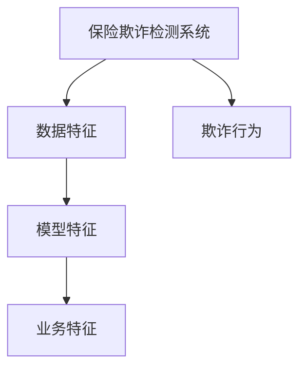
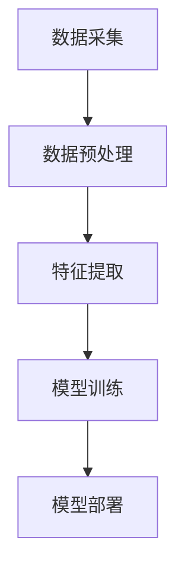

                 

# AI在保险理赔欺诈检测中的深度应用

## 关键词：
保险理赔、欺诈检测、人工智能、机器学习、深度学习、自然语言处理

## 摘要：
随着保险行业的快速发展，保险欺诈问题日益严重，传统的欺诈检测方法逐渐暴露出效率低下、准确性不足等局限性。基于人工智能（AI）的保险欺诈检测技术，凭借其强大的数据处理能力和智能学习能力，正在成为保险行业的关键技术之一。本文将从保险行业的背景出发，详细探讨AI在保险理赔欺诈检测中的核心概念、技术原理、系统设计和实际应用。通过分析各种算法的优缺点，结合实际案例，为保险行业提供一种高效、精准的欺诈检测解决方案。

---

## 目录大纲：

### 第1章: 保险行业的现状与欺诈问题
1.1 保险行业的基本概念与运作模式  
1.2 保险欺诈的现状与挑战  
1.3 保险欺诈检测的痛点与需求  

### 第2章: AI在保险欺诈检测中的核心概念与技术框架  
2.1 保险欺诈检测的基本概念与流程  
2.2 AI技术在保险欺诈检测中的应用  
2.3 保险欺诈检测的核心要素与概念结构  
2.4 保险欺诈检测的技术架构与框架图  

### 第3章: 基于AI的保险欺诈检测算法原理  
3.1 常用AI算法在保险欺诈检测中的应用  
3.2 逻辑回归算法原理与实现  
3.3 支持向量机（SVM）算法原理与实现  
3.4 随机森林算法原理与实现  
3.5 神经网络算法原理与实现  
3.6 基于深度学习的保险欺诈检测模型  

### 第4章: 保险欺诈检测系统的分析与设计  
4.1 保险欺诈检测系统的需求分析  
4.2 系统的总体架构设计  
4.3 系统的功能模块设计  
4.4 系统的数据流图与交互设计  

### 第5章: 保险欺诈检测项目的实战与实现  
5.1 项目背景与目标  
5.2 数据采集与预处理  
5.3 特征工程与模型训练  
5.4 模型调优与部署  
5.5 项目成果与案例分析  

### 第6章: 总结与展望  
6.1 本章总结  
6.2 对未来的展望  

---

## 第1章: 保险行业的现状与欺诈问题

### 1.1 保险行业的基本概念与运作模式
保险行业是金融体系的重要组成部分，通过分散风险为个人和企业提供保障。保险的基本原理是基于概率和大数法则，通过收取保费来覆盖可能发生的理赔支出。保险的种类繁多，包括人寿保险、财产保险、健康保险等。保险的理赔流程通常包括报案、审核、调查和赔付等环节。

保险行业的数字化转型正在加速，保险公司通过大数据、云计算和人工智能等技术提升运营效率和服务质量。然而，数字化也带来了新的挑战，尤其是在保险欺诈方面。

### 1.2 保险欺诈的现状与挑战
保险欺诈是指故意提供虚假信息或制造假象以获得不当保险赔偿的行为。常见的保险欺诈手段包括虚构保险事故、夸大损失金额、伪造理赔证据等。保险欺诈不仅导致保险公司蒙受经济损失，还增加了保费负担，影响了整个保险行业的健康发展。

随着保险业务的复杂化，传统的保险欺诈检测方法逐渐暴露出以下问题：
1. **效率低下**：基于规则的检测方法依赖人工经验，难以快速处理大量数据。
2. **准确性不足**：传统方法难以捕捉复杂的数据模式，容易漏检或误检。
3. **成本高昂**：需要大量的人力和时间来分析和处理欺诈行为。

### 1.3 保险欺诈检测的痛点与需求
保险行业对欺诈检测的需求日益迫切。传统的基于规则的检测方法已经无法应对日益复杂的欺诈手段，保险公司需要一种更高效、更准确的检测方法。

人工智能技术的快速发展为保险欺诈检测提供了新的解决方案。AI技术能够快速处理大量数据，识别隐藏的模式和异常行为，从而提高欺诈检测的准确性和效率。

---

## 第2章: AI在保险欺诈检测中的核心概念与技术框架

### 2.1 保险欺诈检测的基本概念与流程
保险欺诈检测的核心目标是通过分析保险数据，识别潜在的欺诈行为。欺诈检测的基本流程包括数据采集、数据预处理、特征提取、模型训练和结果分析。

### 2.2 AI技术在保险欺诈检测中的应用
人工智能技术在保险欺诈检测中的应用主要体现在以下几个方面：
1. **机器学习**：通过训练模型识别欺诈模式。
2. **深度学习**：利用神经网络处理复杂的非结构化数据。
3. **自然语言处理（NLP）**：分析文本数据以识别欺诈行为。

### 2.3 保险欺诈检测的核心要素与概念结构
保险欺诈检测的核心要素包括：
1. **数据特征**：如时间、地点、金额、行为模式等。
2. **模型特征**：如分类、回归、聚类等。
3. **业务特征**：如保单类型、理赔金额、历史记录等。

概念结构图如下：

### 2.4 保险欺诈检测的技术架构与框架图
保险欺诈检测的技术架构通常包括数据采集、数据预处理、特征提取、模型训练和模型部署等模块。架构图如下：

---

## 第3章: 基于AI的保险欺诈检测算法原理

### 3.1 常用AI算法在保险欺诈检测中的应用
常用的AI算法包括逻辑回归、支持向量机（SVM）、随机森林和神经网络等。

### 3.2 逻辑回归算法原理与实现
逻辑回归是一种常用的分类算法，其原理是通过 sigmoid 函数将线性回归的结果映射到概率空间。数学公式如下：
$$ P(y=1|x) = \frac{e^{\beta x}}{1 + e^{\beta x}} $$

### 3.3 支持向量机（SVM）算法原理与实现
SVM 是一种基于统计学习理论的分类算法，通过构建超平面将数据分为两类。数学公式如下：
$$ \text{max} \quad \frac{1}{2} \|w\|^2 $$
$$ \text{subject to} \quad y_i(w \cdot x_i + b) \geq 1 $$

### 3.4 随机森林算法原理与实现
随机森林是一种基于决策树的集成学习算法，通过随机采样和特征选择提高模型的泛化能力。

### 3.5 神经网络算法原理与实现
神经网络是一种模拟人脑结构的算法，通过多层感知机实现复杂的非线性分类。数学公式如下：
$$ y = \sigma(w x + b) $$

### 3.6 基于深度学习的保险欺诈检测模型
深度学习模型如卷积神经网络（CNN）和长短期记忆网络（LSTM）在处理复杂数据时表现出色。

---

## 第4章: 保险欺诈检测系统的分析与设计

### 4.1 保险欺诈检测系统的需求分析
系统需求包括高准确性、高效率和易用性。

### 4.2 系统的总体架构设计
系统架构通常包括数据采集模块、数据预处理模块、特征提取模块、模型训练模块和结果分析模块。

### 4.3 系统的功能模块设计
功能模块包括数据管理、模型训练、欺诈检测和结果展示。

### 4.4 系统的数据流图与交互设计
数据流图展示了系统中数据的流动和处理过程。

---

## 第5章: 保险欺诈检测项目的实战与实现

### 5.1 项目背景与目标
项目目标是构建一个高效的保险欺诈检测系统。

### 5.2 数据采集与预处理
数据采集包括内部数据和外部数据，预处理步骤包括数据清洗和特征工程。

### 5.3 特征工程与模型训练
特征工程包括特征选择和特征提取，模型训练包括训练和验证。

### 5.4 模型调优与部署
模型调优包括参数优化和模型选择，部署包括在线服务和结果分析。

### 5.5 项目成果与案例分析
通过实际案例分析验证系统的有效性。

---

## 第6章: 总结与展望

### 6.1 本章总结
本文详细探讨了AI在保险欺诈检测中的应用，分析了各种算法的优缺点，并提出了系统的解决方案。

### 6.2 对未来的展望
未来，随着AI技术的不断发展，保险欺诈检测将更加智能化和精准化。

---

## 作者：AI天才研究院/AI Genius Institute & 禅与计算机程序设计艺术 /Zen And The Art of Computer Programming

---

接下来，我将根据上述目录大纲，逐步展开每一部分的具体内容，确保文章的深度和专业性，同时保持逻辑清晰和结构紧凑。

