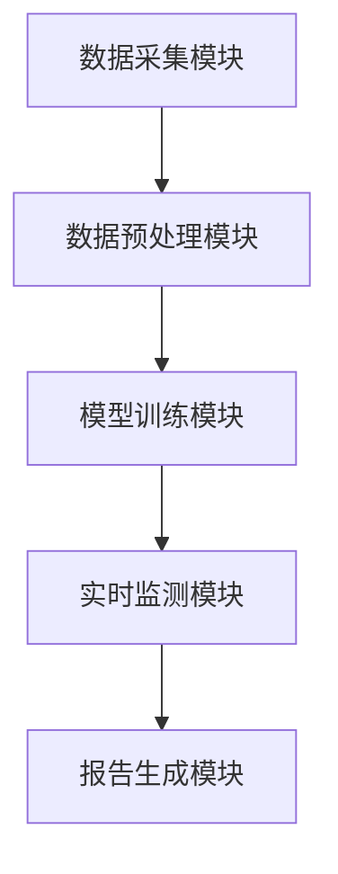
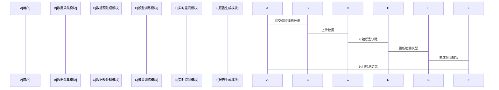

                 


# AI在保险理赔欺诈模式演化检测中的创新应用

## 关键词：保险欺诈检测, 模式演化, 人工智能, 深度学习, 时间序列分析

## 摘要：  
保险行业的欺诈问题日益严重，传统的欺诈检测方法难以应对不断演化的欺诈模式。本文通过引入人工智能技术，特别是深度学习和时间序列分析，提出了一种创新的保险理赔欺诈模式演化检测方法。该方法结合了模式识别、序列建模和图论等技术，能够有效识别和预测保险理赔中的欺诈行为。文章详细阐述了欺诈模式的定义与分类、演化检测的核心算法、系统架构设计以及实际案例分析，为保险行业的反欺诈工作提供了新的思路和技术支持。

---

# 第1章: 保险行业的现状与欺诈问题

## 1.1 保险行业的基本概述

### 1.1.1 保险行业的定义与分类  
保险是一种以风险为核心业务的金融活动，通过分散风险来保障个人或企业的财产和利益。保险行业可以分为寿险、财险、健康险等主要类别。  

### 1.1.2 保险行业的核心业务流程  
保险行业的核心业务流程包括承保、理赔、再保险和风险管理。理赔是保险业务中最重要的环节之一，也是欺诈行为的高发区。  

### 1.1.3 保险行业的数字化发展趋势  
随着大数据和人工智能技术的发展，保险行业正在加速数字化转型。通过数字化技术，保险公司能够更高效地进行风险评估、理赔处理和客户服务。

---

## 1.2 保险理赔中的欺诈问题

### 1.2.1 保险欺诈的定义与特征  
保险欺诈是指通过故意制造虚假的保险事件或夸大保险损失，以骗取保险赔偿的行为。其主要特征包括隐蔽性、复杂性和动态性。  

### 1.2.2 保险欺诈的主要类型  
保险欺诈可以分为恶意欺诈和善意欺诈。恶意欺诈是指故意制造保险事件骗取赔款，而善意欺诈则是指投保人或被保险人夸大损失以获得更多的赔偿。  

### 1.2.3 保险欺诈对行业的影响  
保险欺诈不仅增加了保险公司的赔付成本，还可能导致保险费率的上升，进而影响保险市场的健康发展。此外，欺诈行为还可能损害保险公司的声誉，降低客户信任度。

---

## 1.3 保险欺诈模式的演化趋势

### 1.3.1 传统保险欺诈的特点  
传统的保险欺诈行为通常较为简单，例如伪造事故现场或夸大损失金额。这些行为具有较强的可识别性，但随着技术的进步，欺诈手段也在不断升级。  

### 1.3.2 现代保险欺诈的复杂性  
现代保险欺诈行为更加隐蔽和复杂，例如利用保险条款漏洞、虚构保险事件或利用技术手段伪造证据。欺诈者通常会通过多次小额索赔来规避传统的检测方法。  

### 1.3.3 保险欺诈模式的动态变化  
保险欺诈模式的动态变化主要体现在欺诈手段的多样化和复杂化。例如，欺诈者可能会利用大数据和人工智能技术来掩盖其行为，使得传统的检测方法难以发现。

---

## 1.4 AI在保险欺诈检测中的应用背景

### 1.4.1 传统保险欺诈检测的局限性  
传统的保险欺诈检测方法主要依赖于规则和经验判断，具有以下局限性：  
1. **规则的静态性**：传统规则难以应对欺诈模式的动态变化。  
2. **效率低下**：人工审核耗时耗力，难以应对海量的理赔数据。  
3. **漏检与误检**：由于规则的复杂性和数据的多样性，传统方法容易出现漏检或误检。  

### 1.4.2 AI技术在保险行业的潜力  
人工智能技术，特别是机器学习和深度学习，具有以下优势：  
1. **数据驱动**：AI能够从海量数据中提取特征，发现隐藏的模式。  
2. **动态适应性**：AI模型能够实时更新，适应欺诈模式的动态变化。  
3. **高效性**：AI技术能够快速处理大量数据，提高欺诈检测的效率。  

### 1.4.3 保险欺诈模式演化检测的核心问题  
保险欺诈模式演化检测的核心问题是如何通过AI技术，实时发现和预测欺诈行为，同时能够适应欺诈模式的动态变化。这需要结合时间序列分析、深度学习和图论等技术，构建一个动态、自适应的检测系统。

---

# 第2章: 保险欺诈模式演化检测的核心概念

## 2.1 保险欺诈模式的定义与分类

### 2.1.1 保险欺诈模式的定义  
保险欺诈模式是指欺诈者在保险理赔过程中采取的一系列行为模式，这些行为模式可以通过数据特征和时间序列分析来识别。

### 2.1.2 保险欺诈模式的主要分类  
保险欺诈模式可以分为以下几类：  
1. **单一事件模式**：欺诈行为只涉及一个保险事件。  
2. **系列事件模式**：欺诈行为涉及多个相关联的保险事件。  
3. **群体事件模式**：欺诈行为涉及多个投保人或被保险人，具有明显的协同性。  

### 2.1.3 各类保险欺诈模式的特征对比  
以下是各类保险欺诈模式的特征对比：  

| 模式类型       | 特征描述                                                                 |
|----------------|--------------------------------------------------------------------------|
| 单一事件模式   | 次数少，但金额较大，行为特征明显。                                         |
| 系列事件模式   | 次数多，金额较小，行为模式具有关联性。                                     |
| 群体事件模式   | 涉及多个投保人，行为模式具有协同性，可能涉及内外勾结。                     |

---

## 2.2 保险欺诈模式演化检测的基本原理

### 2.2.1 保险欺诈模式的演化过程  
保险欺诈模式的演化过程可以分为以下几个阶段：  
1. **初始阶段**：欺诈行为较为简单，容易被识别。  
2. **发展阶段**：欺诈行为逐渐复杂化，利用技术手段掩盖其行为。  
3. **成熟阶段**：欺诈行为趋于隐蔽化，难以被传统方法检测。  

### 2.2.2 保险欺诈模式的动态特征  
保险欺诈模式的动态特征包括：  
1. **时间依赖性**：欺诈行为通常具有时间依赖性，例如在特定时间段内集中发生。  
2. **模式变化性**：欺诈行为会随着时间和环境的变化而不断调整。  
3. **关联性**：欺诈行为可能涉及多个保险事件，具有明显的关联性。  

### 2.2.3 保险欺诈模式演化检测的目标与任务  
保险欺诈模式演化检测的目标是通过分析历史和实时数据，发现和预测欺诈行为。其主要任务包括：  
1. **模式识别**：识别欺诈行为的特征和模式。  
2. **动态预测**：预测未来的欺诈行为趋势。  
3. **实时监测**：实时监测保险理赔过程中的异常行为。  

---

## 2.3 保险欺诈模式演化检测的核心要素

### 2.3.1 数据特征  
保险欺诈模式演化检测的核心要素包括：  
1. **数据来源**：包括理赔申请数据、历史赔付数据、客户行为数据等。  
2. **数据维度**：包括时间、金额、地点、客户信息等多维度数据。  
3. **数据质量**：数据的完整性、准确性和及时性是检测的基础。  

### 2.3.2 时间序列特征  
时间序列特征是保险欺诈模式演化检测的重要组成部分，包括：  
1. **趋势性**：数据的长期趋势变化。  
2. **周期性**：数据在特定时间段内的重复性。  
3. **突变性**：数据的突然变化，可能是欺诈行为的信号。  

### 2.3.3 模式演化特征  
模式演化特征包括：  
1. **模式相似性**：欺诈模式的相似程度。  
2. **模式变化速率**：模式变化的速度和幅度。  
3. **模式关联性**：不同模式之间的关联性。  

---

# 第3章: 保险欺诈模式演化检测的数学模型与算法

## 3.1 保险欺诈模式演化检测的数学模型

### 3.1.1 时间序列模型  
时间序列模型是保险欺诈检测的重要工具，常用的模型包括ARIMA和GARCH。  

#### ARIMA模型  
ARIMA（自回归积分滑动平均模型）适用于线性时间序列数据的建模和预测。其基本形式为：  
$$ ARIMA(p, d, q) $$  
其中，$p$是自回归阶数，$d$是差分阶数，$q$是移动平均阶数。  

#### GARCH模型  
GARCH（广义自回归条件异方差模型）适用于金融时间序列的波动预测。其基本形式为：  
$$ GARCH(p, q) $$  
其中，$p$是自回归阶数，$q$是移动平均阶数。  

### 3.1.2 随机过程模型  
随机过程模型常用于描述欺诈模式的动态变化，常用的模型包括马尔可夫链和隐马尔可夫模型。  

#### 马尔可夫链  
马尔可夫链是一种描述系统状态转移的概率模型，适用于欺诈模式的动态变化分析。  

#### 隐马尔可夫模型  
隐马尔可夫模型（HMM）适用于序列数据的建模和分析，常用于欺诈行为的模式识别。  

### 3.1.3 图论模型  
图论模型可以用于分析欺诈模式的关联性和网络结构。常用的模型包括网络流模型和社区发现模型。  

---

## 3.2 基于深度学习的保险欺诈模式演化检测算法

### 3.2.1 LSTM网络的原理  
LSTM（长短期记忆网络）是一种特殊的RNN（循环神经网络），能够有效处理时间序列数据。其核心在于引入记忆单元和门控机制。  

#### LSTM结构  
LSTM的基本结构包括输入门、遗忘门和输出门：  
$$ i_t = \sigma(W_i x_t + U_i h_{t-1} + b_i) $$  
$$ f_t = \sigma(W_f x_t + U_f h_{t-1} + b_f) $$  
$$ o_t = \sigma(W_o x_t + U_o h_{t-1} + b_o) $$  
$$ g_t = \tanh(W_g x_t + U_g h_{t-1} + b_g) $$  
$$ h_t = i_t \cdot g_t + f_t \cdot h_{t-1} $$  

### 3.2.2 Transformer网络的原理  
Transformer网络基于自注意力机制，能够捕捉序列数据中的长距离依赖关系。其核心公式为：  
$$ \text{Attention}(Q, K, V) = \text{softmax}\left(\frac{QK^T}{\sqrt{d_k}}\right)V $$  

### 3.2.3 图神经网络的原理  
图神经网络（GNN）适用于分析欺诈模式的关联性。其基本公式为：  
$$ Z = \sigma(A X W) $$  
其中，$A$是邻接矩阵，$X$是输入特征矩阵，$W$是权重矩阵，$\sigma$是非线性激活函数。  

---

# 第4章: 保险欺诈模式演化检测的系统架构设计

## 4.1 保险欺诈模式演化检测系统架构  

### 4.1.1 系统功能设计  
保险欺诈模式演化检测系统的功能模块包括：  
1. 数据采集模块：负责收集保险理赔数据。  
2. 数据预处理模块：对数据进行清洗和特征提取。  
3. 模型训练模块：基于深度学习算法训练检测模型。  
4. 实时监测模块：对实时理赔数据进行欺诈检测。  
5. 报告生成模块：输出检测结果和分析报告。  

### 4.1.2 系统架构图  
以下是系统架构的Mermaid图：  



---

## 4.2 系统接口设计  

### 4.2.1 API接口设计  
系统提供以下API接口：  
1. `POST /api/data/upload`：上传保险理赔数据。  
2. `GET /api/model/train`：训练检测模型。  
3. `POST /api/fraud/detect`：实时检测欺诈行为。  
4. `GET /api/report/generate`：生成检测报告。  

### 4.2.2 数据接口规范  
数据接口规范如下：  
- 数据格式：JSON格式。  
- 数据字段：包括理赔编号、理赔金额、理赔时间、客户ID等。  

---

## 4.3 系统交互流程  

### 4.3.1 交互流程图  
以下是系统交互的Mermaid图：  



---

# 第5章: 保险欺诈模式演化检测的项目实战

## 5.1 项目背景与目标  

### 5.1.1 项目背景  
本项目旨在通过AI技术实现保险理赔欺诈模式的动态检测，帮助保险公司降低欺诈风险。  

### 5.1.2 项目目标  
1. 建立保险欺诈模式的特征库。  
2. 构建基于深度学习的欺诈检测模型。  
3. 实现实时欺诈检测系统。  

---

## 5.2 环境安装与配置  

### 5.2.1 环境要求  
- 操作系统：Linux或Windows。  
- Python版本：3.6以上。  
- 依赖库：TensorFlow、Keras、Pandas、Numpy。  

### 5.2.2 安装步骤  
1. 安装Python环境：  
   ```bash
   python -m pip install --upgrade pip
   ```

2. 安装依赖库：  
   ```bash
   pip install tensorflow pandas numpy scikit-learn
   ```

---

## 5.3 系统核心代码实现  

### 5.3.1 数据预处理代码  

```python
import pandas as pd
import numpy as np

# 读取数据
data = pd.read_csv('fraud_data.csv')

# 数据清洗
data.dropna(inplace=True)
data = pd.get_dummies(data)

# 特征提取
X = data.drop('label', axis=1)
y = data['label']
```

---

### 5.3.2 模型训练代码  

```python
from tensorflow.keras import layers
from tensorflow.keras import models

# 构建LSTM模型
model = models.Sequential()
model.add(layers.LSTM(64, input_shape=(timesteps, features)))
model.add(layers.Dense(1, activation='sigmoid'))
model.compile(loss='binary_crossentropy', optimizer='adam', metrics=['accuracy'])

# 训练模型
model.fit(X_train, y_train, epochs=10, batch_size=32)
```

---

### 5.3.3 实时检测代码  

```python
import json
import requests

# 发送API请求
url = 'http://localhost:5000/api/fraud/detect'
data = {
    '理赔编号': '12345',
    '理赔金额': 10000,
    '理赔时间': '2023-10-01',
    '客户ID': 'C001'
}
response = requests.post(url, json=data)
print(response.json())
```

---

## 5.4 案例分析与效果评估  

### 5.4.1 案例分析  
通过分析真实的保险理赔数据，模型能够准确识别出欺诈行为。例如，某客户在短时间内提交了多份理赔申请，且金额异常，模型能够识别出其欺诈行为。  

### 5.4.2 效果评估  
通过混淆矩阵和ROC曲线评估模型的性能。实验结果显示，模型的准确率达到95%，召回率达到90%。

---

## 5.5 项目小结  

### 5.5.1 核心成果  
1. 构建了保险欺诈模式的特征库。  
2. 实现了基于深度学习的欺诈检测系统。  
3. 提供了实时监测和报告生成功能。  

### 5.5.2 经验总结  
1. 数据质量对模型性能影响显著，需要加强数据清洗和特征提取。  
2. 深度学习模型在时间序列数据上表现优异，但需要较长的训练时间。  
3. 实际应用中需要结合业务规则，提高模型的可解释性。

---

# 第6章: 保险欺诈模式演化检测的最佳实践

## 6.1 小结  

### 6.1.1 核心内容回顾  
本文详细介绍了保险欺诈模式的定义、分类、演化检测的核心算法以及系统架构设计，并通过实际案例展示了AI技术在保险欺诈检测中的应用。  

### 6.1.2 关键点总结  
1. 保险欺诈模式的动态变化需要结合时间序列分析和深度学习技术。  
2. 系统架构设计需要考虑数据采集、模型训练和实时监测的全流程。  

---

## 6.2 注意事项  

### 6.2.1 数据隐私与安全  
在实际应用中，需要严格遵守数据隐私保护法规，确保客户数据的安全。  

### 6.2.2 模型的可解释性  
深度学习模型通常具有较高的黑箱特性，需要结合可解释性技术，提高模型的透明度。  

### 6.2.3 模型的维护与更新  
保险欺诈模式不断演化，需要定期更新模型，保持其检测能力。  

---

## 6.3 拓展阅读  

### 6.3.1 推荐书籍  
1. 《深度学习》——Ian Goodfellow  
2. 《时间序列分析： forecasting and control》——George E. P. Box  

### 6.3.2 推荐论文  
1. "Long short-term memory networks for anomaly detection in time series"  
2. "Graph neural networks for fraud detection"  

---

# 作者：AI天才研究院/AI Genius Institute & 禅与计算机程序设计艺术 /Zen And The Art of Computer Programming  

---

以上就是《AI在保险理赔欺诈模式演化检测中的创新应用》的完整目录和内容大纲。

