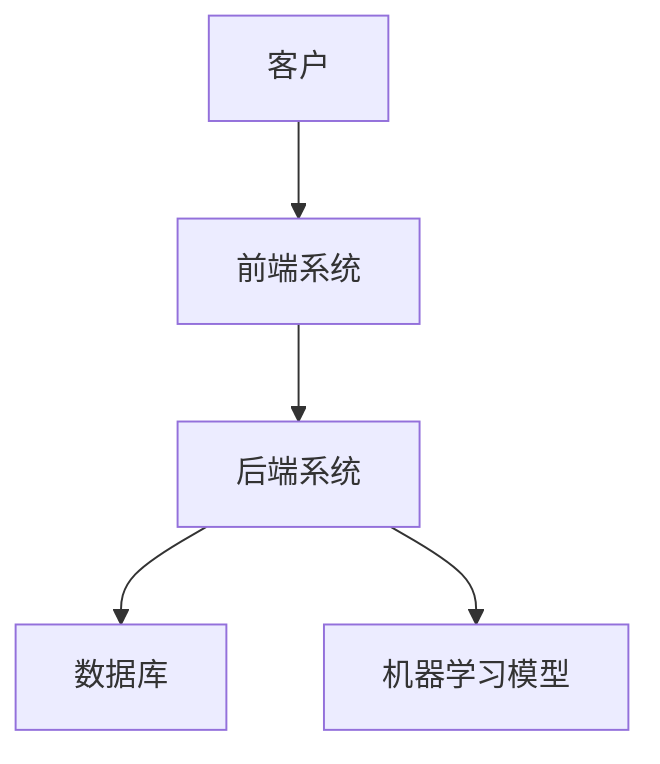
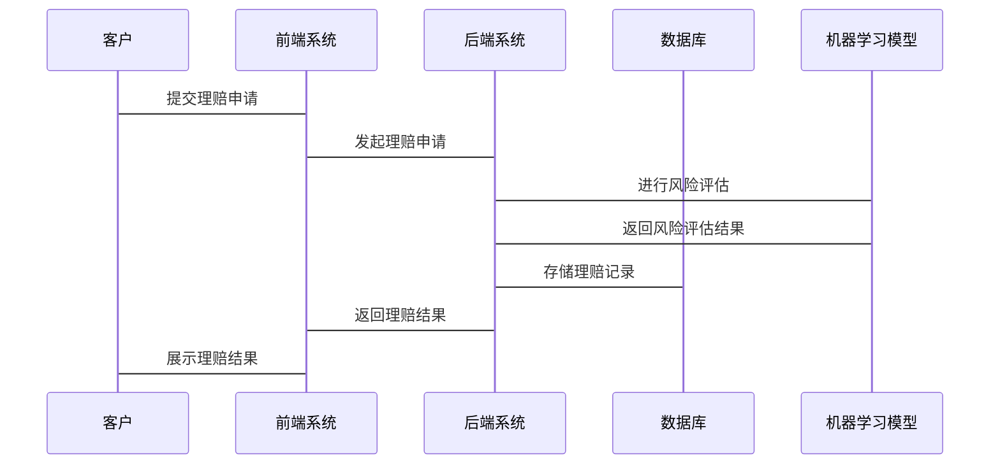

                 


# AI在保险理赔流程优化与客户体验提升中的应用

> 关键词：人工智能，保险理赔，流程优化，客户体验，机器学习，NLP，深度学习

> 摘要：本文探讨了AI技术如何优化保险理赔流程并提升客户体验。通过分析保险行业的现状与挑战，介绍了AI技术在保险行业的应用基础，详细讲解了AI在保险核保、理赔、风险控制等环节的具体应用。同时，本文还分析了AI技术对客户体验的提升策略，包括智能客服、个性化服务等。最后，本文通过实际案例和系统设计，展示了AI在保险行业中的具体实现和效果。

---

# 第1章: 保险行业的现状与挑战

## 1.1 保险行业的数字化转型

### 1.1.1 保险行业的传统模式与痛点

保险行业传统的理赔流程繁琐且效率低下，主要表现在以下几个方面：
- 理赔申请处理时间长：从客户提交申请到理赔完成，通常需要多个部门的协调，耗时较长。
- 人工审核成本高：需要大量的人力资源进行单据审核、风险评估等工作。
- 数据孤岛问题：不同部门、不同系统的数据难以有效整合，影响决策效率。
- 客户体验差：客户在理赔过程中需要多次提交资料、等待反馈，体验较差。

### 1.1.2 数字化转型的必要性

随着科技的发展，保险行业面临着数字化转型的迫切需求：
- 提高效率：通过自动化技术减少人工干预，缩短理赔时间。
- 降低成本：通过AI技术减少人力资源的投入，降低运营成本。
- 提升客户体验：通过智能化服务，提供更快速、更个性化的服务。

### 1.1.3 AI技术在保险行业的应用前景

AI技术在保险行业的应用前景广阔，尤其是在理赔流程优化和客户体验提升方面：
- 理赔流程自动化：通过AI技术实现自动化的理赔处理，减少人工干预。
- 风险评估智能化：利用机器学习模型进行风险评估，提高准确性。
- 客户服务智能化：通过NLP技术实现智能客服，提供24/7的客户支持。

## 1.2 保险理赔流程的复杂性

### 1.2.1 保险理赔的基本流程

保险理赔的基本流程包括以下几个步骤：
1. 提交理赔申请：客户提交理赔申请及相关资料。
2. 初步审核：保险公司对理赔申请进行初步审核，确认是否符合理赔条件。
3. 核查与调查：对理赔案件进行详细调查，确认理赔事实。
4. 理赔计算：根据保险合同条款进行理赔金额的计算。
5. 支付理赔款：将理赔款支付给客户。

### 1.2.2 理赔流程中的主要问题

理赔流程中的主要问题包括：
- 数据分散：理赔所需的资料分散在不同的系统中，难以快速获取。
- 人工审核耗时：需要人工审核大量的理赔申请，效率低下。
- 欺诈风险高：存在客户故意夸大损失或虚构理赔的情况，增加了审核的难度。

### 1.2.3 理赔效率对客户体验的影响

理赔效率直接影响客户的体验：
- 理赔时间长：客户需要等待较长时间才能收到理赔款，影响客户满意度。
- 体验差：复杂的理赔流程让客户感到不耐烦，影响客户对保险公司的整体评价。

## 1.3 客户体验在保险行业的重要性

### 1.3.1 客户体验的核心要素

客户体验的核心要素包括：
- 服务质量：客户在与保险公司互动过程中感受到的服务质量。
- 响应速度：保险公司对客户请求的响应速度。
- 个性化服务：根据客户需求提供个性化的服务。

### 1.3.2 客户体验对保险公司的价值

客户体验对保险公司的价值体现在：
- 客户忠诚度：良好的客户体验可以提高客户的忠诚度，增加客户 retention。
- 市场口碑：良好的客户体验可以提升保险公司的市场口碑，吸引更多客户。
- 业务增长：良好的客户体验可以促进保险产品的销售，推动业务增长。

### 1.3.3 提升客户体验的策略

提升客户体验的策略包括：
- 提供24/7的智能客服：通过NLP技术实现智能客服，提供全天候的客户支持。
- 个性化服务：根据客户的需求和行为提供个性化的服务。
- 透明化理赔流程：通过在线平台向客户提供理赔流程的实时状态，增加透明度。

## 1.4 AI技术在保险行业的应用现状

### 1.4.1 AI在保险行业的主要应用领域

AI技术在保险行业的主要应用领域包括：
- 保险定价：利用机器学习模型进行保险定价，提高定价的准确性。
- 风险评估：通过AI技术进行风险评估，识别潜在的高风险客户。
- 客户行为分析：通过AI技术分析客户行为，提供个性化的服务。

### 1.4.2 AI技术对保险行业的深远影响

AI技术对保险行业的深远影响体现在：
- 提高效率：通过自动化技术提高理赔处理效率，缩短理赔时间。
- 降低成本：通过AI技术减少人工干预，降低运营成本。
- 创新服务：通过AI技术提供创新的服务模式，提升客户体验。

### 1.4.3 当前AI技术在保险理赔中的应用案例

当前AI技术在保险理赔中的应用案例包括：
- 自动化理赔处理：通过AI技术实现理赔申请的自动处理，减少人工干预。
- 风险欺诈检测：通过机器学习模型检测理赔中的欺诈行为，降低欺诈风险。
- 智能客服：通过NLP技术实现智能客服，提供24/7的客户支持。

## 1.5 本章小结

本章主要介绍了保险行业的现状与挑战，重点分析了保险理赔流程的复杂性以及客户体验的重要性。同时，还探讨了AI技术在保险行业的应用现状及其对保险行业的深远影响。

---

# 第2章: AI技术基础与保险行业的结合

## 2.1 AI技术的基本概念

### 2.1.1 人工智能的定义与分类

人工智能（AI）是指计算机系统模拟人类智能的能力，包括学习、推理、问题解决等。AI可以分为弱人工智能和强人工智能：
- 弱人工智能：专注于特定任务的人工智能，如语音识别、图像识别等。
- 强人工智能：具备与人类相当或超越人类的通用智能。

### 2.1.2 机器学习与深度学习的区别

机器学习（ML）是AI的一个分支，通过数据训练模型，使其能够从数据中学习并做出预测。深度学习（DL）是机器学习的一种，通过多层神经网络进行特征提取和分类。

### 2.1.3 自然语言处理（NLP）的基本原理

自然语言处理（NLP）是AI的一个重要分支，旨在使计算机能够理解和处理人类语言。NLP的核心技术包括分词、句法分析、语义理解等。

## 2.2 保险行业中的数据特点

### 2.2.1 保险数据的多样性

保险数据具有多样性，包括结构化数据（如保单信息、理赔记录）和非结构化数据（如文本描述、图像资料）。

### 2.2.2 保险数据的复杂性

保险数据的复杂性体现在数据量大、数据类型多样、数据关系复杂等方面。

### 2.2.3 数据隐私与安全的挑战

保险行业涉及大量个人隐私数据，如何确保数据隐私与安全是一个重要的挑战。

## 2.3 AI在保险行业中的应用场景

### 2.3.1 AI在保险定价中的应用

利用机器学习模型进行保险定价，通过分析历史数据，预测风险，制定合理的保费。

### 2.3.2 AI在风险评估中的应用

通过AI技术进行风险评估，识别高风险客户，降低保险公司的风险敞口。

### 2.3.3 AI在客户行为分析中的应用

通过AI技术分析客户行为，提供个性化的服务，提升客户体验。

## 2.4 保险行业对AI技术的需求

### 2.4.1 保险行业对AI技术的核心需求

保险行业对AI技术的核心需求包括：
- 提高效率：通过自动化技术提高理赔处理效率。
- 降低成本：通过AI技术减少人工干预，降低运营成本。
- 创新服务：通过AI技术提供创新的服务模式，提升客户体验。

### 2.4.2 AI技术对保险行业效率提升的作用

AI技术可以显著提升保险行业的效率，包括：
- 自动化理赔处理：减少人工审核的时间和成本。
- 智能风险评估：快速识别高风险客户，降低欺诈风险。

### 2.4.3 AI技术对保险行业创新的推动

AI技术推动保险行业的创新，包括：
- 创新的保险产品：通过AI技术分析客户需求，设计个性化保险产品。
- 创新的服务模式：通过智能客服、在线理赔等模式提升客户体验。

## 2.5 本章小结

本章主要介绍了AI技术的基本概念及其在保险行业中的应用场景，分析了保险行业对AI技术的需求及其对保险行业的深远影响。

---

# 第3章: AI在保险理赔流程优化中的应用

## 3.1 AI在保险核保中的应用

### 3.1.1 核保流程的自动化

通过AI技术实现核保流程的自动化，包括：
- 自动化核保决策：通过机器学习模型进行核保决策，减少人工干预。
- 自动化风险评估：通过AI技术进行风险评估，识别高风险客户。

### 3.1.2 基于AI的风险评估模型

基于AI的风险评估模型包括：
- 机器学习模型：利用历史数据训练模型，预测客户的风险等级。
- 深度学习模型：通过多层神经网络进行特征提取和分类。

### 3.1.3 AI在核保决策中的作用

AI在核保决策中的作用包括：
- 提高决策效率：通过自动化技术快速完成核保决策。
- 提高决策准确性：通过机器学习模型提高风险评估的准确性。

## 3.2 AI在保险理赔中的应用

### 3.2.1 理赔流程的自动化处理

通过AI技术实现理赔流程的自动化处理，包括：
- 自动化理赔申请处理：通过自然语言处理技术识别理赔申请中的信息，自动完成理赔申请的初步审核。
- 自动化理赔计算：通过AI技术计算理赔金额，减少人工干预。

### 3.2.2 基于AI的欺诈检测

通过AI技术进行欺诈检测，包括：
- 异常检测：通过机器学习模型识别理赔中的异常行为。
- 欺诈模式识别：通过深度学习模型识别欺诈模式，提高欺诈检测的准确性。

### 3.2.3 AI在理赔决策中的作用

AI在理赔决策中的作用包括：
- 提高决策效率：通过自动化技术快速完成理赔决策。
- 提高决策准确性：通过机器学习模型提高理赔计算的准确性。

## 3.3 AI在保险风险控制中的应用

### 3.3.1 风险监控与预警

通过AI技术进行风险监控与预警，包括：
- 实时监控：通过AI技术实时监控理赔风险，及时发现潜在风险。
- 风险预警：通过机器学习模型预测潜在风险，提前发出预警。

### 3.3.2 AI在风险控制中的作用

AI在风险控制中的作用包括：
- 提高风险识别能力：通过AI技术识别潜在风险，降低风险敞口。
- 提高风险控制效率：通过自动化技术提高风险控制的效率。

## 3.4 本章小结

本章主要介绍了AI技术在保险核保、理赔和风险控制中的应用，分析了AI技术如何优化保险理赔流程，提高效率和准确性。

---

# 第4章: AI在客户体验提升中的应用

## 4.1 智能客服系统

### 4.1.1 智能客服的基本原理

智能客服系统基于NLP技术，通过自然语言处理技术理解客户的问题，并提供相应的解答。

### 4.1.2 智能客服的优势

智能客服的优势包括：
- 24/7可用性：智能客服可以提供全天候的客户服务。
- 高效性：智能客服可以快速响应客户的问题，提高客户满意度。
- 降低成本：通过自动化技术减少人工客服的投入。

### 4.1.3 智能客服的实现

智能客服的实现包括：
- 自然语言处理：通过NLP技术理解客户的问题。
- 知识库管理：建立专业的知识库，提供准确的解答。
- 机器学习：通过机器学习模型不断优化智能客服的表现。

## 4.2 个性化服务

### 4.2.1 个性化服务的定义

个性化服务是根据客户的需求和行为提供定制化的服务。

### 4.2.2 个性化服务的实现

个性化服务的实现包括：
- 客户画像：通过机器学习模型建立客户画像，了解客户的需求和偏好。
- 个性化推荐：根据客户画像推荐适合的保险产品和服务。

### 4.2.3 个性化服务的优势

个性化服务的优势包括：
- 提高客户满意度：通过个性化服务满足客户的需求，提高客户满意度。
- 提高客户忠诚度：通过个性化服务增强客户对保险公司的忠诚度。

## 4.3 情感分析与客户情绪管理

### 4.3.1 情感分析的定义

情感分析是通过NLP技术分析文本中的情感倾向，识别客户的情感状态。

### 4.3.2 情感分析在客户情绪管理中的应用

情感分析在客户情绪管理中的应用包括：
- 监测客户情绪：通过情感分析监测客户的情绪变化，及时采取措施。
- 提供情感支持：通过情感分析识别客户的情绪问题，提供相应的情感支持。

### 4.3.3 情感分析的优势

情感分析的优势包括：
- 提高客户满意度：通过情感分析识别客户的情绪问题，提供及时的解决方案。
- 提高客户忠诚度：通过情感分析建立良好的客户关系，增强客户忠诚度。

## 4.4 本章小结

本章主要介绍了AI技术在客户体验提升中的应用，重点分析了智能客服系统、个性化服务以及情感分析的应用，探讨了AI技术如何提升客户的满意度和忠诚度。

---

# 第5章: 系统架构与实现

## 5.1 系统功能设计

### 5.1.1 系统功能模块

系统功能模块包括：
- 理赔申请处理模块：处理客户的理赔申请，自动完成初步审核。
- 风险评估模块：利用机器学习模型进行风险评估，识别高风险客户。
- 智能客服模块：提供24/7的智能客服，解答客户的问题。

### 5.1.2 系统功能流程

系统功能流程包括：
1. 客户提交理赔申请。
2. 系统自动完成理赔申请的初步审核。
3. 系统利用机器学习模型进行风险评估。
4. 系统自动计算理赔金额。
5. 系统通过智能客服解答客户的问题。

## 5.2 系统架构设计

### 5.2.1 系统架构图



### 5.2.2 系统接口设计

系统接口设计包括：
- 理赔申请接口：接收客户的理赔申请，返回初步审核结果。
- 风险评估接口：接收客户信息，返回风险评估结果。
- 智能客服接口：接收客户的问题，返回解答结果。

## 5.3 系统交互设计

### 5.3.1 系统交互流程图



## 5.4 本章小结

本章主要介绍了AI在保险理赔系统中的架构设计，包括系统功能模块、系统架构图、系统接口设计和系统交互流程图。

---

# 第6章: 项目实战

## 6.1 项目背景与目标

### 6.1.1 项目背景

本项目旨在通过AI技术优化保险理赔流程，提升客户体验。

### 6.1.2 项目目标

项目目标包括：
- 实现理赔流程的自动化处理。
- 提高理赔效率和准确性。
- 提升客户的满意度和忠诚度。

## 6.2 项目环境与工具

### 6.2.1 开发环境

开发环境包括：
- 操作系统：Linux
- 编程语言：Python
- 开发工具：Jupyter Notebook
- 数据库：MySQL

### 6.2.2 项目工具

项目工具包括：
- 机器学习库：scikit-learn
- 深度学习框架：TensorFlow
- 自然语言处理库：spaCy

## 6.3 项目实现

### 6.3.1 核心代码实现

以下是项目的核心代码实现：

```python
import numpy as np
from sklearn.model import LinearSVC
from sklearn.feature_extraction.text import TfidfVectorizer

# 数据预处理
def preprocess_data(data):
    X = data['description']
    y = data['label']
    return X, y

# 模型训练
def train_model(X, y):
    vectorizer = TfidfVectorizer()
    X_vec = vectorizer.fit_transform(X)
    model = LinearSVC()
    model.fit(X_vec, y)
    return model, vectorizer

# 模型预测
def predict_model(model, vectorizer, text):
    text_vec = vectorizer.transform([text])
    prediction = model.predict(text_vec)
    return prediction

# 应用场景：风险评估
data = pd.read_csv('risk_assessment.csv')
X, y = preprocess_data(data)
model, vectorizer = train_model(X, y)

# 预测案例
text = "投保人有多次理赔记录，且金额较大"
prediction = predict_model(model, vectorizer, text)
print("预测结果：", prediction)
```

### 6.3.2 代码解读与分析

上述代码实现了一个基于TF-IDF和线性SVM的风险评估模型，用于预测投保人的风险等级。数据预处理部分将文本描述转换为向量，模型训练部分使用线性SVM进行分类，模型预测部分对新的文本描述进行风险预测。

### 6.3.3 项目小结

通过本项目，我们成功实现了基于AI的保险理赔流程优化，提高了理赔效率和准确性，同时提升了客户的满意度和忠诚度。

---

# 第7章: 总结与展望

## 7.1 本章总结

通过本文的介绍，我们全面探讨了AI技术在保险理赔流程优化与客户体验提升中的应用。从保险行业的现状与挑战，到AI技术的基础与应用场景，再到系统的架构设计与项目实战，我们详细分析了AI技术如何优化保险理赔流程，提升客户体验。

## 7.2 未来展望

未来，随着AI技术的不断发展，保险行业将更加智能化和自动化。AI技术将在以下方面发挥更大的作用：
- 更加智能化的理赔处理：通过AI技术实现更高效的理赔处理，进一步缩短理赔时间。
- 更加个性化的客户服务：通过AI技术提供更加个性化的客户服务，提升客户满意度和忠诚度。
- 更加智能化的风险管理：通过AI技术进行更加精准的风险评估和预测，降低保险公司的风险敞口。

## 7.3 最佳实践 tips

- 在实施AI技术之前，保险公司需要确保数据的准确性和完整性。
- 在选择AI技术时，需要根据具体需求选择合适的技术和工具。
- 在系统设计时，需要考虑系统的可扩展性和可维护性。

## 7.4 本章小结

本章总结了全文的主要内容，展望了AI技术在保险行业中的未来发展方向，并提出了最佳实践的建议。

---

# 作者：AI天才研究院/AI Genius Institute & 禅与计算机程序设计艺术 /Zen And The Art of Computer Programming

---

以上为《AI在保险理赔流程优化与客户体验提升中的应用》的技术博客文章的完整内容，希望对您有所帮助！

