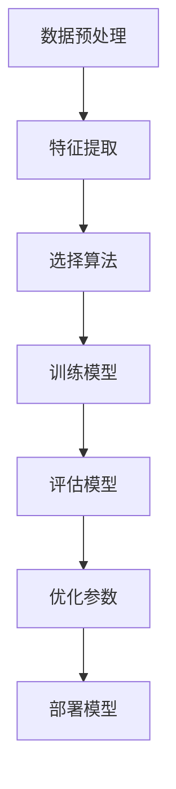
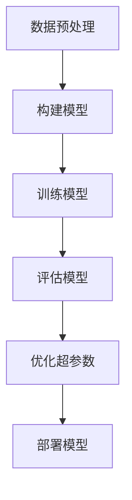
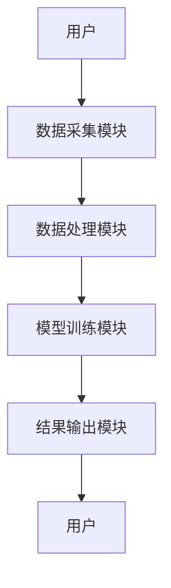

                 


# AI在保险理赔流程优化中的深度应用

> 关键词：AI, 保险理赔, 流程优化, 机器学习, 自然语言处理, 图像识别

> 摘要：本文深入探讨了人工智能技术在保险理赔流程优化中的应用。从保险行业的现状出发，分析了传统理赔流程中的痛点和挑战，重点介绍了机器学习、自然语言处理和图像识别等AI技术在保险理赔中的具体应用场景。通过详细讲解算法原理、系统架构设计和项目实战，展示了AI技术如何有效优化保险理赔流程。本文还提供了丰富的代码示例和系统设计图，帮助读者更好地理解和实现AI驱动的保险理赔优化方案。

---

## 第一章: 保险理赔流程优化的背景与挑战

### 1.1 保险行业的现状与发展

保险行业作为金融领域的重要组成部分，近年来正经历着数字化转型的浪潮。传统的保险业务模式依赖于人工操作，效率低下且容易出错。随着AI技术的快速发展，保险行业逐渐引入智能化工具，以提升业务效率和客户体验。

#### 1.1.1 保险行业的基本概念
保险是一种风险管理工具，通过契约形式转移风险，为被保险人提供经济补偿。保险行业主要包括寿险、财险、健康险等类型，理赔是其中最关键也是最复杂的环节之一。

#### 1.1.2 保险行业的数字化转型趋势
数字化转型已成为保险行业的必然趋势。通过引入大数据、云计算和AI技术，保险公司能够更高效地处理投保、承保、理赔等业务流程。AI技术尤其在理赔环节展现了巨大潜力。

#### 1.1.3 保险理赔流程的核心环节与痛点
保险理赔流程通常包括报案、审核、定损、赔付等环节。传统理赔流程中存在以下痛点：
- **人工审核效率低**：理赔单据繁多，人工审核耗时长且易出错。
- **信息不对称**：投保人与保险公司之间的信息传递不畅，导致理赔纠纷。
- **理赔欺诈风险高**：虚假理赔和欺诈行为频发，增加了理赔成本。

---

### 1.2 AI技术在保险行业的应用前景

#### 1.2.1 AI技术的基本概念与分类
AI技术通过模拟人类智能，实现数据处理、决策和学习等功能。在保险行业，AI主要应用于数据分析、风险评估、理赔优化等领域。

#### 1.2.2 AI在保险行业的典型应用领域
- **客户画像与精准营销**：通过AI技术分析客户行为数据，实现精准营销。
- **风险评估与定价**：基于历史数据和模型预测，优化保险产品定价。
- **理赔自动化**：利用AI技术实现理赔流程的自动化处理。

#### 1.2.3 保险理赔流程优化中的AI潜力
AI技术可以通过自动化处理、智能审核和欺诈检测等方式，显著提升理赔效率和准确性。例如，基于NLP技术的智能理赔单据处理可以大幅减少人工审核时间。

---

### 1.3 保险理赔流程的复杂性与挑战

#### 1.3.1 保险理赔的基本流程与关键环节
保险理赔流程通常包括以下环节：
1. 报案：投保人提交理赔申请及相关单据。
2. 审核：保险公司对理赔请求进行初步审核。
3. 定损：评估理赔金额。
4. 赔付：向投保人支付理赔款。

#### 1.3.2 现有理赔流程中的主要问题
- **人工审核耗时长**：传统理赔流程依赖人工审核，效率低下。
- **信息处理复杂**：理赔单据种类繁多，信息提取难度大。
- **欺诈风险高**：虚假理赔和欺诈行为增加了理赔成本。

#### 1.3.3 AI技术如何解决理赔流程中的痛点
AI技术可以通过以下方式优化理赔流程：
- **自动化审核**：利用机器学习算法快速识别和处理理赔请求。
- **智能定损**：基于图像识别技术自动评估损失程度。
- **欺诈检测**：通过异常检测模型识别潜在的欺诈行为。

---

### 1.4 本章小结

本章介绍了保险行业的现状与发展趋势，重点分析了传统保险理赔流程中的痛点和挑战。通过AI技术的应用，可以显著提升理赔效率和准确性，降低运营成本。接下来，我们将深入探讨AI技术在保险理赔中的核心概念与技术。

---

## 第二章: 保险理赔中的AI核心概念

### 2.1 机器学习在保险理赔中的应用

#### 2.1.1 机器学习的基本概念与分类
机器学习是一种人工智能技术，通过数据训练模型，使其能够自动识别模式并做出预测。常见的机器学习算法包括监督学习、无监督学习和强化学习。

#### 2.1.2 机器学习在保险理赔中的应用场景
- **欺诈检测**：通过监督学习算法识别虚假理赔请求。
- **风险评估**：基于历史数据预测理赔概率。
- **自动化审核**：利用分类算法快速处理理赔请求。

#### 2.1.3 常见的机器学习算法及其特点
- **决策树**：适合处理分类问题，易于解释。
- **随机森林**：通过集成多个决策树提升准确率。
- **支持向量机（SVM）**：适合小样本数据分类。

---

### 2.2 自然语言处理在保险理赔中的应用

#### 2.2.1 自然语言处理的基本概念与技术
自然语言处理（NLP）是AI技术的重要分支，旨在让计算机能够理解和处理人类语言。NLP技术包括分词、句法分析、情感分析等。

#### 2.2.2 NLP在保险理赔文档处理中的应用
- **理赔单据自动化处理**：利用NLP技术提取理赔单据中的关键信息。
- **合同条款分析**：通过文本挖掘技术分析保险合同条款。

#### 2.2.3 基于NLP的理赔信息提取与分析
- **实体识别**：从理赔单据中提取人名、地点、金额等实体信息。
- **关系抽取**：识别理赔单据中的语义关系。

---

### 2.3 图像识别在保险理赔中的应用

#### 2.3.1 图像识别的基本概念与技术
图像识别是AI技术的重要组成部分，通过计算机视觉技术识别图像中的物体、场景或文字。

#### 2.3.2 图像识别在理赔单证处理中的应用
- **OCR技术**：从扫描件中提取文字信息。
- **图像分类**：识别理赔单据的类型。

#### 2.3.3 基于OCR的理赔文档自动识别与处理
- **文档分割**：将复杂文档分割成单个字段。
- **文字识别**：将图像中的文字转换为可编辑文本。

---

### 2.4 本章小结

本章详细介绍了AI技术在保险理赔中的核心概念，包括机器学习、NLP和图像识别等技术。这些技术在理赔流程中的应用能够显著提升效率和准确性。接下来，我们将深入探讨AI算法在保险理赔优化中的原理和实现方式。

---

## 第三章: 保险理赔流程优化的AI算法原理

### 3.1 基于机器学习的保险理赔优化算法

#### 3.1.1 机器学习算法在保险理赔中的应用
- **决策树算法**：适合处理分类问题，如欺诈检测。
- **随机森林算法**：适合处理特征较多的复杂问题。
- **支持向量机算法**：适合处理高维数据分类问题。

#### 3.1.2 机器学习算法的流程图
以下是一个机器学习算法的通用流程图：



#### 3.1.3 机器学习算法的Python实现
以下是一个基于随机森林算法的欺诈检测示例代码：

```python
import pandas as pd
from sklearn.ensemble import RandomForestClassifier
from sklearn.model_selection import train_test_split

# 加载数据
data = pd.read_csv('claims.csv')
X = data.drop('fraud', axis=1)
y = data['fraud']

# 划分训练集和测试集
X_train, X_test, y_train, y_test = train_test_split(X, y, test_size=0.2)

# 初始化模型
model = RandomForestClassifier(n_estimators=100)

# 训练模型
model.fit(X_train, y_train)

# 预测结果
y_pred = model.predict(X_test)

# 输出准确率
print('Accuracy:', accuracy_score(y_test, y_pred))
```

---

### 3.2 基于深度学习的保险理赔优化算法

#### 3.2.1 深度学习算法在保险理赔中的应用
- **卷积神经网络（CNN）**：适合处理图像数据，如理赔单据的OCR识别。
- **循环神经网络（RNN）**：适合处理序列数据，如理赔文本的语义分析。
- **图神经网络（GNN）**：适合处理复杂的理赔关系网络。

#### 3.2.2 深度学习算法的流程图
以下是一个深度学习算法的通用流程图：



#### 3.2.3 深度学习算法的PyTorch实现
以下是一个基于PyTorch的图像分类示例代码：

```python
import torch
import torch.nn as nn
import torch.optim as optim
import torchvision.datasets as datasets
import torchvision.transforms as transforms

# 数据预处理
transform = transforms.Compose([
    transforms.Resize(32),
    transforms.ToTensor(),
])

# 加载数据集
train_dataset = datasets.MNIST(root='./data', train=True, download=True, transform=transform)
train_loader = torch.utils.data.DataLoader(train_dataset, batch_size=32, shuffle=True)

# 定义模型
class SimpleCNN(nn.Module):
    def __init__(self):
        super(SimpleCNN, self).__init__()
        self.conv1 = nn.Conv2d(1, 32, kernel_size=3, stride=1, padding=1)
        self.pool = nn.MaxPool2d(kernel_size=2, stride=2)
        self.fc = nn.Linear(32 * 16 * 16, 10)

    def forward(self, x):
        x = self.conv1(x)
        x = self.pool(x)
        x = x.view(-1, 32 * 16 * 16)
        x = self.fc(x)
        return x

# 初始化模型和优化器
model = SimpleCNN()
optimizer = optim.Adam(model.parameters(), lr=0.001)
criterion = nn.CrossEntropyLoss()

# 训练模型
for epoch in range(10):
    for batch_idx, (data, labels) in enumerate(train_loader):
        outputs = model(data)
        loss = criterion(outputs, labels)
        loss.backward()
        optimizer.step()
        optimizer.zero_grad()

print("模型训练完成！")
```

---

### 3.3 本章小结

本章详细介绍了AI算法在保险理赔优化中的应用，包括机器学习和深度学习算法的原理和实现方式。通过具体的代码示例，读者可以更好地理解和应用这些算法。接下来，我们将探讨保险理赔优化系统的架构设计。

---

## 第四章: 保险理赔优化系统的架构设计

### 4.1 系统功能模块划分

#### 4.1.1 数据采集模块
- **功能描述**：从多种数据源（如数据库、API）获取理赔数据。
- **关键功能**：数据清洗、数据预处理。

#### 4.1.2 数据处理模块
- **功能描述**：对原始数据进行特征提取和数据转换。
- **关键功能**：文本处理、图像处理。

#### 4.1.3 模型训练模块
- **功能描述**：基于处理后的数据训练AI模型。
- **关键功能**：模型选择、参数优化。

#### 4.1.4 结果输出模块
- **功能描述**：将模型预测结果输出到目标系统或用户界面。
- **关键功能**：结果展示、报告生成。

---

### 4.2 系统架构设计

#### 4.2.1 基于微服务的系统架构
- **优势**：模块化设计，便于扩展和维护。
- **实现方式**：使用Docker容器化部署。

#### 4.2.2 基于分布式计算的系统架构
- **优势**：提升计算效率和处理能力。
- **实现方式**：使用Spark进行分布式计算。

#### 4.2.3 基于容器化的系统部署
- **优势**：快速部署和弹性扩展。
- **实现方式**：使用Kubernetes进行容器编排。

---

### 4.3 系统接口设计

#### 4.3.1 数据接口设计
- **输入接口**：接收理赔数据和模型训练数据。
- **输出接口**：返回处理后的数据和模型参数。

#### 4.3.2 模型接口设计
- **输入接口**：接收待预测的理赔请求。
- **输出接口**：返回预测结果和模型评估指标。

#### 4.3.3 用户接口设计
- **输入接口**：接收用户输入的理赔请求。
- **输出接口**：返回理赔结果和相关报告。

---

### 4.4 系统交互流程图

以下是一个系统的交互流程图：



---

### 4.5 本章小结

本章详细介绍了保险理赔优化系统的架构设计，包括功能模块划分、系统架构选择和接口设计。通过系统交互流程图，读者可以清晰了解系统的整体结构和交互逻辑。接下来，我们将通过一个具体的项目实战，展示如何将这些设计应用于实际的保险理赔优化中。

---

## 第五章: 保险理赔优化项目的实战

### 5.1 项目背景与目标

#### 5.1.1 项目背景
某保险公司希望通过引入AI技术优化其理赔流程，降低运营成本，提高客户满意度。

#### 5.1.2 项目目标
- **提升理赔效率**：通过自动化处理减少人工审核时间。
- **降低欺诈风险**：通过AI技术识别潜在的欺诈行为。
- **提高客户满意度**：通过智能理赔系统提供更优质的服务。

---

### 5.2 项目实施步骤

#### 5.2.1 环境安装
- **安装Python**：建议使用Python 3.6及以上版本。
- **安装依赖库**：如Pandas、Scikit-learn、PyTorch等。

#### 5.2.2 数据准备
- **数据来源**：从保险公司内部数据库获取理赔数据。
- **数据预处理**：清洗数据，提取关键特征。

#### 5.2.3 模型训练
- **选择算法**：根据数据特点选择合适的算法。
- **训练模型**：基于训练数据训练AI模型。

#### 5.2.4 模型部署
- **模型优化**：通过超参数调优提升模型性能。
- **部署模型**：将模型集成到现有的理赔系统中。

---

### 5.3 项目核心实现

#### 5.3.1 数据预处理代码
以下是一个数据预处理的Python代码示例：

```python
import pandas as pd

# 加载数据
data = pd.read_csv('claims.csv')

# 数据清洗
data.dropna(inplace=True)
data = data[~data['fraud'].isnull()]

# 特征提取
X = data.drop('fraud', axis=1)
y = data['fraud']

# 划分训练集和测试集
X_train, X_test, y_train, y_test = train_test_split(X, y, test_size=0.2)
```

#### 5.3.2 模型训练代码
以下是一个模型训练的Python代码示例：

```python
from sklearn.ensemble import RandomForestClassifier
from sklearn.metrics import accuracy_score

# 初始化模型
model = RandomForestClassifier(n_estimators=100)

# 训练模型
model.fit(X_train, y_train)

# 预测结果
y_pred = model.predict(X_test)

# 输出准确率
print('Accuracy:', accuracy_score(y_test, y_pred))
```

---

### 5.4 项目小结

本章通过一个具体的项目实战，展示了如何将AI技术应用于保险理赔优化。通过数据预处理、模型训练和部署，我们可以显著提升理赔效率和准确性。接下来，我们将总结AI在保险理赔中的最佳实践，并展望未来的发展方向。

---

## 第六章: AI在保险理赔中的最佳实践与未来发展

### 6.1 最佳实践 tips

- **数据质量**：确保数据的完整性和准确性。
- **模型选择**：根据具体场景选择合适的算法。
- **系统集成**：确保AI系统与现有系统无缝集成。

### 6.2 小结
通过本篇文章，我们深入探讨了AI技术在保险理赔优化中的应用，从理论到实践，全面展示了如何利用AI技术提升保险理赔效率和准确性。

### 6.3 注意事项
- **数据隐私**：在处理敏感数据时，需严格遵守数据隐私法规。
- **模型解释性**：确保模型的可解释性，便于分析和优化。

### 6.4 拓展阅读
- **《机器学习实战》**：深入学习机器学习算法的实现与应用。
- **《深度学习》**：系统了解深度学习技术及其在各个领域的应用。
- **《自然语言处理入门》**：掌握NLP技术的基本原理与应用。

---

## 作者：AI天才研究院/AI Genius Institute & 禅与计算机程序设计艺术 /Zen And The Art of Computer Programming

---

以上是《AI在保险理赔流程优化中的深度应用》的完整目录和内容概览。希望这篇文章能够为读者提供有价值的技术见解和实践指导。

