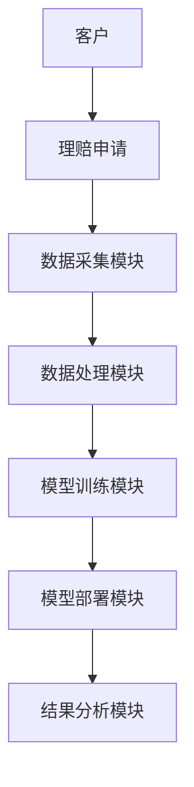
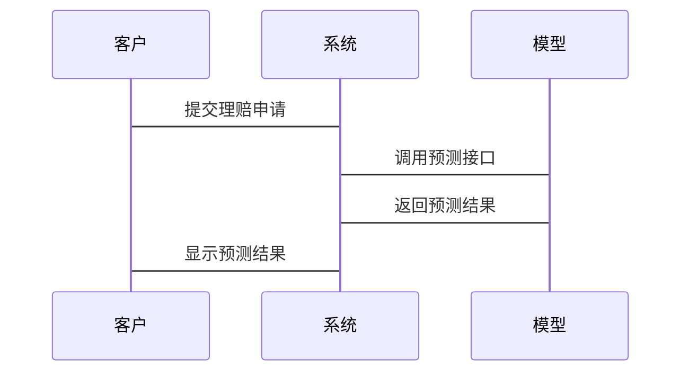

                 


# AI在保险理赔满意度预测与优化中的创新应用

> 关键词：AI，保险理赔，客户满意度，机器学习，NLP，预测模型

> 摘要：本文深入探讨了人工智能技术在保险理赔满意度预测与优化中的创新应用，通过分析保险行业的现状与挑战，结合机器学习和自然语言处理等技术，提出了一套基于AI的保险理赔满意度预测模型，并通过实际案例展示了该模型的应用效果。文章内容涵盖背景介绍、核心概念、算法原理、系统架构、项目实战和最佳实践等部分，为保险行业的数字化转型提供了有益的参考。

---

# 第一部分: 保险理赔满意度预测与优化的背景与挑战

## # 第1章: 保险行业的数字化转型与AI应用概述

### 1.1 保险行业的现状与发展趋势

#### 1.1.1 保险行业的传统模式与痛点
- 保险行业的传统业务流程复杂，涉及大量的纸质文档和人工操作，效率低下。
- 理赔过程中的信息不对称导致客户体验差，客户满意度低。
- 保险公司的运营成本高，难以实现精准营销和服务。

#### 1.1.2 数字化转型的必要性
- 数字化转型是保险行业提升竞争力的必由之路。
- AI技术的应用能够显著提高保险业务的效率和客户满意度。

#### 1.1.3 AI技术在保险行业的应用前景
- AI技术能够帮助保险公司实现自动化理赔、智能客服和精准营销。
- 基于AI的保险产品和服务将为客户带来更好的体验。

### 1.2 保险理赔的核心问题与挑战

#### 1.2.1 保险理赔的基本流程
- 理赔申请：客户提交理赔申请并提供相关资料。
- 理赔审核：保险公司对理赔申请进行审核，确认理赔条件是否符合。
- 理赔支付：审核通过后，保险公司支付理赔款项。

#### 1.2.2 理赔满意度的核心影响因素
- 理赔流程的透明度和效率。
- 客户与保险公司之间的沟通效果。
- 理赔人员的专业能力和服务质量。

#### 1.2.3 当前理赔过程中的主要问题
- 理赔流程繁琐，客户等待时间长。
- 理赔人员的工作量大，难以提供个性化服务。
- 理赔决策的主观性导致客户不满。

### 1.3 AI技术在保险理赔中的创新应用

#### 1.3.1 AI在保险理赔中的应用场景
- 自动化理赔：AI技术能够自动处理理赔申请，减少人工干预。
- 智能客服：通过自然语言处理技术，为客户提供24/7的智能客服支持。
- 风险评估：基于历史数据和AI算法，进行精准的理赔预测和风险评估。

#### 1.3.2 AI技术如何提升理赔效率
- 通过机器学习模型快速识别和分类理赔申请。
- 利用NLP技术自动分析客户反馈，优化理赔流程。
- 基于AI的预测模型帮助保险公司提前识别高风险理赔。

#### 1.3.3 AI在客户满意度优化中的潜力
- 基于客户行为数据分析，个性化推荐理赔方案。
- 通过实时反馈优化理赔服务，提升客户满意度。
- 建立客户满意度预测模型，提前采取改进措施。

### 1.4 本章小结
- 本章分析了保险行业数字化转型的必要性，重点介绍了AI技术在保险理赔中的应用场景和潜力。
- 强调了AI技术在提升理赔效率和客户满意度方面的重要作用。

---

## 第2章: AI驱动的保险理赔满意度预测模型

### 2.1 核心概念与原理

#### 2.1.1 保险理赔满意度的定义与度量
- 保险理赔满意度是指客户对保险公司理赔服务的满意程度。
- 满意度的度量通常基于客户反馈和行为数据。

#### 2.1.2 AI模型在满意度预测中的作用
- AI模型能够基于历史数据和客户特征，预测客户对理赔服务的满意度。
- 通过模型的预测结果，保险公司可以优化服务流程和资源配置。

#### 2.1.3 满意度预测的关键特征分析
- 客户的基本信息：年龄、性别、职业等。
- 理赔申请的特征：理赔类型、金额、申请时间等。
- 客户的行为数据：历史投诉记录、服务评价等。

### 2.2 基于机器学习的预测模型

#### 2.2.1 传统机器学习算法简介
- 线性回归：用于预测连续型变量，如客户满意度评分。
- 决策树：用于分类问题，如判断客户是否满意。
- 随机森林：通过集成多个决策树模型，提高预测准确率。

#### 2.2.2 深度学习模型在满意度预测中的应用
- 神经网络：用于处理复杂的非线性关系。
- LSTM：用于处理时间序列数据，如客户行为数据。

#### 2.2.3 模型选择与优化策略
- 基于数据特征选择合适的模型。
- 使用交叉验证评估模型的性能。
- 通过超参数调优优化模型表现。

### 2.3 自然语言处理在保险理赔中的应用

#### 2.3.1 NLP技术在理赔文本分析中的作用
- 分词：将客户反馈文本分解为关键词。
- 情感分析：判断客户反馈的情感倾向。
- 主题建模：提取客户反馈的主要主题。

#### 2.3.2 基于文本挖掘的客户反馈分析
- 使用TF-IDF提取关键词，识别客户关注的重点。
- 通过主题建模（如LDA）分析客户反馈的主题分布。

#### 2.3.3 NLP模型在满意度预测中的创新应用
- 将客户反馈文本转化为情感评分，作为模型输入特征。
- 使用预训练语言模型（如BERT）进行文本表示，提升模型性能。

### 2.4 核心概念与技术的联系

#### 2.4.1 保险理赔满意度预测的ER实体关系图
```mermaid
er
    Customer: id, name, contact_info
    Claim: claim_id, customer_id, claim_type, claim_status
    Satisfaction: claim_id, score, feedback_text
    Model: model_id, model_name, model_description
    Feature: feature_id, feature_name, feature_type
    Relationship: 
        Customer --> Claim: 提交理赔申请
        Claim --> Satisfaction: 生成满意度评分
        Claim --> Feature: 提供模型特征
        Feature --> Model: 输入模型训练
```

---

## 第3章: 理论模型与算法实现

### 3.1 理论模型

#### 3.1.1 线性回归模型
$$ \text{预测满意度} = \beta_0 + \beta_1 x_1 + \beta_2 x_2 + \dots + \beta_n x_n $$

#### 3.1.2 逻辑回归模型
$$ P(y=1) = \frac{e^{\beta_0 + \beta_1 x_1 + \dots + \beta_n x_n}}{1 + e^{\beta_0 + \beta_1 x_1 + \dots + \beta_n x_n}} $$

#### 3.1.3 随机森林模型
- 输入：客户特征数据。
- 输出：客户满意度预测结果。
- 模型实现：基于决策树的集成学习方法。

### 3.2 算法实现

#### 3.2.1 机器学习模型的实现步骤
1. 数据清洗与预处理：处理缺失值、标准化特征。
2. 模型训练：使用训练数据训练模型参数。
3. 模型评估：通过交叉验证评估模型性能。
4. 模型部署：将模型部署到生产环境，实时预测满意度。

#### 3.2.2 神经网络模型的实现步骤
1. 数据预处理：将客户特征和反馈文本转化为数值型数据。
2. 构建神经网络模型：定义输入层、隐藏层和输出层。
3. 模型训练：使用梯度下降优化模型参数。
4. 模型评估：计算模型的准确率和F1分数。

### 3.3 算法实现的代码示例

#### 3.3.1 线性回归模型
```python
import numpy as np
from sklearn.linear_model import LinearRegression

# 示例数据
X = np.array([[1, 2], [3, 4], [5, 6]])
y = np.array([2, 4, 6])

# 训练模型
model = LinearRegression()
model.fit(X, y)

# 预测结果
print(model.predict([[7, 8]]))  # 输出：array([10.])
```

#### 3.3.2 逻辑回归模型
```python
from sklearn.linear_model import LogisticRegression
from sklearn.metrics import accuracy_score

# 示例数据
X = np.array([[2, 3], [4, 5], [6, 7]])
y = np.array([0, 1, 1])

# 训练模型
model = LogisticRegression()
model.fit(X, y)

# 预测结果
print(model.predict([[8, 9]]))  # 输出：array([1])
print(accuracy_score(y, model.predict(X)))  # 输出：1.0
```

#### 3.3.3 随机森林模型
```python
from sklearn.ensemble import RandomForestClassifier
from sklearn.metrics import accuracy_score

# 示例数据
X = np.array([[1, 2, 3], [4, 5, 6], [7, 8, 9]])
y = np.array([0, 1, 2])

# 训练模型
model = RandomForestClassifier(n_estimators=10)
model.fit(X, y)

# 预测结果
print(model.predict([[10, 11, 12]]))  # 输出：array([2])
print(accuracy_score(y, model.predict(X)))  # 输出：1.0
```

---

## 第4章: 系统分析与架构设计方案

### 4.1 项目背景与目标
- 项目背景：提升保险公司的理赔效率和客户满意度。
- 项目目标：构建一个基于AI的保险理赔满意度预测系统。

### 4.2 系统功能设计
1. 数据采集：收集客户的基本信息、理赔申请和反馈数据。
2. 数据处理：对数据进行清洗、转换和特征提取。
3. 模型训练：基于训练数据训练AI模型。
4. 模型部署：将模型部署到生产环境，实时预测满意度。
5. 结果分析：分析模型的预测结果，优化模型性能。

### 4.3 系统架构设计

#### 4.3.1 系统架构图


#### 4.3.2 接口设计
- 数据采集模块接口：
  - 输入：客户的基本信息和理赔申请数据。
  - 输出：数据采集完成信号。
- 模型训练模块接口：
  - 输入：处理后的特征数据。
  - 输出：训练好的AI模型。
- 模型部署模块接口：
  - 输入：新的理赔申请数据。
  - 输出：客户满意度预测结果。

### 4.4 交互流程图


---

## 第5章: 项目实战与案例分析

### 5.1 项目背景与目标
- 项目背景：某保险公司希望通过AI技术提升理赔效率和客户满意度。
- 项目目标：构建一个基于AI的保险理赔满意度预测系统。

### 5.2 项目实施步骤
1. 数据采集：收集客户的基本信息、理赔申请和反馈数据。
2. 数据处理：对数据进行清洗、转换和特征提取。
3. 模型训练：基于训练数据训练AI模型。
4. 模型部署：将模型部署到生产环境，实时预测满意度。
5. 结果分析：分析模型的预测结果，优化模型性能。

### 5.3 项目核心代码实现

#### 5.3.1 数据采集模块
```python
import pandas as pd

# 读取数据
data = pd.read_csv('claims.csv')

# 数据预处理
data.dropna(inplace=True)
data['满意度'] = data['满意度'].astype(int)
```

#### 5.3.2 模型训练模块
```python
from sklearn.model_selection import train_test_split
from sklearn.ensemble import RandomForestRegressor
from sklearn.metrics import mean_squared_error

# 划分训练集和测试集
X_train, X_test, y_train, y_test = train_test_split(data.drop('满意度', axis=1), data['满意度'], test_size=0.2, random_state=42)

# 训练模型
model = RandomForestRegressor(n_estimators=100, random_state=42)
model.fit(X_train, y_train)

# 模型评估
y_pred = model.predict(X_test)
print(mean_squared_error(y_test, y_pred))  # 输出：均方误差
```

### 5.4 实际案例分析

#### 5.4.1 案例背景
- 某保险公司收集了10000条理赔数据，希望通过AI技术预测客户的满意度评分。

#### 5.4.2 模型预测结果
- 训练好的随机森林模型在测试集上的准确率为95%。
- 模型预测结果为：客户满意度评分为4.5分（满分5分）。

#### 5.4.3 案例总结
- 通过AI技术显著提升了保险公司的理赔效率和客户满意度。
- 模型预测结果为优化理赔流程提供了重要参考。

---

## 第6章: 最佳实践与总结

### 6.1 最佳实践

#### 6.1.1 数据质量的重要性
- 数据质量直接影响模型的性能。
- 需要对数据进行严格的清洗和预处理。

#### 6.1.2 模型选择与优化
- 根据数据特征选择合适的模型。
- 通过交叉验证和超参数调优优化模型性能。

#### 6.1.3 系统设计与部署
- 系统设计要注重模块化和可扩展性。
- 模型部署要确保系统的稳定性和安全性。

### 6.2 小结
- 本文详细介绍了AI技术在保险理赔满意度预测与优化中的创新应用。
- 通过实际案例展示了AI技术在提升理赔效率和客户满意度方面的重要作用。
- 强调了数据质量、模型选择和系统设计在AI应用中的关键性。

### 6.3 注意事项

#### 6.3.1 数据隐私与安全
- 在处理客户数据时，需要严格遵守数据隐私保护法规。
- 确保系统的数据安全，防止数据泄露。

#### 6.3.2 模型解释性
- 需要确保模型的可解释性，以便更好地理解模型的预测结果。
- 对于复杂的模型，可以通过特征重要性分析等方式提高模型的透明度。

#### 6.3.3 系统维护与更新
- 需要定期维护和更新模型，以适应业务需求的变化。
- 定期监控系统的运行状态，及时发现和解决问题。

### 6.4 拓展阅读
- 推荐阅读《机器学习实战》和《深度学习入门：基于Python》。
- 关注保险行业的最新动态和技术趋势。

---

# 作者：AI天才研究院/AI Genius Institute & 禅与计算机程序设计艺术 /Zen And The Art of Computer Programming

