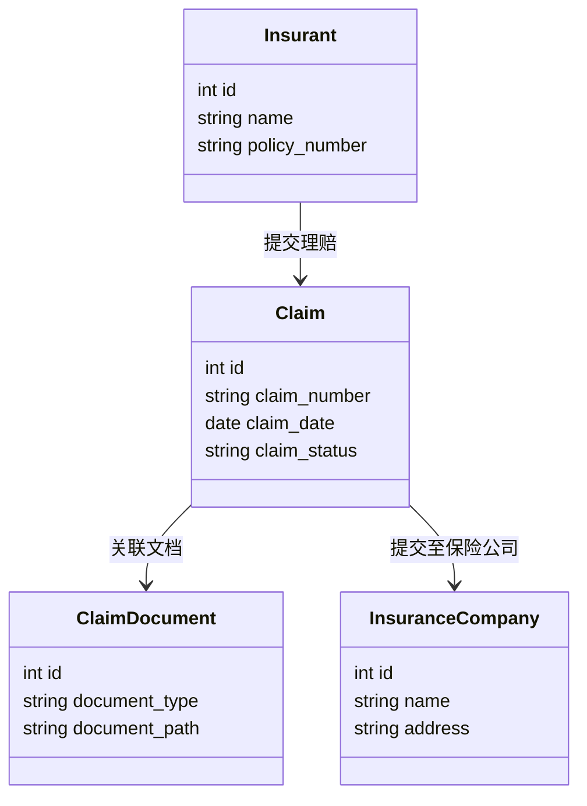

                 


# AI在保险理赔自动化中的创新应用

**关键词**：人工智能, 保险理赔, 自动化, 机器学习, 自然语言处理, 图像识别

**摘要**：  
随着人工智能技术的迅速发展，保险行业正经历一场数字化转型的革命。传统的保险理赔流程繁琐且效率低下，而人工智能技术的应用为保险行业带来了前所未有的创新与变革。本文将详细探讨AI在保险理赔自动化中的创新应用，从背景与核心概念、AI技术在保险理赔中的具体应用、算法原理与数学模型、系统分析与架构设计、项目实战、最佳实践等方面进行深入分析，旨在为读者提供一份全面而系统的技术指南，帮助其理解AI如何在保险理赔中实现自动化与智能化。

---

## 第一部分: AI在保险理赔自动化中的背景与核心概念

### 第1章: 保险行业的数字化转型与AI技术的结合

#### 1.1 保险行业的现状与挑战
##### 1.1.1 保险行业的痛点分析
保险行业作为传统金融行业的重要组成部分，长期依赖人工操作，存在效率低、成本高、体验差等问题。具体痛点包括：
- 理赔流程复杂，涉及多方沟通与文档处理。
- 人工审核耗时长，易出错。
- 保险欺诈风险高，难以快速识别。
- 客户体验不佳，理赔周期长，客户满意度低。

##### 1.1.2 传统保险理赔流程的低效问题
传统保险理赔流程通常包括以下几个步骤：
1. **客户报案**：客户通过电话或线上渠道提交理赔申请。
2. **信息收集**：收集理赔相关的文档（如保单、医疗记录、事故报告等）。
3. **人工审核**：理赔员手动审核文档，评估理赔金额。
4. **赔付处理**：审核通过后，支付理赔款项。

这一流程不仅耗时，还容易因人为疏忽导致错误，客户体验较差。

##### 1.1.3 数字化转型的必要性与趋势
数字化转型已成为保险行业的必然选择。通过引入AI技术，可以实现理赔流程的自动化与智能化，显著提升效率、降低成本、改善客户体验。

#### 1.2 AI技术在保险行业的应用前景
##### 1.2.1 AI技术的核心优势
AI技术在保险行业中的核心优势包括：
- **高效性**：AI可以快速处理大量数据，提高理赔效率。
- **准确性**：AI算法能够减少人为错误，提高理赔准确性。
- **智能性**：AI能够通过数据分析预测风险，提前预防问题。

##### 1.2.2 保险行业对AI技术的需求分析
保险行业对AI技术的需求主要集中在以下几个方面：
- **理赔自动化**：通过AI实现理赔流程的自动化。
- **风险预测**：利用AI进行客户风险评估和欺诈检测。
- **智能客服**：通过自然语言处理技术提供智能客服支持。

##### 1.2.3 保险理赔自动化的目标与价值
保险理赔自动化的目标是通过AI技术实现理赔流程的端到端自动化，具体价值包括：
- **提高效率**：减少人工干预，缩短理赔周期。
- **降低成本**：降低人力成本和时间成本。
- **提升客户体验**：通过快速、准确的理赔服务提高客户满意度。

#### 1.3 保险理赔自动化的创新应用
##### 1.3.1 保险理赔自动化的定义与范围
保险理赔自动化是指利用AI技术（如机器学习、自然语言处理、图像识别等）实现理赔流程的自动化，包括报案、文档处理、审核、赔付等环节。

##### 1.3.2 AI在保险理赔自动化中的作用
AI在保险理赔自动化中的作用体现在以下几个方面：
- **自动化报案**：通过语音识别和自然语言处理技术实现自动报案。
- **智能文档处理**：利用图像识别技术自动提取文档信息。
- **自动审核**：通过机器学习模型实现理赔审核的自动化。
- **智能赔付**：根据审核结果自动完成赔付。

##### 1.3.3 保险理赔自动化的核心流程与关键环节
保险理赔自动化的核心流程包括：
1. **报案与信息收集**：客户通过AI客服提交理赔申请，系统自动收集相关文档。
2. **文档处理与分析**：利用图像识别和自然语言处理技术提取文档信息。
3. **理赔审核**：通过机器学习模型评估理赔金额。
4. **赔付处理**：审核通过后，系统自动完成赔付。

---

### 第2章: AI在保险理赔自动化中的核心概念与联系

#### 2.1 核心概念原理
##### 2.1.1 机器学习在保险理赔中的应用
机器学习在保险理赔中的应用主要体现在以下几个方面：
- **风险评估**：通过监督学习模型评估客户的理赔风险。
- **理赔预测**：利用回归模型预测理赔金额。
- **欺诈检测**：通过无监督学习模型识别异常理赔行为。

##### 2.1.2 自然语言处理在保险文档处理中的作用
自然语言处理（NLP）在保险文档处理中的作用包括：
- **文档分类**：将理赔文档按类型分类（如医疗理赔、车险理赔）。
- **信息抽取**：从文档中提取关键信息（如理赔金额、理赔时间）。
- **自动回复**：通过NLP技术生成智能回复，提高客户沟通效率。

##### 2.1.3 图像识别在保险理赔单据中的应用
图像识别在保险理赔单据中的应用包括：
- **OCR技术**：从扫描件中提取文字信息。
- **图像分类**：识别理赔单据的类型（如医疗发票、事故报告）。
- **自动验证**：通过图像识别技术验证单据的真实性。

#### 2.2 核心概念属性特征对比表格
以下是AI技术在保险理赔自动化中的核心概念属性特征对比表：

| **技术**       | **应用场景**               | **核心特征**                     | **优势**                         |
|----------------|---------------------------|-----------------------------------|----------------------------------|
| 机器学习       | 理赔预测、风险评估         | 数据驱动、模型可解释性           | 高精度、可定制化                 |
| 自然语言处理   | 文档分类、信息抽取         | 语义理解、上下文分析             | 高效性、准确性                   |
| 图像识别       | 单据识别、OCR处理         | 高精度、快速性                   | 易用性、准确性                   |

#### 2.3 ER实体关系图架构（Mermaid流程图）
以下是保险理赔自动化中的ER实体关系图：

```mermaid
erDiagram
    insurant {
        int id
        string name
        string policy_number
    }
    claim {
        int id
        string claim_number
        date claim_date
        string claim_status
    }
    insurance_company {
        int id
        string name
        string address
    }
    claim_document {
        int id
        string document_type
        string document_path
    }
    rel
        insurant -|> claim
        claim -|> claim_document
        claim -|> insurance_company
```

---

### 第3章: AI在保险理赔自动化中的算法原理与数学模型

#### 3.1 监督学习在保险理赔中的应用
##### 3.1.1 监督学习算法原理
监督学习是一种常用机器学习算法，通过训练数据中的输入和输出对进行模型训练，最终实现对新数据的预测。其核心公式为：

$$
y = f(X) + \epsilon
$$

其中，$y$ 表示目标变量，$X$ 表示输入变量，$f$ 表示模型函数，$\epsilon$ 表示误差项。

##### 3.1.2 监督学习在理赔预测中的应用
监督学习可以用于预测理赔金额和理赔概率。例如，利用线性回归模型预测理赔金额：

$$
y = \beta_0 + \beta_1x_1 + \beta_2x_2 + \cdots + \beta_nx_n
$$

其中，$y$ 表示理赔金额，$x_i$ 表示影响理赔金额的特征变量，$\beta_i$ 表示模型系数。

#### 3.2 无监督学习在保险欺诈检测中的应用
##### 3.2.1 无监督学习算法原理
无监督学习是一种通过数据内在结构进行模式识别的算法，常用技术包括聚类和降维。其核心公式为：

$$
J = -\sum_{i=1}^{n} \sum_{j=1}^{k} p(z=j|x=i) \log \left( \frac{p(z=j|x=i)}{p(z=j)} \right)
$$

其中，$J$ 表示目标函数，$p(z=j|x=i)$ 表示条件概率，$p(z=j)$ 表示先验概率。

##### 3.2.2 无监督学习在保险欺诈检测中的应用
无监督学习可以用于识别异常理赔行为。例如，利用K-means聚类算法将理赔数据分为正常和异常两类。

---

### 第4章: AI在保险理赔自动化中的系统分析与架构设计

#### 4.1 问题场景介绍
保险理赔自动化系统需要解决以下问题：
- 如何实现理赔流程的端到端自动化？
- 如何通过AI技术提高理赔效率和准确性？
- 如何设计一个可扩展的系统架构？

#### 4.2 系统功能设计（领域模型Mermaid类图）
以下是保险理赔自动化系统的领域模型类图：



#### 4.3 系统架构设计（Mermaid架构图）
以下是保险理赔自动化系统的架构图：


---

### 第5章: AI在保险理赔自动化中的项目实战

#### 5.1 环境安装
保险理赔自动化系统的开发环境包括：
- Python 3.8+
- Jupyter Notebook
- Scikit-learn、TensorFlow、Keras等机器学习库
- PostgreSQL或MySQL数据库

#### 5.2 系统核心实现源代码
以下是理赔预测的Python代码示例：

```python
import pandas as pd
from sklearn.model_selection import train_test_split
from sklearn.linear_model import LinearRegression

# 加载数据
data = pd.read_csv('claims.csv')

# 数据预处理
X = data[['claim_amount', 'policyholder_age', 'coverage_amount']]
y = data['predicted_amount']

# 划分训练集和测试集
X_train, X_test, y_train, y_test = train_test_split(X, y, test_size=0.2, random_state=42)

# 训练模型
model = LinearRegression()
model.fit(X_train, y_train)

# 预测结果
y_pred = model.predict(X_test)

# 输出结果
print('预测理赔金额:', y_pred)
```

#### 5.3 代码应用解读与分析
上述代码实现了理赔金额的预测。通过线性回归模型，我们可以根据历史数据预测未来的理赔金额。模型的性能可以通过均方误差（MSE）和决定系数（R²）来评估。

#### 5.4 实际案例分析和详细讲解剖析
以医疗理赔为例，假设某保险公司希望预测某客户的理赔金额。通过历史数据训练模型后，系统可以自动预测该客户的理赔金额，并生成赔付方案。

---

### 第6章: AI在保险理赔自动化中的最佳实践

#### 6.1 小结
AI技术在保险理赔自动化中的应用前景广阔，可以显著提升理赔效率和准确性。通过机器学习、自然语言处理和图像识别等技术，保险公司可以实现理赔流程的智能化与自动化。

#### 6.2 注意事项
在实际应用中，需要注意以下几点：
- 数据隐私与安全问题。
- 模型的可解释性与透明度。
- 系统的可扩展性和稳定性。

#### 6.3 拓展阅读
推荐以下书籍和工具：
- 《Python机器学习实战》
- 《自然语言处理入门》
- TensorFlow和Keras框架

---

### 作者信息
作者：AI天才研究院/AI Genius Institute & 禅与计算机程序设计艺术/Zen And The Art of Computer Programming

