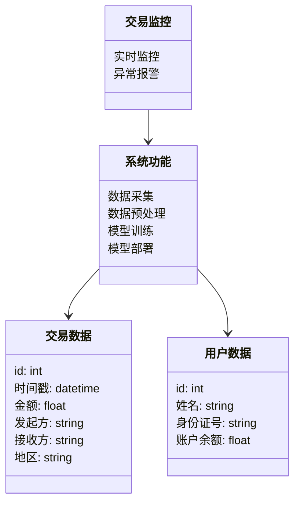
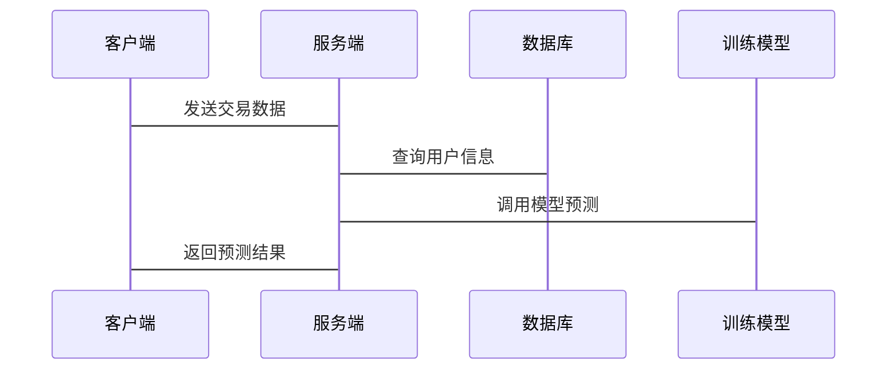

                 


# AI在反洗钱和欺诈检测中的应用

> 关键词：反洗钱, 欺诈检测, 人工智能, 机器学习, 金融安全

> 摘要：本文探讨了人工智能（AI）在反洗钱和欺诈检测中的应用，分析了传统方法的局限性，介绍了AI技术的核心概念与优势，详细讲解了常用算法及其原理，并通过系统架构设计和项目实战展示了AI技术的实际应用效果。最后，本文总结了AI在反洗钱和欺诈检测中的重要性，并展望了未来的发展方向。

---

# 第一部分: AI在反洗钱和欺诈检测中的应用概述

## 第1章: 背景介绍

### 1.1 反洗钱与欺诈检测的基本概念

#### 1.1.1 什么是反洗钱
反洗钱是指通过识别、阻止和报告可疑的金融交易，防止非法资金的流动。其核心目标是打击非法资金流动，维护金融系统的安全与稳定。

#### 1.1.2 什么是欺诈检测
欺诈检测是指通过分析交易数据，识别异常交易行为，防止欺诈行为的发生。欺诈检测广泛应用于信用卡交易、在线支付等领域。

#### 1.1.3 反洗钱与欺诈检测的关联性
反洗钱和欺诈检测都关注异常交易行为，但侧重点不同。反洗钱更关注资金流动的合法性，而欺诈检测更关注交易行为的合法性。两者的结合可以有效提升金融系统的安全性。

### 1.2 AI技术在金融领域的应用背景

#### 1.2.1 传统反洗钱与欺诈检测的局限性
传统反洗钱和欺诈检测方法主要依赖人工审查和规则-based系统，存在效率低、误报率高、难以应对复杂模式等问题。

#### 1.2.2 AI技术的兴起与优势
AI技术的兴起为反洗钱和欺诈检测提供了新的解决方案。通过机器学习、深度学习等技术，可以自动识别异常交易行为，提高检测效率和准确性。

#### 1.2.3 金融行业对AI技术的需求
金融行业对AI技术的需求主要体现在提高交易监控效率、降低运营成本、增强风险控制能力等方面。

### 1.3 实际案例分析

#### 1.3.1 典型的洗钱案例分析
例如，洗钱分子通过多个账户转移资金，掩盖资金来源。AI技术可以通过分析交易金额、频率、时间等特征，识别出异常交易行为。

#### 1.3.2 欺诈交易的典型特征
欺诈交易通常表现出高频率、小额交易、夜间交易等特征。AI技术可以通过分析这些特征，识别出潜在的欺诈行为。

#### 1.3.3 AI技术在实际案例中的应用效果
例如，某银行通过部署基于机器学习的欺诈检测系统，成功降低了欺诈交易的发生率，提高了交易监控效率。

---

## 第2章: 核心概念与联系

### 2.1 反洗钱与欺诈检测的核心概念

#### 2.1.1 反洗钱的核心要素
- 交易金额：高价值交易可能掩盖非法资金流动。
- 交易时间：异常时间段的交易可能存在问题。
- 交易地点：资金流向不同地区的异常情况需要关注。

#### 2.1.2 欺诈检测的核心要素
- 交易频率：短时间内多次小额交易可能存在欺诈行为。
- 交易金额：异常金额的交易可能存在问题。
- 用户行为：异常登录、多次尝试登录失败可能表明欺诈行为。

#### 2.1.3 两者之间的关联性
反洗钱关注资金流动的合法性，而欺诈检测关注交易行为的合法性。两者的结合可以有效识别异常交易行为，提高金融系统的安全性。

### 2.2 AI技术在反洗钱与欺诈检测中的应用原理

#### 2.2.1 数据分析与模式识别
AI技术通过分析交易数据，识别出异常模式。例如，随机森林算法可以通过特征重要性分析，识别出关键的异常交易特征。

#### 2.2.2 自然语言处理在金融文本分析中的应用
NLP技术可以分析交易相关的文本信息，识别出潜在的洗钱行为。例如，通过分析交易说明文本，识别出异常的资金流动。

#### 2.2.3 图神经网络在交易关系分析中的应用
图神经网络可以分析交易之间的关系，识别出复杂的洗钱网络。例如，通过分析账户之间的交易关系，识别出可疑的资金流动网络。

### 2.3 核心概念的ER实体关系图

```mermaid
er
    entity(交易) {
        id: int
        时间戳: datetime
        金额: float
        发起方: string
        接收方: string
        地区: string
    }
    entity(用户) {
        id: int
        姓名: string
        身份证号: string
        账户余额: float
    }
    entity(交易记录) {
        id: int
        用户ID: int
        交易金额: float
        交易时间: datetime
    }
```

---

## 第3章: 算法原理讲解

### 3.1 传统机器学习算法

#### 3.1.1 支持向量机（SVM）
支持向量机是一种监督学习算法，适用于分类问题。在反洗钱和欺诈检测中，SVM可以用于识别异常交易类别。

#### 3.1.2 随机森林（Random Forest）
随机森林是一种基于决策树的集成学习算法，具有高精度和良好的抗过拟合能力。在欺诈检测中，随机森林可以用于识别异常交易行为。

#### 3.1.3 XGBoost算法
XGBoost是一种基于树的优化算法，具有高效性和高准确性。在反洗钱和欺诈检测中，XGBoost可以用于分类和回归问题。

### 3.2 深度学习算法

#### 3.2.1 神经网络（Neural Networks）
神经网络是一种模拟人脑神经元结构的深度学习算法，适用于处理复杂的非线性关系。在反洗钱和欺诈检测中，神经网络可以用于识别复杂的异常交易模式。

#### 3.2.2 卷积神经网络（CNN）
卷积神经网络主要用于图像识别任务，但在金融时间序列数据分析中也有应用。CNN可以用于分析交易时间序列数据，识别异常模式。

#### 3.2.3 循环神经网络（RNN）
循环神经网络适用于处理序列数据，如交易时间序列数据。RNN可以用于识别交易中的时间依赖性异常行为。

### 3.3 图神经网络

#### 3.3.1 图神经网络的基本原理
图神经网络是一种处理图结构数据的深度学习算法，适用于分析交易之间的关系。在反洗钱中，图神经网络可以用于识别复杂的洗钱网络。

#### 3.3.2 图嵌入（Graph Embedding）
图嵌入是一种将图结构数据转换为低维向量的技术，可以用于分类和聚类任务。在欺诈检测中，图嵌入可以用于识别异常交易网络。

#### 3.3.3 图注意力机制（Graph Attention Mechanism）
图注意力机制是一种基于注意力机制的图神经网络技术，可以用于处理图中的节点关系。在反洗钱中，图注意力机制可以用于识别关键的洗钱节点。

---

## 第4章: 系统分析与架构设计方案

### 4.1 问题场景介绍
反洗钱和欺诈检测系统需要处理大量的交易数据，识别异常交易行为。系统需要具备高效率、高准确性、可扩展性等特点。

### 4.2 项目介绍
本项目旨在设计一个基于AI的反洗钱和欺诈检测系统，利用机器学习和深度学习算法，实现对异常交易行为的实时检测。

### 4.3 系统功能设计



### 4.4 系统架构设计


### 4.5 系统接口设计



---

## 第5章: 项目实战

### 5.1 环境安装
安装Python、机器学习库（如scikit-learn、XGBoost）和深度学习框架（如TensorFlow、Keras）。

### 5.2 系统核心实现源代码

#### 5.2.1 数据预处理
```python
import pandas as pd
from sklearn.preprocessing import StandardScaler

# 加载数据
data = pd.read_csv('transactions.csv')

# 数据清洗
data = data.dropna()

# 特征提取
features = data[['amount', 'time', 'region']]
```

#### 5.2.2 模型训练
```python
from sklearn.ensemble import RandomForestClassifier
from sklearn.metrics import accuracy_score

# 训练模型
model = RandomForestClassifier()
model.fit(features, labels)

# 模型评估
预测 = model.predict(features_test)
准确率 = accuracy_score(预测, labels_test)
print('准确率:', 准确率)
```

#### 5.2.3 模型部署
```python
from flask import Flask, request, jsonify

app = Flask(__name__)

@app.route('/predict', methods=['POST'])
def predict():
    data = request.json
    features = [data['amount'], data['time'], data['region']]
    prediction = model.predict([features])
    return jsonify({'prediction': int(prediction[0])})

if __name__ == '__main__':
    app.run(debug=True)
```

### 5.3 实际案例分析
通过实际案例分析，验证系统的有效性。例如，分析一笔可疑交易，展示系统如何识别并报警。

### 5.4 项目小结
总结项目实现的关键步骤，强调AI技术在反洗钱和欺诈检测中的重要性。

---

## 第6章: 总结与展望

### 6.1 总结
本文详细介绍了AI技术在反洗钱和欺诈检测中的应用，分析了传统方法的局限性，讲解了常用算法及其原理，并通过系统设计和项目实战展示了AI技术的实际应用效果。

### 6.2 注意事项
在实际应用中，需要注意数据隐私保护、模型解释性等问题，确保系统的合规性和可解释性。

### 6.3 未来展望
未来，随着AI技术的不断发展，反洗钱和欺诈检测将更加智能化和高效化。图神经网络、强化学习等技术将进一步提升检测系统的性能。

---

# 作者

作者：AI天才研究院/AI Genius Institute & 禅与计算机程序设计艺术 /Zen And The Art of Computer Programming

---

感谢您的阅读！希望本文能为您提供有价值的信息和启发。

