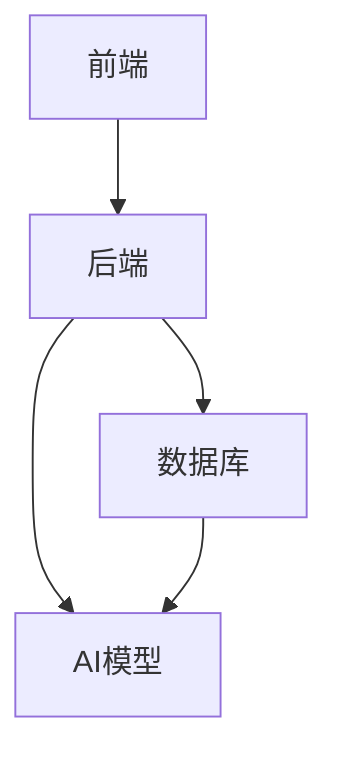

                 


# AI在反洗钱模式识别中的深度应用研究

## 关键词：反洗钱, AI, 机器学习, 深度学习, 模式识别

## 摘要：  
随着全球金融体系的复杂化，洗钱行为日益猖獗，传统的反洗钱手段逐渐暴露出效率低下、精准度不足等问题。人工智能（AI）技术的崛起为反洗钱模式识别提供了新的解决方案。本文深入探讨了AI技术在反洗钱模式识别中的应用，详细分析了机器学习、深度学习等算法的原理与实现，并结合实际案例展示了如何利用AI技术提升反洗钱的效率与准确性。文章还总结了AI技术在反洗钱中的优势与挑战，并展望了未来的发展方向。

---

## 第1章: 反洗钱模式识别的背景与挑战

### 1.1 反洗钱的基本概念  
反洗钱是指通过合法手段将非法资金转化为合法资金的行为，目的是切断非法资金的流动，维护金融体系的稳定。传统的反洗钱手段依赖于人工审查和简单的规则匹配，这种方式效率低下且容易被规避。

### 1.2 洗钱行为的模式与特点  
洗钱行为具有多样性和隐蔽性，常见的模式包括：
- **虚构交易**：通过虚假的商业活动转移资金。
- **分散交易**：将大额资金拆分成多个小额交易。
- **利用非正规渠道**：通过地下银行或加密货币进行资金转移。

### 1.3 AI技术在反洗钱中的应用潜力  
AI技术能够通过大数据分析和模式识别，快速发现异常交易行为。其优势在于：
- **高效性**：AI可以在短时间内处理海量数据。
- **精准性**：通过机器学习算法，AI能够识别复杂的交易模式。
- **适应性**：AI能够动态调整模型，应对洗钱行为的不断变化。

---

## 第2章: AI在反洗钱模式识别中的核心概念与联系

### 2.1 AI技术的核心原理  
- **机器学习**：通过训练数据，模型能够识别数据中的模式和特征。
- **深度学习**：通过多层神经网络，模型能够自动提取复杂的特征。

### 2.2 反洗钱模式识别的关键算法  
- **监督学习**：适用于已标注的数据，如随机森林和逻辑回归。
- **无监督学习**：适用于无标注数据，如聚类分析和关联规则挖掘。
- **强化学习**：通过奖励机制优化决策过程。

### 2.3 AI算法与反洗钱模式识别的结合  
- **特征工程**：提取交易金额、时间、地点等特征。
- **模型训练**：通过训练数据优化模型参数。
- **模型评估**：通过准确率、召回率等指标评估模型性能。

---

## 第3章: 基于AI的反洗钱模式识别算法原理

### 3.1 常见算法的数学模型  
#### 3.1.1 支持向量机（SVM）的数学模型  
$$ \text{最大化} \quad \frac{1}{2} \cdot \lambda \cdot \sum_{i=1}^{n} \lambda_i + \sum_{i=1}^{n} y_i h(x_i) $$  

#### 3.1.2 随机森林的数学模型  
$$ \text{决策树的基尼指数} = \sum_{k=1}^{K} p_k (1 - p_k) $$  

### 3.2 神经网络在反洗钱中的应用  
#### 3.2.1 多层感知机（MLP）的结构与原理  
$$ \text{输出层} = \sigma(\text{输入层} \cdot \text{权重} + \text{偏置}) $$  

#### 3.2.2 卷积神经网络（CNN）的应用  
- CNN通过卷积层提取图像特征，适用于识别交易中的异常图像模式。  

#### 3.2.3 循环神经网络（RNN）的应用  
- RNN适用于时间序列数据，能够识别交易时间中的异常模式。  

---

## 第4章: 系统分析与架构设计

### 4.1 反洗钱系统的应用场景  
反洗钱系统广泛应用于银行、支付平台等领域，能够实时监控交易行为，识别异常交易。

### 4.2 系统功能设计  
- **数据采集模块**：采集交易数据。
- **特征提取模块**：提取交易特征。
- **模型训练模块**：训练AI模型。
- **结果分析模块**：分析模型输出结果。

### 4.3 系统架构设计  


---

## 第5章: 项目实战

### 5.1 环境安装  
- **Python安装**：使用Anaconda安装Python环境。
- **库安装**：安装numpy、pandas、scikit-learn等库。

### 5.2 核心代码实现  
```python
from sklearn.ensemble import RandomForestClassifier
import pandas as pd
import numpy as np

# 加载数据
data = pd.read_csv('transactions.csv')

# 特征提取
X = data.drop('is_fraud', axis=1)
y = data['is_fraud']

# 模型训练
model = RandomForestClassifier()
model.fit(X, y)

# 预测结果
predictions = model.predict(X)
```

### 5.3 实际案例分析  
通过分析一笔可疑交易，展示AI技术如何识别异常交易行为。

### 5.4 项目小结  
通过项目实战，验证了AI技术在反洗钱中的有效性，同时也发现了模型调优的必要性。

---

## 第6章: 最佳实践与未来展望

### 6.1 实际应用中的注意事项  
- 数据隐私保护
- 模型调优与优化
- 多算法结合使用

### 6.2 未来发展方向  
- 结合区块链技术，提升反洗钱系统的安全性。
- 利用联邦学习，实现跨机构的数据共享与分析。

---

## 作者：AI天才研究院/AI Genius Institute & 禅与计算机程序设计艺术 /Zen And The Art of Computer Programming

