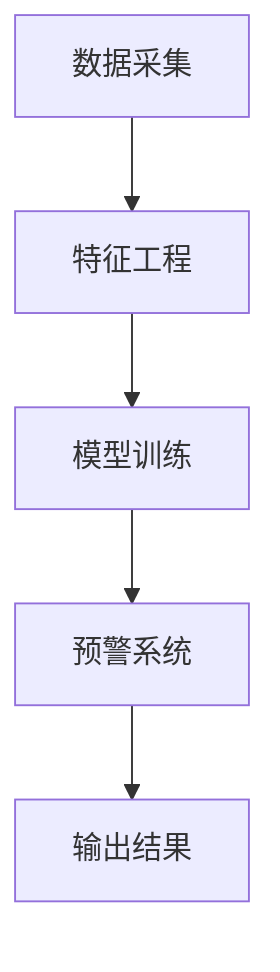
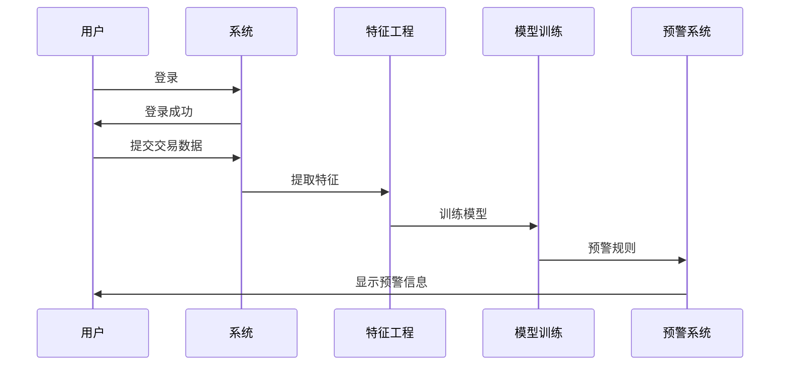

                 


# AI在反洗钱模式进化检测与预警中的深度应用研究

## 关键词：反洗钱, 人工智能, 机器学习, 深度学习, 异常检测, 图神经网络

## 摘要：
随着金融犯罪手段的不断进化，传统的反洗钱方法逐渐暴露出效率低、准确率不足等问题。人工智能技术，特别是机器学习和深度学习，在处理海量数据和复杂模式识别方面展现出了巨大潜力。本文将深入探讨AI技术在反洗钱模式检测与预警中的应用，从特征提取、分类算法到系统架构设计，全面解析如何利用AI提升反洗钱的效率和准确性。通过实际案例分析和系统实现，本文将展示AI在反洗钱领域的实际应用价值，并展望未来的发展方向。

---

# 第一部分：AI在反洗钱中的背景与概念

## 第1章：反洗钱的基本概念与挑战

### 1.1 反洗钱的基本概念

#### 1.1.1 洗钱的定义与基本流程
洗钱是指将非法获得的资金通过复杂的金融交易转化为合法资金的过程。其基本流程包括：**获取非法资金**、**清洗资金**（通过合法渠道转移资金）和**最终使用**。洗钱活动通常涉及跨-border交易、复杂金融产品和匿名账户。

#### 1.1.2 反洗钱的核心目标与原则
反洗钱的核心目标是通过法律法规和技术手段，识别和阻止洗钱行为，维护金融系统的安全和稳定。反洗钱原则包括：** legality（合法性）、transparency（透明性）、integrity（完整性）**。

#### 1.1.3 反洗钱的法律框架与监管要求
反洗钱的法律框架包括国际和国内法规，例如FATF（金融行动特别工作组）制定的反洗钱建议，以及各国的本地法规。监管要求包括金融机构必须建立客户身份识别（KYC）、交易报告和风险评估机制。

### 1.2 反洗钱模式的进化与技术需求

#### 1.2.1 传统反洗钱模式的局限性
传统反洗钱模式依赖人工审查和规则-based系统，存在以下问题：
- **效率低**：人工审查耗时长，难以处理海量交易数据。
- **准确性不足**：规则-based系统难以捕捉复杂和隐蔽的洗钱模式。
- **成本高**：需要大量人力资源和时间投入。

#### 1.2.2 新型洗钱手段的出现与挑战
随着技术的发展，洗钱手段也不断进化：
- **利用加密货币**：比特币等虚拟货币的匿名性和去中心化特性，使得洗钱更加隐蔽。
- **利用AI技术**：洗钱者通过AI技术进行复杂的交易模式分析，寻找监管漏洞。
- **跨国交易与分散资金**：通过跨国交易和分散资金来源，降低被发现的风险。

#### 1.2.3 技术在反洗钱中的重要性
技术的进步为反洗钱提供了新的工具和方法：
- **大数据分析**：通过分析海量交易数据，发现异常模式。
- **AI技术**：利用机器学习和深度学习，识别复杂的洗钱模式。
- **实时监控**：通过实时交易监控系统，快速识别和阻止可疑交易。

### 1.3 AI在反洗钱中的应用现状与前景

#### 1.3.1 AI在金融领域的应用概述
AI技术在金融领域的应用包括：
- **欺诈检测**：通过机器学习识别欺诈交易。
- **信用评估**：通过算法分析客户信用风险。
- **智能投顾**：通过AI提供个性化投资建议。

#### 1.3.2 AI在反洗钱中的具体应用场景
AI在反洗钱中的应用场景包括：
- **交易模式识别**：通过机器学习算法识别异常交易模式。
- **客户行为分析**：通过NLP和深度学习分析客户的交易行为，发现可疑行为。
- **实时预警**：通过实时监控系统和AI算法，快速识别并预警可疑交易。

#### 1.3.3 AI技术对反洗钱模式的潜在影响
AI技术将对反洗钱模式产生深远影响：
- **提高检测效率**：AI能够快速处理海量数据，显著提高检测效率。
- **增强检测准确性**：通过复杂的算法，AI能够发现更多隐蔽的洗钱模式。
- **推动智能化反洗钱**：AI技术将推动反洗钱从人工主导向智能化转变。

### 1.4 本章小结
本章介绍了反洗钱的基本概念、传统模式的局限性以及AI技术在反洗钱中的应用现状与前景。随着洗钱手段的不断进化，AI技术将成为反洗钱的重要工具，帮助金融机构更高效、更准确地识别和阻止洗钱行为。

---

# 第二部分：AI技术基础与反洗钱的结合

## 第2章：AI技术基础

### 2.1 机器学习基础

#### 2.1.1 机器学习的基本概念
机器学习是一种人工智能技术，通过数据训练模型，使其能够从数据中学习规律，并用于预测或分类。机器学习的核心是**特征提取**和**模型训练**。

#### 2.1.2 监督学习、无监督学习与强化学习
- **监督学习**：基于标注数据训练模型，适用于分类和回归任务。
- **无监督学习**：基于未标注数据发现数据中的结构和模式。
- **强化学习**：通过与环境互动，学习最优策略。

#### 2.1.3 常见机器学习算法简介
- **逻辑回归**：用于分类任务，如欺诈检测。
- **支持向量机（SVM）**：适用于小规模数据的分类。
- **随机森林**：基于决策树的集成学习方法，适用于特征重要性分析。

### 2.2 深度学习基础

#### 2.2.1 深度学习的基本概念
深度学习是一种机器学习技术，通过多层神经网络提取数据特征。深度学习的核心是**神经网络**和**特征提取**。

#### 2.2.2 神经网络的基本结构
神经网络由输入层、隐藏层和输出层组成，每一层由多个神经元组成，通过权重和激活函数进行信息处理。

#### 2.2.3 常见深度学习模型简介
- **卷积神经网络（CNN）**：适用于图像识别任务。
- **循环神经网络（RNN）**：适用于序列数据处理，如NLP任务。
- **图神经网络（GNN）**：适用于图结构数据的分析，如社交网络分析。

### 2.3 自然语言处理（NLP）与图论基础

#### 2.3.1 NLP的基本概念与技术
NLP是人工智能的分支，研究如何让计算机理解和处理人类语言。常用技术包括词袋模型、TF-IDF和词嵌入（如Word2Vec）。

#### 2.3.2 图论的基本概念与应用
图论研究图的结构和性质，适用于社交网络分析、节点关系建模等任务。

#### 2.3.3 NLP与图论在反洗钱中的潜在应用
- **NLP**：用于分析交易相关的文本数据，如交易描述。
- **图论**：用于分析交易网络，发现可疑交易模式。

### 2.4 本章小结
本章介绍了机器学习、深度学习、NLP和图论的基本概念和技术，以及它们在反洗钱中的潜在应用。这些技术为AI在反洗钱中的应用提供了理论基础。

---

# 第三部分：AI在反洗钱中的算法原理

## 第3章：反洗钱中的特征提取与分类

### 3.1 特征提取的基本原理

#### 3.1.1 特征提取的定义与目标
特征提取是将数据转换为适合模型输入的特征向量的过程。目标是提取能够反映数据本质特征的特征。

#### 3.1.2 常见特征提取方法
- **数值特征**：如交易金额、交易频率。
- **类别特征**：如交易类型、客户国籍。
- **文本特征**：如交易描述、客户地址。

#### 3.1.3 特征选择的挑战与优化
特征选择的挑战包括特征冗余、特征缺失和特征噪声。优化方法包括特征筛选和特征工程。

### 3.2 基于机器学习的分类算法

#### 3.2.1 逻辑回归模型
逻辑回归是一种常用的分类算法，适用于二分类问题。其数学模型为：
$$ P(y=1|x) = \frac{1}{1 + e^{-\beta x}} $$
其中，$\beta$ 是模型参数，$x$ 是输入特征。

#### 3.2.2 支持向量机（SVM）模型
SVM适用于小规模数据的分类任务。其目标是找到一个超平面，将数据分为两类。

#### 3.2.3 随机森林模型
随机森林是一种集成学习方法，通过组合多个决策树的预测结果，提高模型的准确性和稳定性。

### 3.3 基于深度学习的分类算法

#### 3.3.1 卷积神经网络（CNN）模型
CNN适用于图像识别任务，但也可用于时间序列数据的分类。

#### 3.3.2 循环神经网络（RNN）模型
RNN适用于序列数据的分类，如时间序列分析。

#### 3.3.3 图神经网络（GNN）模型
GNN适用于图结构数据的分类，如社交网络分析。

### 3.4 本章小结
本章介绍了特征提取的基本原理和常见分类算法，包括逻辑回归、随机森林和深度学习模型。这些算法为反洗钱提供了多种选择。

---

## 第4章：反洗钱中的异常检测

### 4.1 异常检测的基本原理

#### 4.1.1 异常检测的定义与目标
异常检测是指识别数据中异常的、与正常模式不符的样本。目标是发现潜在的洗钱行为。

#### 4.1.2 异常检测的常见方法
- **基于统计的方法**：如Z-score、箱线图。
- **基于机器学习的方法**：如Isolation Forest、One-Class SVM。
- **基于深度学习的方法**：如AE（自编码器）、VAE（变分自编码器）。

### 4.2 基于自编码器的异常检测

#### 4.2.1 自编码器的基本原理
自编码器是一种无监督学习模型，通过重建输入数据来学习数据的特征。

#### 4.2.2 自编码器的数学模型
自编码器的数学模型如下：
$$ x_{\text{encoded}} = \sigma(W_{\text{enc}}x + b_{\text{enc}}) $$
$$ \hat{x} = \sigma(W_{\text{dec}}x_{\text{encoded}} + b_{\text{dec}}) $$
其中，$\sigma$ 是激活函数，$W$ 是权重矩阵，$b$ 是偏置项。

#### 4.2.3 自编码器在反洗钱中的应用
自编码器可以用于异常检测，通过重建误差识别异常交易。

### 4.3 基于图神经网络的异常检测

#### 4.3.1 图神经网络的基本原理
图神经网络是一种处理图结构数据的深度学习模型，适用于社交网络分析和交易网络分析。

#### 4.3.2 图神经网络的数学模型
图神经网络的数学模型如下：
$$ h_i^{(l+1)} = \sigma\left(\sum_{j \in N(i)} W_{ij} h_j^{(l)} + W_{ii} h_i^{(l)}\right) $$
其中，$h_i$ 是节点i的表示，$N(i)$ 是节点i的邻居。

#### 4.3.3 图神经网络在反洗钱中的应用
图神经网络可以用于分析交易网络，发现可疑交易模式。

### 4.4 本章小结
本章介绍了异常检测的基本原理和常见方法，重点讲解了自编码器和图神经网络在反洗钱中的应用。

---

# 第四部分：AI在反洗钱中的系统架构设计

## 第5章：系统架构设计与实现

### 5.1 问题场景介绍

#### 5.1.1 反洗钱系统的功能需求
- 数据采集：收集交易数据、客户信息。
- 特征提取：提取交易特征、客户特征。
- 模型训练：训练分类模型和异常检测模型。
- 预警系统：实时监控交易，识别并预警可疑交易。

#### 5.1.2 系统的输入与输出
- 输入：交易数据、客户信息。
- 输出：分类结果、异常检测结果、预警信息。

### 5.2 系统功能设计

#### 5.2.1 领域模型设计
领域模型设计包括客户、交易、账户等实体，以及它们之间的关系。

##### 实体关系图（ER图）
```mermaid
erDiagram
    actor 用户 {
        string 用户ID
        string 用户名
        string 密码
    }
    actor 客户 {
        string 客户ID
        string 客户名
        string 联系方式
    }
    actor 账户 {
        string 账户ID
        string 账户类型
        double 余额
    }
    actor 交易 {
        string 交易ID
        string 交易类型
        double 交易金额
        string 时间戳
    }
    用户 --> 账户 : "拥有"
    用户 --> 交易 : "发起"
    账户 --> 交易 : "涉及"
```

#### 5.2.2 系统架构设计
系统架构设计包括数据采集层、特征工程层、模型训练层和预警系统层。

##### 系统架构图


#### 5.2.3 系统接口设计
系统接口设计包括数据接口、模型接口和预警接口。

#### 5.2.4 系统交互设计
系统交互设计包括用户登录、数据输入、模型训练和预警展示。

##### 系统交互图


### 5.3 本章小结
本章介绍了反洗钱系统的功能需求、领域模型设计和系统架构设计，为后续的系统实现提供了理论基础。

---

# 第五部分：AI在反洗钱中的项目实战

## 第6章：项目实战与案例分析

### 6.1 项目背景与目标

#### 6.1.1 项目背景
本项目旨在利用AI技术，开发一个反洗钱系统，能够实时监控交易数据，识别并预警可疑交易。

#### 6.1.2 项目目标
- 开发一个高效的反洗钱系统。
- 实现交易数据的特征提取和分类。
- 构建一个实时预警系统。

### 6.2 项目实现

#### 6.2.1 环境配置
- **编程语言**：Python 3.8+
- **框架与库**：TensorFlow、Keras、Pandas、NumPy、Scikit-learn
- **开发工具**：Jupyter Notebook、PyCharm
- **数据存储**：MySQL数据库

#### 6.2.2 数据预处理

##### 数据清洗
- 删除缺失值。
- 处理异常值。
- 标准化特征。

##### 数据分割
- 训练集、验证集、测试集的分割比例为7:2:1。

##### 数据增强
- 数据增强技术用于提高模型的泛化能力。

#### 6.2.3 模型实现

##### 分类模型实现
```python
import numpy as np
import pandas as pd
from sklearn.model_selection import train_test_split
from sklearn.linear_model import LogisticRegression
from sklearn.metrics import accuracy_score

# 数据加载
data = pd.read_csv('anti_fraud.csv')
X = data.drop('label', axis=1)
y = data['label']

# 数据分割
X_train, X_test, y_train, y_test = train_test_split(X, y, test_size=0.2, random_state=42)

# 模型训练
model = LogisticRegression()
model.fit(X_train, y_train)

# 模型预测
y_pred = model.predict(X_test)

# 模型评估
print('准确率:', accuracy_score(y_test, y_pred))
```

##### 异常检测模型实现
```python
from sklearn.ensemble import IsolationForest

# 数据加载
data = pd.read_csv('anti_fraud.csv')
X = data.drop('label', axis=1)
y = data['label']

# 数据分割
X_train, X_test, y_train, y_test = train_test_split(X, y, test_size=0.2, random_state=42)

# 异常检测模型训练
outlier_model = IsolationForest(n_estimators=100, random_state=42)
outlier_model.fit(X_train)

# 模型预测
y_pred = outlier_model.predict(X_test)

# 模型评估
# 这里需要根据实际业务需求调整评估指标
print('异常检测结果:', y_pred)
```

#### 6.2.4 系统实现

##### 系统架构实现


##### 系统交互实现


### 6.3 项目小结

---

# 第六部分：总结与展望

## 第7章：总结与展望

### 7.1 总结
本文深入探讨了AI技术在反洗钱中的应用，从特征提取、分类算法到系统架构设计，全面解析了如何利用AI提升反洗钱的效率和准确性。通过实际案例分析和系统实现，本文展示了AI在反洗钱领域的实际应用价值。

### 7.2 展望
未来，AI技术在反洗钱中的应用将更加广泛和深入。主要发展方向包括：
- **实时性提升**：通过实时数据流处理技术，进一步提高反洗钱的实时性。
- **模型优化**：通过优化算法和模型结构，提高检测准确性和效率。
- **多模态数据融合**：利用文本、图像等多种数据源，提高检测的全面性。
- **可解释性增强**：通过可解释AI技术，提高模型的透明性和可信度。

### 7.3 本章小结
本章总结了本文的主要内容，并展望了AI技术在反洗钱中的未来发展方向。

---

# 作者：AI天才研究院/AI Genius Institute & 禅与计算机程序设计艺术 /Zen And The Art of Computer Programming

---

**备注**：本文是基于AI在反洗钱模式进化检测与预警中的深度应用研究的框架，后续可以根据实际研究和需求进行扩展和补充。

