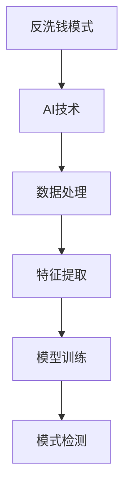
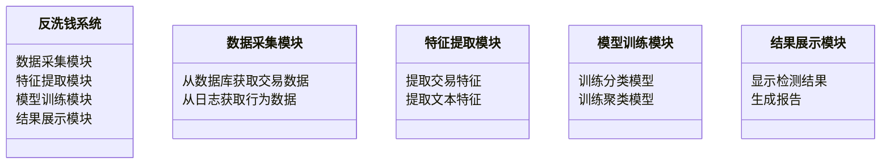

                 

# AI在反洗钱模式进化检测中的深度应用研究

## 关键词
反洗钱, AI, 人工智能, 模式检测, 深度学习

## 摘要
随着全球化和数字化的快速发展，洗钱活动变得越来越隐蔽和复杂。传统的反洗钱方法在面对不断进化的洗钱模式时显得力不从心。人工智能（AI）技术的引入为反洗钱模式检测带来了新的可能性。本文将深入探讨AI在反洗钱模式进化检测中的应用，分析其技术基础、算法原理、系统架构以及实际案例，揭示AI如何帮助金融行业更有效地识别和应对洗钱行为。

---

# 目录

## 第一部分: 反洗钱模式进化检测的背景与挑战

## 第二部分: 反洗钱模式进化检测的核心概念与联系

## 第三部分: AI在反洗钱模式进化检测中的技术基础

## 第四部分: 反洗钱模式进化检测的算法原理

## 第五部分: 系统分析与架构设计方案

## 第六部分: 项目实战: AI驱动的反洗钱系统实现

## 第七部分: 总结与展望

---

# 正文

## 第一部分: 反洗钱模式进化检测的背景与挑战

### 第1章: 反洗钱模式进化检测概述

#### 1.1 反洗钱的背景与重要性

反洗钱是指通过法律手段识别、防止和打击非法资金流动的过程。洗钱活动不仅威胁金融系统的稳定性，还可能导致严重的经济损失和社会问题。随着全球化和数字化的发展，洗钱手段也在不断进化，传统的基于规则的反洗钱方法难以应对复杂的洗钱模式。

#### 1.2 洗钱模式的进化与挑战

洗钱模式经历了从简单到复杂的演变。早期的洗钱主要依赖于简单的资金转移，而现代洗钱手段则利用了复杂的金融工具、匿名技术以及跨境支付系统。洗钱者通过多层次的交易和伪装，使得传统的基于规则的检测方法难以识别这些复杂的模式。

#### 1.3 AI在反洗钱中的应用潜力

人工智能技术在处理复杂数据模式和识别异常行为方面具有显著优势。通过机器学习、深度学习和自然语言处理等技术，AI能够从大量非结构化数据中提取有价值的特征，并实时检测潜在的洗钱行为。AI的引入使得反洗钱系统更加智能化和高效。

---

## 第二部分: 反洗钱模式进化检测的核心概念与联系

### 第2章: 反洗钱模式进化检测的核心概念

#### 2.1 反洗钱模式的定义与分类

反洗钱模式可以分为传统模式和现代模式。传统模式包括简单的资金转移和现金交易，而现代模式则涉及复杂的金融工具和匿名技术。模式的分类基于交易的特征、参与者的行为模式以及数据的关联性。

#### 2.2 AI技术的核心原理

人工智能通过机器学习算法从数据中学习模式和特征。监督学习适用于已标注数据的分类任务，无监督学习适用于从无标签数据中发现异常模式，深度学习则通过多层神经网络提取复杂的特征。

#### 2.3 实体关系图

---

## 第三部分: AI在反洗钱模式进化检测中的技术基础

### 第3章: 机器学习在反洗钱中的应用

#### 3.1 监督学习

监督学习通过训练数据学习分类模型，适用于已知洗钱行为的检测。常用算法包括决策树、随机森林和逻辑回归。

#### 3.2 无监督学习

无监督学习从无标签数据中发现异常模式，适用于未知洗钱行为的检测。常用算法包括聚类和异常检测。

#### 3.3 强化学习

强化学习通过奖励机制优化策略，适用于动态环境下的反洗钱任务。

### 第4章: 深度学习在反洗钱中的应用

#### 4.1 卷积神经网络（CNN）

CNN适用于图像和序列数据的处理，可用于识别交易中的异常模式。

#### 4.2 循环神经网络（RNN）

RNN适用于时间序列数据的处理，可用于检测交易中的时间关联性。

#### 4.3 图神经网络（GNN）

GNN适用于复杂网络结构的数据，可用于检测交易网络中的异常行为。

### 第5章: 自然语言处理在反洗钱中的应用

#### 5.1 文本挖掘与信息提取

通过NLP技术从文本数据中提取关键信息，识别潜在的洗钱行为。

#### 5.2 实体识别与关系抽取

识别文本中的实体及其关系，帮助发现洗钱网络。

#### 5.3 文本分类与情感分析

通过分类和情感分析，识别异常文本模式。

---

## 第四部分: 反洗钱模式进化检测的算法原理

### 第4章: 传统算法与现代算法的对比

#### 4.1 传统算法

传统算法如随机森林和聚类算法在处理中小规模数据时表现良好。

#### 4.2 现代算法

深度学习算法在处理大规模和复杂数据时表现更优。

#### 4.3 对比分析

对比传统算法和深度学习算法的优缺点，分析适用场景。

### 第5章: 算法实现

#### 5.1 机器学习算法实现

使用Python实现随机森林分类器，展示代码实现和模型评估。

#### 5.2 深度学习算法实现

使用Keras框架实现卷积神经网络，展示模型结构和训练过程。

### 第6章: 数学模型与公式

#### 6.1 机器学习模型

$$ y = f(x) $$

其中，$$ y $$是输出，$$ x $$是输入特征，$$ f $$是模型函数。

#### 6.2 深度学习模型

$$ y = \sigma(Wx + b) $$

其中，$$ W $$是权重矩阵，$$ b $$是偏置，$$ \sigma $$是激活函数。

---

## 第五部分: 系统分析与架构设计方案

### 第5章: 系统功能设计

#### 5.1 领域模型设计

#### 5.2 系统架构设计

---

## 第六部分: 项目实战: AI驱动的反洗钱系统实现

### 第6章: 项目背景与目标

#### 6.1 项目背景

本项目旨在开发一个基于AI的反洗钱系统，用于检测银行交易中的异常行为。

#### 6.2 项目目标

实现一个能够实时检测洗钱行为的系统，提升反洗钱效率和准确性。

### 第7章: 数据准备与特征工程

#### 7.1 数据准备

从银行交易数据中提取特征，包括交易金额、时间、参与者等。

#### 7.2 特征工程

通过PCA进行降维，选择关键特征。

### 第8章: 模型实现与评估

#### 8.1 模型实现

使用Python实现随机森林分类器，训练模型并进行评估。

#### 8.2 模型评估

通过混淆矩阵和F1分数评估模型性能。

$$ F1 = 2 \times \frac{Precision \times Recall}{Precision + Recall} $$

### 第9章: 系统实现与部署

#### 9.1 系统实现

开发一个Web界面，展示检测结果和生成报告。

#### 9.2 系统部署

部署系统到云平台，实现实时检测。

---

## 第七部分: 总结与展望

### 第7章: 总结

本文详细探讨了AI在反洗钱模式进化检测中的应用，分析了技术基础、算法原理和系统架构。通过实际案例展示了AI在反洗钱中的潜力和优势。

### 第8章: 未来展望

未来的研究方向包括多模态数据融合、在线自适应学习和可解释性AI。

---

# 作者

作者：AI天才研究院/AI Genius Institute  
简介：专注于人工智能技术研究与应用，致力于推动AI技术在金融安全领域的创新应用。

