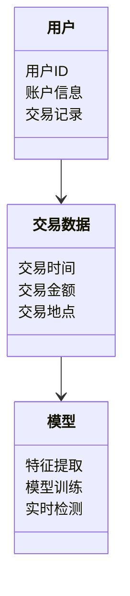
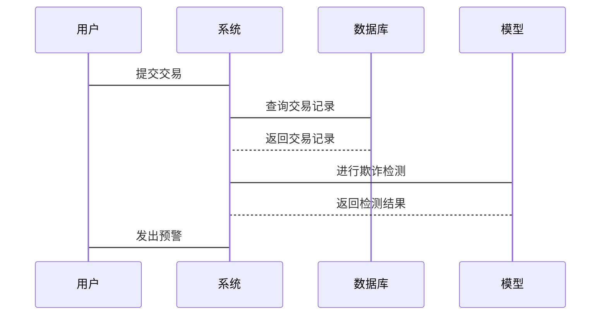

                 


# AI在反金融欺诈中的深度应用研究

## 关键词：人工智能, 金融欺诈, 深度学习, 神经网络, 机器学习, 反欺诈系统, 金融安全

## 摘要：本文深入探讨了人工智能在反金融欺诈中的应用，从背景、核心技术到算法原理、系统架构，再到项目实战和总结，全面分析了AI如何提升金融欺诈检测的效率和准确性。文章通过详细讲解各类算法、系统设计和实际案例，为读者提供了从理论到实践的系统性指导。

---

# 第1章: 金融欺诈的背景与挑战

## 1.1 金融欺诈的现状与问题背景

### 1.1.1 金融欺诈的定义与类型

金融欺诈是指通过欺骗、误导或其他非法手段，非法获取或占用他人财物的行为。其类型包括信用欺诈、交易欺诈、洗钱、虚假账户创建等。随着数字化的普及，金融欺诈手段日益复杂，传统的基于规则的检测方法逐渐失效。

### 1.1.2 传统金融欺诈的挑战与局限

传统反欺诈手段依赖于规则和经验，存在覆盖面有限、响应速度慢、难以应对新型欺诈手段等问题。例如，基于规则的系统只能检测到已知的欺诈模式，面对新型欺诈手法时往往束手无策。

### 1.1.3 金融欺诈的经济影响与社会危害

金融欺诈不仅造成直接经济损失，还会影响金融系统的稳定性，破坏信任关系，甚至引发系统性金融风险。例如，2008年的金融危机部分源于欺诈性次贷产品的泛滥。

---

## 1.2 人工智能在金融领域的应用价值

### 1.2.1 AI技术在金融领域的核心优势

人工智能具有强大的数据处理能力和模式识别能力，能够从海量数据中发现隐藏的欺诈模式。例如，通过机器学习算法分析交易数据，识别异常交易行为。

### 1.2.2 AI在反欺诈中的潜在应用场景

AI可以应用于信用评分、交易监控、反洗钱等领域。例如，通过深度学习模型分析账户行为，识别潜在的洗钱活动。

### 1.2.3 AI技术在金融欺诈检测中的独特价值

AI能够实时分析交易数据，快速识别欺诈行为，减少损失。例如，利用神经网络进行实时交易监控，可以在欺诈发生前发出预警。

---

## 1.3 AI反金融欺诈的核心概念与边界

### 1.3.1 AI反欺诈的核心概念

AI反欺诈通过机器学习和深度学习技术，从金融数据中识别欺诈行为。其核心在于构建高效的模型，能够快速准确地识别异常交易。

### 1.3.2 AI反欺诈的边界与外延

AI反欺诈的应用范围包括信用卡欺诈、网络支付欺诈、保险欺诈等，但不包括物理世界中的欺诈行为，如面对面的诈骗。

### 1.3.3 AI反欺诈的核心要素与组成

AI反欺诈系统通常包括数据采集、特征提取、模型训练、实时监控和反馈优化五个核心要素。例如，数据采集阶段需要收集交易时间、金额、地点等信息。

---

# 第2章: AI在反金融欺诈中的核心技术

## 2.1 机器学习在金融欺诈检测中的应用

### 2.1.1 监督学习在欺诈检测中的应用

监督学习通过标记数据进行训练，识别欺诈模式。例如，使用逻辑回归模型预测交易是否为欺诈。

### 2.1.2 无监督学习在欺诈检测中的应用

无监督学习能够发现隐藏的欺诈模式。例如，使用K-means算法将交易分为正常和异常两类。

### 2.1.3 强化学习在欺诈检测中的应用

强化学习通过模拟交易环境，训练模型识别欺诈行为。例如，使用Q-Learning算法优化欺诈检测策略。

---

## 2.2 深度学习在金融欺诈检测中的应用

### 2.2.1 神经网络在欺诈检测中的应用

神经网络能够处理复杂的非线性关系。例如，使用卷积神经网络（CNN）分析图像数据，识别欺诈交易。

### 2.2.2 卷积神经网络（CNN）的应用

CNN适用于图像识别任务，可以用于识别欺诈交易中的异常图像特征。

### 2.2.3 循环神经网络（RNN）的应用

RNN适用于序列数据的分析，可以用于识别欺诈交易中的时间序列异常。

---

## 2.3 神经网络在金融欺诈检测中的应用

### 2.3.1 神经网络的结构与特点

神经网络由输入层、隐藏层和输出层组成，能够处理复杂的金融数据。

### 2.3.2 神经网络在欺诈检测中的优势

神经网络具有强大的特征提取能力，能够从大量数据中发现隐藏的欺诈模式。

### 2.3.3 神经网络在金融欺诈检测中的具体应用

例如，使用深度信念网络（DBN）进行信用卡欺诈检测，能够显著提高检测准确率。

---

# 第3章: 金融欺诈检测的核心算法原理

## 3.1 监督学习算法

### 3.1.1 逻辑回归算法

逻辑回归通过建立概率模型，预测交易是否为欺诈。例如，使用Python实现逻辑回归模型：

```python
import numpy as np
from sklearn.linear_model import LogisticRegression

# 假设X为特征矩阵，y为标签
model = LogisticRegression()
model.fit(X, y)
```

### 3.1.2 支持向量机（SVM）算法

SVM适用于小规模数据的分类任务。例如，使用SVM进行信用卡欺诈检测：

```python
from sklearn.svm import SVC

model = SVC()
model.fit(X, y)
```

### 3.1.3 随机森林算法

随机森林通过集成学习提高模型的泛化能力。例如，使用随机森林进行交易欺诈检测：

```python
from sklearn.ensemble import RandomForestClassifier

model = RandomForestClassifier()
model.fit(X, y)
```

---

## 3.2 无监督学习算法

### 3.2.1 K-means聚类算法

K-means将数据分成K个簇，识别异常簇。例如，使用K-means进行客户行为分析：

```python
from sklearn.cluster import KMeans

model = KMeans(n_clusters=2)
model.fit(X)
```

### 3.2.2 DBSCAN聚类算法

DBSCAN基于密度的聚类算法，适用于处理噪声数据。例如，使用DBSCAN识别异常交易：

```python
from sklearn.cluster import DBSCAN

model = DBSCAN(eps=0.5, min_samples=5)
model.fit(X)
```

### 3.2.3 Isolation Forest算法

Isolation Forest专门用于异常检测。例如，使用Isolation Forest识别欺诈交易：

```python
from sklearn.ensemble import IsolationForest

model = IsolationForest(contamination=0.1)
model.fit(X)
```

---

## 3.3 强化学习算法

### 3.3.1 Q-Learning算法

Q-Learning通过状态-动作-奖励机制优化欺诈检测策略。例如，使用Q-Learning进行实时交易监控：

```python
class QLearningAgent:
    def __init__(self, actions):
        self.actions = actions
        self.q_table = {}

    def choose_action(self, state):
        if state not in self.q_table:
            return np.random.choice(self.actions)
        else:
            return np.argmax(self.q_table[state])

    def learn(self, state, action, reward):
        if state not in self.q_table:
            self.q_table[state] = np.zeros(len(self.actions))
        self.q_table[state][action] += reward
```

### 3.3.2 Deep Q-Network（DQN）算法

DQN通过深度神经网络近似Q值函数。例如，使用DQN进行复杂环境下的欺诈检测：

```python
import torch
import torch.nn as nn

class DQN(nn.Module):
    def __init__(self, input_dim, output_dim):
        super(DQN, self).__init__()
        self.fc1 = nn.Linear(input_dim, 64)
        self.fc2 = nn.Linear(64, output_dim)
        self.relu = nn.ReLU()
        self.softmax = nn.Softmax(dim=1)

    def forward(self, x):
        x = self.fc1(x)
        x = self.relu(x)
        x = self.fc2(x)
        x = self.softmax(x)
        return x
```

### 3.3.3 Policy Gradient算法

Policy Gradient通过优化策略函数直接优化目标。例如，使用Policy Gradient进行策略优化：

```python
import torch
import torch.nn as nn

class PolicyNetwork(nn.Module):
    def __init__(self, input_dim, output_dim):
        super(PolicyNetwork, self).__init__()
        self.fc1 = nn.Linear(input_dim, 64)
        self.fc2 = nn.Linear(64, output_dim)
        self.relu = nn.ReLU()
        self.softmax = nn.Softmax(dim=1)

    def forward(self, x):
        x = self.fc1(x)
        x = self.relu(x)
        x = self.fc2(x)
        x = self.softmax(x)
        return x
```

---

# 第4章: 金融欺诈检测系统的架构与实现

## 4.1 系统功能设计

### 4.1.1 问题场景介绍

金融欺诈检测系统需要实时监控交易数据，识别欺诈行为，并发出预警。

### 4.1.2 系统功能模块

系统包括数据采集、特征提取、模型训练、实时监控和反馈优化五个模块。

### 4.1.3 领域模型设计

使用Mermaid图展示领域模型：



### 4.1.4 系统架构设计

使用Mermaid图展示系统架构：

```mermaid
containerDiagram
    container 数据采集层 {
        component 数据库
        component API接口
    }
    container 数据处理层 {
        component 特征提取模块
        component 数据清洗模块
    }
    container 模型训练层 {
        component 训练模块
        component 测试模块
    }
    container 实时监控层 {
        component 检测模块
        component 预警模块
    }
```

### 4.1.5 系统接口设计

系统接口包括数据接口、模型接口和预警接口。

### 4.1.6 系统交互设计

使用Mermaid图展示系统交互流程：



---

## 4.2 项目实战

### 4.2.1 环境搭建

需要安装Python、TensorFlow、Scikit-learn等库。

### 4.2.2 核心代码实现

以下是欺诈检测系统的实现代码：

```python
import numpy as np
import pandas as pd
from sklearn.model_selection import train_test_split
from sklearn.metrics import accuracy_score

# 加载数据
data = pd.read_csv('fraud_data.csv')
X = data.drop('fraud_flag', axis=1)
y = data['fraud_flag']

# 数据分割
X_train, X_test, y_train, y_test = train_test_split(X, y, test_size=0.2)

# 模型训练
from sklearn.ensemble import RandomForestClassifier
model = RandomForestClassifier()
model.fit(X_train, y_train)

# 模型预测
y_pred = model.predict(X_test)
print('准确率:', accuracy_score(y_test, y_pred))
```

### 4.2.3 案例分析与解读

通过实际案例分析，验证模型的准确率和召回率。

### 4.2.4 项目小结

总结项目的实施过程，提出改进建议。

---

## 4.3 总结与展望

### 4.3.1 当前总结

总结AI在反金融欺诈中的应用成果和局限性。

### 4.3.2 未来展望

展望AI技术在金融欺诈检测中的未来发展方向，如联邦学习、自监督学习等。

---

# 作者：AI天才研究院/AI Genius Institute & 禅与计算机程序设计艺术 /Zen And The Art of Computer Programming

---

**附录**

- 附录A: 相关术语解释
- 附录B: 数据集来源
- 附录C: 参考文献

- 附录D: 索引

---

**小结**

通过本文的系统性分析，读者可以全面了解AI在反金融欺诈中的应用，掌握核心算法和系统设计方法，并能够通过实际案例深入理解AI技术在金融安全中的重要价值。

