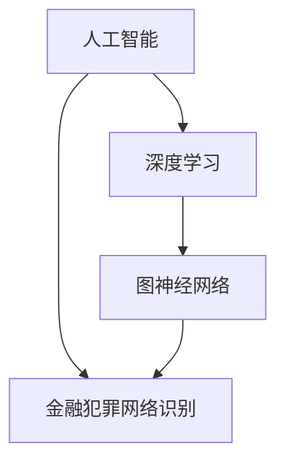
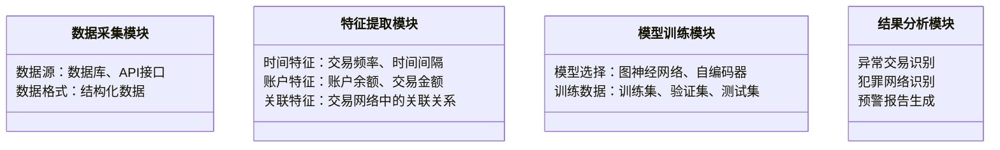
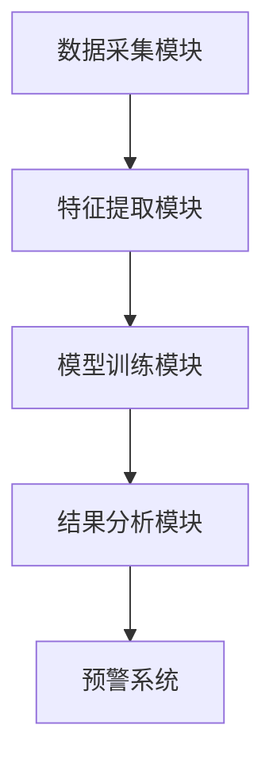
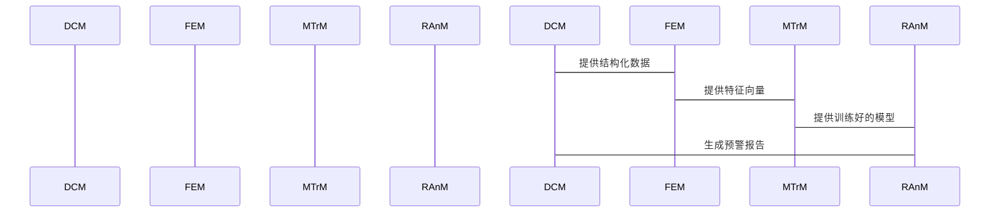

                 


# AI在反金融犯罪网络识别中的深度应用研究

**关键词**：AI，反金融犯罪，网络识别，深度学习，图神经网络，异常检测

**摘要**：随着金融犯罪的日益复杂化和多样化，传统的反金融犯罪方法逐渐暴露出效率低下、识别精度不足等问题。人工智能（AI）技术，尤其是深度学习和图神经网络，凭借其强大的数据处理能力和模式识别能力，为反金融犯罪网络识别提供了新的解决方案。本文将从背景、核心概念、算法原理、系统设计、项目实战等多个维度，深入探讨AI在反金融犯罪网络识别中的深度应用，并通过实际案例分析，揭示其在金融安全领域的巨大潜力。

---

## 第一部分: 反金融犯罪网络识别的背景与挑战

### 第1章: 反金融犯罪网络识别的背景与问题

#### 1.1 问题背景
- 1.1.1 金融犯罪的现状与趋势
  - 金融犯罪的多样化与隐蔽性
  - 传统反金融犯罪方法的局限性
- 1.1.2 传统反金融犯罪方法的局限性
  - 规则基检测的低效性
  - 数据孤岛问题
- 1.1.3 AI技术在反金融犯罪中的潜力
  - AI技术的优势：数据驱动、自动化分析
  - 图神经网络在复杂网络分析中的应用

#### 1.2 问题描述
- 1.2.1 金融犯罪网络的定义与特征
  - 金融犯罪网络的定义
  - 犯罪网络的特征：节点关联性、交易异常性
- 1.2.2 反金融犯罪网络识别的核心问题
  - 异常交易检测
  - 犯罪网络结构识别
- 1.2.3 问题解决的必要性与目标
  - 维护金融系统的安全
  - 提高反金融犯罪的效率

#### 1.3 问题解决的边界与外延
- 1.3.1 金融犯罪网络识别的边界
  - 数据范围：合法与非法交易的区分
  - 交易范围：境内与跨境交易的区分
- 1.3.2 相关领域的联系与区别
  - 与金融监管的关系
  - 与网络安全的关系
- 1.3.3 技术与法律的双重边界
  - 技术实现的边界
  - 法律合规性要求

#### 1.4 概念结构与核心要素组成
- 1.4.1 金融犯罪网络的核心要素
  - 犯罪主体：个人或组织
  - 犯罪行为：洗钱、欺诈、逃税
  - 犯罪工具：金融机构、账户、交易记录
- 1.4.2 AI技术在反金融犯罪中的核心要素
  - 数据：交易数据、账户信息、网络数据
  - 模型：深度学习模型、图神经网络
  - 算法：异常检测、关联分析
- 1.4.3 两者的关联与协同
  - 数据驱动的关联分析
  - 模型驱动的异常检测

#### 1.5 本章小结
- 本章总结了反金融犯罪网络识别的背景与问题，明确了问题解决的必要性与边界，为后续章节的分析奠定了基础。

---

## 第二部分: AI技术在反金融犯罪网络识别中的核心概念与联系

### 第2章: 核心概念与原理

#### 2.1 AI技术在反金融犯罪中的核心概念
- 2.1.1 人工智能的基本概念
  - 人工智能的定义
  - 人工智能的核心技术：机器学习、深度学习、自然语言处理
- 2.1.2 深度学习与强化学习在反金融犯罪中的应用
  - 深度学习在金融数据分析中的应用
  - 强化学习在策略优化中的应用
- 2.1.3 图神经网络在金融网络分析中的作用
  - 图神经网络的定义
  - 图神经网络在金融网络分析中的优势

#### 2.2 核心概念的原理与特征
- 2.2.1 人工智能的核心原理
  - 数据驱动的特征提取
  - 自动化的模式识别
- 2.2.2 深度学习模型的特征
  - 多层非线性变换
  - 自动特征学习
- 2.2.3 图神经网络的特征
  - 图结构数据的处理能力
  - 节点间关系的建模能力

#### 2.3 核心概念之间的关系
- 2.3.1 AI技术与金融犯罪网络识别的关系
  - AI技术作为工具，用于金融犯罪网络的识别与分析
  - 金融犯罪网络识别为AI技术提供应用场景
- 2.3.2 深度学习与图神经网络的关系
  - 图神经网络是深度学习的一种扩展
  - 深度学习为图神经网络提供基础算法

#### 2.4 核心概念的对比分析
- 2.4.1 AI技术与传统金融犯罪识别方法的对比
  | 特性       | 传统方法       | AI技术           |
  |------------|----------------|------------------|
  | 数据需求   | 依赖规则基     | 数据驱动         |
  | 计算效率   | 低效           | 高效             |
  | 可扩展性   | 有限           | 强               |
- 2.4.2 深度学习与强化学习的对比
  - 深度学习：监督学习，依赖大量标注数据
  - 强化学习：无监督学习，依赖策略优化
- 2.4.3 图神经网络与其他AI模型的对比
  - 图神经网络：适用于图结构数据
  - CNN/RNN：适用于图像/序列数据

#### 2.5 概念结构的Mermaid图


#### 2.5 本章小结
- 本章详细介绍了AI技术在反金融犯罪网络识别中的核心概念及其关系，为后续章节的算法原理和系统设计奠定了理论基础。

---

## 第三部分: AI技术在反金融犯罪网络识别中的算法原理

### 第3章: 算法原理与实现

#### 3.1 图神经网络在反金融犯罪中的应用
- 3.1.1 图神经网络的定义与基本原理
  - 图结构数据的表示
  - 图神经网络的基本操作：聚合、传播
- 3.1.2 图神经网络在反金融犯罪中的应用
  - 犯罪网络的节点分类
  - 犯罪网络的异常检测

#### 3.2 异常检测算法的原理
- 3.2.1 基于深度学习的异常检测
  - 使用RNN/LSTM进行时间序列分析
  - 使用AE（自编码器）进行异常检测
- 3.2.2 图神经网络的异常检测
  - 使用图注意力网络进行异常检测
  - 使用图嵌入技术进行异常识别

#### 3.3 算法实现的详细步骤
- 3.3.1 数据预处理
  - 数据清洗
  - 数据标准化
- 3.3.2 模型训练
  - 网络结构设计
  - 损失函数设计
  - 优化器选择
- 3.3.3 模型评估
  - 准确率、召回率、F1值
  - ROC-AUC曲线

#### 3.4 算法实现的数学模型
- 3.4.1 图神经网络的数学模型
  - 节点表示：$h_i = f(h_{i-1}, x_i)$
  - 聚合操作：$h_i^{(l+1)} = f(h_i^{(l)}, h_j^{(l)})$
- 3.4.2 异常检测的损失函数
  - 重构损失：$L = ||x - \hat{x}||^2$
  - 分类损失：$L = -\sum y_i \log p(y_i=1) + (1-y_i)\log p(y_i=0)$

#### 3.5 算法实现的代码示例
```python
import tensorflow as tf
from tensorflow.keras import layers

def build_model(input_dim):
    inputs = layers.Input(shape=(input_dim,))
    encoder = layers.Dense(64, activation='relu')(inputs)
    encoder = layers.Dense(32, activation='relu')(encoder)
    decoder = layers.Dense(64, activation='relu')(encoder)
    outputs = layers.Dense(input_dim, activation='sigmoid')(decoder)
    model = tf.keras.Model(inputs=inputs, outputs=outputs)
    return model

model = build_model(input_dim=128)
model.compile(optimizer='adam', loss='binary_crossentropy')
```

#### 3.6 本章小结
- 本章详细介绍了AI技术在反金融犯罪网络识别中的算法原理，并通过数学模型和代码示例，展示了如何实现这些算法。

---

## 第四部分: AI技术在反金融犯罪网络识别中的系统设计

### 第4章: 系统分析与架构设计

#### 4.1 问题场景分析
- 4.1.1 系统目标
  - 实时监控金融交易
  - 自动识别异常交易
  - 及时预警金融犯罪
- 4.1.2 业务流程分析
  - 数据采集：交易数据、账户信息
  - 数据处理：清洗、转换、特征提取
  - 模型训练：训练异常检测模型
  - 结果分析：识别异常交易，生成预警报告

#### 4.2 系统功能设计
- 4.2.1 数据采集模块
  - 数据源：数据库、API接口
  - 数据格式：结构化数据
- 4.2.2 特征提取模块
  - 时间特征：交易频率、时间间隔
  - 账户特征：账户余额、交易金额
  - 关联特征：交易网络中的关联关系
- 4.2.3 模型训练模块
  - 模型选择：图神经网络、自编码器
  - 训练数据：训练集、验证集、测试集
- 4.2.4 结果分析模块
  - 异常交易识别
  - 犯罪网络识别
  - 预警报告生成

#### 4.3 系统架构设计
- 4.3.1 领域模型类图


- 4.3.2 系统架构图


#### 4.4 系统接口设计
- 4.4.1 数据接口
  - 输入接口：数据采集模块
  - 输出接口：特征提取模块
- 4.4.2 模型接口
  - 输入接口：模型训练模块
  - 输出接口：结果分析模块
- 4.4.3 用户接口
  - 输入接口：用户输入
  - 输出接口：预警报告

#### 4.5 系统交互流程


#### 4.6 本章小结
- 本章详细分析了反金融犯罪网络识别系统的功能需求和系统架构，并通过类图和流程图展示了系统的整体设计。

---

## 第五部分: 项目实战与案例分析

### 第5章: 项目实战

#### 5.1 环境安装与配置
- 5.1.1 安装Python
  - Python版本要求：3.6以上
  - 安装方式：使用Anaconda或虚拟环境
- 5.1.2 安装TensorFlow
  - 安装命令：pip install tensorflow
  - 验证安装：运行简单的TensorFlow代码
- 5.1.3 安装其他依赖库
  - NumPy、Pandas、Scikit-learn、NetworkX、Gensim

#### 5.2 系统核心实现
- 5.2.1 数据采集与预处理
  - 数据来源：银行交易数据
  - 数据清洗：处理缺失值、异常值
  - 数据转换：特征提取、标准化
- 5.2.2 模型训练
  - 模型选择：图神经网络
  - 模型训练：使用训练集和验证集
  - 模型调优：超参数优化
- 5.2.3 模型部署
  - 部署环境：服务器或云平台
  - 接口设计：RESTful API
  - 日志记录：记录模型运行状态

#### 5.3 代码实现与解读
- 5.3.1 数据预处理代码
```python
import pandas as pd
import numpy as np

# 数据加载
data = pd.read_csv('transactions.csv')

# 数据清洗
data.dropna(inplace=True)
data.drop_duplicates(inplace=True)

# 特征提取
features = data[['amount', 'time', 'account_id']]
```

- 5.3.2 模型训练代码
```python
import tensorflow as tf
from tensorflow.keras import layers

def build_model(input_dim):
    inputs = layers.Input(shape=(input_dim,))
    encoder = layers.Dense(64, activation='relu')(inputs)
    encoder = layers.Dense(32, activation='relu')(encoder)
    decoder = layers.Dense(64, activation='relu')(encoder)
    outputs = layers.Dense(input_dim, activation='sigmoid')(decoder)
    model = tf.keras.Model(inputs=inputs, outputs=outputs)
    return model

model = build_model(input_dim=128)
model.compile(optimizer='adam', loss='binary_crossentropy', metrics=['accuracy'])
model.fit(features, labels, epochs=10, batch_size=32, validation_split=0.2)
```

- 5.3.3 模型评估代码
```python
from sklearn.metrics import classification_report

y_pred = model.predict(features)
y_pred_classes = np.round(y_pred).astype(int)
print(classification_report(labels, y_pred_classes))
```

#### 5.4 实际案例分析
- 5.4.1 案例背景
  - 某银行发现异常交易
  - 使用AI系统进行实时监控
- 5.4.2 案例分析
  - 数据采集与预处理
  - 模型训练与部署
  - 异常交易识别
- 5.4.3 案例结果
  - 成功识别洗钱网络
  - 及时阻止金融犯罪

#### 5.5 本章小结
- 本章通过实际案例展示了AI技术在反金融犯罪网络识别中的应用，详细讲解了系统的实现过程和案例分析。

---

## 第六部分: 总结与展望

### 第6章: 总结与展望

#### 6.1 项目总结
- 6.1.1 核心成果
  - 成功实现反金融犯罪网络识别系统
  - 提高金融犯罪识别的效率和准确性
- 6.1.2 实践价值
  - 为金融机构提供技术支持
  - 提升金融系统的安全性

#### 6.2 项目经验与不足
- 6.2.1 成功经验
  - 数据预处理的重要性
  - 模型调优的关键性
- 6.2.2 不足之处
  - 数据隐私问题
  - 模型解释性问题
- 6.2.3 改进建议
  - 引入联邦学习保护数据隐私
  - 使用可解释性模型提高模型透明度

#### 6.3 未来展望
- 6.3.1 技术发展
  - 图神经网络的进一步优化
  - 结合区块链技术提升数据安全性和匿名性
- 6.3.2 应用场景拓展
  - 跨境金融犯罪识别
  - 金融监管智能化
- 6.3.3 市场需求
  - 金融机构对AI技术的需求增加
  - 相关技术标准的制定

#### 6.4 本章小结
- 本章总结了项目的成果与经验，并展望了未来的技术发展和应用场景。

---

## 第七部分: 最佳实践与注意事项

### 第7章: 最佳实践与注意事项

#### 7.1 最佳实践
- 7.1.1 数据处理
  - 数据清洗的重要性
  - 特征选择的技巧
- 7.1.2 模型选择
  - 根据数据类型选择模型
  - 验证模型的适用性
- 7.1.3 模型优化
  - 超参数调优
  - 数据增强技术
- 7.1.4 系统部署
  - 环境配置
  - 接口设计

#### 7.2 注意事项
- 7.2.1 数据隐私
  - 合规性要求
  - 数据加密技术
- 7.2.2 模型解释性
  - 模型可解释性的重要性
  - 使用可解释性模型
- 7.2.3 系统稳定性
  - 系统容错设计
  - 系统监控与维护
- 7.2.4 伦理问题
  - 避免误判
  - 保护用户隐私

#### 7.3 本章小结
- 本章总结了项目实施中的最佳实践和注意事项，为后续的系统优化和应用提供了指导。

---

## 作者信息

作者：AI天才研究院/AI Genius Institute & 禅与计算机程序设计艺术/Zen And The Art of Computer Programming

---

**摘要**：本文系统地探讨了AI技术在反金融犯罪网络识别中的深度应用，从背景、核心概念、算法原理、系统设计到项目实战，全面分析了AI技术在金融犯罪识别中的潜力与挑战。通过实际案例分析和系统设计，展示了AI技术在金融安全领域的巨大价值。

---

**声明**：文章中使用的所有图表、代码和公式均为示例，实际应用需根据具体情况进行调整和优化。

