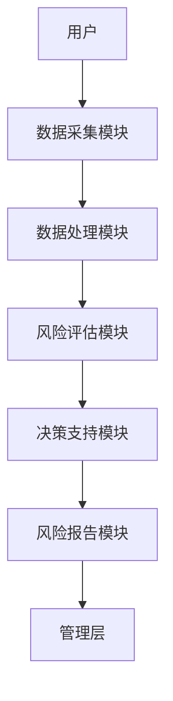
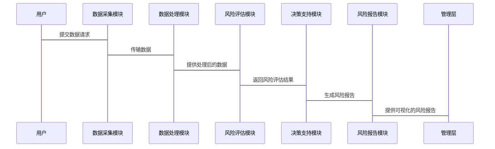

                 


```markdown
# AI在商业银行风险管理中的应用

> 关键词：AI技术，风险管理，商业银行，机器学习，金融应用

> 摘要：随着人工智能技术的迅速发展，AI在商业银行风险管理中的应用越来越广泛。本文将系统地探讨AI如何提升商业银行的风险管理能力，包括数据分析、预测模型构建以及实时监控等方面。通过实际案例分析和算法实现，本文详细讲解了AI在信用风险、市场风险等领域的具体应用，为商业银行的风险管理提供了新的思路和解决方案。

---

## 第四章: 商业银行风险管理系统的AI技术实现

### 4.1 风险管理系统构建的背景与目标
#### 4.1.1 风险管理系统构建的背景
- 当前商业银行面临的风险类型多样，包括信用风险、市场风险、操作风险等。
- 传统风险管理手段依赖人工分析，效率低且覆盖面有限。
- AI技术的应用可以显著提升风险识别和预测的效率与精度。
#### 4.1.2 风险管理系统构建的目标
- 实现风险的智能化识别与预测。
- 提供实时风险监控与预警功能。
- 优化决策支持系统，帮助管理层做出科学决策。

### 4.2 风险管理系统中的功能设计
#### 4.2.1 数据采集与处理模块
- 数据来源：客户信息、交易数据、市场数据等。
- 数据清洗与特征提取：去除噪声数据，提取关键特征。
#### 4.2.2 风险评估与预测模块
- 使用机器学习算法构建风险评估模型。
- 实时监控风险指标，提供预警信息。
#### 4.2.3 决策支持模块
- 提供风险分析报告。
- 支持决策者的风险管理策略优化。

### 4.3 系统架构设计
#### 4.3.1 系统架构图


#### 4.3.2 关键模块的功能实现
- 数据采集模块：负责从数据库中获取实时数据。
- 数据处理模块：清洗数据并提取特征。
- 风险评估模块：使用训练好的模型进行风险预测。
- 决策支持模块：根据预测结果生成决策建议。
- 风险报告模块：生成风险分析报告，提供可视化界面。

### 4.4 系统接口设计
#### 4.4.1 数据接口
- 数据输入接口：从数据库或API获取数据。
- 数据输出接口：将处理后的数据传输到下一个模块。
#### 4.4.2 用户接口
- 管理界面：供决策者查看风险报告和预警信息。
- 操作界面：供系统管理员进行数据管理和模块配置。

### 4.5 系统交互流程


### 4.6 本章小结
通过构建基于AI的商业银行风险管理系统，可以实现风险的智能化管理，显著提升风险管理的效率和准确性。系统设计注重模块化和可扩展性，便于后续功能的优化和升级。

---

## 第五章: 项目实战——基于AI的信用风险评估系统

### 5.1 项目背景与目标
#### 5.1.1 项目背景
- 信用风险是商业银行面临的主要风险之一。
- 传统信用评估方法依赖人工审核，效率低且主观性强。
- 基于AI的信用风险评估系统可以实现自动化、智能化的评估。

### 5.2 数据准备与特征工程
#### 5.2.1 数据来源
- 客户基本信息：年龄、职业、收入等。
- 贷款记录：还款历史、逾期情况等。
- 风险相关特征：信用评分、违约概率等。
#### 5.2.2 数据清洗
- 去除缺失值和异常值。
- 标准化处理：将不同量纲的特征进行标准化。
#### 5.2.3 特征选择
- 使用相关性分析选择关键特征。
- 使用特征重要性分析筛选出对风险评估影响较大的特征。

### 5.3 模型构建与训练
#### 5.3.1 选择模型
- 使用逻辑回归模型进行二分类任务。
- 使用随机森林模型进行特征重要性分析。
#### 5.3.2 模型训练
```python
from sklearn.model_selection import train_test_split
from sklearn.linear_model import LogisticRegression

# 数据分割
X_train, X_test, y_train, y_test = train_test_split(X, y, test_size=0.2, random_state=42)

# 模型训练
model = LogisticRegression()
model.fit(X_train, y_train)
```
#### 5.3.3 模型评估
- 准确率、召回率、F1分数等指标。
- 使用混淆矩阵和ROC曲线分析模型性能。

### 5.4 系统实现与优化
#### 5.4.1 系统实现
- 前端界面设计：用户输入基本信息，系统返回信用评分。
- 后端实现：接收数据，调用模型进行预测。
#### 5.4.2 系统优化
- 模型调优：使用网格搜索优化模型参数。
- 系统优化：提高处理速度和响应效率。

### 5.5 实际案例分析
#### 5.5.1 案例背景
- 某客户的基本信息和贷款记录。
- 系统预测其违约概率并提出风险管理建议。
#### 5.5.2 分析结果
- 预测结果与实际结果对比。
- 系统给出的风险管理建议。

### 5.6 本章小结
通过构建基于AI的信用风险评估系统，可以显著提高风险评估的效率和准确性。系统的实际案例分析证明了其在商业银行风险管理中的有效性。

---

## 第六章: 总结与展望

### 6.1 全文总结
- AI技术为商业银行风险管理提供了新的工具和方法。
- 通过数据分析和模型构建，可以实现风险的智能化管理。
- 系统设计注重模块化和可扩展性，便于后续优化和升级。

### 6.2 未来展望
- AI技术的进一步发展将推动风险管理系统的智能化和自动化。
- 多模态数据的引入将提升风险评估的精准度。
- 区块链技术的应用将增强风险管理系统的安全性和可信度。

### 6.3 最佳实践 tips
- 数据质量是风险管理的基础，需加强数据清洗和特征工程。
- 模型选择需结合实际业务需求和数据特点。
- 系统设计需注重可解释性和可维护性。

### 6.4 本章小结
AI在商业银行风险管理中的应用前景广阔，未来将有更多创新技术的应用，进一步提升风险管理的效率和效果。

---

## 作者信息

作者：AI天才研究院/AI Genius Institute & 禅与计算机程序设计艺术/Zen And The Art of Computer Programming

---

**本文为原创内容，转载请注明出处。**
```

