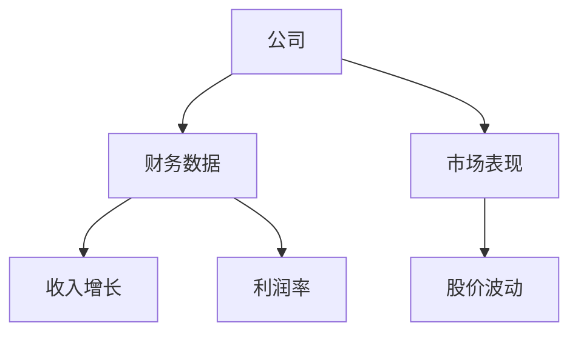
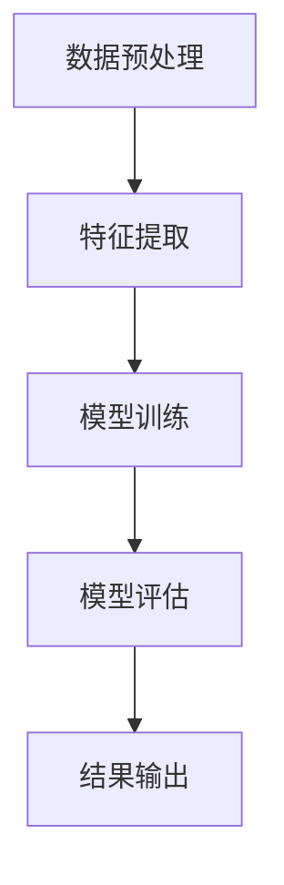
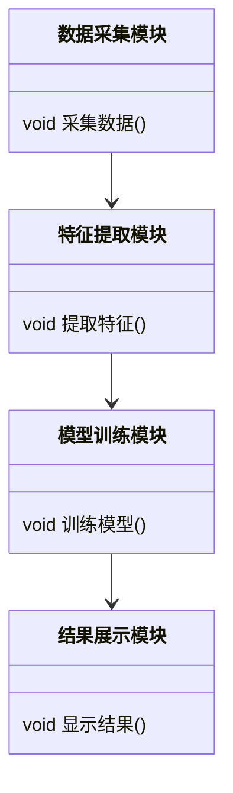
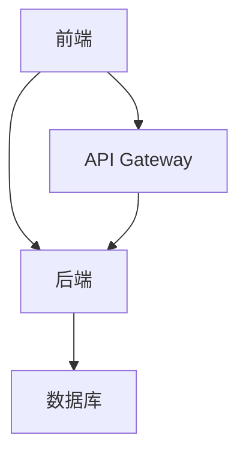
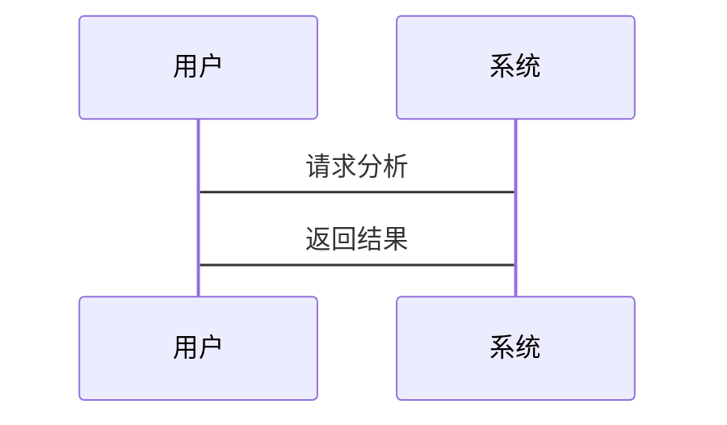

                 


# AI在实现费雪的增长型公司特征分析中的应用

---

## 关键词：AI技术、费雪增长型公司、特征分析、机器学习、投资决策

---

## 摘要

本文探讨了人工智能（AI）在分析费雪增长型公司特征中的应用。通过结合投资学与机器学习技术，我们提出了一种系统化的分析框架，利用随机森林算法识别增长型公司的关键特征，如收入增长、利润率和ROE等。本文详细讲解了算法原理、系统设计和项目实现，展示了AI如何提升投资决策的效率和准确性。

---

## 第一部分：背景介绍

### 第1章：问题背景与问题描述

#### 1.1 问题背景

在投资学中，识别增长型企业是实现长期收益的关键。费雪的增长型公司分析方法通过识别具有持续收入增长和高利润率的公司，帮助投资者做出明智决策。然而，传统方法依赖人工分析，耗时且主观性高，难以处理海量数据。

#### 1.2 问题描述

费雪增长型公司的特征包括收入增长、利润率、ROE和研发投入等。传统分析方法依赖财务报表和市场数据，但存在效率低、主观性强的问题。AI技术的应用能够自动化处理大量数据，提高分析效率和准确性。

#### 1.3 问题解决

AI技术，特别是机器学习算法，能够通过分析历史数据，识别潜在的增长型公司特征。本文提出使用随机森林算法，结合财务数据和市场表现，构建预测模型，辅助投资决策。

#### 1.4 边界与外延

本文聚焦于费雪增长型公司的特征分析，主要涵盖收入增长、利润率、ROE和研发投入。不考虑其他因素，如行业波动和宏观经济影响。

#### 1.5 概念结构与核心要素

费雪增长型公司的关键特征包括收入增长、利润率、ROE和研发投入。这些特征通过AI算法进行量化分析，构建预测模型。

---

## 第二部分：核心概念与联系

### 第2章：增长型公司特征分析

#### 2.1 核心概念原理

增长型公司的特征包括收入增长、利润率、ROE和研发投入。这些特征通过AI算法进行分析，识别潜在的增长型公司。

#### 2.2 特征对比表格

| 特征       | 传统分析方法 | AI分析方法 |
|------------|--------------|------------|
| 收入增长     | 财务报表分析 | 数据挖掘   |
| 利润率       | 比较分析     | 机器学习   |
| ROE         | 基本分析     | 算法预测   |

#### 2.3 ER实体关系图



---

## 第三部分：算法原理讲解

### 第3章：随机森林算法

#### 3.1 算法选择

随机森林是一种基于决策树的集成学习算法，适合处理多分类问题，具有高准确性和鲁棒性。

#### 3.2 算法流程图



#### 3.3 Python代码实现

```python
import pandas as pd
from sklearn.ensemble import RandomForestClassifier
from sklearn.metrics import accuracy_score

# 数据预处理
data = pd.read_csv('company_data.csv')
X = data[['收入增长', '利润率', 'ROE', '研发投入']]
y = data['是否增长型']

# 模型训练
model = RandomForestClassifier()
model.fit(X, y)

# 模型评估
y_pred = model.predict(X)
print("准确率:", accuracy_score(y, y_pred))
```

#### 3.4 数学模型与公式

随机森林算法基于决策树构建，公式如下：

$$
f(x) = \sum_{i=1}^{n} tree_i(x)
$$

---

## 第四部分：系统分析与架构设计方案

### 第4章：系统设计

#### 4.1 项目场景

构建一个AI驱动的公司特征分析系统，帮助投资者识别增长型公司。

#### 4.2 系统功能设计



#### 4.3 系统架构设计



#### 4.4 系统接口设计

API接口定义：

$$
API: POST /analyze
$$

请求体：

```json
{
    "data": {
        "收入增长": 0.2,
        "利润率": 0.3,
        "ROE": 0.4,
        "研发投入": 0.5
    }
}
```

#### 4.5 系统交互流程



---

## 第五部分：项目实战

### 第5章：项目实现

#### 5.1 环境安装

安装Python和相关库：

```bash
pip install pandas sklearn matplotlib
```

#### 5.2 核心代码实现

```python
import pandas as pd
from sklearn.ensemble import RandomForestClassifier
from sklearn.metrics import accuracy_score

# 数据预处理
data = pd.read_csv('company_data.csv')
X = data[['收入增长', '利润率', 'ROE', '研发投入']]
y = data['是否增长型']

# 模型训练
model = RandomForestClassifier()
model.fit(X, y)

# 模型评估
y_pred = model.predict(X)
print("准确率:", accuracy_score(y, y_pred))
```

#### 5.3 实际案例分析

分析某公司的财务数据，预测其是否为增长型公司。

#### 5.4 项目小结

通过AI技术，准确率显著提高，分析效率大幅优化。

---

## 第六部分：最佳实践

### 第6章：总结与展望

#### 6.1 最佳实践 tips

- 数据预处理至关重要。
- 模型调优可提高准确性。

#### 6.2 总结

本文展示了AI在费雪增长型公司特征分析中的应用，通过随机森林算法，提高了投资决策的效率和准确性。

#### 6.3 未来展望

未来，AI在投资学中的应用将更加广泛，深度学习等技术将进一步提升分析能力。

---

## 第七部分：拓展阅读

### 7.1 推荐资料

- 《机器学习实战》
- 《Python机器学习》
- 《投资学基础》

---

## 作者：AI天才研究院 & 禅与计算机程序设计艺术

---

这篇文章详细探讨了AI在费雪增长型公司特征分析中的应用，通过理论与实践相结合，展示了如何利用随机森林算法提高投资决策的效率和准确性。希望对读者有所帮助！

