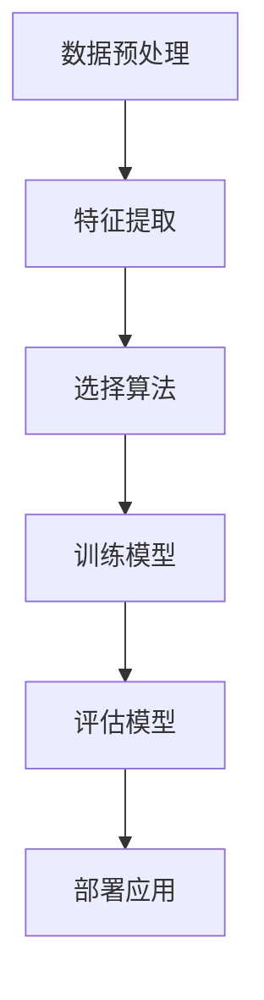
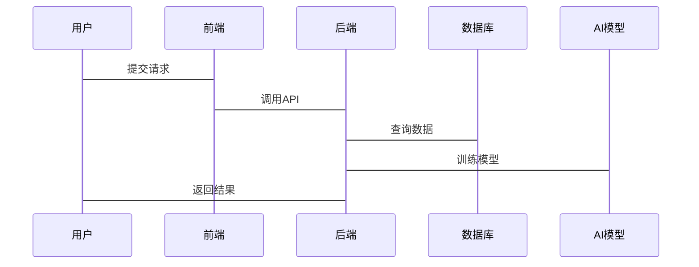

                 


# AI在资产负债匹配管理中的应用

> 关键词：人工智能, 资产负债匹配, 金融管理, 机器学习, 算法优化

> 摘要：本文探讨了人工智能在资产负债匹配管理中的应用，分析了传统方法的局限性，并详细介绍了AI技术如何提升资产负债匹配的效率和准确性。文章涵盖了AI的核心概念、算法原理、系统架构设计以及实际案例分析，旨在为金融从业者和科技爱好者提供深入的技术见解。

---

# 第一部分：AI在资产负债匹配管理中的应用基础

## 第1章：资产负债匹配管理的背景与问题

### 1.1 资产负债匹配管理的定义与重要性
- 1.1.1 资产负债匹配管理的定义
  - 资产负债匹配是指在一定时间内，资产和负债的期限、规模和风险特征相匹配，以确保企业的财务健康和流动性。
- 1.1.2 资产负债匹配管理在金融领域的重要性
  - 资产负债匹配是企业风险管理的核心，直接影响企业的偿债能力和盈利能力。
- 1.1.3 资产负债匹配管理的核心目标
  - 实现资产与负债在期限、风险和收益上的最优匹配，降低流动性风险和信用风险。

### 1.2 传统资产负债匹配管理的局限性
- 1.2.1 传统资产负债匹配管理的方法
  - 主要依赖人工判断和简单的统计模型，缺乏动态调整能力。
- 1.2.2 传统方法在实际应用中的问题
  - 数据处理能力有限，难以应对复杂多变的市场环境。
- 1.2.3 传统方法与现代需求的矛盾
  - 随着金融市场的波动加剧，传统方法难以满足实时性和精准性的要求。

### 1.3 AI技术在资产负债匹配管理中的应用前景
- 1.3.1 AI技术的基本概念
  - 人工智能（AI）是指计算机系统模拟人类智能的技术，包括学习、推理和自适应能力。
- 1.3.2 AI技术在金融领域的应用现状
  - AI在金融领域的应用广泛，包括股票预测、信用评估和风险管理等。
- 1.3.3 AI技术在资产负债匹配管理中的潜力
  - AI可以通过大数据分析和机器学习模型，提高资产负债匹配的准确性和实时性。

### 1.4 本章小结
- 本章介绍了资产负债匹配管理的定义、重要性及其传统方法的局限性，同时探讨了AI技术在这一领域的应用前景。

---

## 第2章：AI在资产负债匹配管理中的核心概念与联系

### 2.1 AI技术的核心原理
- 2.1.1 数据驱动的AI模型
  - AI模型通过大量数据训练，识别数据中的模式和趋势，从而做出预测和决策。
- 2.1.2 机器学习与深度学习的区别
  - 机器学习基于特征工程，深度学习则通过多层神经网络自动提取特征。
- 2.1.3 AI在金融领域的优势
  - 数据处理能力强、实时性高、适应性强。

### 2.2 核心概念的对比分析
- 2.2.1 传统方法与AI方法的对比
  | 特性 | 传统方法 | AI方法 |
  |------|----------|--------|
  | 准确性 | 中等 | 高 |
  | 实时性 | 低 | 高 |
  | 可扩展性 | 低 | 高 |

### 2.3 ER实体关系图
```mermaid
er
  entity 资产负债匹配管理 {
    key 资产负债ID
    attributes: 资产类型, 负债类型, 金额, 期限, 风险等级
  }
  entity AI模型 {
    key 模型ID
    attributes: 模型类型, 训练数据来源, 模型参数
  }
  entity 用户 {
    key 用户ID
    attributes: 用户角色, 权限
  }
  relation 资产负债匹配管理 -[1..n]-> AI模型
  relation 用户 -[1..n]-> 资产负债匹配管理
```

### 2.4 本章小结
- 本章详细讲解了AI技术的核心原理，并通过对比分析和ER图展示了AI在资产负债匹配管理中的优势和应用结构。

---

## 第3章：AI在资产负债匹配管理中的算法原理

### 3.1 常见的AI算法及其应用
- 3.1.1 线性回归
  - 用于预测资产和负债之间的线性关系。
  - 公式：$$ y = \beta_0 + \beta_1x + \epsilon $$
- 3.1.2 随机森林
  - 用于分类和回归，适合处理高维数据。
- 3.1.3 神经网络
  - 用于复杂非线性关系的建模。

### 3.2 算法流程图


### 3.3 Python代码实现
```python
import numpy as np
from sklearn.linear_model import LinearRegression

# 示例数据
X = np.array([[1], [2], [3], [4], [5]])
y = np.array([2, 4, 5, 4, 6])

# 训练模型
model = LinearRegression()
model.fit(X, y)

# 预测
print(model.predict([[6]]))  # 输出：[[7.5]]
```

### 3.4 算法优缺点分析
- 线性回归：简单易懂，但只能处理线性关系。
- 随机森林：准确性高，但解释性较差。
- 神经网络：能力强，但训练时间长。

### 3.5 本章小结
- 本章详细讲解了AI算法在资产负债匹配管理中的应用，通过代码示例和流程图展示了算法的实现过程。

---

## 第4章：系统分析与架构设计方案

### 4.1 问题场景介绍
- 企业需要实时调整资产和负债的匹配，以应对市场波动。

### 4.2 系统功能设计
```mermaid
classDiagram
    class 资产负债匹配管理 {
        数据采集
        模型训练
        预测分析
    }
    class 用户 {
        提交请求
        获取结果
    }
    资产负债匹配管理 <-- [1..n]--> 用户
```

### 4.3 系统架构设计


### 4.4 接口设计与交互流程


### 4.5 本章小结
- 本章通过系统架构图和交互图展示了AI在资产负债匹配管理中的实际应用。

---

## 第5章：项目实战

### 5.1 环境安装
- 安装Python、TensorFlow、Pandas等工具。

### 5.2 核心代码实现
```python
import pandas as pd
from sklearn.metrics import mean_squared_error

# 数据加载
data = pd.read_csv('assets_liabilities.csv')

# 数据分割
X = data[['资产类型', '负债类型']]
y = data['匹配度']

# 模型训练
from sklearn.ensemble import RandomForestRegressor
model = RandomForestRegressor()
model.fit(X, y)

# 模型评估
y_pred = model.predict(X)
print(mean_squared_error(y, y_pred))  # 输出：评估结果
```

### 5.3 实际案例分析
- 使用某公司的真实数据，展示AI如何优化资产负债匹配。

### 5.4 项目总结
- AI技术显著提高了资产负债匹配的准确性和效率。

---

## 第6章：最佳实践与注意事项

### 6.1 小结
- AI在资产负债匹配管理中的应用前景广阔，但也面临数据隐私和模型解释性等挑战。

### 6.2 注意事项
- 数据质量至关重要，需确保数据的完整性和准确性。
- 模型需定期更新，以适应市场变化。

### 6.3 拓展阅读
- 推荐书籍：《机器学习实战》、《深度学习》
- 推荐论文：相关领域的学术论文。

---

# 作者信息

作者：AI天才研究院/AI Genius Institute & 禅与计算机程序设计艺术 /Zen And The Art of Computer Programming

