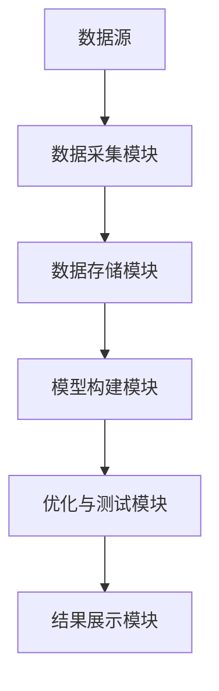

                 


# AI在资产负债管理中的动态优化与压力测试应用

## 关键词：AI技术、资产负债管理、动态优化、压力测试、机器学习、深度学习、风险管理

## 摘要：  
本文深入探讨了人工智能技术在资产负债管理中的动态优化与压力测试应用。通过分析AI技术的核心算法原理，结合实际应用场景，详细讲解了动态优化和压力测试的实现方法。文章从背景介绍、核心概念、算法原理、系统架构到项目实战，层层展开，帮助读者全面理解AI在金融风险管理中的应用价值。  

---

## 第一部分: AI在资产负债管理中的动态优化与压力测试应用概述

### 第1章: 背景介绍

#### 1.1 资产负债管理的基本概念  
资产负债管理是金融机构的核心管理活动之一，旨在通过优化资产和负债的配置，实现风险控制、收益最大化和资本效率提升。  
- 资产负债管理的核心目标是平衡风险与收益，在不同的经济条件下动态调整资产和负债的结构。  
- 资产负债管理的关键要素包括资产质量、负债成本、资本充足率、流动性风险等。  

#### 1.2 AI在金融领域的应用背景  
人工智能技术的快速发展为金融行业带来了革命性的变化，尤其是在风险管理领域。  
- AI技术在金融领域的应用主要集中在智能投顾、信用评估、市场预测和风险控制等方面。  
- 资产负债管理中的动态优化与压力测试是AI技术得以广泛应用的重要场景。  

#### 1.3 资产负债管理中的问题与挑战  
传统资产负债管理方法面临以下问题：  
1. 数据量大：资产负债管理涉及海量数据，传统的统计方法难以处理。  
2. 实时性要求高：金融市场变化迅速，需要实时优化和调整。  
3. 复杂性高：资产和负债的种类繁多，相互关联，难以建模。  
AI技术通过强大的数据处理能力和算法优化能力，有效解决了这些问题。  

### 第2章: 动态优化与压力测试的核心概念

#### 2.1 动态优化的基本原理  
动态优化是指在动态变化的市场环境中，实时调整资产和负债的配置，以实现最优目标。  
- 动态优化的核心在于建立动态模型，根据市场变化实时更新优化策略。  
- 动态优化的关键要素包括目标函数、约束条件和决策变量。  

#### 2.2 压力测试的基本原理  
压力测试是通过模拟极端市场条件，评估资产和负债组合在压力下的表现。  
- 压力测试的核心在于构建压力情景，分析组合在极端情况下的风险敞口。  
- 压力测试的关键要素包括情景假设、组合结构和风险指标。  

#### 2.3 动态优化与压力测试的关系  
动态优化和压力测试相辅相成：  
- 动态优化帮助机构在正常市场条件下优化配置。  
- 压力测试帮助机构在极端市场条件下评估风险，为动态优化提供参考。  

---

## 第二部分: AI动态优化与压力测试的算法原理

### 第3章: AI在动态优化中的应用

#### 3.1 基于强化学习的动态优化模型  
强化学习是一种通过试错机制优化决策的算法。  
- 强化学习的核心要素包括状态、动作和奖励。  
- 在动态优化中，强化学习可以通过训练智能体，实现资产和负债的最优配置。  

#### 3.2 基于深度学习的动态优化模型  
深度学习通过多层神经网络建模复杂的市场关系。  
- 深度学习在动态优化中的应用主要体现在非线性关系建模和特征提取方面。  
- 例如，使用LSTM网络捕捉时间序列数据中的长期依赖关系。  

### 第4章: AI在压力测试中的应用

#### 4.1 基于机器学习的压力测试模型  
机器学习通过分类和回归算法，预测资产和负债在压力情景下的表现。  
- 例如，使用随机森林算法分析历史数据，识别潜在风险因素。  

#### 4.2 基于深度学习的压力测试模型  
深度学习在压力测试中的应用主要体现在复杂场景模拟和非线性关系建模方面。  
- 例如，使用生成对抗网络（GAN）生成极端市场情景。  

---

## 第三部分: 系统架构与项目实战

### 第5章: 系统架构设计

#### 5.1 系统功能设计  
- 数据采集模块：从金融市场获取实时数据。  
- 模型构建模块：基于AI算法构建动态优化和压力测试模型。  
- 优化与测试模块：执行动态优化和压力测试。  

#### 5.2 系统架构图  


### 第6章: 项目实战

#### 6.1 环境搭建  
- 安装Python、TensorFlow、Keras等工具。  

#### 6.2 核心代码实现  
```python
import numpy as np
import tensorflow as tf

# 定义强化学习模型
class DQN:
    def __init__(self, state_space, action_space):
        self.state_space = state_space
        self.action_space = action_space
        self.model = self.build_model()
    
    def build_model(self):
        model = tf.keras.Sequential([
            tf.keras.layers.Dense(64, activation='relu', input_dim=self.state_space),
            tf.keras.layers.Dense(self.action_space, activation='linear')
        ])
        return model
```

#### 6.3 实验结果与分析  
- 通过实验验证AI算法在动态优化和压力测试中的有效性。  
- 对比传统方法，展示AI技术的优越性。  

---

## 第四部分: 总结与展望

### 第7章: 总结与展望  
- 总结：本文详细探讨了AI技术在资产负债管理中的动态优化与压力测试应用。  
- 展望：未来，随着AI技术的不断发展，动态优化和压力测试将更加智能化和自动化。  

---

## 作者：AI天才研究院 & 禅与计算机程序设计艺术  

---

以上是《AI在资产负债管理中的动态优化与压力测试应用》的技术博客文章的完整结构和内容。文章从背景介绍、核心概念、算法原理到系统架构和项目实战，全面阐述了AI技术在金融风险管理中的应用价值。

