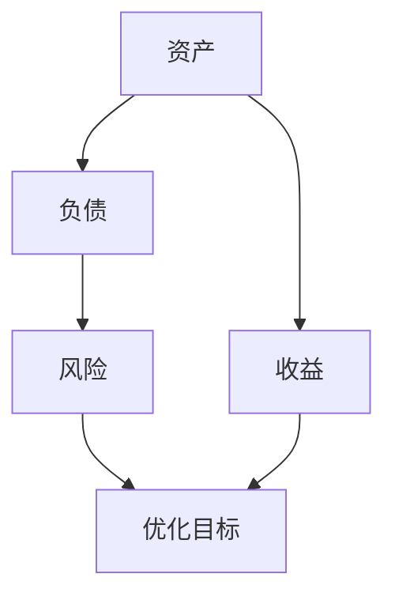
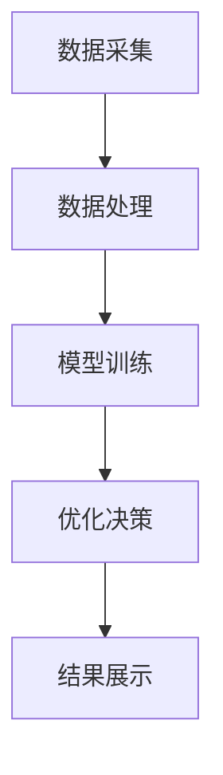
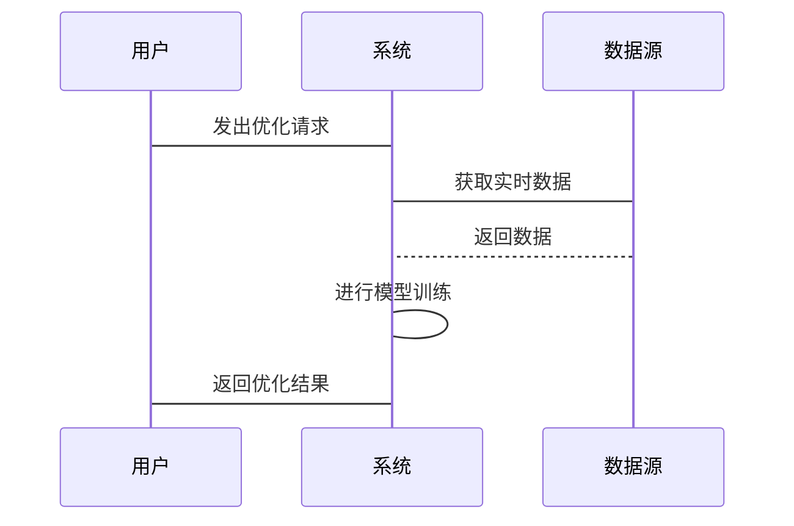

                 


# AI在资产负债管理动态优化中的应用

## 关键词
人工智能, 资产负债管理, 动态优化, 风险管理, 金融建模, 机器学习

## 摘要
本文探讨了人工智能在资产负债管理动态优化中的应用，详细分析了AI技术如何通过机器学习和深度学习等方法，优化资产负债配置，降低风险，提升决策效率。文章从背景、核心概念、算法原理、系统架构到项目实战，层层深入，结合实际案例和代码实现，全面解析AI在现代金融管理中的革命性作用。

---

# 第一部分: AI在资产负债管理动态优化中的应用概述

## 第1章: 背景介绍

### 1.1 问题背景

#### 1.1.1 资产负债管理的传统方法与局限性
传统的资产负债管理依赖于静态模型和经验判断，存在以下问题：
- **数据依赖性**：过于依赖历史数据，难以应对实时变化。
- **决策滞后**：缺乏动态调整能力，难以应对市场波动。
- **复杂性**：随着资产种类和负债类型的增加，优化问题复杂性指数级上升。

#### 1.1.2 动态优化在资产负债管理中的重要性
动态优化是指在时间和空间维度上不断调整资产和负债的配置，以实现最优目标。其重要性体现在：
- **实时响应**：能够快速适应市场变化。
- **风险控制**：通过动态调整降低潜在风险。
- **效率提升**：优化资源配置，提高整体收益。

#### 1.1.3 AI技术如何解决传统方法的不足
人工智能技术，尤其是机器学习和深度学习，能够处理海量数据，发现复杂模式，实时优化决策。AI通过以下方式解决传统方法的不足：
- **实时数据分析**：利用流数据处理技术，实时更新优化模型。
- **非线性关系建模**：能够捕捉传统模型难以发现的非线性关系。
- **自我学习与进化**：通过强化学习等方法，模型能够不断进化，适应复杂环境。

### 1.2 核心概念

#### 1.2.1 资产负债管理的定义与目标
**资产负债管理**是指对资产和负债的组合进行规划和控制，以实现企业或机构的财务目标。其核心目标包括：
- **风险最小化**：降低市场风险、信用风险和流动性风险。
- **收益最大化**：在风险可控的前提下，实现资产收益最大化。
- **合规性**：确保资产和负债的配置符合监管要求。

#### 1.2.2 动态优化的定义与特点
**动态优化**是在动态变化的环境中，通过不断调整变量，以达到最优目标的过程。其特点包括：
- **实时性**：能够实时调整优化方案。
- **适应性**：能够适应环境变化。
- **全局最优**：通过算法找到全局最优解。

#### 1.2.3 AI在动态优化中的作用
AI通过以下方式在动态优化中发挥关键作用：
- **数据处理**：能够快速处理大量数据，提取有用信息。
- **模式识别**：能够识别数据中的模式和趋势，指导优化决策。
- **预测与模拟**：通过机器学习模型，预测未来趋势，模拟不同场景下的结果。

### 1.3 技术基础

#### 1.3.1 机器学习的基本概念
机器学习是一种通过数据训练模型，使其能够从数据中学习并做出预测或决策的技术。主要类型包括监督学习、无监督学习和强化学习。

#### 1.3.2 深度学习与强化学习简介
- **深度学习**：通过多层神经网络，自动提取数据特征，常用于图像识别、自然语言处理等领域。
- **强化学习**：通过试错机制，学习最优策略，常用于动态优化和博弈问题。

#### 1.3.3 动态规划与优化算法
动态规划是一种解决多阶段决策问题的方法，通过分解问题，找到各阶段的最优解，最终得到全局最优解。

### 1.4 应用价值

#### 1.4.1 提高决策效率
AI能够快速处理大量数据，提供实时优化建议，显著提高决策效率。

#### 1.4.2 降低风险
通过动态调整资产和负债配置，AI能够有效降低市场波动带来的风险。

#### 1.4.3 提升资产配置效率
AI能够根据市场变化，实时调整资产配置，提升整体收益。

## 第2章: AI技术与动态优化的核心概念

### 2.1 AI技术的核心原理

#### 2.1.1 机器学习模型的训练过程
机器学习模型的训练过程包括数据预处理、模型选择、参数优化和模型评估等步骤。

#### 2.1.2 深度学习的神经网络结构
深度学习通过多层神经网络，自动提取数据特征，常用于复杂模式识别。

#### 2.1.3 强化学习的基本原理
强化学习通过试错机制，学习最优策略，常用于动态优化和博弈问题。

### 2.2 动态优化模型

#### 2.2.1 动态规划的基本概念
动态规划是一种解决多阶段决策问题的方法，通过分解问题，找到各阶段的最优解，最终得到全局最优解。

#### 2.2.2 动态优化的数学模型
动态优化的数学模型通常包括状态变量、决策变量、目标函数和约束条件。

#### 2.2.3 动态优化与AI的结合
AI通过强化学习和深度学习等技术，优化动态规划模型，提高求解效率和准确性。

### 2.3 核心概念对比表

| 概念       | 传统优化方法 | AI动态优化方法 |
|------------|--------------|----------------|
| 方法       | 确定性模型    | 非确定性模型    |
| 算法       | 线性规划      | 强化学习        |
| 应用场景   | 静态问题      | 动态变化问题    |

### 2.4 ER实体关系图



---

# 第二部分: AI在资产负债管理动态优化中的实现与应用

## 第3章: 算法原理与实现

### 3.1 算法原理

#### 3.1.1 强化学习在动态优化中的应用
强化学习通过试错机制，学习最优策略，常用于动态优化和博弈问题。

#### 3.1.2 非线性规划模型
非线性规划模型是一种用于求解非线性目标函数和约束条件的优化问题的方法。

#### 3.1.3 预测与优化的结合
通过机器学习模型预测市场趋势，优化资产和负债配置。

### 3.2 算法实现

#### 3.2.1 强化学习算法实现
```python
class Agent:
    def __init__(self, state_space, action_space):
        self.state_space = state_space
        self.action_space = action_space
        self.model = self.build_model()

    def build_model(self):
        # 构建神经网络模型
        pass

    def act(self, state):
        # 根据当前状态选择动作
        pass

    def learn(self, state, action, reward, next_state):
        # 更新模型参数
        pass
```

#### 3.2.2 预测模型实现
```python
from tensorflow.keras import layers

model = tf.keras.Sequential([
    layers.Dense(64, activation='relu'),
    layers.Dense(1, activation='linear')
])

model.compile(optimizer='adam', loss='mean_squared_error')
```

### 3.3 数学模型与公式

#### 3.3.1 强化学习的基本公式
$$ Q(s, a) = r + \gamma \max_{a'} Q(s', a') $$

#### 3.3.2 非线性规划模型
$$ \min_{x} f(x) $$
$$ \text{subject to } g(x) \leq 0 $$

---

## 第4章: 系统架构与设计

### 4.1 系统架构设计

#### 4.1.1 系统功能模块设计
- 数据采集模块
- 数据处理模块
- 模型训练模块
- 优化决策模块
- 结果展示模块

#### 4.1.2 系统架构图


### 4.2 接口设计

#### 4.2.1 数据接口
- 数据输入接口
- 数据输出接口

#### 4.2.2 模型接口
- 模型训练接口
- 模型预测接口

### 4.3 交互流程



---

## 第5章: 项目实战

### 5.1 环境安装

#### 5.1.1 安装Python
```bash
python --version
pip install --upgrade pip
```

#### 5.1.2 安装依赖包
```bash
pip install numpy pandas scikit-learn tensorflow
```

### 5.2 核心代码实现

#### 5.2.1 加载数据
```python
import pandas as pd

data = pd.read_csv('data.csv')
```

#### 5.2.2 构建模型
```python
import tensorflow as tf
from tensorflow.keras import layers

model = tf.keras.Sequential([
    layers.Dense(64, activation='relu'),
    layers.Dense(1, activation='linear')
])

model.compile(optimizer='adam', loss='mean_squared_error')
```

#### 5.2.3 训练模型
```python
model.fit(x_train, y_train, epochs=100, batch_size=32)
```

### 5.3 案例分析

#### 5.3.1 数据分析
通过分析市场数据，识别潜在风险和机会。

#### 5.3.2 模型优化
通过多次训练和调整模型参数，提高预测精度。

#### 5.3.3 结果展示
将优化结果以可视化形式展示，便于理解和决策。

---

## 第6章: 总结与展望

### 6.1 最佳实践 tips
- 定期更新模型，适应市场变化。
- 结合专家知识，优化模型性能。
- 加强数据质量管理，提高模型准确性。

### 6.2 小结
本文详细介绍了AI在资产负债管理动态优化中的应用，从背景、核心概念、算法原理到系统设计和项目实战，全面解析了AI技术如何提升资产负债管理的效率和准确性。

### 6.3 注意事项
- 数据隐私和安全问题
- 模型的可解释性
- 系统的实时性和稳定性

### 6.4 拓展阅读
- 《强化学习入门》
- 《机器学习实战》
- 《动态规划与优化算法》

---

# 作者：AI天才研究院/AI Genius Institute & 禅与计算机程序设计艺术/Zen And The Art of Computer Programming

