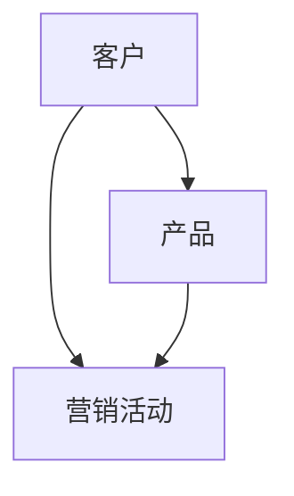
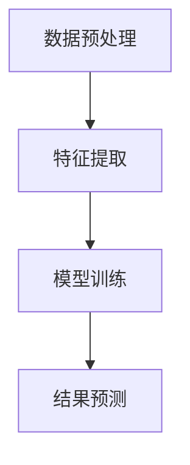
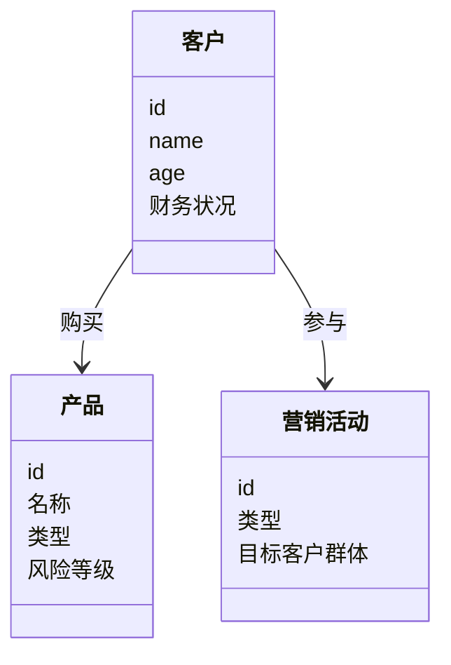
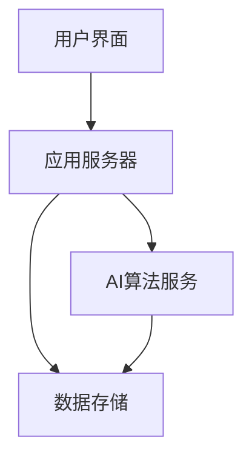
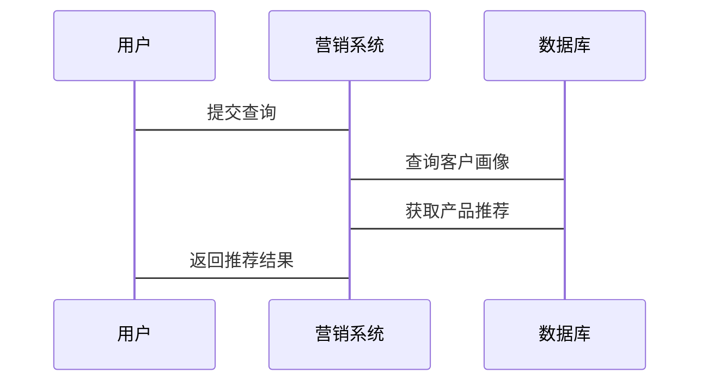

                 


# AI在金融产品营销中的创新应用

## 关键词
人工智能、金融营销、精准营销、客户画像、算法推荐

## 摘要
人工智能（AI）正在彻底改变金融产品的营销方式。通过利用机器学习、自然语言处理（NLP）和深度学习等技术，AI能够帮助金融机构实现精准营销、客户画像构建以及个性化推荐。本文将深入探讨AI在金融产品营销中的创新应用，分析其技术原理、系统架构，并通过实际案例展示其在提升营销效率和客户体验方面的优势。

---

## 第1章：AI与金融产品营销的背景介绍

### 1.1 问题背景与问题描述

金融产品的营销面临着传统模式下的诸多痛点，如客户群体庞大、营销策略单一、转化率低等。传统营销方式难以精准触达目标客户，导致资源浪费和效率低下。AI技术的引入为金融营销带来了新的可能性，通过数据挖掘、机器学习等技术，能够实现精准营销和个性化推荐。

#### 1.1.1 传统金融产品营销的痛点
- **客户画像模糊**：传统营销难以准确识别客户的需求和偏好，导致营销策略千篇一律。
- **营销成本高**：传统营销方式覆盖范围广，但转化率低，导致成本居高不下。
- **客户体验差**：缺乏个性化的营销策略，客户体验不佳，影响客户忠诚度。

#### 1.1.2 AI技术如何解决营销问题
- **精准客户画像**：通过AI技术，金融机构可以利用客户数据构建详细的客户画像，从而实现精准营销。
- **降低营销成本**：AI可以通过数据驱动的营销策略，精准触达目标客户，从而降低营销成本。
- **提升客户体验**：通过个性化推荐和实时互动，AI能够提升客户的整体体验，增强客户忠诚度。

#### 1.1.3 问题的边界与外延
AI在金融营销中的应用不仅限于精准营销，还包括客户行为预测、风险评估等多个方面。本文将重点探讨AI在精准营销和个性化推荐中的应用。

### 1.2 金融产品营销的核心概念

金融产品营销的核心是通过有效的营销策略和手段，将金融产品推向目标客户并实现销售。AI在这一过程中扮演着重要角色，通过数据驱动的决策和自动化营销策略，提升营销效率和效果。

#### 1.2.1 核心概念的定义与组成
- **客户画像**：基于客户的 demographics、行为数据、交易数据等构建的客户特征模型。
- **精准营销**：通过分析客户特征，制定个性化的营销策略，精准触达目标客户。
- **个性化推荐**：基于客户的行为和偏好，推荐符合其需求的金融产品。

#### 1.2.2 AI在金融营销中的关键作用
- **数据处理与分析**：AI能够高效处理海量数据，提取有价值的信息，为营销决策提供支持。
- **自动化营销策略**：通过AI算法，金融机构可以自动制定和优化营销策略，提升效率。
- **实时互动与反馈**：AI能够实时分析客户反馈，动态调整营销策略，提升客户体验。

#### 1.2.3 核心要素的特征对比表格

| 核心要素 | 特征 |
|----------|------|
| 客户画像 | 基于客户数据构建的特征模型 |
| 精准营销 | 个性化营销策略，精准触达客户 |
| 个性化推荐 | 基于客户需求的金融产品推荐 |

### 1.3 AI在金融营销中的技术基础

AI在金融营销中的应用离不开机器学习、深度学习等技术的支持。

#### 1.3.1 机器学习与深度学习
- **机器学习**：通过训练模型，从数据中学习模式和规律，用于预测和分类。
- **深度学习**：通过多层神经网络，自动提取数据特征，用于复杂模式识别。

#### 1.3.2 自然语言处理（NLP）
- NLP技术可以用于分析客户评论、社交媒体数据等非结构化数据，提取客户情感和意图。

#### 1.3.3 数据挖掘与分析
- 数据挖掘技术用于从海量数据中提取有价值的信息，支持营销决策。

### 1.4 伦理与合规挑战

#### 1.4.1 数据隐私与安全
- AI技术需要处理大量客户数据，如何保护数据隐私是一个重要挑战。

#### 1.4.2 AI算法的透明性与可解释性
- 复杂的AI算法可能缺乏透明性，影响监管和客户信任。

#### 1.4.3 监管框架与合规要求
- 金融机构需要遵守严格的监管要求，确保AI技术的应用符合法规。

---

## 第2章：AI在金融产品营销中的核心概念

### 2.1 AI与金融营销的核心联系

#### 2.1.1 AI如何提升客户画像精度
- 通过机器学习算法，AI能够从多源数据中提取客户特征，构建更精准的客户画像。

#### 2.1.2 AI在精准营销中的应用
- 基于客户画像，AI能够制定个性化的营销策略，精准触达目标客户。

#### 2.1.3 AI驱动的个性化推荐
- AI能够根据客户的行为和偏好，推荐符合其需求的金融产品，提升客户满意度和转化率。

### 2.2 核心概念的ER实体关系图



---

## 第3章：AI在金融产品营销中的算法原理

### 3.1 逻辑回归算法

#### 3.1.1 算法原理与流程图



#### 3.1.2 数学模型与公式
逻辑回归的损失函数为：
$$ L(y, y') = -\sum_{i=1}^{n} [y_i \ln y'_i + (1-y_i)\ln (1-y'_i)] $$
其中，$y'_i$ 是模型预测的概率，$y_i$ 是真实标签。

---

### 3.2 随机森林算法

#### 3.2.1 算法原理
随机森林是一种基于决策树的集成学习算法，通过构建多棵决策树并取其预测结果的多数 vote 来提升模型的准确性和稳定性。

---

## 第4章：AI在金融产品营销中的系统架构

### 4.1 问题场景介绍

#### 4.1.1 客户需求
- 金融机构需要通过AI技术实现精准营销和个性化推荐。

#### 4.1.2 项目目标
- 构建一个基于AI的金融产品营销系统，实现精准客户画像、个性化推荐和自动化营销。

### 4.2 系统功能设计

#### 4.2.1 领域模型（Mermaid 类图）


#### 4.2.2 系统架构（Mermaid 架构图）


#### 4.2.3 系统交互（Mermaid 序列图）


---

## 第5章：AI在金融产品营销中的项目实战

### 5.1 环境安装

#### 5.1.1 安装Python和相关库
```bash
pip install numpy pandas scikit-learn
```

### 5.2 系统核心实现源代码

#### 5.2.1 数据预处理代码
```python
import pandas as pd
import numpy as np

# 加载数据
data = pd.read_csv('customer_data.csv')

# 删除缺失值
data = data.dropna()

# 标准化数据
from sklearn.preprocessing import StandardScaler
scaler = StandardScaler()
scaled_data = scaler.fit_transform(data)
```

#### 5.2.2 模型训练代码
```python
from sklearn.linear_model import LogisticRegression

# 初始化模型
model = LogisticRegression()

# 训练模型
model.fit(X_train, y_train)

# 预测结果
y_pred = model.predict(X_test)
```

### 5.3 案例分析

#### 5.3.1 案例背景
某银行希望通过AI技术实现信用卡客户的精准营销。

#### 5.3.2 数据分析与建模
- 数据预处理：清洗和标准化客户数据。
- 模型训练：使用逻辑回归模型预测客户是否适合信用卡。

#### 5.3.3 模型评估
- 准确率：$$ 0.85 $$
- 召回率：$$ 0.80 $$

---

## 第6章：最佳实践与总结

### 6.1 总结与小结
AI技术正在深刻改变金融产品的营销方式，通过精准营销和个性化推荐，金融机构能够更高效地触达目标客户，提升营销效果。

### 6.2 注意事项
- 数据隐私与安全：金融机构需要严格遵守数据隐私法规，保护客户数据。
- 模型的可解释性：复杂的AI模型可能缺乏透明性，影响监管和客户信任。

### 6.3 拓展阅读
- 《机器学习实战》
- 《深度学习》

---

## 作者：AI天才研究院/AI Genius Institute & 禅与计算机程序设计艺术 /Zen And The Art of Computer Programming

---

通过以上思考和步骤，我可以逐步完成这篇关于《AI在金融产品营销中的创新应用》的技术博客文章。

