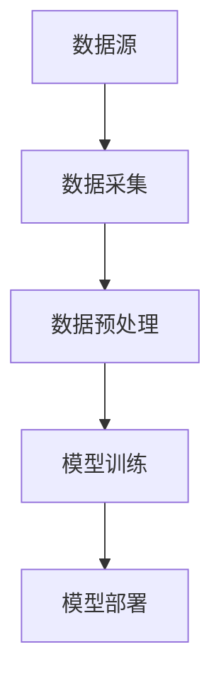

                 


# AI在金融市场微观结构分析中的应用

**关键词**：人工智能、金融市场、微观结构分析、算法、机器学习、深度学习

**摘要**：  
本文深入探讨了人工智能（AI）技术在金融市场微观结构分析中的应用。通过分析市场参与者的交易行为、市场流动性和波动性预测以及异常检测，本文揭示了AI技术在金融市场微观结构分析中的优势与潜力。文章结合具体的算法实现和系统架构设计，展示了如何利用AI技术解决复杂金融问题。本文旨在为金融从业者、数据科学家和AI研究人员提供理论与实践结合的指导，帮助他们更好地理解和应用AI技术在金融市场微观结构分析中的价值。

---

## 第1章: 金融市场微观结构分析概述

### 1.1 金融市场微观结构的基本概念

#### 1.1.1 金融市场的定义与分类
金融市场是资金供需双方进行交易的场所，按交易对象可分为股票市场、债券市场、外汇市场等。微观结构关注市场的基本组成要素，包括交易者、价格、成交量和时间等。

#### 1.1.2 微观结构的核心要素
- **交易者**：机构投资者、个人投资者、做市商等。
- **价格**：资产的市场价格。
- **成交量**：交易量。
- **时间**：交易发生的时间点。

#### 1.1.3 微观结构分析的意义与应用
微观结构分析有助于理解市场的运行机制，识别市场操纵、预测价格波动，并优化交易策略。

---

### 1.2 AI技术在金融领域的应用背景

#### 1.2.1 AI技术的发展与现状
AI技术的进步，尤其是深度学习的发展，使其在金融领域的应用日益广泛。

#### 1.2.2 金融领域对AI技术的需求
金融市场数据复杂且海量，AI技术能够高效处理这些数据，发现隐藏的模式。

#### 1.2.3 微观结构分析中的AI应用潜力
AI技术可以用于高频交易、市场情绪分析和异常检测。

---

## 第2章: AI技术的核心概念与原理

### 2.1 人工智能的基本原理

#### 2.1.1 机器学习的定义与分类
机器学习是AI的重要分支，分为监督学习、无监督学习和强化学习。

#### 2.1.2 深度学习的原理与特点
深度学习通过多层神经网络模拟人脑的处理方式，具有强大的特征提取能力。

#### 2.1.3 AI算法的数学基础
AI算法依赖于线性代数、概率论和统计学等数学工具。

### 2.2 常见AI算法及其特点

#### 2.2.1 线性回归与逻辑回归
线性回归用于预测连续变量，逻辑回归用于分类问题。

#### 2.2.2 支持向量机（SVM）
SVM适用于小样本数据的分类和回归。

#### 2.2.3 神经网络与深度学习
神经网络通过多层结构模拟复杂的模式识别。

---

## 第3章: AI在金融市场微观结构分析中的应用

### 3.1 微观结构分析中的关键问题

#### 3.1.1 市场参与者行为分析
通过分析交易者的交易行为，识别市场操纵和异常交易。

#### 3.1.2 市场流动性与波动性预测
利用AI技术预测市场流动性变化和价格波动。

#### 3.1.3 市场微观结构中的异常检测
通过AI算法识别市场中的异常事件，如闪崩。

### 3.2 AI技术在微观结构分析中的优势

#### 3.2.1 数据处理能力
AI技术能够处理海量的金融市场数据。

#### 3.2.2 模式识别能力
AI算法能够发现隐藏在数据中的模式。

#### 3.2.3 预测与决策能力
AI技术能够辅助交易者做出更准确的决策。

---

## 第4章: 常见AI算法在微观结构分析中的应用

### 4.1 机器学习算法的应用

#### 4.1.1 线性回归在价格预测中的应用
使用线性回归模型预测股票价格。

#### 4.1.2 支持向量机在分类问题中的应用
使用SVM模型分类交易信号。

#### 4.1.3 随机森林在特征选择中的应用
使用随机森林模型选择关键特征。

### 4.2 深度学习算法的应用

#### 4.2.1 卷积神经网络（CNN）在图像识别中的应用
使用CNN识别K线图中的模式。

#### 4.2.2 循环神经网络（RNN）在时间序列分析中的应用
使用RNN预测价格波动。

#### 4.2.3 Transformer在自然语言处理中的应用
使用Transformer分析市场新闻。

---

## 第5章: 数学模型与公式解析

### 5.1 机器学习模型的数学基础

#### 5.1.1 线性回归的数学模型
$$ y = \beta_0 + \beta_1x + \epsilon $$

#### 5.1.2 逻辑回归的数学模型
$$ P(Y=1|X) = \frac{1}{1 + e^{- (\beta_0 + \beta_1x)}} $$

### 5.2 深度学习模型的数学基础

#### 5.2.1 神经网络的激活函数
$$ \text{ReLU}(x) = \max(0, x) $$

#### 5.2.2 损失函数与优化算法
$$ \text{损失函数} = \frac{1}{N}\sum_{i=1}^{N}(y_i - \hat{y}_i)^2 $$
$$ \text{优化算法} = \text{随机梯度下降} $$

---

## 第6章: 系统架构与设计

### 6.1 微观结构分析系统的功能模块设计

#### 6.1.1 数据采集模块
从多个数据源采集实时金融数据。

#### 6.1.2 数据预处理模块
清洗数据并进行特征提取。

#### 6.1.3 模型训练模块
使用机器学习或深度学习算法训练模型。

#### 6.1.4 模型部署模块
将训练好的模型部署到生产环境。

---

### 6.2 系统架构设计

#### 6.2.1 系统架构图


#### 6.2.2 接口设计
API接口用于数据输入和模型输出。

#### 6.2.3 交互流程
使用序列图展示用户与系统的交互流程。

---

## 第7章: 项目实战

### 7.1 环境安装

#### 7.1.1 安装Python
使用Anaconda安装Python 3.8。

#### 7.1.2 安装依赖库
安装NumPy、Pandas、Scikit-learn和TensorFlow。

### 7.2 系统核心实现源代码

#### 7.2.1 数据预处理
```python
import pandas as pd
import numpy as np

# 读取数据
data = pd.read_csv('market_data.csv')

# 数据清洗
data = data.dropna()
data = data.replace([np.inf, -np.inf], np.nan).dropna()
```

#### 7.2.2 模型训练
```python
from sklearn.linear_model import LinearRegression

# 训练模型
model = LinearRegression()
model.fit(X_train, y_train)
```

#### 7.2.3 模型预测
```python
# 预测结果
y_pred = model.predict(X_test)
```

### 7.3 案例分析

#### 7.3.1 数据可视化
使用Matplotlib绘制K线图。

#### 7.3.2 模型评估
计算模型的准确率和召回率。

---

## 第8章: 总结与展望

### 8.1 总结
本文详细介绍了AI技术在金融市场微观结构分析中的应用，展示了如何利用AI技术解决复杂金融问题。

### 8.2 未来展望
未来，随着AI技术的不断发展，其在金融市场中的应用将更加广泛和深入。

---

**作者：AI天才研究院/AI Genius Institute & 禅与计算机程序设计艺术 /Zen And The Art of Computer Programming**

---

这篇文章通过详细的内容和结构，全面覆盖了AI在金融市场微观结构分析中的应用，从理论到实践，为读者提供了丰富的知识和指导。

