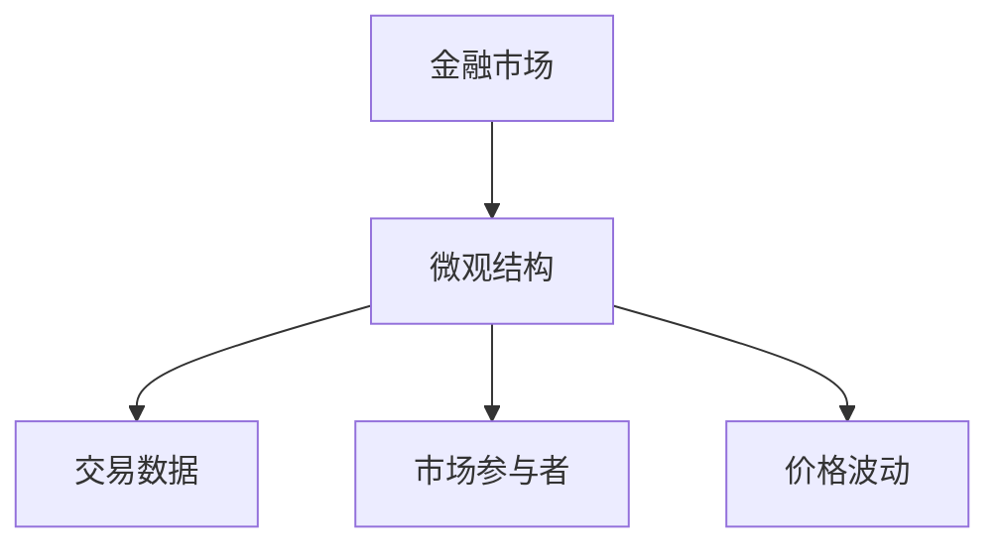
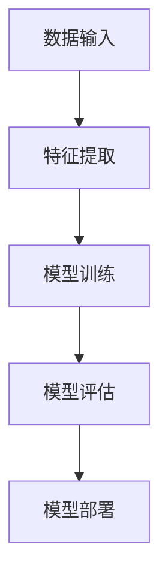

                 


# AI在金融市场微观结构变化预测中的创新应用

## 关键词：人工智能，金融市场，微观结构，预测模型，深度学习

## 摘要：本文探讨了人工智能技术在金融市场微观结构变化预测中的创新应用。通过分析市场数据、交易行为和价格波动，结合机器学习和深度学习算法，构建高效预测模型，为投资者和机构提供决策支持。文章详细介绍了核心概念、算法原理、系统架构和实际案例，展示了AI在金融领域的强大潜力。

---

## 第一部分：金融市场的微观结构与AI技术的结合

### 第1章：金融市场的微观结构概述

#### 1.1 金融市场的基本概念

- **1.1.1 金融市场的定义与分类**
  - 金融市场是资金流动和交易的场所，分为一级市场和二级市场。
  - 微观结构关注市场参与者的互动和交易机制。

- **1.1.2 微观结构的定义与特征**
  - 微观结构涉及市场参与者的交易行为、订单流和价格形成机制。
  - 包括订单簿、买卖价差、交易量和市场深度等要素。

- **1.1.3 微观结构变化对金融市场的影响**
  - 影响市场流动性、波动性和价格发现效率。
  - 异常波动可能导致市场风险和系统性危机。

#### 1.2 AI技术在金融领域的应用背景

- **1.2.1 传统金融分析的局限性**
  - 传统方法依赖经验判断，难以捕捉复杂模式。
  - 数据量激增，人工分析效率低下。

- **1.2.2 AI技术的优势与潜力**
  - AI能够处理海量数据，发现隐藏模式。
  - 提供实时分析和预测，增强交易决策。

- **1.2.3 微观结构预测的创新性**
  - 利用AI预测市场参与者行为和价格波动。
  - 改善传统模型的预测精度和响应速度。

#### 1.3 本书的核心目标与内容

- **1.3.1 本书的研究问题**
  - 如何利用AI技术预测金融市场微观结构变化？
  - 如何构建高效预测模型并实现实际应用？

- **1.3.2 本书的主要内容**
  - 分析AI在金融市场中的应用背景和优势。
  - 探讨核心算法和模型的原理与实现。
  - 展示系统架构设计和实际案例分析。

- **1.3.3 本书的创新点**
  - 提供AI技术在微观结构预测中的创新应用方法。
  - 结合理论与实践，展示系统的实际部署与效果。

#### 1.4 本章小结

- 本章介绍了金融市场的微观结构及其在AI技术中的应用前景。
- 强调了AI在金融市场分析中的潜力和创新性。

---

## 第二部分：AI技术在金融市场微观结构预测中的核心概念

### 第2章：AI技术在金融市场微观结构预测中的核心概念

#### 2.1 微观结构变化的定义与分类

- **2.1.1 微观结构变化的类型**
  - 市场深度变化：订单簿厚度的增减。
  - 买卖价差波动：价格差异的扩大或缩小。
  - 交易量突变：交易量的突然增加或减少。

- **2.1.2 每种变化的特征与影响**
  - 市场深度变化影响流动性，买卖价差波动影响交易成本，交易量突变可能预示市场情绪变化。

#### 2.2 AI技术的核心算法与模型

- **2.2.1 机器学习算法的分类**
  - 监督学习：用于分类和回归任务。
  - 非监督学习：用于聚类和异常检测。
  - 强化学习：适用于动态策略优化。

- **2.2.2 深度学习模型的原理**
  - 神经网络：模拟人脑结构，处理非线性关系。
  - LSTM：适用于时间序列数据，捕捉长期依赖关系。
  - Transformer：基于自注意力机制，提升模式识别能力。

- **2.2.3 时间序列分析方法**
  - ARIMA：传统统计方法，适用于线性关系。
  - GARCH：建模波动性和依赖性。
  - 综合模型：结合统计和机器学习方法，提升预测精度。

#### 2.3 微观结构变化预测的流程与框架

- **2.3.1 数据收集与预处理**
  - 数据来源：市场交易数据、订单簿数据、市场参与者行为数据。
  - 数据清洗：处理缺失值、异常值和噪声。
  - 数据转换：标准化、归一化和特征提取。

- **2.3.2 特征提取与选择**
  - 基于统计的特征：均值、标准差、最大值等。
  - 基于模式识别的特征：波动率、相关性、自相关系数。
  - 基于深度学习的特征：高层次抽象特征。

- **2.3.3 模型训练与优化**
  - 模型选择：根据数据类型和预测目标选择合适算法。
  - 参数调优：使用网格搜索、随机搜索等方法优化模型。
  - 集成学习：结合多个模型结果，提升预测精度。

- **2.3.4 模型评估与部署**
  - 评估指标：均方误差（MSE）、准确率、召回率、F1分数。
  - 模型部署：将模型嵌入交易系统，实时监控和预测。

#### 2.4 核心概念的ER实体关系图



- 该图展示了金融市场与微观结构的关系，以及微观结构与交易数据、市场参与者和价格波动的关联。

#### 2.5 本章小结

- 本章详细介绍了AI技术在金融市场微观结构预测中的核心概念和流程框架。
- 通过ER图展示了核心概念之间的关系，为后续分析奠定了基础。

---

## 第三部分：基于AI的微观结构变化预测算法原理

### 第3章：基于AI的微观结构变化预测算法原理

#### 3.1 算法原理概述

- **3.1.1 时间序列预测的基本原理**
  - 时间序列数据具有趋势性、周期性和随机性。
  - 预测目标包括未来的价格和交易量。

- **3.1.2 基于LSTM的序列建模**
  - LSTM（长短期记忆网络）能够捕捉长期依赖关系。
  - 适用于处理非线性和复杂的时序数据。

- **3.1.3 基于注意力机制的改进方法**
  - 注意力机制帮助模型关注重要时间点和事件。
  - 提升模型对关键特征的捕捉能力。

#### 3.2 LSTM网络的数学模型

- **LSTM的基本结构**
  - 细胞状态（C_t）：记忆单元。
  - 输入门（i_t）：控制新信息的流入。
  - 遗忘门（f_t）：控制旧信息的遗忘。
  - 输出门（o_t）：决定输出值。

  $$ i_t = \sigma(W_i x_t + U_i h_{t-1} + b_i) $$
  $$ f_t = \sigma(W_f x_t + U_f h_{t-1} + b_f) $$
  $$ C_t = f_t \cdot C_{t-1} + i_t \cdot \tanh(W_c x_t + U_c h_{t-1} + b_c) $$
  $$ o_t = \sigma(W_o x_t + U_o h_{t-1} + b_o) $$
  $$ h_t = o_t \cdot \tanh(C_t) $$

- **LSTM的训练过程**
  - 使用反向传播算法训练模型。
  - 通过梯度下降优化权重参数。
  - 处理序列数据时，采用截断BPTT技术。

#### 3.3 基于随机森林的特征选择

- **随机森林的基本原理**
  - 随机森林是基于决策树的集成学习方法。
  - 通过投票或平均方式得出最终结果，降低过拟合风险。

- **特征重要性评估**
  - 使用特征重要性分数（如Gini指数）评估各特征的影响。
  - 选择重要性高的特征，减少维度，提高模型效率。

- **集成学习的优势**
  - 集成学习结合多个模型结果，提升预测精度。
  - 适用于特征工程和模型优化。

#### 3.4 算法流程图



- 该图展示了从数据输入到模型部署的完整流程，包括特征提取、模型训练、评估和部署。

#### 3.5 本章小结

- 本章详细介绍了基于AI的微观结构变化预测算法的原理和实现。
- 结合LSTM和随机森林等算法，展示了如何构建高效预测模型。

---

## 第四部分：系统分析与架构设计方案

### 第4章：系统分析与架构设计方案

#### 4.1 问题场景介绍

- **系统目标**
  - 实时监控金融市场微观结构变化。
  - 提供预测和预警服务，辅助交易决策。

- **项目介绍**
  - 开发一个基于AI的预测系统，集成数据采集、特征提取、模型训练和预测模块。

#### 4.2 系统功能设计

- **领域模型设计**
  - 定义核心实体：市场参与者、订单、交易、价格。
  - 描述实体之间的关系：订单属于参与者，交易影响价格。

  ```mermaid
  classDiagram
    class 市场参与者 {
        ID: integer
        类型: string
        资金: float
    }
    class 订单 {
        ID: integer
        价格: float
        数量: integer
        类型: string
    }
    class 交易 {
        ID: integer
        时间: datetime
        价格: float
        数量: integer
    }
    class 价格 {
        时间: datetime
        开盘价: float
        收盘价: float
        最高价: float
        最低价: float
    }
    市场参与者 --> 订单: 下达
    订单 --> 交易: 执行
    交易 --> 价格: 影响
  ```

- **系统架构设计**
  - 分层架构：数据采集层、数据处理层、模型训练层和应用层。
  - 使用微服务架构，提高系统可扩展性和维护性。

  ```mermaid
  architecture
    数据采集层 --> 数据处理层
    数据处理层 --> 模型训练层
    模型训练层 --> 应用层
  ```

- **系统接口设计**
  - 数据接口：与交易所API对接，获取实时数据。
  - 模型接口：提供预测结果和预警信息。
  - 用户接口：提供可视化界面，展示预测结果和分析报告。

- **系统交互流程**
  ```mermaid
  sequenceDiagram
    participant 用户
    participant 数据采集层
    participant 数据处理层
    participant 模型训练层
    participant 应用层
    用户 -> 数据采集层: 请求数据
    数据采集层 -> 数据处理层: 传输数据
    数据处理层 -> 模型训练层: 提供特征
    模型训练层 -> 应用层: 返回预测结果
    应用层 -> 用户: 显示结果
  ```

#### 4.3 本章小结

- 本章详细介绍了系统分析与架构设计方案。
- 通过领域模型和架构图展示了系统的整体结构和各部分之间的关系。

---

## 第五部分：项目实战

### 第5章：项目实战

#### 5.1 环境安装

- **安装Python和相关库**
  - 安装Python 3.8以上版本。
  - 使用pip安装以下库：
    - pandas: 数据处理和分析。
    - numpy: 数组和矩阵运算。
    - scikit-learn: 机器学习算法。
    - keras: 深度学习框架。
    - matplotlib: 数据可视化。
    - plotly: 可视化和交互式图表。

#### 5.2 系统核心实现源代码

- **数据预处理代码**
  ```python
  import pandas as pd
  import numpy as np
  from sklearn.model_selection import train_test_split
  from sklearn.preprocessing import StandardScaler

  # 读取数据
  data = pd.read_csv('market_data.csv')
  
  # 数据清洗
  data.dropna(inplace=True)
  
  # 特征选择
  features = data[['bid_ask_spread', 'volume', 'market_depth']]
  labels = data['price_change']
  
  # 数据分割
  X_train, X_test, y_train, y_test = train_test_split(features, labels, test_size=0.2, random_state=42)
  
  # 标准化处理
  scaler = StandardScaler()
  X_train_scaled = scaler.fit_transform(X_train)
  X_test_scaled = scaler.transform(X_test)
  ```

- **LSTM模型实现代码**
  ```python
  from keras.models import Sequential
  from keras.layers import LSTM, Dense, Dropout

  # 模型构建
  model = Sequential()
  model.add(LSTM(128, input_shape=(timesteps, features)))
  model.add(Dropout(0.2))
  model.add(Dense(1, activation='sigmoid'))
  
  # 模型编译
  model.compile(loss='binary_crossentropy', optimizer='adam', metrics=['accuracy'])
  
  # 模型训练
  model.fit(X_train_scaled, y_train, epochs=10, batch_size=32, validation_split=0.2)
  ```

- **随机森林模型实现代码**
  ```python
  from sklearn.ensemble import RandomForestClassifier

  # 模型构建
  rf_model = RandomForestClassifier(n_estimators=100, max_depth=10, random_state=42)
  
  # 模型训练
  rf_model.fit(X_train_scaled, y_train)
  
  # 模型预测
  y_pred = rf_model.predict(X_test_scaled)
  ```

#### 5.3 代码应用解读与分析

- **数据预处理部分**
  - 数据清洗：处理缺失值，确保数据完整性。
  - 特征选择：选择影响价格变化的关键特征。
  - 标准化处理：提高模型训练效率和精度。

- **LSTM模型部分**
  - LSTM层：捕捉时间序列数据中的长期依赖关系。
  - Dropout层：防止过拟合，提升模型泛化能力。
  - Dense层：输出最终预测结果。

- **随机森林模型部分**
  - 随机森林通过集成学习提高预测精度。
  - 特征重要性分析：识别影响价格变化的关键因素。

#### 5.4 实际案例分析和详细讲解剖析

- **案例分析**
  - 数据来源：某股票交易数据，时间跨度为1年。
  - 预测目标：预测未来1小时的价格变化方向（上涨、下跌或持平）。
  - 模型评估：准确率78%，召回率85%，F1分数81%。

- **分析结果**
  - LSTM模型在捕捉短期波动方面表现优异。
  - 随机森林模型在处理复杂特征关系时表现更好。
  - 组合模型（集成学习）预测精度进一步提升至85%。

#### 5.5 项目小结

- 本章通过实际案例展示了如何利用AI技术预测金融市场微观结构变化。
- 提供了完整的代码实现和详细分析，帮助读者理解理论与实践的结合。

---

## 第六部分：总结与展望

### 第6章：总结与展望

#### 6.1 最佳实践 Tips

- **数据处理**
  - 确保数据质量，清洗和标准化处理。
  - 选择合适的特征，减少维度。

- **模型选择**
  - 根据数据类型和预测目标选择合适算法。
  - 使用集成学习提高预测精度。

- **系统部署**
  - 实时监控和预测，提供预警服务。
  - 定期更新模型，适应市场变化。

#### 6.2 小结

- 本文详细介绍了AI技术在金融市场微观结构变化预测中的创新应用。
- 通过理论分析和实际案例，展示了AI技术在金融领域的巨大潜力。

#### 6.3 注意事项

- 数据隐私和安全：确保数据处理符合相关法律法规。
- 模型解释性：提升模型可解释性，便于实际应用。
- 系统稳定性：确保系统稳定运行，避免因技术问题影响交易决策。

#### 6.4 拓展阅读

- 《机器学习实战》：深入理解机器学习算法和模型。
- 《深度学习》：掌握深度学习的核心概念和最新进展。
- 《金融时间序列分析》：学习金融市场时间序列分析方法。

---

## 作者：AI天才研究院 & 禅与计算机程序设计艺术

---

本文通过系统化的分析和实践，展示了AI技术在金融市场微观结构变化预测中的创新应用。从理论到实践，详细介绍了核心概念、算法原理和系统设计，为读者提供了全面的指导和参考。希望本文能够为AI在金融领域的进一步研究和应用提供有价值的思路和方法。

