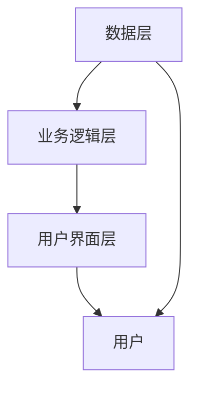
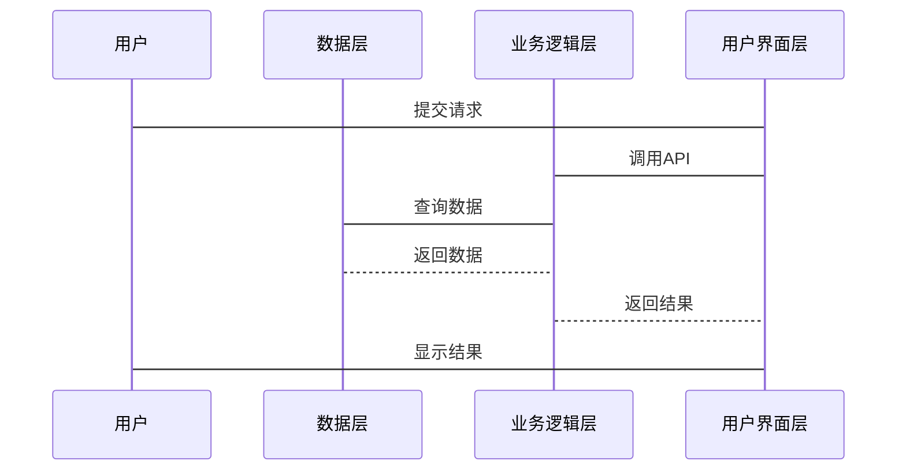

                 


# AI在金融市场流动性提供策略动态优化中的创新应用

> 关键词：AI, 金融市场, 流动性管理, 动态优化, 强化学习, 时间序列分析

> 摘要：本文探讨了人工智能（AI）在金融市场流动性提供策略动态优化中的创新应用。通过分析传统流动性管理的局限性，结合AI技术的核心优势，本文详细介绍了AI算法在流动性预测和交易策略优化中的具体应用。通过构建基于强化学习和时间序列分析的动态优化模型，本文展示了如何利用AI技术提升金融市场流动性管理的效率和准确性。同时，本文还通过实际案例分析和系统实现，验证了AI驱动的流动性管理策略的有效性。

---

# 第1章: 金融市场流动性管理与AI的结合

## 1.1 金融市场的流动性问题

### 1.1.1 什么是流动性
流动性是指资产在金融市场中迅速转换为现金而不遭受重大损失的能力。流动性是金融市场健康运行的基础，直接影响市场的交易效率和价格稳定性。

### 1.1.2 流动性在金融市场中的重要性
- **市场稳定性**：高流动性可以减少市场波动，提高价格发现的效率。
- **交易成本**：流动性越高，交易成本越低，市场参与者可以以更低的成本完成交易。
- **风险管理**：流动性管理是金融机构风险管理的重要组成部分。

### 1.1.3 流动性管理的核心目标
- **维持市场深度**：确保市场中有足够的订单量，以支持大规模交易。
- **减少市场冲击**：降低大额交易对市场价格的负面影响。
- **优化交易成本**：通过合理的流动性管理，降低交易成本。

## 1.2 AI技术在金融领域的应用背景

### 1.2.1 AI技术的基本概念
人工智能（AI）是指计算机系统执行与人类智能相关的任务的能力，包括学习、推理、决策和自适应。

### 1.2.2 AI在金融领域的应用现状
- **交易策略优化**：利用机器学习算法分析历史数据，预测市场趋势。
- **风险管理**：通过AI技术识别市场风险，优化风险控制策略。
- **客户画像**：利用AI技术分析客户行为，提供个性化金融服务。

### 1.2.3 AI在流动性管理中的潜力
- **实时预测**：利用AI技术实时预测市场流动性状况。
- **动态优化**：根据市场变化动态调整流动性管理策略。
- **自动化决策**：通过AI技术实现自动化的流动性管理决策。

## 1.3 动态优化策略的必要性

### 1.3.1 传统流动性管理的局限性
- **静态策略**：传统流动性管理策略通常基于历史数据，缺乏动态调整能力。
- **人为干预**：依赖人工判断，容易受到主观因素影响。
- **效率低下**：面对复杂多变的市场环境，传统策略难以及时做出反应。

### 1.3.2 动态优化策略的定义
动态优化策略是指根据市场环境的变化，实时调整流动性管理策略，以实现最优的流动性管理目标。

### 1.3.3 AI在动态优化中的作用
- **实时分析**：AI技术能够实时分析市场数据，快速做出反应。
- **自我学习**：通过机器学习算法，AI系统能够不断优化自己的决策模型。
- **高效决策**：AI技术能够在短时间内处理大量数据，做出最优决策。

---

# 第2章: AI在金融市场流动性提供中的核心概念与联系

## 2.1 AI算法的基本原理

### 2.1.1 机器学习的基本概念
机器学习是一种通过数据训练模型，使其能够从数据中学习规律并做出预测的技术。

### 2.1.2 深度学习的基本概念
深度学习是一种基于人工神经网络的机器学习技术，能够自动提取数据特征。

### 2.1.3 强化学习的基本概念
强化学习是一种通过试错方式，学习最优策略的技术，适用于动态环境下的决策问题。

## 2.2 金融市场流动性管理的核心要素

### 2.2.1 市场深度
市场深度是指在特定价格水平上可以交易的数量，反映了市场的流动性状况。

### 2.2.2 市场冲击
市场冲击是指大额交易对市场价格的短期影响，反映了市场的流动性风险。

### 2.2.3 交易成本
交易成本包括佣金、买卖价差等，反映了交易的经济成本。

## 2.3 AI与流动性管理的结合

### 2.3.1 AI在流动性预测中的应用
- **时间序列分析**：利用历史流动性数据，预测未来的流动性状况。
- **机器学习模型**：通过训练数据，预测市场深度和市场冲击。

### 2.3.2 AI在交易策略优化中的应用
- **强化学习**：通过不断试错，优化交易策略，以实现最优的流动性管理目标。
- **动态调整**：根据市场变化，实时调整交易策略。

### 2.3.3 AI在风险控制中的应用
- **风险预警**：通过AI技术，实时监测市场风险，提前预警潜在风险。
- **风险对冲**：利用AI技术，制定风险对冲策略，降低市场冲击。

---

# 第3章: AI动态优化策略的算法原理

## 3.1 强化学习在流动性管理中的应用

### 3.1.1 强化学习的基本原理
强化学习通过智能体与环境的交互，学习最优策略。智能体在环境中采取动作，获得奖励或惩罚，从而优化策略。

### 3.1.2 强化学习在流动性优化中的具体应用
- **状态空间**：市场深度、市场冲击等流动性相关指标。
- **动作空间**：买入、卖出等交易动作。
- **奖励函数**：根据流动性管理目标，定义奖励函数，例如最大化市场深度、最小化交易成本。

### 3.1.3 强化学习的优缺点
- **优点**：能够适应动态环境，具有较强的自适应能力。
- **缺点**：需要大量的训练数据，计算成本较高。

## 3.2 时间序列分析在流动性预测中的应用

### 3.2.1 时间序列分析的基本原理
时间序列分析是一种通过分析历史数据，预测未来趋势的技术。

### 3.2.2 常见的时间序列模型
- **ARIMA模型**：自回归积分滑动模型，适用于线性时间序列数据。
- **LSTM模型**：长短期记忆网络，适用于非线性时间序列数据。
- **Prophet模型**：Facebook开源的时间序列预测模型。

### 3.2.3 时间序列分析在流动性预测中的具体应用
- **市场深度预测**：利用历史市场深度数据，预测未来的市场深度。
- **市场冲击预测**：通过分析历史市场冲击数据，预测未来的市场冲击。

## 3.3 算法实现与优化

### 3.3.1 算法实现的基本步骤
1. 数据收集：收集历史市场数据，包括市场深度、交易量等。
2. 数据预处理：对数据进行清洗、标准化等处理。
3. 模型训练：利用机器学习算法，训练流动性预测模型。
4. 模型优化：通过调整模型参数，优化预测精度。

### 3.3.2 算法优化的常见方法
- **超参数调优**：通过网格搜索、随机搜索等方法，优化模型参数。
- **特征工程**：通过提取特征，提高模型的预测精度。
- **模型集成**：通过集成多种模型，提高预测的稳定性。

### 3.3.3 算法实现中的注意事项
- **数据质量**：确保数据的完整性和准确性。
- **模型选择**：根据具体问题，选择合适的模型。
- **模型评估**：通过交叉验证等方法，评估模型的性能。

---

# 第4章: 系统分析与架构设计方案

## 4.1 问题场景介绍

### 4.1.1 流动性管理的典型问题
- **市场深度不足**：导致交易成本增加，市场流动性下降。
- **市场冲击过大**：导致市场价格波动，影响市场稳定性。
- **交易成本高**：增加投资者的经济负担。

### 4.1.2 动态优化策略的应用场景
- **高频交易**：需要实时调整交易策略，优化流动性管理。
- **机构投资者**：需要管理大规模的交易，优化流动性风险。

### 4.1.3 系统设计的目标
- **实时预测**：实现对市场深度、市场冲击的实时预测。
- **动态优化**：根据市场变化，动态调整流动性管理策略。
- **高效决策**：实现快速、准确的决策，优化流动性管理效果。

## 4.2 系统功能设计

### 4.2.1 流动性预测模块
- **功能描述**：利用时间序列分析模型，预测市场深度和市场冲击。
- **输入**：历史市场数据。
- **输出**：未来市场的流动性预测结果。

### 4.2.2 交易策略优化模块
- **功能描述**：利用强化学习算法，优化交易策略。
- **输入**：市场深度预测结果、交易成本等。
- **输出**：最优交易策略。

### 4.2.3 风险控制模块
- **功能描述**：实时监测市场风险，制定风险对冲策略。
- **输入**：市场深度、市场冲击等数据。
- **输出**：风险预警信号、风险对冲策略。

## 4.3 系统架构设计

### 4.3.1 分层架构设计
- **数据层**：负责数据的存储和管理。
- **业务逻辑层**：负责业务逻辑的实现，包括流动性预测、交易策略优化等。
- **用户界面层**：负责与用户的交互，展示系统结果。

### 4.3.2 系统架构图


### 4.3.3 系统交互流程图


---

# 第5章: 项目实战与结果分析

## 5.1 环境安装与配置

### 5.1.1 安装Python环境
- **安装步骤**：
  1. 下载并安装Python。
  2. 配置Python环境变量。
  3. 安装必要的Python包，例如`numpy`、`pandas`、`sklearn`等。

### 5.1.2 安装机器学习库
- **安装步骤**：
  1. 使用`pip`安装`scikit-learn`、`tensorflow`、`keras`等机器学习库。

## 5.2 核心代码实现

### 5.2.1 流动性预测模型实现
```python
import numpy as np
import pandas as pd
from sklearn.metrics import mean_squared_error
from sklearn.model_selection import train_test_split
from sklearn.

