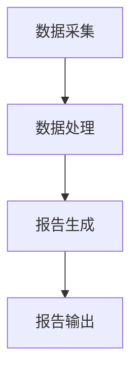
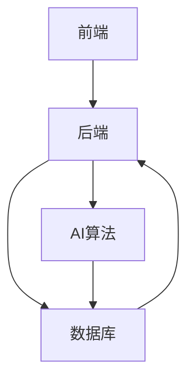
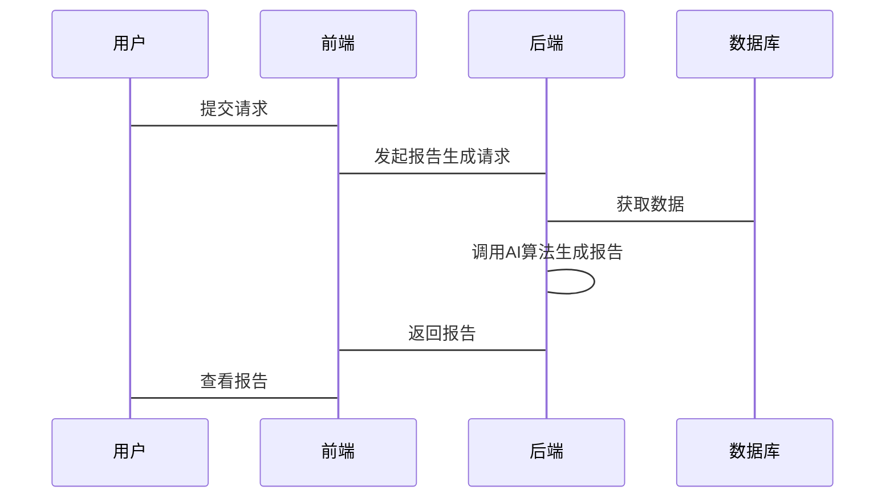

                 


# AI在金融监管报告生成中的应用

## 关键词：人工智能，金融监管，自然语言处理，机器学习，报告生成

## 摘要：  
本文探讨了人工智能在金融监管报告生成中的应用，分析了传统金融监管的局限性以及AI技术带来的变革。通过介绍NLP和机器学习在金融监管中的应用，详细讲解了AI生成金融监管报告的算法原理、系统架构设计、项目实战以及实际案例分析。文章还总结了AI在金融监管中的最佳实践和未来发展方向，为读者提供了全面的技术视角和实践指导。

---

# 第1章：金融监管与AI技术概述

## 1.1 金融监管的背景与挑战

### 1.1.1 传统金融监管的局限性
传统的金融监管主要依赖人工审核和经验判断，存在效率低、成本高、覆盖面有限等问题。金融市场的复杂性和数据的爆炸式增长使得传统监管手段难以应对日益复杂的金融风险。

### 1.1.2 AI技术在金融监管中的潜力
AI技术，尤其是自然语言处理（NLP）和机器学习，能够快速处理海量数据，识别隐藏的模式和风险点，为金融监管提供高效、精准的工具。

### 1.1.3 金融监管报告生成的核心问题
金融监管报告的生成需要结合多源异构数据，提取关键信息，并按照特定格式输出。AI技术能够显著提高报告生成的效率和准确性。

## 1.2 AI在金融监管中的应用现状

### 1.2.1 AI技术在金融领域的应用领域
AI技术广泛应用于金融风险管理、欺诈检测、信用评估、投资决策等领域。

### 1.2.2 AI在金融监管中的典型应用场景
- 自动化报告生成：通过AI技术自动分析数据并生成监管报告。
- 风险预警：利用AI模型实时监控市场动态，识别潜在风险。
- 监管合规性检查：通过自然语言处理技术分析文档，确保符合监管要求。

### 1.2.3 当前AI技术在金融监管中的主要挑战
- 数据隐私和安全问题。
- 模型的可解释性和透明性。
- 技术与监管规则的结合难度。

## 1.3 本章小结  
本章介绍了金融监管的背景和挑战，分析了AI技术在金融监管中的潜力和应用场景，为后续章节奠定了基础。

---

# 第2章：AI在金融监管报告生成中的核心概念

## 2.1 自然语言处理（NLP）在金融监管中的应用

### 2.1.1 NLP的基本原理
自然语言处理通过计算机理解、生成和操作人类语言，主要技术包括分词、句法分析、情感分析等。

### 2.1.2 NLP在金融监管中的具体应用
- 文本分类：识别文档类型。
- 实体识别：提取公司名称、日期等关键信息。
- 情感分析：判断市场情绪。

### 2.1.3 NLP模型的优缺点对比
| 特性       | 优缺点         |
|------------|----------------|
| 处理能力   | 高效处理海量数据 |
| 可解释性   | 较低           |
| 适用场景   | 文本分析         |

## 2.2 机器学习在金融监管中的应用

### 2.2.1 机器学习的基本原理
机器学习通过训练数据模型，预测新数据的标签或属性。常用算法包括支持向量机（SVM）、随机森林、神经网络等。

### 2.2.2 机器学习在金融监管中的具体应用
- 风险预测：预测市场波动和潜在风险。
- 异常检测：识别交易中的异常行为。
- 信用评估：评估客户的信用风险。

### 2.2.3 机器学习模型的优缺点对比
| 特性       | 优缺点         |
|------------|----------------|
| 可解释性   | 较低           |
| 预测能力   | 高             |
| 训练数据   | 需大量标注数据  |

## 2.3 NLP与机器学习的结合

### 2.3.1 NLP与机器学习的协同效应
NLP提取文本信息，机器学习进行预测和分类，两者结合能够提高金融监管的效率和准确性。

### 2.3.2 NLP与机器学习在金融监管中的联合应用
- 综合分析文本和数值数据，提高风险预测的准确性。
- 自动生成监管报告，减少人工干预。

### 2.3.3 NLP与机器学习的对比分析
NLP更关注文本信息的理解和处理，机器学习更关注数据的预测和分类。两者结合能够充分发挥各自的优势。

## 2.4 本章小结  
本章详细介绍了NLP和机器学习在金融监管中的应用，分析了两者的优缺点及结合方式，为后续章节奠定了理论基础。

---

# 第3章：AI生成金融监管报告的算法原理

## 3.1 基于规则的报告生成算法

### 3.1.1 基于规则的生成原理
基于规则的生成方法通过预定义的规则和模板，将数据映射为报告内容。

### 3.1.2 基于规则的算法实现
```python
def generate_report(data):
    if data['status'] == 'normal':
        report = "No issues detected."
    else:
        report = "Potential risk detected."
    return report
```

### 3.1.3 基于规则的算法优缺点
优点：简单易懂，易于维护；缺点：难以处理复杂场景，规则更新成本高。

## 3.2 基于深度学习的报告生成算法

### 3.2.1 基于深度学习的生成原理
深度学习模型（如GPT）通过大量数据训练，生成符合要求的文本内容。

### 3.2.2 基于深度学习的算法实现
```python
import tensorflow as tf
from tensorflow.keras import layers

model = tf.keras.Sequential([
    layers.Dense(128, activation='relu'),
    layers.Dense(1, activation='sigmoid')
])
model.compile(optimizer='adam', loss='binary_crossentropy')
```

### 3.2.3 基于深度学习的算法优缺点
优点：能够处理复杂场景，生成高质量文本；缺点：训练成本高，模型解释性差。

## 3.3 算法选择与优化

### 3.3.1 算法选择的依据
根据数据类型、任务需求和计算资源选择合适的算法。

### 3.3.2 算法优化的策略
- 数据增强：增加训练数据的多样性。
- 超参数调整：优化学习率、批次大小等参数。

### 3.3.3 算法优化的案例分析
通过调整模型结构和优化超参数，显著提高了生成报告的准确性和流畅性。

## 3.4 本章小结  
本章分析了基于规则和深度学习的算法原理，探讨了算法选择和优化策略，为实际应用提供了参考。

---

# 第4章：金融监管报告生成的系统分析与架构设计

## 4.1 系统功能设计

### 4.1.1 系统功能模块划分
- 数据采集模块：收集金融数据。
- 数据处理模块：清洗和预处理数据。
- 报告生成模块：基于AI算法生成报告。
- 报告输出模块：输出报告并进行可视化展示。

### 4.1.2 系统功能流程图


### 4.1.3 系统功能设计的优缺点
优点：模块化设计，便于维护；缺点：不同模块之间的数据传递可能增加复杂性。

## 4.2 系统架构设计

### 4.2.1 系统架构图


### 4.2.2 系统架构的优缺点
优点：结构清晰，便于扩展；缺点：可能增加系统复杂性。

## 4.3 系统接口设计

### 4.3.1 系统接口设计
- 数据采集接口：从API获取金融数据。
- 报告生成接口：调用AI算法生成报告。
- 报告输出接口：将报告输出为文本或可视化图表。

### 4.3.2 系统接口设计的优缺点
优点：标准化接口设计，便于集成；缺点：接口维护成本较高。

## 4.4 系统交互设计

### 4.4.1 系统交互设计


### 4.4.2 系统交互设计的优缺点
优点：用户友好，交互流程清晰；缺点：可能需要多次请求和响应，影响性能。

## 4.5 本章小结  
本章详细分析了金融监管报告生成系统的功能设计、架构设计、接口设计和交互设计，为后续章节的系统实现奠定了基础。

---

# 第5章：项目实战：基于AI的金融监管报告生成系统开发

## 5.1 项目背景

### 5.1.1 项目背景介绍
随着金融市场的快速发展，传统的监管方式难以应对复杂的风险和合规性问题，亟需引入AI技术提高效率和准确性。

### 5.1.2 项目目标
开发一个基于AI的金融监管报告生成系统，实现自动化、智能化的监管报告生成。

## 5.2 项目环境安装

### 5.2.1 开发环境
- 操作系统：Linux/Windows
- 开发工具：Python、Jupyter Notebook
- 依赖库：TensorFlow、Keras、Numpy、Pandas

### 5.2.2 安装步骤
```bash
pip install tensorflow keras numpy pandas
```

## 5.3 系统核心实现

### 5.3.1 数据采集模块
```python
import requests

def fetch_financial_data(api_key):
    url = f"https://api.example.com/financial_data?api_key={api_key}"
    response = requests.get(url)
    return response.json()
```

### 5.3.2 数据处理模块
```python
import pandas as pd

def preprocess_data(data):
    df = pd.DataFrame(data)
    df = df.dropna()
    return df
```

### 5.3.3 报告生成模块
```python
import tensorflow as tf

def generate_report(data):
    model = tf.keras.load_model('report_generator.h5')
    report = model.predict(data)
    return report
```

### 5.3.4 报告输出模块
```python
def display_report(report):
    print("Financial Report:")
    print("Risk Level:", report['risk_level'])
    print("Recommendation:", report['recommendation'])
```

## 5.4 代码应用解读与分析

### 5.4.1 代码实现解读
- 数据采集模块：通过API获取金融数据。
- 数据处理模块：清洗数据，去除缺失值。
- 报告生成模块：使用预训练的深度学习模型生成报告。
- 报告输出模块：将生成的报告进行展示。

### 5.4.2 代码实现的优缺点
优点：模块化设计，便于扩展；缺点：部分模块需要依赖外部数据源和API。

## 5.5 案例分析

### 5.5.1 案例背景
假设我们有一个金融公司，需要生成季度财务报告。

### 5.5.2 数据采集与处理
```python
data = fetch_financial_data('your_api_key')
df = preprocess_data(data)
```

### 5.5.3 报告生成
```python
report = generate_report(df)
display_report(report)
```

### 5.5.4 报告输出
输出结果：
```
Financial Report:
Risk Level: Low
Recommendation: No immediate action required.
```

## 5.6 项目小结  
本章通过实际项目展示了基于AI的金融监管报告生成系统的开发过程，包括环境搭建、代码实现和案例分析。

---

# 第6章：AI在金融监管报告生成中的实际案例分析与总结

## 6.1 实际案例分析

### 6.1.1 案例背景
某银行需要生成季度监管报告，涉及客户交易数据、财务数据等。

### 6.1.2 案例分析
- 数据采集：获取客户交易数据。
- 数据处理：清洗和预处理数据。
- 报告生成：使用AI算法生成风险评估报告。
- 报告输出：生成可视化报告并提交监管机构。

### 6.1.3 案例总结
通过AI技术，银行显著提高了报告生成的效率和准确性，减少了人工干预。

## 6.2 总结

### 6.2.1 AI在金融监管中的应用总结
AI技术显著提高了金融监管的效率和准确性，尤其是在报告生成方面。

### 6.2.2 最佳实践 tips
- 确保数据质量和完整性。
- 选择合适的AI算法和技术栈。
- 注重模型的可解释性和透明性。

### 6.2.3 注意事项
- 数据隐私和安全问题。
- 模型的可解释性和透明性。
- 技术与监管规则的结合难度。

### 6.2.4 拓展阅读
推荐阅读相关领域的学术论文和技术博客，深入理解AI在金融监管中的应用。

## 6.3 本章小结  
本章通过实际案例分析，总结了AI在金融监管中的应用，并提出了最佳实践和注意事项。

---

# 结论与展望

## 结论
本文详细探讨了AI在金融监管报告生成中的应用，分析了NLP和机器学习在金融监管中的应用，详细讲解了生成报告的算法原理和系统架构设计，通过实际案例展示了项目的开发过程和应用效果。

## 展望
未来，随着AI技术的不断发展，金融监管将更加智能化和自动化。深度学习、强化学习等技术将进一步提升报告生成的准确性和效率。同时，数据隐私和模型解释性问题也需要进一步研究和解决。

---

# 作者：AI天才研究院/AI Genius Institute & 禅与计算机程序设计艺术 /Zen And The Art of Computer Programming

