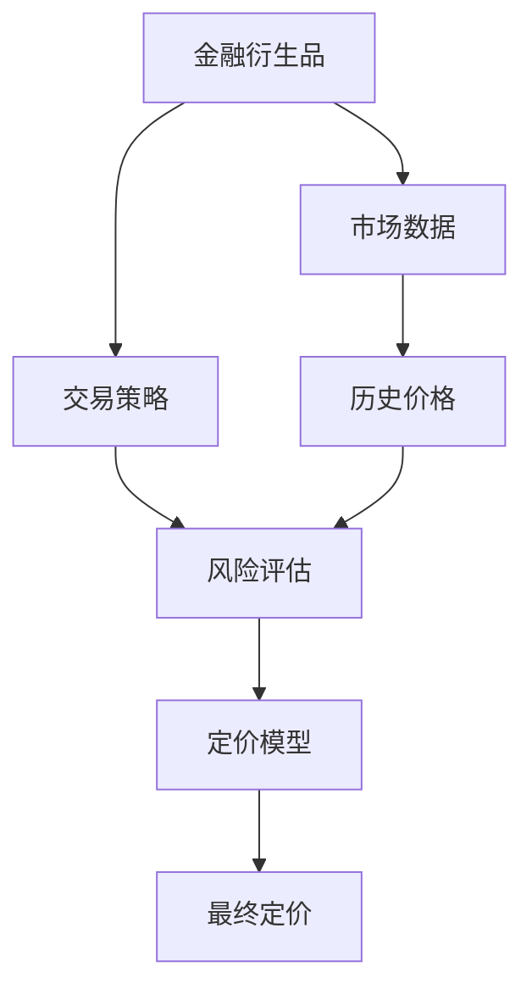

                 


# AI在金融衍生品定价中的深度应用研究

> 关键词：人工智能，金融衍生品定价，机器学习，数学模型，系统架构

> 摘要：本文深入探讨了人工智能在金融衍生品定价中的应用，分析了传统定价方法的局限性，介绍了机器学习模型的核心概念，详细讲解了算法原理和数学模型，设计了系统的架构，并通过项目实战展示了AI技术的实际应用。文章最后总结了最佳实践和未来研究方向。

---

## 第一部分：AI在金融衍生品定价中的背景与概念

### 第1章：AI在金融衍生品定价中的背景介绍

#### 1.1 问题背景

金融市场中，衍生品的定价一直是金融机构的核心任务之一。传统定价方法依赖于复杂的数学模型，例如Black-Scholes公式，这些方法在处理简单衍生品时表现良好，但在面对复杂、高维数据和动态市场环境时显得力不从心。传统方法的局限性主要体现在以下几个方面：

1. **假设的严格性**：传统模型如Black-Scholes假设标的资产价格服从几何布朗运动，但在实际市场中，价格波动往往受到跳跃、市场情绪等多种因素的影响，导致模型定价出现偏差。
2. **计算复杂性**：在处理多变量衍生品（如Basket Options）时，计算复杂度显著增加，且难以实时更新。
3. **数据驱动不足**：传统方法主要依赖理论假设，缺乏对市场实际数据的深度挖掘和利用。

AI技术的引入为金融衍生品定价带来了新的可能性。通过机器学习模型，可以从海量历史数据中提取非线性关系，捕捉市场隐含信息，构建动态调整的定价模型。数据驱动方法能够有效处理高维、非线性问题，提升定价模型的准确性和实时性。

#### 1.2 问题描述

金融衍生品定价的核心挑战在于如何准确捕捉标的资产的价格波动及其影响因素。传统方法在面对复杂、动态的市场环境时，难以有效应对以下问题：

1. **数据复杂性**：金融数据通常具有高维、非线性、噪声多等特点，传统模型难以有效处理。
2. **市场动态变化**：市场价格受宏观经济、市场情绪等多种因素影响，模型需要具备动态调整能力。
3. **计算效率**：实时定价要求模型具备高效的计算能力，传统方法在多变量情况下计算耗时。

AI技术通过机器学习算法，特别是深度学习，能够有效处理上述问题。机器学习模型可以自动提取数据特征，发现传统模型难以捕捉的复杂关系，从而提升定价精度。

#### 1.3 问题解决

AI技术在金融衍生品定价中的应用主要体现在以下几个方面：

1. **模型灵活性**：机器学习模型能够处理复杂的数据关系，适应市场的动态变化。
2. **高效计算**：通过并行计算和优化算法，AI模型可以在较短时间内完成定价任务。
3. **数据驱动**：利用历史数据，模型能够自动调整参数，捕捉市场变化。

AI技术的应用显著提升了定价模型的准确性和效率，特别是在处理高维、非线性问题时表现突出。然而，AI模型的可解释性较差，且需要大量高质量的数据支持，这在实际应用中仍面临挑战。

#### 1.4 边界与外延

金融衍生品定价的AI应用具有明确的边界。首先，AI模型适用于那些可以通过历史数据提取规律的问题，但对于缺乏足够数据的新兴市场或产品，AI技术的效果有限。其次，AI模型的黑箱特性可能导致定价过程难以解释，这在金融监管和风险控制中可能带来挑战。最后，AI技术的应用范围不仅限于定价，还可以扩展到风险评估、交易策略制定等领域。

### 第2章：AI在金融衍生品定价中的核心概念与联系

#### 2.1 核心概念原理

在金融衍生品定价中，AI技术的核心在于机器学习模型的应用。常用的模型包括：

1. **随机森林**：通过决策树的集成，能够处理高维数据，捕捉复杂特征关系。
2. **支持向量机（SVM）**：在特征空间中构建超平面，适用于分类和回归问题。
3. **神经网络**：通过多层网络结构，能够学习复杂的非线性关系。

特征工程是AI定价模型的关键步骤，包括数据清洗、特征选择和特征构建。通过合理的特征工程，可以提升模型的性能和可解释性。

#### 2.2 概念属性特征对比

下表展示了不同机器学习模型在金融衍生品定价中的表现对比：

| 模型类型      | 优点                               | 缺点                               |
|---------------|------------------------------------|------------------------------------|
| 随机森林      | 高维数据表现好，无参数调优需求     | 易受特征重要性影响，解释性有限     |
| 支持向量机（SVM） | 高精度，适合小样本数据             | 计算复杂度高，不擅长高维数据         |
| 神经网络      | 高非线性，适应复杂数据结构         | 训练时间长，解释性较差               |

#### 2.3 ER实体关系图

金融衍生品定价的实体关系图展示了各实体之间的关系：



## 第3章：AI算法原理与数学模型

### 3.1 算法原理讲解

#### 3.1.1 随机森林

随机森林是一种基于决策树的集成学习方法。其工作流程如下：

1. **数据采样**：通过Bootstrap方法从训练数据中抽取样本。
2. **决策树构建**：对每个样本集构建决策树，直到达到预设深度或样本数量。
3. **集成预测**：将所有决策树的结果进行投票或平均，得到最终预测结果。

随机森林的数学模型可以通过以下方式表示：

$$
y = \sum_{i=1}^{n} \text{Tree}_i(x) \times \alpha_i
$$

其中，$\alpha_i$是决策树的权重，$x$是输入特征，$y$是输出预测值。

### 3.1.2 支持向量机（SVM）

SVM通过在特征空间中构建最大间隔超平面，将数据分为两类。数学模型如下：

$$
y = \text{sign}(\sum_{i=1}^{n} \alpha_i x_i \cdot x + b)
$$

其中，$\alpha_i$是拉格朗日乘子，$x_i$是支持向量，$b$是偏置项。

### 3.1.3 神经网络

神经网络通过多层感知机（MLP）结构，学习复杂的非线性关系。其数学模型包括输入层、隐藏层和输出层，通常使用激活函数（如ReLU）和损失函数（如均方误差）进行优化。

## 第4章：系统分析与架构设计

### 4.1 问题场景介绍

金融衍生品定价系统需要处理以下场景：

1. **数据采集**：从多种数据源获取市场数据，包括历史价格、波动率、市场情绪等。
2. **特征工程**：对数据进行清洗、特征选择和构建。
3. **模型训练**：基于特征数据，训练机器学习模型。
4. **定价计算**：利用训练好的模型，计算衍生品的实时定价。

### 4.2 系统功能设计

系统功能设计包括：

1. **数据处理模块**：负责数据的采集、清洗和存储。
2. **特征工程模块**：实现特征的选择和构建。
3. **模型训练模块**：训练机器学习模型并进行调优。
4. **定价计算模块**：根据输入数据，输出衍生品的定价。

### 4.3 系统架构设计

系统架构采用微服务架构，包括：

- **数据采集服务**：负责从外部数据源获取数据。
- **特征工程服务**：处理数据并生成特征。
- **模型训练服务**：训练和优化定价模型。
- **定价计算服务**：根据输入数据返回定价结果。

### 4.4 接口设计

系统接口设计包括：

1. **数据接口**：提供数据的读取和写入接口。
2. **模型接口**：提供模型训练和预测的API。
3. **定价接口**：提供定价结果的查询接口。

## 第5章：项目实战

### 5.1 环境安装

首先，安装必要的Python库：

```bash
pip install numpy pandas scikit-learn keras tensorflow
```

### 5.2 核心代码实现

以下是随机森林定价模型的实现代码：

```python
from sklearn.ensemble import RandomForestRegressor
import pandas as pd

# 加载数据
data = pd.read_csv('derivative_data.csv')

# 特征与标签分离
X = data.drop('price', axis=1)
y = data['price']

# 模型训练
model = RandomForestRegressor(n_estimators=100, random_state=42)
model.fit(X, y)

# 预测定价
new_data = pd.read_csv('new_data.csv')
predicted_price = model.predict(new_data[X.columns])
print(predicted_price)
```

### 5.3 代码解读与分析

上述代码展示了如何使用随机森林模型进行定价预测。首先，加载数据并分离特征与标签，然后训练模型，最后对新数据进行预测。该模型通过集成多个决策树，提升了定价的准确性和鲁棒性。

## 第6章：最佳实践

### 6.1 小结

本文详细探讨了AI在金融衍生品定价中的应用，分析了传统方法的局限性，介绍了机器学习模型的核心概念和算法原理，设计了系统的架构，并通过项目实战展示了AI技术的实际应用。AI技术的应用显著提升了定价模型的准确性和效率，但在实际应用中仍需注意模型的可解释性和数据质量。

### 6.2 注意事项

在实际应用中，需要注意以下几点：

1. **数据质量**：确保数据的完整性和准确性，避免噪声干扰。
2. **模型解释性**：尽管AI模型提高了定价精度，但其可解释性较差，可能影响风险管理和监管合规。
3. **计算资源**：深度学习模型需要大量的计算资源，可能对硬件要求较高。

### 6.3 拓展阅读

建议进一步阅读以下内容：

- 《机器学习实战》
- 《深度学习》
- 《金融工程与风险管理》

---

作者：AI天才研究院  
联系方式：info@ait天才.com  
版权归作者所有，未经授权不得转载

