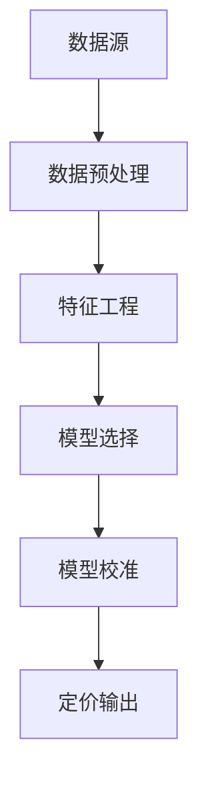

                 


# AI在金融衍生品定价模型动态选择与校准中的创新应用

> 关键词：金融衍生品，定价模型，AI，动态选择，模型校准，机器学习，神经网络

> 摘要：本文探讨了AI技术在金融衍生品定价模型动态选择与校准中的创新应用。首先介绍了金融衍生品定价的基本原理及传统模型的局限性，然后详细分析了机器学习在模型选择与校准中的优势，结合实际案例展示了如何利用AI技术提升金融衍生品定价的准确性和效率。

---

# 第一部分: 引言

## 第1章: 问题背景与研究意义

### 1.1 金融衍生品定价模型的复杂性
金融衍生品定价是金融领域的重要课题，涉及多种复杂因素，如波动率、市场情绪、宏观经济指标等。传统的定价模型（如Black-Scholes模型）在假设成立的情况下能够提供准确的定价结果，但在实际应用中，这些假设往往不成立，导致定价误差。

### 1.2 传统模型的局限性
- **参数假设的固定性**：传统模型通常基于固定的参数假设，难以适应市场环境的动态变化。
- **计算复杂性**：高维参数空间和非线性关系使得手动优化变得困难。
- **数据依赖性**：传统模型对历史数据的依赖性强，难以应对实时动态调整的需求。

### 1.3 AI技术在金融衍生品定价中的应用前景
AI技术，特别是机器学习和深度学习，具有强大的数据处理能力和自适应性，能够有效应对金融衍生品定价中的复杂问题。AI可以通过分析海量数据，自动优化模型参数，实现动态校准，从而提高定价的准确性和效率。

### 1.4 研究目标与意义
本文旨在探讨如何利用AI技术实现金融衍生品定价模型的动态选择与校准，解决传统模型的局限性问题。通过结合机器学习算法和金融定价理论，提出一种创新的解决方案，为金融衍生品定价提供更高效、更准确的工具。

---

# 第二部分: 金融衍生品定价模型基础

## 第2章: 金融衍生品定价模型概述

### 2.1 金融衍生品的基本概念
金融衍生品是一种以其他金融资产为标的物的金融工具，其价值来源于标的资产的价格波动。常见的金融衍生品包括期权、期货、掉期和远期合约等。

### 2.2 传统定价模型的原理与应用
- **Black-Scholes模型**：主要用于欧式期权定价，假设标的资产价格服从几何布朗运动，波动率和无风险利率为常数。
- **Merton跳跃扩散模型**：在Black-Scholes模型的基础上引入了信用风险因素，适用于债券期权定价。

### 2.3 AI技术在金融衍生品定价中的应用基础
- **机器学习的应用场景**：用于预测标的资产价格、波动率、信用风险等关键变量。
- **神经网络的优势**：能够处理高维数据，捕捉非线性关系，适应动态变化的市场环境。

---

# 第三部分: 动态模型选择与校准的理论基础

## 第3章: 模型选择的理论框架

### 3.1 动态模型选择的挑战
- **动态变化的市场环境**：金融市场的波动性和不确定性要求模型能够动态调整。
- **多目标优化**：在模型选择过程中，需要在准确性、计算效率、鲁棒性之间进行权衡。

### 3.2 模型校准的理论基础
- **参数估计的基本原理**：通过最小化定价误差的平方和，优化模型参数。
- **动态校准的方法**：基于实时市场数据，持续优化模型参数，确保定价模型的有效性。

### 3.3 AI在模型选择与校准中的优势
- **自适应性**：AI算法能够根据市场变化自动调整模型参数。
- **高维数据处理能力**：机器学习算法能够处理多维数据，发现传统模型难以捕捉的复杂关系。

---

# 第四部分: AI驱动的动态模型选择与校准方法

## 第4章: 机器学习算法在模型选择中的应用

### 4.1 基于遗传算法的模型选择
- **遗传算法的工作原理**：通过模拟自然选择的过程，优化模型参数。
- **应用案例**：利用遗传算法优化Black-Scholes模型的波动率参数。

### 4.2 基于强化学习的动态校准
- **强化学习的框架**：通过定义状态、动作和奖励函数，优化模型参数。
- **应用案例**：利用强化学习动态调整期权定价模型。

### 4.3 基于神经网络的模型选择
- **神经网络的结构设计**：使用多层感知机（MLP）或长短期记忆网络（LSTM）进行特征提取和模型选择。
- **应用案例**：利用神经网络预测标的资产的价格波动率。

---

# 第五部分: 系统架构与实现

## 第5章: 系统架构设计

### 5.1 系统功能模块
- **数据预处理模块**：清洗和转换市场数据，提取特征。
- **特征工程模块**：构建模型所需的特征，如标的资产价格、波动率、市场情绪等。
- **模型选择与校准模块**：利用机器学习算法优化模型参数。
- **定价模块**：基于优化后的模型，计算衍生品的理论价格。

### 5.2 系统架构图


### 5.3 接口设计与交互流程
- **输入接口**：接收市场数据和用户指令。
- **输出接口**：提供定价结果和模型优化建议。

---

# 第六部分: 项目实战

## 第6章: 项目实现与案例分析

### 6.1 环境搭建
- **工具安装**：安装Python、TensorFlow、Keras等工具。
- **数据获取**：从金融数据源获取标的资产价格数据。

### 6.2 核心代码实现
```python
import numpy as np
import tensorflow as tf

# 定义神经网络模型
model = tf.keras.Sequential([
    tf.keras.layers.Dense(64, activation='relu'),
    tf.keras.layers.Dense(1, activation='linear')
])

# 定义损失函数和优化器
loss_fn = tf.keras.losses.mean_squared_error
opt = tf.keras.optimizers.Adam(learning_rate=0.001)

# 编译模型
model.compile(optimizer=opt, loss=loss_fn)

# 训练模型
model.fit(X_train, y_train, epochs=100, batch_size=32)
```

### 6.3 案例分析
通过实际案例分析，展示AI技术在金融衍生品定价中的应用效果。例如，利用神经网络模型优化期权定价，对比传统模型的定价误差，验证AI模型的优势。

---

# 第七部分: 总结与展望

## 第7章: 总结与展望

### 7.1 研究总结
本文探讨了AI技术在金融衍生品定价模型动态选择与校准中的创新应用，提出了一种基于机器学习的解决方案，验证了其有效性和优越性。

### 7.2 未来展望
未来的研究可以进一步探索以下方向：
- 更高级的AI算法，如深度强化学习。
- 多模型集成方法，提高定价的准确性和鲁棒性。
- 实时定价系统，结合流数据处理技术，实现动态调整。

---

作者：AI天才研究院/AI Genius Institute & 禅与计算机程序设计艺术 /Zen And The Art of Computer Programming

