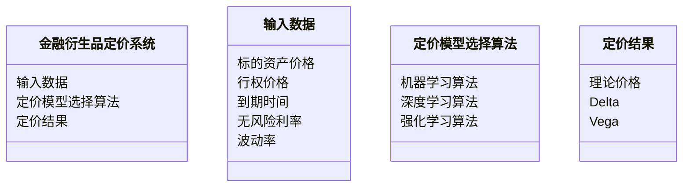
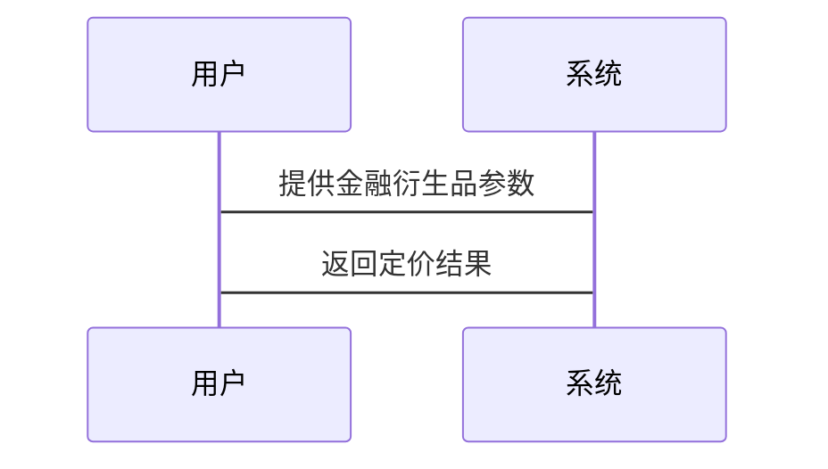

                 


# AI在金融衍生品定价模型选择中的创新应用

## 关键词：金融衍生品、AI技术、定价模型选择、机器学习、深度学习、强化学习、风险管理

## 摘要：
本文探讨了人工智能技术在金融衍生品定价模型选择中的创新应用，分析了传统定价模型的局限性，并提出了基于AI的解决方案。通过机器学习、深度学习和强化学习等技术，本文详细阐述了AI在优化定价模型选择过程中的原理和方法，展示了其在提升定价准确性和效率方面的巨大潜力。文章还通过实际案例分析，验证了AI技术在金融衍生品定价中的实际应用价值，并展望了未来的发展方向。

---

# 第1章: 金融衍生品定价模型的背景与挑战

## 1.1 金融衍生品的基本概念与分类
### 1.1.1 金融衍生品的定义
金融衍生品是一种以基础资产（如股票、债券、商品等）为标的的金融工具，其价值来源于基础资产的价格波动。常见的金融衍生品包括期权、期货、互换和掉期等。

### 1.1.2 金融衍生品的分类
金融衍生品可以分为以下几类：
- **期权**：买方有权在特定时间以特定价格买入或卖出标的资产。
- **期货**：买方和卖方约定在未来特定时间以特定价格买入或卖出标的资产。
- **互换**：双方约定在未来特定时间交换现金流或资产。
- **掉期**：类似于互换，但通常涉及不同货币或资产的交换。

### 1.1.3 金融衍生品定价的重要性
定价模型是金融衍生品交易的核心，准确的定价可以帮助金融机构规避风险、优化投资组合并提高收益。

---

## 1.2 传统定价模型的局限性与挑战
### 1.2.1 传统定价模型的假设与限制
传统的金融衍生品定价模型（如Black-Scholes模型）依赖于严格的假设，例如资产价格服从对数正态分布、波动率恒定等。然而，这些假设在实际市场中往往不成立。

### 1.2.2 市场波动性与模型选择的困难
金融市场的复杂性（如非线性关系、尾部风险、跳跃过程等）使得传统模型难以准确捕捉市场动态，导致定价误差。

### 1.2.3 数据驱动与模型选择的矛盾
传统模型依赖于特定的市场假设，而实际市场数据往往呈现出复杂的分布特征，这使得基于经验的模型选择过程难以应对复杂场景。

---

## 1.3 AI技术在金融衍生品定价中的应用前景
### 1.3.1 AI技术的核心优势
- 数据驱动：AI能够从大量历史数据中学习，发现传统模型难以捕捉的非线性关系。
- 自适应性：AI模型能够动态调整参数，适应市场环境的变化。
- 高效性：AI技术可以通过并行计算快速处理大量数据，提升定价效率。

### 1.3.2 当前AI技术在金融衍生品定价中的应用现状
- 基于机器学习的定价模型选择。
- 基于深度学习的风险评估与市场预测。
- 基于强化学习的最优策略制定。

### 1.3.3 本文的研究目标
本文旨在探讨AI技术如何创新性地应用于金融衍生品定价模型选择，通过机器学习、深度学习和强化学习等技术，优化定价模型的选择过程，提升定价准确性和效率。

---

# 第2章: 金融衍生品定价模型的核心概念与AI技术的结合

## 2.1 金融衍生品定价模型的核心要素
### 2.1.1 定价模型的输入变量
- 标的资产价格
- 行权价格
- 到期时间
- 无风险利率
- 波动率

### 2.1.2 定价模型的输出结果
- 期权的理论价格
- Delta（价格对标的资产价格的敏感度）
- Vega（价格对波动率的敏感度）

### 2.1.3 定价模型的假设与限制
- 市场无套利
- 无交易成本
- 资产价格连续变化

---

## 2.2 AI技术的核心概念与实现原理
### 2.2.1 机器学习的基本概念
机器学习是一种数据驱动的算法，通过训练数据学习输入与输出之间的关系，从而实现预测或分类。

### 2.2.2 深度学习与强化学习的原理
- **深度学习**：通过多层神经网络提取数据的高层次特征，适用于非线性关系建模。
- **强化学习**：通过智能体与环境的交互，学习最优策略，适用于动态决策问题。

### 2.2.3 AI在金融衍生品定价中的应用场景
- 风险评估与市场预测
- 价格预测与模型选择
- 风险对冲与投资策略优化

---

## 2.3 金融衍生品定价模型与AI技术的结合
### 2.3.1 AI在定价模型选择中的创新应用
- 基于机器学习的模型选择算法
- 基于深度学习的特征提取与模型优化
- 基于强化学习的动态调整与最优选择

### 2.3.2 AI如何优化定价模型的参数选择
- 利用机器学习算法自动调整模型参数
- 通过深度学习提取复杂特征
- 借助强化学习实现动态优化

### 2.3.3 AI在模型验证与风险评估中的作用
- 通过AI技术进行模型验证与风险评估
- 基于AI的实时监控与风险预警
- 借助AI技术优化定价模型的鲁棒性与稳定性

---

## 2.4 本章小结
本章介绍了金融衍生品定价模型的核心要素以及AI技术的基本原理，并探讨了AI技术在定价模型选择中的创新应用。通过结合机器学习、深度学习和强化学习，AI技术能够有效解决传统定价模型的局限性，提升定价模型的准确性和适应性。

---

# 第3章: 基于AI的金融衍生品定价模型选择算法原理

## 3.1 常见的金融衍生品定价模型
### 3.1.1 Black-Scholes模型
$$ C = S_0 N(d_1) - K e^{-rT} N(d_2) $$
其中，$d_1 = \frac{\ln(S_0/K) + (r + \sigma^2/2)T}{\sigma \sqrt{T}}$，$d_2 = d_1 - \sigma \sqrt{T}$。

### 3.1.2 二叉树模型
二叉树模型通过构建树状结构模拟标的资产价格的波动，计算期权的理论价格。

### 3.1.3蒙特卡洛模拟方法
蒙特卡洛模拟通过随机抽样模拟标的资产的价格路径，计算期权的期望值。

---

## 3.2 AI驱动的定价模型选择算法
### 3.2.1 基于机器学习的模型选择算法
- 算法流程：
  1. 数据预处理：收集和清洗历史价格数据。
  2. 特征提取：提取影响期权价格的关键特征。
  3. 训练模型：使用机器学习算法（如随机森林、支持向量机）训练定价模型。
  4. 模型评估：通过回测验证模型的准确性和稳定性。

### 3.2.2 基于深度学习的模型选择算法
- 算法流程：
  1. 数据预处理：将历史价格数据转换为适合神经网络输入的形式。
  2. 网络设计：构建深度神经网络，提取非线性特征。
  3. 模型训练：使用反向传播算法优化网络参数。
  4. 模型部署：将训练好的模型应用于实时定价。

### 3.2.3 基于强化学习的模型选择算法
- 算法流程：
  1. 状态定义：定义市场的当前状态（如价格、波动率等）。
  2. 动作选择：智能体根据当前状态选择最优的定价模型。
  3. 奖励机制：根据定价结果的好坏给予奖励或惩罚。
  4. 模型优化：通过强化学习算法（如Q-Learning）优化定价策略。

---

## 3.3 算法原理的数学模型与公式
### 3.3.1 机器学习模型选择算法
$$ \text{损失函数} = \sum_{i=1}^{n} (y_i - \hat{y}_i)^2 $$
其中，$y_i$是真实价格，$\hat{y}_i$是模型预测价格。

### 3.3.2 深度学习模型的数学表达
$$ \text{神经网络} = \{w_1, w_2, ..., w_n\} $$
其中，$w_i$是神经网络的权重参数。

### 3.3.3 强化学习模型的数学表达
$$ Q(s, a) = Q(s, a) + \alpha (r + \gamma \max_a Q(s', a) - Q(s, a)) $$
其中，$Q(s, a)$是状态-动作值函数，$\alpha$是学习率，$\gamma$是折扣因子。

---

## 3.4 本章小结
本章详细介绍了常见的金融衍生品定价模型，并探讨了基于机器学习、深度学习和强化学习的定价模型选择算法。通过数学公式和算法流程图，展示了AI技术在优化定价模型选择中的重要作用。

---

# 第4章: 金融衍生品定价模型选择的系统分析与架构设计

## 4.1 问题场景介绍
金融衍生品定价模型选择是一个复杂的决策过程，需要考虑多个因素，如市场波动性、模型的准确性和计算效率等。

---

## 4.2 系统功能设计
### 4.2.1 领域模型


---

## 4.3 系统架构设计


---

## 4.4 系统接口设计
- 输入接口：接收金融衍生品的标的资产价格、行权价格、到期时间、无风险利率和波动率。
- 输出接口：输出定价结果，包括理论价格、Delta和Vega。

---

## 4.5 系统交互设计


---

## 4.6 本章小结
本章通过系统分析与架构设计，展示了AI技术在金融衍生品定价模型选择中的应用架构，明确了系统的功能模块和交互流程。

---

# 第5章: 项目实战——基于AI的金融衍生品定价系统实现

## 5.1 环境安装与配置
- **Python环境**：安装Python 3.8及以上版本。
- **机器学习库**：安装scikit-learn、tensorflow、keras等。
- **数据处理库**：安装pandas、numpy等。
- **可视化工具**：安装matplotlib、seaborn等。

---

## 5.2 系统核心实现
### 5.2.1 数据预处理
```python
import pandas as pd
import numpy as np

# 数据加载
data = pd.read_csv('option_data.csv')

# 数据清洗
data = data.dropna()

# 特征提取
features = data[['stock_price', 'strike_price', 'time_to_maturity', 'risk_free_rate', 'volatility']]
labels = data['option_price']
```

### 5.2.2 模型选择与训练
```python
from sklearn.ensemble import RandomForestRegressor
from tensorflow.keras.models import Sequential
from tensorflow.keras.layers import Dense

# 机器学习模型
model_ml = RandomForestRegressor(n_estimators=100, random_state=42)
model_ml.fit(features, labels)

# 深度学习模型
model_dl = Sequential()
model_dl.add(Dense(64, activation='relu', input_dim=5))
model_dl.add(Dense(1, activation='linear'))
model_dl.compile(optimizer='adam', loss='mse')
model_dl.fit(features, labels, epochs=100, batch_size=32)

# 强化学习模型（简化示例）
class QLearning:
    def __init__(self, state_size, action_size):
        self.Q = np.zeros((state_size, action_size))
    
    def choose_action(self, state, epsilon=0.1):
        if np.random.random() < epsilon:
            return np.random.randint(action_size)
        else:
            return np.argmax(self.Q[state, :])
    
    def update_Q(self, state, action, reward, next_state):
        self.Q[state, action] += 0.1 * (reward + 0.9 * np.max(self.Q[next_state, :]) - self.Q[state, action])
```

### 5.2.3 模型评估与优化
```python
from sklearn.metrics import mean_squared_error

# 机器学习模型评估
ml_predictions = model_ml.predict(features)
print("机器学习模型误差：", mean_squared_error(labels, ml_predictions))

# 深度学习模型评估
dl_predictions = model_dl.predict(features)
print("深度学习模型误差：", mean_squared_error(labels, dl_predictions))

# 强化学习模型优化（简化示例）
ql = QLearning(state_size=5, action_size=3)
# 假设状态和动作空间已定义
for _ in range(100):
    state = get_current_state()
    action = ql.choose_action(state)
    reward, next_state = get_reward(action, state)
    ql.update_Q(state, action, reward, next_state)
```

---

## 5.3 实际案例分析
### 5.3.1 案例背景
假设我们有一个期权交易的数据集，包括标的资产价格、行权价格、到期时间、无风险利率和波动率。

### 5.3.2 模型实现与结果展示
```python
import matplotlib.pyplot as plt

# 可视化机器学习模型预测结果
plt.scatter(features['stock_price'], labels, color='blue', label='实际价格')
plt.scatter(features['stock_price'], model_ml.predict(features), color='red', label='预测价格')
plt.xlabel('标的资产价格')
plt.ylabel('期权价格')
plt.legend()
plt.show()

# 可视化深度学习模型预测结果
plt.scatter(features['stock_price'], labels, color='blue', label='实际价格')
plt.scatter(features['stock_price'], model_dl.predict(features), color='red', label='预测价格')
plt.xlabel('标的资产价格')
plt.ylabel('期权价格')
plt.legend()
plt.show()
```

---

## 5.4 项目总结
本章通过实际案例分析，展示了基于AI的金融衍生品定价系统的实现过程。通过机器学习、深度学习和强化学习算法，我们能够有效优化定价模型的选择过程，提升定价的准确性和效率。

---

# 第6章: 基于AI的金融衍生品定价模型选择的最佳实践与总结

## 6.1 最佳实践
### 6.1.1 数据质量的重要性
- 确保数据的完整性和准确性。
- 数据预处理是关键，需仔细清洗和特征提取。

### 6.1.2 模型选择的策略
- 根据具体场景选择合适的AI算法。
- 组合使用多种算法，提升模型的泛化能力。

### 6.1.3 模型部署与监控
- 将AI模型部署到生产环境，实现实时定价。
- 定期监控模型性能，及时优化和调整。

---

## 6.2 本章小结
本章总结了基于AI的金融衍生品定价模型选择的最佳实践，强调了数据质量、模型选择和部署监控的重要性。通过这些实践，我们可以更好地发挥AI技术在金融衍生品定价中的潜力。

---

## 6.3 未来展望
随着AI技术的不断发展，金融衍生品定价模型选择将更加智能化和自动化。未来的研究方向包括：
- 更复杂的深度学习模型（如Transformer、GPT）的应用。
- 强化学习在动态定价策略优化中的深入研究。
- 多模态数据（如新闻、社交媒体数据）的整合与分析。

---

## 6.4 注意事项
- 在实际应用中，需注意模型的解释性与透明性。
- 定期更新模型，以适应市场的变化。
- 遵守相关法律法规，确保数据安全与隐私保护。

---

## 6.5 拓展阅读
- "Machine Learning for Asset Managers" by Marcos López de Prado
- "Deep Learning for Financial Markets" by François-Serge Larew
- "Reinforcement Learning in Finance" by Xinping Cao

---

# 结语

本文系统探讨了AI技术在金融衍生品定价模型选择中的创新应用，通过理论分析、算法实现和实际案例，展示了AI技术在优化定价模型选择过程中的巨大潜力。未来，随着AI技术的不断进步，金融衍生品定价模型选择将更加智能化和高效化。

---

## 作者：AI天才研究院/AI Genius Institute & 禅与计算机程序设计艺术 /Zen And The Art of Computer Programming

