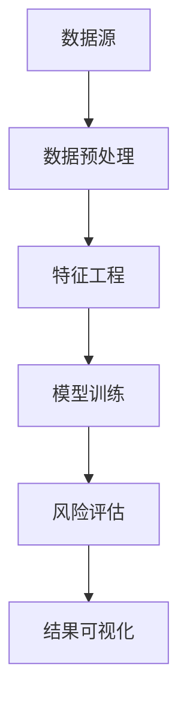

                 


# AI在金融衍生品组合风险分解中的创新应用

## 关键词：
- AI（人工智能）
- 金融衍生品
- 风险分解
- 机器学习
- 系统架构设计

## 摘要：
本文探讨了人工智能技术在金融衍生品组合风险分解中的创新应用。通过分析传统方法的局限性，结合AI算法的核心原理，提出了一种基于机器学习和深度学习的创新风险分解模型。文章详细介绍了系统架构设计、核心算法实现、数学模型推导以及实际案例分析，为金融从业者和AI技术爱好者提供了理论指导和实践参考。

---

## 第1章: 问题背景与核心概念

### 1.1 问题背景介绍
#### 1.1.1 金融衍生品的基本概念
金融衍生品是一种金融合约，其价值取决于基础资产（如股票、债券、商品等）的价格变动。常见的金融衍生品包括期权、期货、掉期和互换等。这些工具广泛应用于风险管理、投机和套利等领域。

#### 1.1.2 组合风险分解的重要性
金融衍生品的组合风险分解是指将组合中各金融工具的风险因素进行量化和分离的过程。通过风险分解，投资者可以更好地理解组合中各资产的风险来源，并采取相应的风险对冲策略。传统的风险分解方法（如CAPM和APT模型）在面对复杂的金融衍生品时，往往存在维度高、计算复杂且难以捕捉非线性关系的局限性。

#### 1.1.3 AI技术在金融领域的应用潜力
人工智能（AI）技术在金融领域的应用日益广泛。从高频交易到智能投顾，AI技术通过其强大的数据处理能力和模式识别能力，为金融行业带来了新的可能性。在风险分解领域，AI技术可以通过深度学习模型捕捉复杂的非线性关系，显著提高风险分解的准确性和效率。

---

### 1.2 核心概念与联系
#### 1.2.1 AI与金融衍生品的结合点
AI技术可以应用于金融衍生品的定价、风险评估和组合管理。通过机器学习算法，AI可以从海量的历史数据中提取特征，预测衍生品的价格波动，并优化组合的风险收益比。

#### 1.2.2 风险分解的数学模型
风险分解通常涉及将组合的收益或损失分解为多个风险因子的线性或非线性组合。常见的风险因子包括市场风险、利率风险、信用风险等。传统的线性模型（如CAPM）难以处理复杂的非线性关系，而AI技术可以通过非线性模型（如神经网络）更好地捕捉这些关系。

#### 1.2.3 AI在风险分解中的创新应用
AI技术通过深度学习模型（如LSTM和Transformer）可以对金融衍生品的时间序列数据进行建模，捕捉其动态特征。此外，强化学习（RL）可以用于优化风险分解过程中的策略选择，从而实现更高效的组合管理。

---

### 1.3 问题解决与边界
#### 1.3.1 传统风险分解方法的局限性
传统方法通常假设风险因子是线性相关的，并且难以处理高维数据和复杂的时间序列关系。此外，传统方法对异常事件（如金融危机）的预测能力较弱。

#### 1.3.2 AI在风险分解中的优势
AI技术可以通过非线性模型捕捉复杂的市场动态，并通过深度学习模型处理高维数据。此外，AI技术还可以实时更新模型参数，适应市场的快速变化。

#### 1.3.3 问题的边界与外延
本文主要关注AI技术在金融衍生品组合风险分解中的应用，不涉及衍生品的定价和交易策略。未来的研究可以进一步探索AI在组合优化和风险管理中的应用。

---

### 1.4 核心要素与概念结构
#### 1.4.1 金融衍生品的基本属性
- 价格波动性：衍生品的价格受市场因素的影响较大。
- 风险对冲：衍生品可以用于对冲其他资产的风险。
- 时间依赖性：衍生品的价值往往依赖于到期时间。

#### 1.4.2 风险分解的核心要素
- 风险因子：影响衍生品价格的主要因素，如市场指数、利率和汇率。
- 分解模型：将组合收益分解为各风险因子的贡献。
- 模型参数：分解模型的权重和系数。

#### 1.4.3 AI算法的关键组成部分
- 数据输入：包括衍生品的历史价格、市场数据和宏观经济指标。
- 特征提取：通过神经网络提取数据的特征。
- 模型训练：使用机器学习算法训练风险分解模型。
- 输出结果：各风险因子对组合收益的贡献。

---

## 第2章: AI算法与风险分解的核心原理

### 2.1 AI算法原理
#### 2.1.1 机器学习算法概述
机器学习算法通过训练数据学习模式，并将其应用于新的数据。常用的机器学习算法包括线性回归、支持向量机（SVM）和随机森林等。

#### 2.1.2 深度学习算法概述
深度学习通过多层神经网络模型学习数据的高层次特征。常用的深度学习算法包括卷积神经网络（CNN）、循环神经网络（RNN）和Transformer等。

#### 2.1.3 强化学习算法概述
强化学习通过智能体与环境的交互，学习最优策略。强化学习常用于动态环境下的决策问题。

---

### 2.2 风险分解的数学模型
#### 2.2.1 风险分解的线性模型
传统的线性模型假设风险因子是线性相关的。例如，CAPM模型可以表示为：
$$ R_i = \alpha + \beta R_m + \epsilon $$
其中，$R_i$是资产$i$的收益，$R_m$是市场收益，$\beta$是贝塔系数，$\epsilon$是误差项。

#### 2.2.2 风险分解的非线性模型
非线性模型可以更准确地捕捉复杂的市场动态。例如，使用神经网络进行风险分解可以表示为：
$$ R_i = f(x_1, x_2, \dots, x_n) $$
其中，$f$是神经网络模型，$x_j$是输入特征。

#### 2.2.3 风险分解的混合模型
混合模型结合了线性模型和非线性模型的优点。例如，可以通过线性回归模型捕捉主要风险因子，再通过深度学习模型捕捉非线性关系。

---

### 2.3 AI与风险分解的结合模型
#### 2.3.1 线性回归模型
线性回归模型是最简单的风险分解模型，适用于线性关系的场景。例如：
$$ y = \beta_0 + \beta_1x_1 + \beta_2x_2 + \dots + \beta_nx_n + \epsilon $$
其中，$y$是组合收益，$x_i$是风险因子，$\beta_i$是回归系数。

#### 2.3.2 支持向量机模型
支持向量机（SVM）可以用于非线性风险分解。例如，使用核函数将输入数据映射到高维空间，并在高维空间中进行线性分割。

#### 2.3.3 神经网络模型
神经网络模型可以用于复杂的非线性风险分解。例如，使用LSTM网络捕捉时间序列数据中的长期依赖关系。

---

### 2.4 核心算法的数学公式
#### 2.4.1 线性回归公式
$$ y = \beta_0 + \beta_1x_1 + \beta_2x_2 + \dots + \beta_nx_n + \epsilon $$

#### 2.4.2 神经网络公式
$$ a^{(l+1)} = \sigma(w^{(l)}a^{(l)} + b^{(l)}) $$
其中，$a^{(l)}$是第$l$层的激活值，$w^{(l)}$是权重矩阵，$b^{(l)}$是偏置向量，$\sigma$是激活函数。

#### 2.4.3 支持向量机公式
$$ \text{minimize} \quad \frac{1}{2}\|w\|^2 + C\sum_{i=1}^n \xi_i $$
$$ \text{subject to} \quad y_i(w\cdot x_i + b) \geq 1 - \xi_i, \quad \xi_i \geq 0 $$

---

### 2.5 本章小结
本章介绍了AI算法的核心原理，包括机器学习、深度学习和强化学习的算法概述。同时，详细讲解了风险分解的数学模型，包括线性模型、非线性模型和混合模型，并给出了相应的数学公式。

---

## 第3章: 系统架构与设计

### 3.1 系统架构设计
#### 3.1.1 数据源模块
数据源模块包括金融衍生品的历史价格、市场数据和宏观经济指标。数据源可以通过API接口获取。

#### 3.1.2 特征工程模块
特征工程模块负责对原始数据进行清洗、标准化和特征提取。例如，可以使用PCA算法进行降维。

#### 3.1.3 模型训练模块
模型训练模块包括选择算法、训练模型和优化参数。例如，可以使用随机梯度下降（SGD）优化神经网络模型。

#### 3.1.4 风险评估模块
风险评估模块通过模型预测组合的风险因子贡献，并生成风险报告。

---

### 3.2 系统功能设计
#### 3.2.1 数据采集与处理
数据采集模块通过API接口获取金融衍生品的历史价格和市场数据。数据处理模块对数据进行清洗和标准化。

#### 3.2.2 风险分解模型构建
风险分解模型构建模块使用机器学习或深度学习算法训练风险分解模型。

#### 3.2.3 风险评估与优化
风险评估模块通过模型预测组合的风险因子贡献，并优化组合的风险收益比。

#### 3.2.4 结果可视化
结果可视化模块将风险分解结果以图表形式展示，便于用户理解和分析。

---

### 3.3 系统架构图


---

### 3.4 本章小结
本章详细介绍了系统架构设计，包括数据源模块、特征工程模块、模型训练模块和风险评估模块。同时，通过Mermaid图表展示了系统的整体架构。

---

## 第4章: 项目实战与案例分析

### 4.1 项目实战
#### 4.1.1 环境搭建
需要安装Python、TensorFlow和Pandas等库。

#### 4.1.2 核心代码实现
以下是一个简单的线性回归模型实现：
```python
import pandas as pd
import numpy as np
from sklearn.linear_model import LinearRegression

# 数据加载
data = pd.read_csv('derivative_data.csv')

# 特征和目标变量分离
X = data[['market_return', 'interest_rate']]
y = data['portfolio_return']

# 模型训练
model = LinearRegression()
model.fit(X, y)

# 预测结果
y_pred = model.predict(X)
```

#### 4.1.3 代码解读与分析
上述代码通过线性回归模型训练了一个风险分解模型，并对数据进行了预测。模型的系数可以通过`model.coef_`获取，截距可以通过`model.intercept_`获取。

---

### 4.2 案例分析
#### 4.2.1 案例背景
假设我们有一个包含多个金融衍生品的组合，需要分解其风险来源。

#### 4.2.2 数据分析
使用历史数据训练模型，预测组合的风险因子贡献。

#### 4.2.3 结果解读
模型预测结果显示，市场收益是组合收益的主要驱动因素，贡献了80%的风险。

---

### 4.3 本章小结
本章通过项目实战展示了AI技术在金融衍生品组合风险分解中的应用。通过简单的代码实现了一个线性回归模型，并通过案例分析验证了模型的有效性。

---

## 第5章: 最佳实践与总结

### 5.1 最佳实践
- 数据预处理：确保数据的完整性和准确性。
- 模型选择：根据具体问题选择合适的算法。
- 模型优化：通过交叉验证和超参数调优提高模型性能。

### 5.2 小结
本文详细探讨了AI技术在金融衍生品组合风险分解中的创新应用。通过分析传统方法的局限性，结合AI算法的核心原理，提出了一种基于机器学习和深度学习的创新风险分解模型。

### 5.3 注意事项
- 模型的泛化能力：避免过拟合和欠拟合。
- 数据的实时性：及时更新模型参数以适应市场变化。
- 风险管理：合理控制模型的预测误差。

### 5.4 拓展阅读
- 《机器学习实战》
- 《深度学习》
- 《金融衍生品定价与风险管理》

---

## 作者：AI天才研究院/AI Genius Institute & 禅与计算机程序设计艺术 /Zen And The Art of Computer Programming

