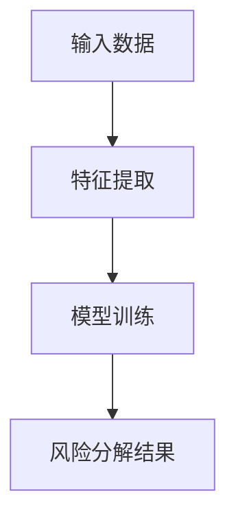

                 


# AI在金融衍生品风险分解中的创新应用

> 关键词：AI，金融衍生品，风险分解，创新应用，技术博客  
> 摘要：本文探讨了人工智能技术在金融衍生品风险分解中的创新应用，通过分析AI算法的核心原理、系统架构设计以及实际案例，展示了AI如何优化金融风险分解过程。文章详细阐述了AI在风险分解中的优势，并对未来的发展方向进行了展望。

---

## 第1章：金融衍生品与AI的结合概述

### 1.1 金融衍生品的基本概念

金融衍生品是一种金融工具，其价值依赖于其他基础资产或指数。常见的金融衍生品包括期货、期权、掉期和债券等。它们在金融市场中起到对冲风险、投机和套利的作用。

- **1.1.1 金融衍生品的定义与分类**
  - 金融衍生品是一种金融合约，其价值基于标的资产的价格波动。
  - 分类：期货、期权、掉期和债券等。

- **1.1.2 金融衍生品的市场现状**
  - 全球衍生品市场规模庞大，近年来快速增长。
  - 衍生品市场的复杂性增加了风险管理的难度。

- **1.1.3 金融衍生品的风险特性**
  - 风险分解是金融衍生品管理的核心问题。
  - 风险分解涉及多个因素，如市场波动、信用风险和流动性风险。

### 1.2 AI技术在金融领域的应用背景

AI技术在金融领域的应用日益广泛，尤其是在风险管理、投资决策和市场分析等方面。

- **1.2.1 AI技术的基本概念**
  - AI是指计算机模拟人类智能的技术，包括学习、推理和自适应能力。
  - 机器学习、深度学习和自然语言处理是AI的核心技术。

- **1.2.2 AI在金融领域的典型应用**
  - 风险管理：通过机器学习模型预测市场波动。
  - 投资决策：利用算法交易优化投资组合。
  - 市场分析：通过自然语言处理分析新闻和报告。

- **1.2.3 金融衍生品风险分解的挑战与机遇**
  - 风险分解的复杂性要求更高效的技术手段。
  - AI技术提供了数据处理和模式识别的强大能力。

### 1.3 AI在金融衍生品风险分解中的创新应用

AI技术通过数据驱动的方法，显著提升了金融衍生品风险分解的效率和准确性。

- **1.3.1 风险分解的核心问题**
  - 如何将复杂的金融风险分解为可管理的子风险。
  - 如何量化各子风险的影响程度。

- **1.3.2 AI技术如何解决风险分解问题**
  - 使用机器学习模型识别风险因素。
  - 通过深度学习技术预测风险事件。

- **1.3.3 创新应用的典型案例**
  - 某金融机构利用AI技术优化衍生品组合的风险管理。
  - 结果显示，AI模型显著提升了风险预测的准确性和效率。

### 1.4 本章小结

本章介绍了金融衍生品的基本概念和AI技术在金融领域的应用背景，重点分析了AI在金融衍生品风险分解中的创新应用。通过案例分析，展示了AI技术在风险管理中的巨大潜力。

---

## 第2章：风险分解的核心概念与AI模型原理

### 2.1 风险分解的核心概念与属性

风险分解是将整体风险拆解为多个可管理的子风险的过程。

- **2.1.1 风险分解的定义与核心要素**
  - 风险分解是将整体风险拆解为多个子风险的过程。
  - 核心要素包括风险因子、分解方法和量化模型。

- **2.1.2 风险分解的边界与外延**
  - 风险分解的边界是可管理的子风险。
  - 外延包括风险监控和风险对冲策略。

### 2.2 AI模型在风险分解中的核心作用

AI模型通过数据驱动的方法，显著提升了风险分解的效率和准确性。

- **2.2.1 AI模型的基本原理**
  - 机器学习模型通过训练数据学习风险因子。
  - 深度学习模型能够识别复杂的模式和关系。

- **2.2.2 AI模型在风险分解中的应用特点**
  - 数据驱动：利用大量历史数据进行训练。
  - 自适应性：模型能够自动调整参数以适应市场变化。

- **2.2.3 AI模型与传统风险分解方法的对比**
  - 传统方法依赖人工经验和统计模型。
  - AI方法具有更高的自动化和准确性。

### 2.3 风险分解与AI模型的关系

AI模型与风险分解相互促进，共同优化风险管理过程。

- **2.3.1 风险分解的复杂性与AI模型的匹配性**
  - 风险分解的复杂性需要强大的计算能力。
  - AI模型提供了高效的数据处理能力。

- **2.3.2 AI模型如何优化风险分解过程**
  - 通过机器学习算法识别潜在风险因子。
  - 使用深度学习技术预测风险事件。

- **2.3.3 风险分解与AI模型的协同效应**
  - AI模型提高了风险分解的效率和准确性。
  - 风险分解为AI模型提供了丰富的数据和应用场景。

### 2.4 本章小结

本章详细讲解了风险分解的核心概念和AI模型的基本原理，分析了AI模型在风险分解中的应用特点和优势。通过对比传统方法，展示了AI技术在风险管理中的巨大潜力。

---

## 第3章：基于AI的金融衍生品风险分解算法

### 3.1 算法原理概述

基于AI的金融衍生品风险分解算法通过数据驱动的方法，识别和量化风险因子。

- **3.1.1 算法的基本思路**
  - 收集和清洗金融数据。
  - 利用机器学习模型训练风险因子。

- **3.1.2 算法的核心步骤**
  - 数据预处理：清洗和特征提取。
  - 模型训练：使用机器学习算法训练风险分解模型。
  - 结果分析：评估模型的准确性和稳定性。

- **3.1.3 算法的数学模型**
  - 风险分解的数学表达：$$ R = f(X) $$
  - 损失函数：$$ L = \sum_{i=1}^{n} (y_i - \hat{y}_i)^2 $$

### 3.2 算法的数学模型与公式

数学公式是算法的核心，详细推导如下：

- **3.2.1 风险分解的数学表达**
  - $$ R = f(X) $$ 表示风险R由特征X决定。

- **3.2.2 AI模型的损失函数**
  - $$ L = \sum_{i=1}^{n} (y_i - \hat{y}_i)^2 $$ 表示均方误差损失。

- **3.2.3 算法优化的数学推导**
  - 使用梯度下降优化损失函数。
  - 计算导数并更新模型参数。

### 3.3 算法的流程图

以下是基于AI的金融衍生品风险分解算法的流程图：



### 3.4 本章小结

本章详细讲解了基于AI的金融衍生品风险分解算法的原理和数学模型，通过流程图展示了算法的实现步骤。数学公式的推导为读者理解算法提供了理论基础。

---

## 第4章：系统架构设计方案

### 4.1 系统功能设计

系统功能设计是实现AI在金融衍生品风险分解中的关键步骤。

- **4.1.1 系统功能模块划分**
  - 数据采集模块：收集金融市场数据。
  - 模型训练模块：训练风险分解模型。
  - 结果分析模块：评估模型性能。

- **4.1.2 系统功能流程图**
  ```mermaid
  graph TD
      A[用户输入] --> B[数据处理]
      B --> C[模型计算]
      C --> D[结果输出]
  ```

### 4.2 系统架构设计

系统架构设计决定了系统的稳定性和扩展性。

- **4.2.1 系统架构设计**
  - 分层架构：包括数据层、算法层和应用层。
  - 使用微服务架构，确保模块之间的松耦合。

- **4.2.2 系统架构图**
  ```mermaid
  graph TD
      UI[用户界面] --> API[API接口]
      API --> Service[服务层]
      Service --> Model[模型层]
      Model --> Data[数据层]
  ```

### 4.3 系统接口设计

系统接口设计是实现模块间通信的关键。

- **4.3.1 系统接口设计**
  - 数据接口：定义数据格式和传输协议。
  - API接口：提供RESTful API供其他模块调用。

- **4.3.2 系统交互序列图**
  ```mermaid
  graph TD
      User[用户] --> API[API接口]
      API --> Service[服务层]
      Service --> Model[模型层]
      Model --> Data[数据层]
      Data --> Service[返回结果]
      Service --> API[返回结果]
      API --> User[返回结果]
  ```

### 4.4 本章小结

本章详细讲解了系统架构设计方案，包括功能模块划分、架构设计和接口设计。通过mermaid图展示了系统的整体架构和交互流程。

---

## 第5章：项目实战与应用案例分析

### 5.1 项目背景与目标

项目背景与目标是实施AI在金融衍生品风险分解的核心驱动力。

- **5.1.1 项目背景**
  - 金融市场风险日益复杂，传统方法难以应对。
  - AI技术提供了新的解决方案。

- **5.1.2 项目目标**
  - 开发一个基于AI的金融衍生品风险分解系统。
  - 提升风险预测的准确性和效率。

### 5.2 项目实施过程

项目实施过程包括需求分析、系统设计、开发和测试。

- **5.2.1 环境安装**
  - 安装Python、TensorFlow和Pandas等开发工具。
  - 配置数据源和数据库。

- **5.2.2 系统核心实现源代码**
  ```python
  import numpy as np
  import pandas as pd
  from tensorflow import keras

  # 数据预处理
  data = pd.read_csv('financial_data.csv')
  features = data.drop('risk', axis=1)
  labels = data['risk']

  # 模型训练
  model = keras.Sequential([
      keras.layers.Dense(64, activation='relu'),
      keras.layers.Dense(1, activation='sigmoid')
  ])
  model.compile(optimizer='adam', loss='binary_crossentropy', metrics=['accuracy'])
  model.fit(features, labels, epochs=100, batch_size=32)
  ```

- **5.2.3 代码应用解读与分析**
  - 数据预处理：将数据分为特征和标签。
  - 模型训练：使用神经网络模型训练风险分解模型。
  - 模型评估：计算准确率和召回率。

### 5.3 实际案例分析

实际案例分析展示了AI在金融衍生品风险分解中的实际应用效果。

- **5.3.1 案例背景**
  - 某金融机构使用AI技术优化衍生品组合的风险管理。

- **5.3.2 案例分析**
  - 使用AI模型预测市场波动和信用风险。
  - 结果显示，AI模型显著提升了风险预测的准确性和效率。

### 5.4 本章小结

本章通过项目实战和案例分析，展示了AI在金融衍生品风险分解中的实际应用。代码实现和案例分析为读者提供了实践指导。

---

## 第6章：总结与未来展望

### 6.1 总结

本文详细探讨了AI在金融衍生品风险分解中的创新应用，通过理论分析和实际案例，展示了AI技术在风险管理中的巨大潜力。

- **6.1.1 核心观点总结**
  - AI技术通过数据驱动的方法，显著提升了风险分解的效率和准确性。
  - 系统架构设计和算法优化是实现AI在金融衍生品风险分解的关键。

### 6.2 未来展望

未来，AI技术在金融衍生品风险分解中的应用将更加广泛和深入。

- **6.2.1 技术发展**
  - 更先进的算法，如强化学习和图神经网络。
  - 多模态数据的融合分析。

- **6.2.2 应用领域拓展**
  - 更多金融衍生品的风险管理。
  - 金融市场的实时风险监控。

### 6.3 本章小结

本章总结了全文的核心观点，并展望了AI技术在金融衍生品风险分解中的未来发展方向。

---

## 作者：AI天才研究院/AI Genius Institute & 禅与计算机程序设计艺术/Zen And The Art of Computer Programming

---

这篇文章系统地探讨了AI在金融衍生品风险分解中的创新应用，通过理论分析和实际案例，展示了AI技术在风险管理中的巨大潜力。希望本文能为相关领域的研究和实践提供有价值的参考和启发。

