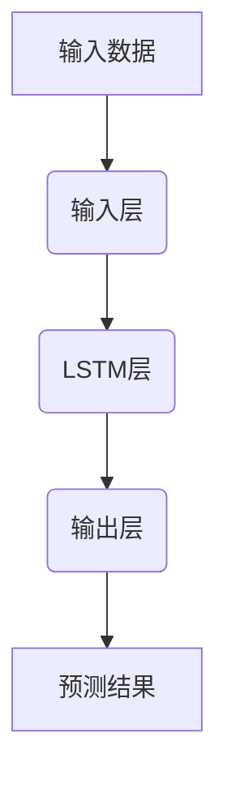
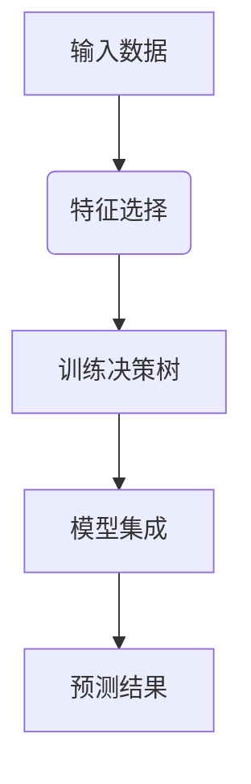
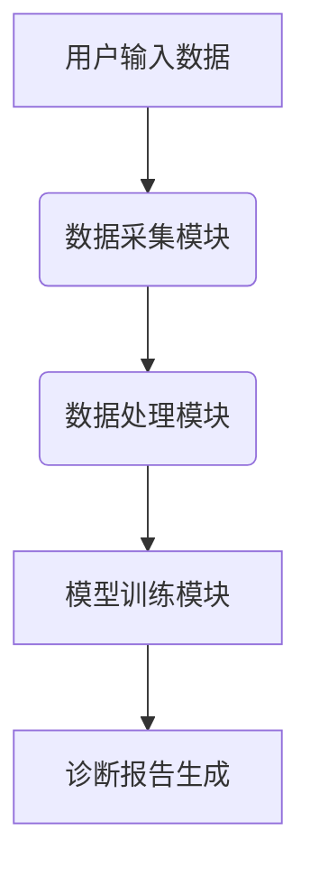
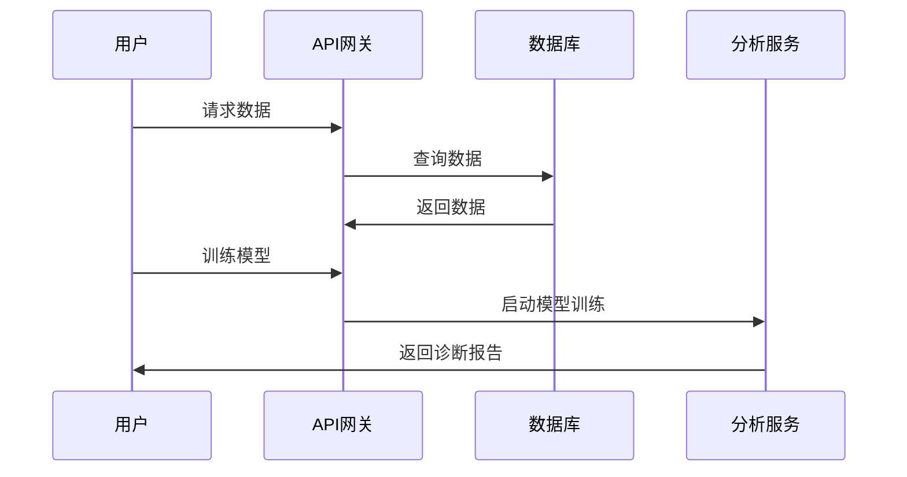

                 


# AI增强型公司财务健康诊断

> 关键词：AI增强型财务诊断，人工智能，财务数据分析，机器学习，公司财务健康

> 摘要：本文深入探讨了AI在公司财务健康诊断中的应用，从背景介绍到系统架构设计，结合实际案例分析，展示了如何利用AI技术提升财务分析的效率和准确性。通过详细讲解算法原理和系统架构，本文为读者提供了从理论到实践的全面指导，帮助企业在复杂多变的商业环境中做出更明智的财务决策。

---

## 第一部分: AI增强型公司财务健康诊断的背景与概念

### 第1章: AI增强型公司财务健康诊断的背景介绍

#### 1.1 问题背景

##### 1.1.1 传统公司财务分析的局限性
传统的财务分析依赖于人工审核和经验判断，存在以下问题：
- 数据处理效率低：需要手动整理大量财务数据，耗时耗力。
- 模型单一：传统财务指标（如资产负债率、利润率）难以捕捉复杂市场环境中的潜在风险。
- 预测能力有限：基于历史数据的线性模型难以应对市场波动和突发事件。

##### 1.1.2 数据驱动决策的需求
现代企业面临复杂多变的市场环境，需要实时、动态的财务分析工具来支持决策。数据驱动的财务分析能够：
- 提高决策的准确性。
- 实现财务数据的深度挖掘。
- 优化资源配置。

##### 1.1.3 AI技术在财务分析中的应用潜力
AI技术（如机器学习、深度学习）能够处理非结构化数据，识别隐藏模式，提供实时预测，是财务分析领域的革命性工具。

#### 1.2 问题描述

##### 1.2.1 财务健康诊断的核心目标
通过分析公司财务数据，识别潜在风险，评估财务健康状况，并提供优化建议。

##### 1.2.2 财务健康诊断的关键问题
- 数据清洗与预处理。
- 特征提取与选择。
- 模型选择与优化。
- 结果解释与应用。

##### 1.2.3 AI增强型财务诊断的优势
- 高效处理海量数据。
- 深度学习识别潜在风险。
- 实时预测与动态监控。

#### 1.3 问题解决

##### 1.3.1 AI技术的应用场景
- 财务数据清洗与预处理。
- 财务指标预测。
- 风险评估与预警。

##### 1.3.2 边界与外延
- 适用范围：上市公司、中小企业。
- 局限性：数据质量依赖、模型可解释性。

#### 1.4 概念结构与核心要素

##### 1.4.1 核心概念
- 公司：分析对象。
- 财务数据：输入数据。
- 诊断模型：AI模型。

##### 1.4.2 ER实体关系图
```mermaid
erd
    entity 公司 {
        key 公司ID
        属性 公司名称
    }
    entity 财务数据 {
        key 数据ID
        属于 公司ID
        属性 收入、支出、利润
    }
    entity 诊断模型 {
        key 模型ID
        属于 公司ID
        属性 预测结果
    }
```

---

## 第二部分: AI增强型公司财务健康诊断的核心概念与联系

### 第2章: 核心概念与联系

#### 2.1 核心概念

##### 2.1.1 数据预处理
清洗、标准化、特征提取。

##### 2.1.2 模型训练
监督学习、无监督学习、深度学习。

#### 2.2 概念联系

##### 2.2.1 数据流程
从数据输入到诊断结果的完整流程。

##### 2.2.2 数据特征对比
| 特征 | 传统财务分析 | AI增强型分析 |
|------|----------------|---------------|
| 数据量 | 小 | 大 |
| 处理速度 | 慢 | 快 |
| 准确性 | 低 | 高 |

---

## 第三部分: AI增强型公司财务健康诊断的算法原理

### 第3章: 算法原理

#### 3.1 算法选择

##### 3.1.1 LSTM网络
适合时间序列预测。

##### 3.1.2 随机森林
适合分类任务。

#### 3.2 算法流程

##### 3.2.1 LSTM流程图


##### 3.2.2 随机森林流程图


#### 3.3 数学模型

##### 3.3.1 LSTM公式
$$ f(x) = \text{ LSTM}(x, h_{t-1}, c_{t-1}) $$

##### 3.3.2 随机森林公式
$$ y = \sum_{i=1}^{n} w_i x_i $$

---

## 第四部分: AI增强型公司财务健康诊断的系统分析与架构设计

### 第4章: 系统分析与架构设计

#### 4.1 问题场景

##### 4.1.1 数据收集
从财务系统中获取数据。

##### 4.1.2 数据分析
实时分析财务数据。

#### 4.2 系统功能设计

##### 4.2.1 功能模块
- 数据采集模块。
- 数据处理模块。
- 模型训练模块。
- 诊断报告生成模块。

##### 4.2.2 功能流程图


#### 4.3 系统架构设计

##### 4.3.1 架构图


#### 4.4 接口设计

##### 4.4.1 API接口
- GET /api/financial-data
- POST /api/train-model

##### 4.4.2 交互流程图


---

## 第五部分: AI增强型公司财务健康诊断的项目实战

### 第5章: 项目实战

#### 5.1 环境安装

##### 5.1.1 安装Python
```bash
python --version
pip install --upgrade pip
```

##### 5.1.2 安装依赖库
```bash
pip install numpy pandas scikit-learn tensorflow
```

#### 5.2 核心代码实现

##### 5.2.1 数据预处理
```python
import pandas as pd
data = pd.read_csv('financial_data.csv')
data = data.dropna()
```

##### 5.2.2 模型训练
```python
from tensorflow.keras import layers
model = layers.Sequential([
    layers.LSTM(64, input_shape=(timesteps, features)),
    layers.Dense(1)
])
model.compile(optimizer='adam', loss='mse')
model.fit(X_train, y_train, epochs=10)
```

##### 5.2.3 结果生成
```python
predictions = model.predict(X_test)
```

#### 5.3 案例分析

##### 5.3.1 案例背景
分析某公司三年的财务数据。

##### 5.3.2 分析过程
数据清洗、特征提取、模型训练、结果解读。

##### 5.3.3 实施效果
提高了预测准确性，提前识别潜在风险。

#### 5.4 代码解读与分析

##### 5.4.1 数据预处理代码
```python
import pandas as pd
import numpy as np

data = pd.read_csv('financial_data.csv')
data = data.dropna()
data['revenue_growth'] = data['revenue'].pct_change()
data = data[~data.isin([np.nan, np.inf, -np.inf]).any(axis=1)]
```

##### 5.4.2 模型训练代码
```python
import tensorflow as tf
from tensorflow.keras import layers

model = tf.keras.Sequential([
    layers.LSTM(64, input_shape=(timesteps, features)),
    layers.Dense(1)
])

model.compile(optimizer='adam', loss=tf.keras.losses.MeanSquaredError())
model.fit(X_train, y_train, epochs=10, batch_size=32)
```

##### 5.4.3 结果生成代码
```python
import matplotlib.pyplot as plt

actual = y_test
predicted = model.predict(X_test)
plt.plot(actual, label='Actual')
plt.plot(predicted, label='Predicted')
plt.legend()
plt.show()
```

---

## 第六部分: AI增强型公司财务健康诊断的最佳实践

### 第6章: 最佳实践

#### 6.1 小结

##### 6.1.1 核心要点回顾
- 数据预处理的重要性。
- 模型选择与调优。
- 结果解释与应用。

#### 6.2 注意事项

##### 6.2.1 数据隐私
确保数据安全和合规性。

##### 6.2.2 模型可解释性
选择易于解释的模型，便于财务团队理解。

##### 6.2.3 模型调优
定期更新模型，保持其准确性。

#### 6.3 拓展阅读

##### 6.3.1 推荐书籍
- 《机器学习实战》。
- 《深度学习》。

##### 6.3.2 在线资源
- TensorFlow官方文档。
- Kaggle上的相关比赛。

---

## 作者信息

作者：AI天才研究院 & 禅与计算机程序设计艺术

---

这篇文章全面介绍了AI增强型公司财务健康诊断的背景、核心概念、算法原理、系统架构设计、项目实战和最佳实践，为读者提供了从理论到实践的详细指导。通过实际案例分析和代码实现，帮助读者理解如何利用AI技术提升财务分析的效率和准确性。

